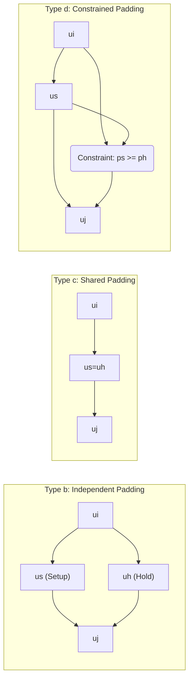
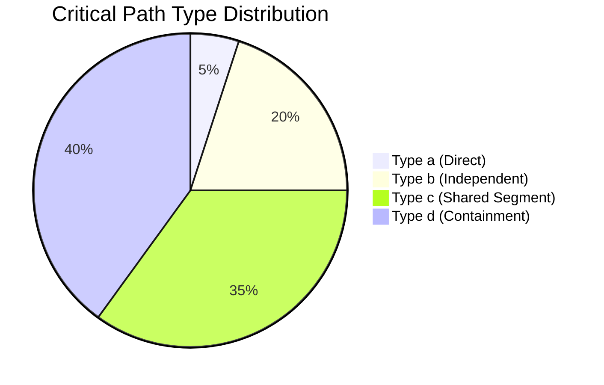

# 🚀 Novel Multi-Corner Delay Padding using Path Relationship Analysis and Dual Decomposition

## Slide 1: Title and Authors (2 minutes)

| Content | Details & Citation |
| :--- | :--- |
| **Title** | Novel Multi-Corner Delay Padding using Path Relationship Analysis and Dual Decomposition |

## Slide 2: Motivation & Key Challenges (2 minutes)

### 💡 The Need for Robust Timing Closure

*   **Multi-Corner Timing Analysis (MCTA)** is essential to ensure circuits are robust under variations in Process, Voltage, and Temperature (PVT).
*   **Goal:** Achieve the minimum clock period ($TCP$) that satisfies setup and hold constraints across all corners.

### 🚧 Challenges in Multi-Corner Optimization

1.  **Conflicting Constraints:** Applying padding consistently across multiple corners is challenging due to inherent conflicts.
2.  **"Ping-Pong" Effects:** Traditional corner-based optimization can cause fixes applied in one corner to violate constraints in another, leading to oscillatory and non-convergent behavior.
3.  **Physical Feasibility:** Conventional methods often struggle with physical feasibility, ignoring structural constraints or the lack of valid insertion positions.

## Slide 3: Background: Timing Optimization (2 minutes)

### Clock Skew Scheduling (CSS)

*   CSS intentionally adjusts clock arrival times ($t_i$) at flip-flops (FFs) to balance setup and hold constraints.
*   It optimizes performance by utilizing available slack without altering data signal paths.
*   CSS fails if the Timing Constraint Graph (TCG) contains negative cycles.

### Delay Padding

*   Strategically inserts additional delay ($p$) into specific paths, usually to fix **hold violations**.
*   This technique modifies the right-hand side of the hold constraint, relaxing it and potentially eliminating negative cycles in the TCG.
*   Integrating padding with CSS provides additional flexibility and robustness.

## Slide 4: Timing Constraints and the TCG (2 minutes)

### Clock Skew Definition
The clock skew between FFi and FFj is:
$$ T_{skew}(i, j) = t_i - t_j \quad (1) $$

### Deterministic Constraints
*   **Setup Time Constraint (Max Delay $D_{ij}$):** Ensures data settles in time.
    $$ T_{skew}(i, j) \leq TCP - D_{ij} - T_{setup} \quad (2) $$
*   **Hold Time Constraint (Min Delay $d_{ij}$):** Ensures the register has time to latch data.
    $$ T_{skew}(i, j) \geq T_{hold} - d_{ij} \quad (3) $$

### Timing Constraint Graph (TCG)
*   The system is modeled as $G(V, E)$, where vertices ($V$) are flip-flops ($FF_i$).
*   Solid edges represent setup time relations; dashed edges represent hold time relations.
*   A **negative cycle** in the TCG indicates a timing failure that CSS alone cannot fix.

## Slide 5: Physical Feasibility and Path Analysis (2 minutes)

### Limitations of Conventional Padding
*   Conventional approaches often aim to minimize the total added delay ($\sum p$).
*   However, in modern physical design (cell swapping), minimizing $\sum p$ does not reflect the true cost.
*   **Applicability Issue:** Many paths lack valid positions for delay insertion due to structural constraints.

### Why Path Relationship Analysis (PRA) is Needed
*   Conventional methods often ignore the relationship between the maximum ($D_{ij}$) and minimum ($d_{ij}$) delay paths (e.g., shared logic or mutual influence).
*   **Proposed Argument:** It is more reliable to **first determine the physically feasible padding locations** using PRA, and *then* calculate the suitable delay values.

## Slide 6: Statistical Modeling using GEV Distribution (2 minutes)

### Addressing Process Variation
*   Process variations introduce statistical uncertainties, making deterministic timing analysis inadequate.
*   Statistical Static Timing Analysis (SSTA) models delays as probability distributions.

### Why GEV?
*   Previous methods relied on Gaussian models.
*   However, studies show the distribution of maximum path delays is often significantly asymmetric and deviates from the Gaussian assumption.
*   We adopt the **Generalized Extreme Value (GEV) distribution** because it better captures the **tail distribution** critical to worst-case timing.

### 📐 GEV Quantile Function
The timing satisfaction probability $\beta$ is linked to the deterministic constraints using the GEV quantile function:
$$ Q = \mu + \frac{\sigma}{\xi} ((-\ln\beta)^{-\xi} - 1) \quad (8) $$

## Slide 7: Methodology: Path Relationship Analysis (PRA) (3 minutes)

### TCG Enhancement
*   The first step is PRA to identify how setup and hold paths interact due to structural overlap and timing coupling.
*   The TCG is modified by incorporating new connections to reflect these interactions.

### Four Structural Configurations for Delay Insertion

| Type | Description | Effect on Padding |
| :--- | :--- | :--- |
| **Type a** | Direct connection; no combinational logic (Fig. 2a) | No feasible delay insertion. TCG unchanged. |
| **Type b** | Independent structure (Fig. 2b) | Max/min paths disjoint; delays ($p_s, p_h$) inserted independently. |
| **Type c** | Shared path segment (Fig. 2c) | Setup and hold paths overlap entirely; padding must be equal ($p_s = p_h$). |
| **Type d** | Hierarchical containment (Fig. 2d) | Hold path is a subset of setup path; padding constraints: $p_s \geq p_h$. |

### TCG Modifications using Auxiliary Nodes (Example)

## Slide 8: Methodology: Dual Decomposition (DD) (3 minutes)

### Purpose of DD
*   Delay padding must be jointly optimized to ensure inserted delays remain **consistent across all corners**.
*   DD decouples the problem into a set of network flow problems (one per corner), coupled by shared delay variables.
*   This approach eliminates the "ping-pong" effect by enforcing global consistency.

### DD Formulation
We seek to minimize the deviation between local solutions ($y^k$) and the global shared timing profile ($y_{shared}$). The problem is formulated using Lagrangian multipliers ($\lambda_k$) to enforce $y^k = y_{shared}$:

$$ \min_{\{y^k\}} \sum_k \lambda_k^\top (y^k - y_{shared}) $$

This objective is subject to the modified TCG constraints and the statistical timing requirements (see next slide).

## Slide 9: Dual Decomposition Iteration (3 minutes)

### 🔄 DD Iterative Optimization

1.  **Solve Subproblems:** In each iteration, all per-corner subproblems are solved independently and in parallel, treating $y_{shared}$ and $\lambda_k$ as fixed parameters.
2.  **Update Global Shared Variable:** The global solution is updated as the average of the local solutions ($K$ is the number of corners).
    $$ y_{shared} \leftarrow \frac{1}{K} \sum_{k=1}^K y^k \quad (10) $$
3.  **Update Lagrangian Multipliers:** The multipliers are updated using subgradient ascent, penalizing deviations from the global average.
    $$ \lambda_k \leftarrow \lambda_k + \rho(y^k - y_{shared}) \quad (11) $$

*   This process repeats until the solutions converge, ensuring a robust, consistent, and feasible delay padding assignment across all corners.

## Slide 10: Statistical Delay Constraints (3 minutes)

### Probabilistic Constraint
To ensure timing correctness against process variation, we enforce a probabilistic constraint, requiring the circuit to meet both setup and hold criteria with a required timing satisfaction probability $\beta$:

$$ Pr((\tilde{D} \leq TCP-T_{setup}-T_{skew})\wedge(\tilde{d} \geq T_{hold}-T_{skew})) \geq \beta \quad (14) $$
*(Where $\tilde{D}$ and $\tilde{d}$ are GEV-modeled random variables for max and min delays)*.

### Deterministic Equivalent (Quantile-based)
Using the GEV quantile function $Q$, we obtain deterministic multi-corner constraints (Eq. 15):
*   Setup (Slow corner focus, using $\beta$ quantile):
    $$ TCP - T_{setup} - T_{skew} \geq Q_D(\beta) $$
*   Hold (Fast corner focus, using $1-\beta$ quantile):
    $$ T_{hold} - T_{skew} \geq Q_d(1 - \beta) $$

### Unified Statistical DD Optimization
The statistical constraints replace the deterministic constraints in the DD optimization formulation (Eq. 16).

## Slide 11: Timing Optimization Flow (2 minutes)

### Binary Search for Optimal TCP
The flow (Fig. 4) minimizes the feasible clock period $TCP$ through a binary search, while ensuring statistical timing constraints are met.

1.  **SSTA & Constraint Extraction:** Multi-corner SSTA extracts GEV-based path delay distributions. Quantile checks ($Q(\beta)$) are used for constraints.
2.  **TCG Construction & Enhancement:** For a candidate $TCP$, the TCG is built. PRA is performed to identify setup/hold interactions, leading to the modified TCG.
3.  **Feasibility Check:** Bellman-Ford checks the modified TCG for negative cycles.
    *   **Negative Cycle detected:** $TCP$ is infeasible. $T_{low}$ is updated.
    *   **No Negative Cycles:** $TCP$ is feasible. Proceed to solving.
4.  **DD Solver:** The DD-based solver computes the optimal corner-aware delay configuration.
5.  **Refinement:** Binary search updates bounds until $T_{high} - T_{low} < \epsilon$.

## Slide 12: Experimental Setup (1 minute)

*   **Benchmarks:** OpenCore and OpenABC-D.
*   **Technology:** ASAP 7nm process technology library.
*   **Corners Used:** FF (Fast-Fast), SS (Slow-Slow), and TT (Typical-Typical).
*   **Modeling:** GEV-based SSTA.
*   **Target Timing Yield ($\beta$):** 0.99 (99% satisfaction probability).
*   **Optimization Goal:** Determine the minimum feasible $TCP$ through binary search, incorporating PRA and DD.

## Slide 13: Results: Path Relationship Analysis (1 minute)

### Structural Distribution Findings
*   The proportion of path relationship types varies significantly across different benchmarks.
*   **Crucial Observation:** Most critical paths exhibit **Type c (Shared path segment)** and **Type d (Hierarchical containment)** relationships.

*Conceptual distribution based on text description*

### Implication
This confirms that padding a critical path frequently affects the hold time constraint due to shared logic, validating the necessity of PRA to ensure safe and effective delay insertion.

## Slide 14: Results: Optimization Performance (2 minutes)

### Multi-Corner Optimization vs. Single Corner Baseline
The approach compares the optimized $TCP$ (Unified Multi-Corner) against the minimum feasible $TCP$ found for individual corners (FF, SS, TT).

| Benchmark | Initial TCP (SS, ps) | Optimized TCP (ps) | Improvement (%) |
| :--- | :--- | :--- | :--- |
| aes | 760.35 | 741.96 | 1.12% |
| gcd | 602.02 | 546.47 | **9.19%** |
| ethmac | 1009.21 | 929.91 | 7.85% |
| ibex | 2823.3 | 2264.99 | **19.77%** |
| jpeg | 1896.71 | 1686.32 | 11.09% |
| tv80 | 951.32 | 892.06 | 6.16% |
*(Data extracted from Table I)*

### Key Findings
*   The optimized clock periods fall consistently within the range defined by the per-corner results, demonstrating a balanced trade-off.
*   Compared to the **SS corner** (which typically dictates timing closure), the proposed DD approach achieved an **average improvement of 9.2%**.
*   Overall, the optimized clock period is reduced by **up to 9%** compared to the single worst-case corner baseline.

## Slide 15: Conclusion (2 minutes)

### Summary of Novelty
We presented a novel multi-corner delay padding methodology combining:
1.  **Path Relationship Analysis (PRA):** To ensure physical feasibility and structural consistency of padding assignments.
2.  **Dual Decomposition (DD):** To coordinate optimization across multiple PVT corners, eliminating "ping-pong" effects.
3.  **GEV-based SSTA:** To provide robust, variation-aware timing closure guarantees.

### Impact
The experimental results demonstrate the flow's effectiveness in achieving **robust timing closure** by significantly reducing the minimum feasible clock period while maintaining a high timing yield.

***

## Final Slide: Q&A (1 minute)

# Thank You

**Questions?**
