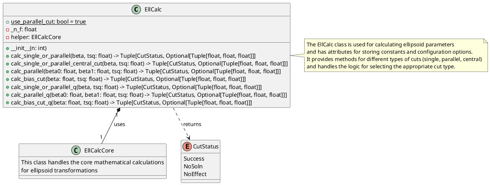
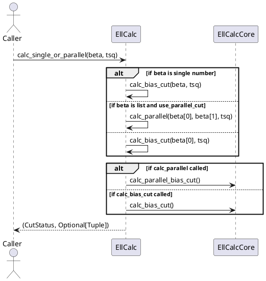
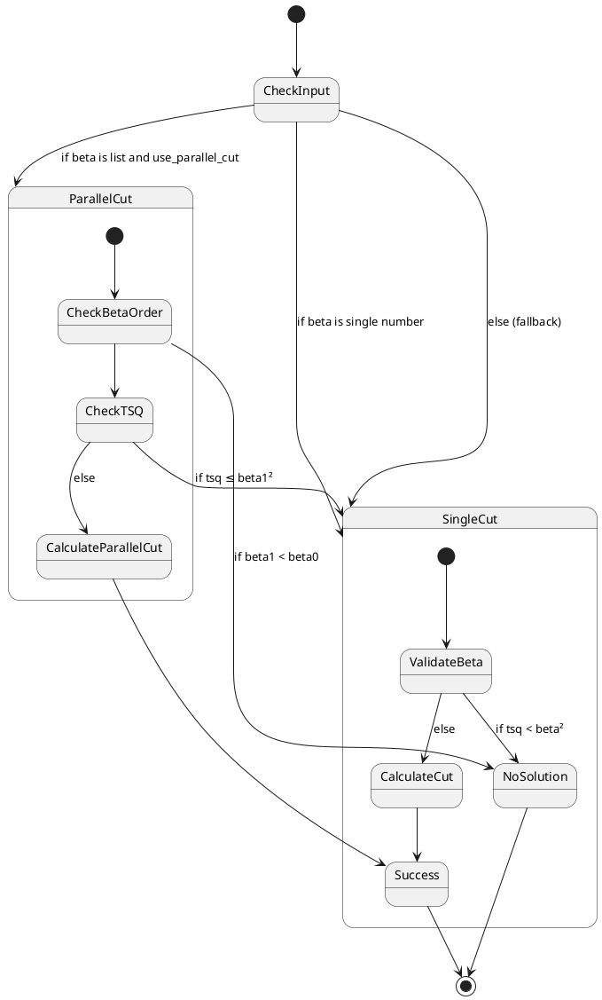

Here are the PlantUML diagrams for the `EllCalc` class based on the provided Python code:

### Class Diagram

### Sequence Diagram (for calc_single_or_parallel method)

### State Diagram (for cut calculation logic)

These diagrams visualize:
1. The class structure and relationships (Class Diagram)
2. The flow of a typical method call (Sequence Diagram)
3. The decision logic for cut calculations (State Diagram)

The diagrams show how the `EllCalc` class acts as a facade that delegates complex calculations to `EllCalcCore` while managing the high-level logic and status reporting. The state diagram particularly highlights the validation checks and different cut calculation paths.