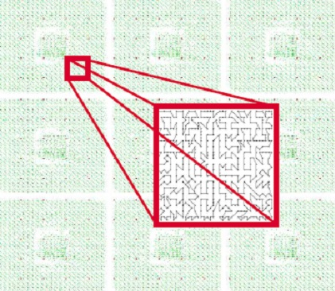

layout: true
class: typo, typo-selection

---

class: nord-dark, middle, center

# Lecture 2d: Complexity Theory & Algorithmic Paradigms

@luk036 👨‍💻

2025-11-19 📅

---

### 📝 Abstract

Throughout this lecture, we'll examine how computational problems are classified based on their inherent difficulty 🧠, with special attention to NP-completeness and approximation algorithms.

We'll investigate why many Electronic Design Automation (EDA) problems are computationally challenging 🔍 and explore strategies for addressing these complex problems. By the end, you'll understand the theoretical foundations that guide algorithm selection in practical applications.

---

### Overview 📋

- Complexity theory 🧮
- NP-completeness 🚧
- Approximation classes ⚖️
- Books and online resources 📚

---

### Complexity Theory Fundamentals

- Big O-notation 📈

  Classifies algorithms based on their growth rate: O($N$), O($N\log N$), O($N^2$), O($N!$) ...

- EDA Problem Scale 🏗️

  $N$ can reach multi-millions in Electronic Design Automation problems.

- Practical Limits ⏳

  Most EDA problems have practical limits: signal nets (<200 pins), polygon shapes (<100 vertices), routing layers (<10)

- Geometric Properties 📐

  Many physical design problems can exploit locality, symmetry, planarity, or triangle inequality to reduce complexity

---

### The Challenge of NP-Hard

- NP-Hard Problems 🧩

  Many Electronic Design Automation problems fall into the NP-hard category, making them computationally intensive to solve optimally.
  Some NP-hard problems allow for good approximations with guaranteed performance ratios (**pseudo-polynomial**), such as bin-packing and knapsack problems.

- Approximation Challenges ⚠️

  Other NP-complete problems like Boolean Satisfiability (SAT) are intrinsically not "approximatable" unless P=NP.

For deeper insights, refer to "Complexity and Approximation: Combinatorial Optimization Problems and Their Approximability Properties."

---

### Approximation Classes Hierarchy

- NPO-hard: Hardest optimization problems 🏔️
- APX-hard: Cannot be approximated within constant factor 🚫
- PTAS: Polynomial-time approximation scheme ⏱️
- FPTAS: Fully polynomial-time approximation scheme ⏳
- P: Polynomial time solvable ✅

This hierarchy represents the relationship between different approximation classes, with P being the easiest problems and NPO-hard being the most difficult. The relationship can be expressed as: P < FPTAS < PTAS < APX < NPO.

---

### E.g. Minimum Vertex Cover

- Instance: Graph $G$ = (${\color{salmon}V}$, ${\color{lime}E}$)
- Solution: A vertex cover for $G$, i.e., a subset ${\color{salmon}V'}$ such that, for
  each edge $(u, v) \in {\color{lime}E}$, at least one of $u$ and $v$ belongs to
  ${\color{salmon}V'}$
- Measure: Cardinality of the vertex cover, i.e. $|{\color{salmon}V'}|$ 🔢
- Bad News: APX-complete 😟
- Comment: Admits a PTAS for _planar_ graphs \[Baker, 1994\]. The
  generalization to $k$-hypergraphs, for $k>1$, is approximable within
  $k$ \[Bar-Yehuda and Even, 1981\] and \[Hochbaum, 1982a\]. (HW:
  Implement the algorithms.) 💻
- Garey and Johnson: GT1

---

### Minimum Maximal Matching

- Instance: Graph $G$ = (${\color{salmon}V}$, ${\color{lime}E}$).
- Solution: A maximal matching ${\color{lime}E'}$, i.e., a subset ${\color{lime}E'}$ such that no
  two edges in ${\color{lime}E'}$ shares a common endpoint and every edge in
  ${\color{lime}E} - {\color{lime}E'}$ shares a common endpoint with some edge in ${\color{lime}E'}$. ↔️
- Measure: Cardinality of the matching, i.e. $|{\color{lime}E'}|$. 🔢
- Bad News: APX-complete \[Yannakakis and Gavril, 1980\] 😟
- Comment: Transformation from Minimum Vertex Cover (HW: Implement the algorithm) 💻
- Garey and Johnson: GT10

---

### Minimum Steiner Tree

- Instance: Complete graph $G$ = (${\color{salmon}V}$, ${\color{lime}E}$), a metric given by edge
  weights $s: E \mapsto N$ and a subset $S \subset {\color{salmon}V}$ of required
  vertices. 🌳
- Solution: A Steiner tree, i.e., a sub-tree of $G$ that includes all
  the vertices in $S$.
- Measure: The sum of the weights of the edges in the sub-tree. ⚖️
- Bad News: APX-complete. 😟
- Garey and Johnson: ND12

---

### Minimum Geometric Steiner Tree

- Instance: Set $P \subset Z \times Z$ of points in the plane.
- Solution: A finite set of Steiner points, i.e.,
  $Q \subset Z \times Z$
- Good News: Admits a PTAS \[Arora, 1996\] ✅
- Comment: Admits a PTAS for any _geometric space_ of constant
  dimension $d$, e.g. in the rectilinear metric \[Arora, 1997\].
- Garey and Johnson: ND13

---

### Traveling Salesperson Problem

- Instance: Set $C$ of $m$ cities, distances $d(c_i, c_j) \in N$ for
  each pair of cities $c_i, c_j \in C$. 🗺️
- Solution: A tour of $C$, i.e., a permutation
  $\pi : [1..m] \mapsto [1..m]$. 🔄
- Measure: The length of the tour. 📏

  

---

### General TSP

- Bad News: NPO-complete 😟
- Comment: The corresponding maximization problem (finding the tour of
  maximum length) is approximable within 7/5 if the distance function
  is _symmetric_ and 63/38 if it is asymmetric \[Kosaraju, Park, and
  Stein, 1994\]
- Garey and Johnson: ND22

---

### Metric TSP

- Instance: Set $C$ of $m$ cities, distances $d(c_i, c_j) \in N$
  satisfying the *triangle inequality*
  (i.e. $d(a, b) + d(b, c) \geq d(a, c)$) 📐
- Solution: A permutation $\pi : [1..m] \mapsto [1..m]$. 🔄
- Measure: The length of the tour. 📏
- Good news: Approximable within 3/2 \[Christofides 76\] ✅
- Bad News: APX-complete. 😟
- Comment: A variation in which vertices can be revisited and the goal
  is to minimize the sum of the latencies of all vertices, where the
  latency of a vertex $c$ is the length of the tour from the starting
  point to $c$, is approximable within 29 and is APX-complete

---

### Geometric TSP

- Instance: Set $C \subset Z \times Z$ of $m$ points in the plane.
- Solution: A tour of $C$, i.e., a permutation
  $\pi : [1..m] \mapsto [1..m]$. 🔄
- Measure: The length of the tour, where the distance is the
  discretized Euclidean length. 📏
- Good news: Admits a PTAS \[Arora, 1996\] ✅
- Comment: In $\mathbb{R}^m$ the problem is APX-complete for any $l_p$
  metric \[Trevisan, 1997\].
- Garey and Johnson: ND23

---

### Application - Punching Machine

Used in manufacturing for optimizing punching machine operations and other industrial processes requiring efficient path planning. 🏭



---

### Approximation Strategies for Hard Problems

- Heuristic Methods 🧪

  For NPO-complete problems where good approximations don't exist unless P=NP, heuristic methods provide practical solutions without guarantees.

- Exploiting Problem Properties 🔍

  Better algorithms can be developed by leveraging properties such as locality, symmetry, sparsity, planarity, convexity, and monotonicity.

- Problem-Specific Techniques 🛠️

  Many EDA problems benefit from domain-specific knowledge that can dramatically reduce computational complexity in practice.

---

### 📚 Resources for Further Study

To deepen your understanding of complexity theory and approximation algorithms, consider these valuable resources:

- Key Textbooks 📖

  G. Ausiello et al. "Complexity and Approximation: Combinatorial Optimization Problems and Their Approximability Properties." Springer, 1999. (O224 C737)

- Foundational Work 🏛️

  M. R. Garey and D. S. Johnson. "Computers and Intractability: A Guide to the Theory of NP-completeness." Freeman, 1979.

- Online Learning 🌐

  Explore academic courses, research papers, and online tutorials that provide practical implementations of the theoretical concepts covered in this presentation.

---

class: nord-light, middle, center

# Algorithmic Paradigms 🔧

---

### Overview 📋

- Greedy approach 🤑
- Mathematical programming ➗
- Primal-dual algorithm ☯
- Randomized method 🎲
- Dynamic programming 🧮
- Local search 🔍
- Simulated annealing ❄️
- Books and online resource 📚

---

### 🤑 Greedy Approach

- Excellent for Minimum Spanning Tree (MST) and Channel Routing
  Problem 🌳
  - Obtain optimal solution ✅
- Not bad for Knapsack problem 🎒
  - At least half of optimal solution ½
- Very bad for Feedback Arc Removal problem 🔄
  - Even worse than a naïve method: randomly remove edges when
    traversing a graph, then reverses the set if $|{\color{lime}E'}|$ is greater
    than 0.5$|{\color{lime}E}|$.
- Question: Any theory to predict the performance? 🤔

---

### Knapsack 🎒 Problem

.pull-left[

- A thief considers taking $b$ pounds of loot 💰. The loot is in the
  form of $n$ items, each with weight $a_i$ and value $p_i$. Any
  amount of an item can be put in the knapsack as long as the weight
  limit $b$ is not exceeded

] .pull-right[


]

---

### 🤑 Greedy Approach

- Take as much of the item with the highest value per pound
  ($p_i$/$a_i$) as you can. If you run out of that item, take from the
  next highest ($p_i$/$a_i$) item. Continue until knapsack is full. 🏃‍♂️

---

### Program 1: Greedy Knapsack

- **Input**: Set of $n$ items, for each $x_i \in X$, values $p_i$,
  $a_i$, positive integer $b$; 📥
- **Output**: Subset $Y \subset X$ such that $\sum a_i \leq b$; 📤
- Sort $X$ in non-increasing order with respect to the ratio
  $p_i$/$a_i$; 🔽
- Let ($x_1$, $x_2$, ..., $x_n$) be the sorted sequence
- $Y$ := $0$;
- **for** $i$:=1 **to** $n$ **do**
  - **if** $b \geq a_i$ **do**
    - $Y$ := $Y \cup \{ x_i \}$;
    - $b$ := $b - a_i$;
- **return** $Y$

---

### C++ code 🅒

```cpp
template <class InputIt, typename T, typename F1, typename F2>
InputIt greedy_knapsack(InputIt first, InputIt last,
                        const T& b, F1&& price, F2&& weight)
{
    using Item = typename InputIt::value_type;
    std::sort(first, last, [&](const Item& i1, const Item& i2) {
        return weight(i1) * price(i2) < weight(i2) * price(i1);
    });
    T init(0);
    InputIt it = std::find_if(first, last, [&](Item& i) {
        return (init += weight(i)) > b;
    });
    return it;
}
```

- Test program can be found in http://ideone.com/9ZK6ol. 💻

---

### Can the thief do better?

- Theorem 1. Let m<sub>H</sub>($x$) =
  max($p$<sub>max</sub>, m<sub>GR</sub>($x$)),
  where $p$<sub>max</sub> is the maximum profit
  of an item 💍 in $x$. Then m<sub>H</sub>($x$) satisfies the
  following inequality: m($x$)/m<sub>H</sub>($x$) < 2. (p.42)
  (m($x$) is the optimal solution)

- As a consequence of the above theorem, a simple modification of
  Program 1 allows us to obtain a provably better algorithm.

- HW: Implement the algorithm using C++ Template technique and
  iterators (generic programming style) 💻

---

### Linear Programming Relaxation

- Formulate a problem as an integer linear program. ➗
- By relaxing the integrality constraints we obtain a new linear
  program, whose optimal solution can be found in polynomial time. ⏱️
- This solution, in some cases, can be used to obtain a feasible
  solution for the original integer linear program, by "rounding" the
  values of the variables that do not satisfy the integrality
  constraints. 🔄

---

### Weighted Vertex Cover

- Given a weighted graph $G=({\color{salmon}V}, {\color{lime}E})$, Minimum Weighted Vertex Cover
  (MWVC) can be formulated as the following integer program
  ILP<sub>VC</sub>($G$):

- Minimize $\sum_{v_i \in {\color{salmon}V} } c_i x_i$

- Subject to $x_i + x_j \geq 1$ for all $(v_i, v_j) \in {\color{lime}E}$↔️

- $x_i \in \{0, 1\}$ for all $v_i \in {\color{salmon}V}$ 🔘

---

### Program 2.6 Rounding WVC

- **Input** Graph $G=({\color{salmon}V}, {\color{lime}E})$ with non-negative vertex weights; 📥
- **Output** Vertex cover ${\color{salmon}V'}$ of $G$; 📤
- Let ILP<sub>VC</sub> be the linear integer
  programming formulation of the problem; ➗
- Let LP<sub>VC</sub> be the problem obtained
  from ILP<sub>VC</sub> by relaxing the
  integrality constraints; 🔄
- Let $x(G^*)$ be the optimal solution for
  LP<sub>VC</sub>; 🏆
- ${\color{salmon}V'}$ := \{$v \mid x_v(G^*) \geq 0.5$\}; 🔢
- **return** ${\color{salmon}V'}$

---

### Linear Programming

- Theorem 2.15. Given a graph $G$ with non-negative vertex weights,
  Program 2.6 finds a feasible solution of MWVC with value
  m<sub>LP</sub>($G$) such that
  m<sub>LP</sub>($G$)/m($G^*$) $\leq 2$. ✅

- Problem: need to solve the LP optimally. ⏳

---

### ☯ Primal-dual WVC

- **Input** Graph $G = ({\color{salmon}V}, {\color{lime}E})$ with non-negative vertex weights; 📥
- **Output** Vertex cover ${\color{salmon}V'}$ of $G$; 📤
- Let DLP<sub>VC</sub> be the dual of the LP
  relaxation of ILP<sub>VC</sub>; ☯
- **for** each dual variable $y$ of
  DLP<sub>VC</sub> **do** $y := 0$; 🔄
- ${\color{salmon}V'} := 0$;
- **while** ${\color{salmon}V'}$ is not a vertex cover **do**
  - Let $(v_i, v_j)$ be an edge not covered by ${\color{salmon}V'}$; ↔️
  - Increase $y_{ij}$ until a constraint of
    DLP<sub>VC</sub> becomes tight; ⚖️
  - **if** sum$(y_{ij} | (i, j) \in {\color{lime}E} )$ is tight **then**
    - ${\color{salmon}V'} := {\color{salmon}V'} \cup \{v_i\}$ (\* the i-th dual constraint is
      tight \*)
  - **else**
    - ${\color{salmon}V'} := {\color{salmon}V'} \cup \{v_j\}$ (\* the j-th dual constraint is
      tight \*)
- **return** ${\color{salmon}V'}$

---

### ☯ Primal-dual WVC

- Theorem 2.16. Given a graph $G$ with non-negative weights, Program
  2.7 finds a feasible solution of MWVC such that
  $m_\text{PD}(G)/m(G^*) \leq 2$. (p. 69) ✅

- Much faster than Program 2.6 (only take linear time) because we
  don't need to solve the LP optimally. ⚡

- Bonus: Sum of dual variables $y_{ij}$ gives the lower bound of the
  optimal solution.

---

### Program - Random WVC

- **Input** Graph $G= ({\color{salmon}V}, {\color{lime}E})$, weight function $w: V \mapsto N$; 📥
- **Output** Vertex cover ${\color{salmon}U}$; 📤
- ${\color{salmon}U}$ := $\emptyset$;
- **while** ${\color{lime}E}$ is not empty **do**
  - Select an edge $e = (v,t) \in {\color{lime}E}$; ↔️
  - Randomly choose $x$ from $\{v,t\}$ with Pr$\{x=v\}$ =
    $w(t) / (w(v) + w(t))$; 🎲
  - ${\color{salmon}U}$ := ${\color{salmon}U} \cup \{x\}$;
  - ${\color{lime}E}$ := ${\color{lime}E} - \{e \mid x \text{ is an endpoint of } e\}$
- **return** ${\color{salmon}U}$

---

### 🎲 Randomized Algorithms

- In many cases, a randomized algorithm is either simpler or faster
  (or both) than a deterministic algorithm. ⚡

- However, it does not guarantee that the algorithm always finds a
  good approximation solution. 🎰

- Theorem 5.1. The expect measure of the solution returned by the
  previous algorithm satisfied the following inequality:

  $$E[m_\text{RWVC}(x)] \leq 2 m^*(x)$$

- HW: Implement MWVC solvers using all the above methods. Also extend
  all the methods to handle hypergraph 💻

---

### Dynamic Programming (I)

- One passenger wants to go from city A to city H through the
  _shortest path_ according to the map on the right, where number of
  indicate distance between corresponding cities. 🗺️

- Reference: Pablo Pedregal, _Introduction to Optimization_, chapter
  5.8, Springer, 2003 📚

---

### Dynamic Programming (II)

- Proposition 5.24 (Fundamental property of dynamic programming)
  - If $S(t_j, x)$ denotes the optimal cost from $(t_0, x)$ to
    $(t_j, x)$
  - then we must have S($t_{j+1}$, $y$) =
    min<sub>j</sub> \[S($t_j$, $x$) +
    c($j$,$x$,$y$)\]

---

### Dynamic Programming (III)

- According to Proposition 5.24, we must proceed successively to
  determine S($t_j, x$) for each $x$ in
  A<sub>j</sub> to end with S($t_n, x_n$). In the
  proposed example, we have four stages $t_0$, $t_1$, $t_2$, $t_3$
  with associated sets of feasible states

  - A<sub>0</sub> = {A},
    A<sub>1</sub> = {B, C, D},
    A<sub>2</sub> = {E,F,G},
    A<sub>3</sub> = {H}

- For each city in A<sub>1</sub>, there is a unique
  path from A, so that it must be optimal, and

  - S($t_1$, B) = 7, S($t_1$, C) = 4, S($t_1$, D) = 1.

- For each city in A<sub>2</sub>, we determine the
  optimal cost based on the fundamental property of dynamic
  programming,

  - S($t_{j+1}$, $y$) = min<sub>j</sub> \[S($t_j$,
    $x$) + c($j$,$x$,$y$)\]

---

### Local Search

- **Input**: Instance $x$; 📥
- **Output**: Solution $s$ 📤
- $s$ := initial feasible solution $s_0$; 🏁
- (\* $\mathcal{N}$ denotes the neighborhood function \*)
- **repeat**
  - Select any $s' \in \mathcal{N}(x, s)$ not yet considered; 🔍
  - **if** $m(x,s')$ < $m(x, s)$ **then**
    - $s$ := $s'$; 🔄
- **until** all solutions in $\mathcal{N}(x, s)$ have been
  visited; 🔚
- **return** $s$;

---

### Simulated Annealing

- **Input**: Instance $x$; 📥
- **Output**: Solution $s$ 📤
- $τ$ := $t$; 🌡️
- $s$ := initial feasible solution $s_0$; 🏁
- **repeat**
  - **for** $l$ times **do**
    - Select any unvisited $s' \in \mathcal{N}(x, s)$ 🔍
    - **if** ($m(x, s')$ < $m(x, s)$)
      - $s$ := $s'$; 🔄
    - **else**
      - $δ$ := $m(x, s') - m(x, s)$; ⚖️
      - $s$ := $s'$ with probability exp($-δ/t$); 🎲
  - $τ$ := $r \cdot τ$; (\* update of temperature \*) 🔄
- **until** FROZEN; ❄️
- **return** $s$;

---

### Other Heuristic Methods

- 🧗 Hill Climbing
  - Reference: _Hill Climbing_ by R. A. Sutton and A. G. Barto, MIT Press, 1983 📚
- 🐜 Ant Colony Optimization (ACO)
  - Reference: _Ant Colony Optimization_, D. E. Kirkpatrick, C.
    Storn, Journal of Global Optimization, 1992 📚
- 🧬 Genetic Algorithm (GA)
  - Reference: _Genetic Algorithms_, M. Mitchell, McGraw Hill, 1989 📚
- 🙅 Tabu Search (TS)
  - Reference: _Tabu search_, Kirkpatrick, Storn, 1983 📚
- Variable Neighborhood Descent (VND)
  - Reference: _Variable neighborhood descent_, Kirkpatrick, Storn, 1983 📚

---

### 📚 Books and Online Resources

- G. Ausiello et al. Complexity and Approximation: Combinatorial
  Optimization Problems and Their Approximability Properties.
  Springer, 1999. (O224 C737) 📖

- M. R. Garey and D. S. Johnson. Computers and Intractability: A Guide
  to the Theory of NP-completeness. Freeman, 1979. 📖

- Pablo Pedregal. Introduction to Optimization. Springer, 2003 (O224
  P371) 📖

---

count: false
class: nord-dark, middle, center

.pull-left[

# Q&A 🎤

] .pull-right[


]
