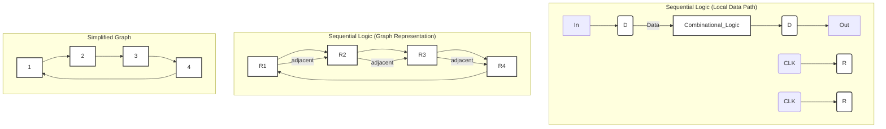
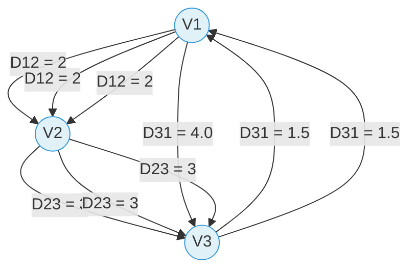
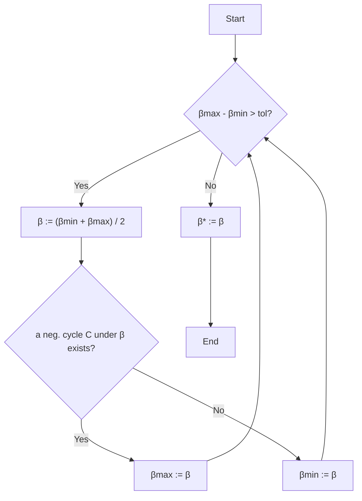

# Yield-driven Clock Skew Scheduling Under Process Variations

This essay provides a comprehensive overview of clock skew scheduling under process variations, drawing directly from the provided lecture "Yield-driven Clock Skew Scheduling Under Process Variations". The lecture discusses various techniques and methods aimed at optimizing clock skew to improve circuit performance or minimize timing failures.

## 1. Introduction and Background

The lecture begins by establishing the main topic: clock skew scheduling under process variations. It highlights the importance of this topic for optimizing circuit performance and mitigating timing failures.

### 1.1. Clock Skew: Concept and Importance

Clock skew refers to the difference in clock signal arrival times at different registers in a circuit. Specifically, for a path from an initial register $i$ to a final register $f$, the clock skew is defined as $ T_{skew}(i, f) = t_i - t_f $, where $t_i$ is the clock signal delay at the initial register and $t_f$ is the clock signal delay at the final register. The lecture emphasizes that the absolute time of the clock signals is not of interest, but rather their relative difference, i.e., the skew.

The importance of managing clock skew stems from its impact on meeting critical timing constraints, such as setup time and hold time. Violations of these constraints can lead to significant problems, including cycle time violations (zero clocking) and race conditions (double clocking).

### 1.2. Sequential Logic and Data Paths

Understanding clock skew requires an appreciation of sequential logic circuits. A typical local data path involves data flowing from an input (In) through a register (D-Q flip-flop), a block of combinational logic, and then to another register before producing an output (Out). Clock signals (CLK) arrive at registers $R_i$ and $R_j$.

A circuit can be represented as a graph, where registers are nodes and combinational logic paths are edges connecting them. For example, a circuit with registers R1, R2, R3, R4 can be abstracted into a graph with nodes 1, 2, 3, 4, representing the registers.


*Figure 1: Sequential Logic Representation*

### 1.3. Zero Skew vs. Useful Skew

Historically, zero skew was a common clocking strategy where $t_i = t_f$ was targeted, making it relatively easy to implement. However, the concept of "useful skew" emerged as a means to improve circuit performance. By intentionally introducing non-zero skew, it's possible to permit a higher maximum clock frequency or increase the safety margins of clock skew within permissible ranges. The maximum and minimum path delays are determined through Static Timing Analysis (STA).

## 2. Timing Constraints

Timing constraints are fundamental to circuit operation, ensuring that data arrives and is captured correctly by registers.

### 2.1. Setup Time Constraint

The setup time constraint ensures that data is stable at the input of a flip-flop for a specified duration before the clock edge arrives. For a path from register $i$ to register $f$, the setup time constraint is given by:
\[ T_{skew}(i, f) \le T_{CP} - D_{if} - T_{setup} = u_{if} \]
where $T_{CP}$ is the clock period, $D_{if}$ is the delay of the combinational logic path from $i$ to $f$, and $T_{setup}$ is the setup time of the final register. Violation of this constraint typically leads to cycle time violation, also known as "zero clocking".

### 2.2. Hold Time Constraint

The hold time constraint ensures that data remains stable at the input of a flip-flop for a specified duration after the clock edge arrives. For a path from register $i$ to register $f$, the hold time constraint is given by:
\[ T_{skew}(i, f) \ge T_{hold} - d_{if} = l_{if} \]
where $T_{hold}$ is the hold time of the final register and $d_{if}$ is the minimum delay of the combinational logic path from $i$ to $f$. Violation of this constraint can cause a race condition, also known as "double clocking".

### 2.3. Timing Constraint Graph (TCG)

A circuit's timing constraints can be represented as a Timing Constraint Graph (TCG). This graph is constructed by:
*   Replacing hold time constraints with $h$-edges that have a cost of $ -(T_{hold} - d_{ij}) $ from flip-flop $FF_i$ to $FF_j$.
*   Replacing setup time constraints with $s$-edges that have a cost of $ T_{CP} - D_{ij} - T_{setup} $ from $FF_j$ to $FF_i$.

The TCG must satisfy two sets of constraints stemming from the clock skew definition:
1.  The sum of skews for paths having the same starting and ending flip-flop must be zero.
2.  The sum of clock skews of all cycles must be zero.

For a feasible clock period $T_{CP}$, the TCG must not contain any negative cost cycles, assuming $T_{setup} = T_{hold} = 0$ for simplicity in some contexts.


*Figure 2: Example Timing Constraint Graph with Delays*

## 3. Clock Skew Scheduling Approaches

The lecture presents various approaches to clock skew scheduling, including traditional, yield-driven, and minimum cost-to-time ratio formulations.

### 3.1. Minimize Clock Period (Traditional Scheduling)

A common goal in traditional clock skew scheduling is to minimize the clock period ($T_{CP}$). This can be formulated as a linear programming (LP) problem. The objective is to minimize $T_{CP}$ subject to the constraints:
\[ l_{ij} \le t_i - t_j \le u_{ij} \]
where $FF_i$ and $FF_j$ are sequential adjacent flip-flops. This set of constraints is known as a system of difference constraints.

Finding a feasible solution that minimizes $T_{CP}$ requires ensuring that the timing constraint graph contains no negative cycles. The Bellman-Ford algorithm is a common method used to detect negative cycles in such graphs.

#### 3.1.1. Basic Bellman-Ford Algorithm

The Bellman-Ford algorithm can be summarized in three steps:
1.  **Initialize graph:** Set the distance to the source vertex to 0 and all other vertices to infinity. Predecessors are null.
2.  **Relax edges repeatedly:** For $i$ from 1 to `size(vertices)-1`, iterate through all edges $(i, j)$ with weight $d[i,j]$. If $u[j] > u[i] + d[i,j]$, update $u[j]$ and set $predecessor[j] = i$.
3.  **Check for negative-weight cycles:** Iterate through all edges $(i, j)$ again. If $u[j] > u[i] + d[i,j]$, then a negative-weight cycle exists, and an error is reported.


*Figure 3: Lawler's Algorithm (Binary Search based)*

#### 3.1.2. Problems with Bellman-Ford Algorithm

While simple, the Bellman-Ford algorithm has limitations:
*   It is primarily designed for finding shortest paths, with negative cycle detection being a side product.
*   It only detects negative cycles at the end of the process.
*   It requires computing all $d[i,j]$.
*   The input graph must have a source node, and initialization needs $u[i] := \text{inf}$.
Various improvements have been proposed.

#### 3.1.3. Minimizing Clock Period using Bellman-Ford

A fast algorithm for solving the LP for minimizing clock period involves using a binary search method. In each iteration, the Bellman-Ford algorithm is called to detect if the timing constraint graph contains a negative weighted edge cycle. It's important to remember that Bellman-Ford is fundamentally a shortest-path algorithm.

The optimal clock period and the corresponding skew schedule are often obtained simultaneously. However, many skew values can be on the bounds of the feasible range, indicating flexibility or criticality.

### 3.2. Yield-Driven Clock Skew Scheduling

With increasing process variations, timing-failure-induced yield loss becomes a significant problem. Consequently, yield-driven clock skew scheduling has become important. The primary goal shifts from solely minimizing the clock period to minimizing the yield loss (or maximizing timing yield).

#### 3.2.1. Timing Yield Definition

A circuit is considered functionally correct if all setup and hold time constraints are satisfied under a given group of process parameters. Timing Yield is defined as:
\[ \text{Timing Yield} = (\text{functional correct times}) / (\text{sample number}) * 100\% \]
This definition quantifies the percentage of manufactured circuits that meet all timing specifications.

#### 3.2.2. Primitive Solutions and their Shortcomings

The lecture outlines several primitive solutions for clock skew scheduling under process variations, along with their drawbacks.

**Primitive Solution 1: Pre-allocating Timing Margins**
This approach involves pre-allocating timing margins, usually equivalent to maximum timing uncertainty, at both ends of the Feasible Skew Region (FSR). The constraint is expressed as:
\[ l_{ij} \le s_{ij} \le u_{ij} \implies l_{ij} + \Delta d \le s_{ij} \le u_{ij} - \Delta d \]
After this allocation, clock period optimization is performed.

*   **Problems:** This method is often too pessimistic, leading to performance loss. Also, $\Delta d$ is fixed and does not consider data path delay differences between cycle edges.

**Primitive Solution 2: Least Center Error Square (LCES) Problem Formulation**
This approach formulates the problem as an LCES problem. The objective is to choose skew values ($s_{ij}$) as close as possible to the middle points of their FSRs:
\[ \text{minimize } \sum_k (0.5 - \min(lm_k, um_k))^2 \]
subject to $l_{ij} + lm_k(u_{ij} - l_{ij}) \le s_{ij} \le u_{ij} - um_k(u_{ij} - l_{ij})$, with $0 \le lm_k \le 0.5$ and $0 \le um_k \le 0.5$. This is related to quadratic programming methods.

*   **Shortcoming:** This method might not be optimal for yield.

**Primitive Solution 3: Incremental Slack Distribution**
This method checks all skew constraints. However, a disadvantage is that it does not take into consideration path delay differences.

### 3.3. Advanced Techniques: Slack Maximization and Prop-based Methods

More advanced techniques are introduced, focusing on distributing slack along the most timing-critical cycle based on Gaussian models.

#### 3.3.1. Slack Maximization (EVEN)

The EVEN method solves the slack optimization problem using a minimum mean cycle formulation. The objective is to maximize $\beta$ subject to $t_j - t_i \le \mu_{ij} - \beta$, where $\beta$ is defined as $ \frac{1}{|C|} \sum_{(i,j) \in C} \mu_{ij} $ for a critical cycle $C$. This is equivalent to the minimum mean cycle problem. This method can be solved efficiently.

The EVEN method involves an iterative slack optimization process:
1.  **Identify the circuit's most timing-critical cycle**. This can be solved using Karp's algorithm for the minimum mean-weight cycle problem.
2.  **Distribute the slack along the cycle**. The slack is distributed evenly along the most timing-critical cycle. For example, if the critical path has $t_3 - t_1$ constrained by $-1.5 \le t_3 - t_1 \le 0.5$, and the slack is distributed evenly, then $t_3 - t_1 = -0.5$ (evenly), leading to $t_1 = 0.5, t_3 = 0$.
3.  **Freeze the clock skews on the cycle and replace it with a super vertex**. This reduces the graph for subsequent iterations. For instance, after setting $t_1=0.5$ and $t_3=0$, these nodes can be combined into a super vertex (e.g., VS).
4.  **Repeat the process iteratively**. This continues until all skews are determined.

```mermaid
graph TD
    V1((V1)) --- 2.5 --> V2((V2))
    V2 --- 1.5 --> V3((V3))
    V3 --- 0.5 --> V1
    V1 --- 2 --> V2
    V2 --- 3 --> V3
    V3 --- 1.5 --> V1
    style V1 fill:#f5d7d7,stroke:#e74c3c;
    style V2 fill:#d7f5d7,stroke:#2ecc71;
    style V3 fill:#f5d7d7,stroke:#e74c3c;

    subgraph Identify Critical Cycle
        V1_Crit((V1)) --- 2.5 --> V2_Crit((V2))
        V2_Crit --- 1.5 --> V3_Crit((V3))
        V3_Crit --- 0.5 --> V1_Crit
        style V1_Crit fill:#f5d7d7,stroke:#e74c3c;
        style V2_Crit fill:#d7f5d7,stroke:#2ecc71;
        style V3_Crit fill:#f5d7d7,stroke:#e74c3c;
    end

    subgraph Distribute Slack
        V1_Slack((V1)) --- 2.5 --> V2_Slack((V2))
        V2_Slack --- 1.5 --> V3_Slack((V3))
        V3_Slack --- 0.5 --> V1_Slack
        style V1_Slack fill:#f5d7d7,stroke:#e74c3c;
        style V2_Slack fill:#d7f5d7,stroke:#2ecc71;
        style V3_Slack fill:#f5d7d7,stroke:#e74c3c;
    end

    subgraph Freeze Skews (I)
        V1_F1((0.5)) --- 2.5 --> V2_F1((V2))
        V2_F1 --- 1.5 --> V3_F1((0))
        V3_F1 --- 0.5 --> V1_F1
        style V1_F1 fill:#f5d7d7,stroke:#e74c3c;
        style V2_F1 fill:#d7f5d7,stroke:#2ecc71;
        style V3_F1 fill:#f5d7d7,stroke:#e74c3c;
    end

    subgraph Freeze Skews (II)
        VS((VS)) --- 2.5 --> V2_F2((V2))
        V2_F2 --- 1.5 --> VS
        style VS fill:#f5d7d7,stroke:#e74c3c;
        style V2_F2 fill:#d7f5d7,stroke:#2ecc71;
    end

    subgraph Repeat Process (I)
        VS_R1((VS)) --- 2 --> V2_R1((V2))
        V2_R1 --- 1.5 --> VS_R1
        style VS_R1 fill:#f5d7d7,stroke:#e74c3c;
        style V2_R1 fill:#d7f5d7,stroke:#2ecc71;
    end

    subgraph Final Result
        V1_Final((0.75)) --- 2.5 --> V2_Final((0))
        V2_Final --- 1.5 --> V3_Final((0.25))
        V3_Final --- 0.5 --> V1_Final
        style V1_Final fill:#d7f5d7,stroke:#2ecc71;
        style V2_Final fill:#d7f5d7,stroke:#2ecc71;
        style V3_Final fill:#d7f5d7,stroke:#2ecc71;
    end
```
*Figure 4: EVEN Method Steps and Final Result*

The final result of the EVEN method for a sample graph might show specific skew values and corresponding slacks. For instance:
*   $Skew_{12} = 0.75$
*   $Skew_{23} = -0.25$
*   $Skew_{31} = -0.5$
*   $Slack_{12} = 1.75$
*   $Slack_{23} = 1.75$
*   $Slack_{31} = 1$
where Slack is defined as $T_{CP} - D_{ij} - T_{setup} - Skew_{ij}$.

*   **Problems with EVEN:** The EVEN method assumes all variances are the same. However, the timing uncertainty of a long combinational path is typically larger than that of a shorter path. Therefore, the even slack distribution along timing-critical cycles performed by EVEN is not optimal for yield if data path delays along the cycles are different.

#### 3.3.2. Prop-Based on Gaussian Model (PROP)

The PROP method assumes that $n$ gate delays follow a Gaussian distribution $N(\mu, \sigma^2)$, and thus the path delay is $N(n\mu, n\sigma^2)$. It aims to distribute slack along the most timing-critical cycle according to the square root of each edge's path delays.

To achieve this, the weights of s-edges and h-edges are updated using a parameter $\alpha$:
For s-edges: $T_{CP} - (D_{ij} + \alpha \sqrt{D_{ij}\sigma}) - T_{setup}$
For h-edges: $ -T_{hold} + (d_{ij} - \alpha \sqrt{d_{ij}\sigma}) $
where $\alpha$ ensures a minimum timing margin for each timing constraint.

Given a specific clock period $T_{CP}$, $\alpha$ is gradually increased, and the Bellman-Ford algorithm is used to detect if the graph is still feasible. After finding the maximum $\alpha$, the edges along the most timing-critical cycle will have slacks equal to the pre-allocated timing margins. If many edges in a circuit have sufficiently large slack, proportional slack distribution can be performed for the most timing-critical cycle, and the rest of the skews can be assigned using the EVEN method.

*   **Problems with PROP:** This method assumes all gate delays have the same distribution. More critically, it does not justify using the square root of path delay for timing margin.

#### 3.3.3. FP-Prop (False Path-aware Prop)

FP-Prop uses a sensitizable-critical-path search algorithm for clock skew scheduling.
A "false path" is a path that can never be sensitized, meaning it will never carry a signal from its input to its output under any valid input vector. If false paths are not considered, some non timing-critical cycles may become timing-critical, and more slacks are distributed to these cycles. As a result, the slacks in actually timing-critical cycles might become insufficient, leading to a decrease in overall timing yield.

*   **Problems with FP-Prop:** It shares the same problems as the basic Prop method.

#### 3.3.4. Experimental Results Comparison

Experimental results comparing EVEN, PROP, and FP-Prop methods show their impact on yield percentage (Yield (%)) for various circuits (e.g., s1423, s1488, etc.) and clock periods (CP). The "Imp. (%)" column indicates the percentage improvement in yield. This table provides empirical evidence for the performance of these methods, demonstrating that Prop and FP-Prop generally offer better yield compared to Even for many circuits.

## 4. Statistical Methods and Yield Optimization

To address process variations more robustly, statistical methods are employed.

### 4.1. Statistical Timing Constraints

In statistical methods, the path delays are treated as random variables under process variations.
The setup time constraint becomes:
\[ T_{skew}(i, f) \le T_{CP} - \tilde{D}_{if} - T_{setup} \]
The hold time constraint becomes:
\[ T_{skew}(i, f) \ge T_{hold} - \tilde{d}_{if} \]
where $\tilde{D}_{if}$ and $\tilde{d}_{if}$ are random variables representing the maximum and minimum path delays, respectively.

In a Statistical Timing Constraint Graph (STCG), edge weights are represented as a pair of values: (mean, variance).

### 4.2. Most Critical Cycle

In traditional criteria, the most critical cycle is determined by minimizing the mean cycle weight:
\[ \min_{C \in \mathcal{C}} \frac{\sum_{(i,j) \in C} \mu_{ij}}{|C|} \]
where $\mu_{ij}$ is the mean of the edge weight.
For statistical methods, a new criterion for the most critical cycle is introduced, which considers both mean and standard deviation:
\[ \min_{C \in \mathcal{C}} \frac{\sum_{(i,j) \in C} \mu_{ij}}{\sum_{(i,j) \in C} \sigma_{ij}} \]
This new criterion aims to better capture the impact of variations. The correctness of this new criterion is asserted, with further proof available elsewhere.

### 4.3. Slack Maximization (C-PROP)

C-PROP is a slack maximization scheduling method adapted for statistical variations. It seeks to maximize $\beta$ subject to $t_j - t_i \le \mu_{ij} - \sigma_{ij}\beta$. This is equivalent to the minimum cost-to-time ratio cycle problem. The critical cycle $C$ in this context is identified as the first negative cycle.

### 4.4. Whole Flow for Statistical Methods

The general flow for solving these problems iteratively involves:
1.  Determining the clock arrival time at each vertex in the most critical cycle.
2.  Replacing the cycle with a super vertex.
3.  Modifying in-edge $(u, v)$ from an outside vertex $u$ to a cycle member $v$: the weight of the new in-edge $(u, v')$ (where $v'$ is the super vertex) is $\mu(u, v) - T_v$, where $T_v$ is the arrival time of $v$ relative to the super vertex.
4.  Modifying out-edge $(v, u)$ from a cycle member $v$ to an outside vertex $u$: the weight of the new out-edge $(v', u)$ is $\mu(v, u) + T_v$.
5.  Parallel edges can be combined.
6.  The process is repeated iteratively until the graph is reduced to a single super vertex, or the number of edges becomes zero.

This iterative process relies on a data structure that can represent the relationships and combine clock arrival times. For instance, a total arrival time $T_1$ might be composed of components $T_1 + T_7 + T_9$ based on a hierarchical data structure.

#### 4.4.1. Advantages of this Method

This method offers several advantages:
*   A fast algorithm exists for the minimum cost-to-time ratio cycle problem.
*   It reduces to the EVEN method when all variances are equal.
*   When variance tends to zero, the method makes sense by assigning only minimal slack to this variable, while others can be assigned more.

### 4.5. Comparison of Methods (Yield-Clock Period Curve)

A graph comparing different methods (GMB, PROP, EVEN) shows their yield performance against the clock period. GMB (presumably the statistical method discussed) consistently achieves higher yield percentages for a given clock period compared to PROP and EVEN, especially at tighter clock periods.

```mermaid
graph TD
    A[Start] --> B(Determine clock arrival time at each vertex in critical cycle);
    B --> C(Replace cycle with super vertex v');
    C --> D{For each in-edge (u,v) from outside u to cycle member v};
    D -- Yes --> E(New in-edge (u,v') weight: μ(u,v) - Tv);
    E --> D;
    D -- No --> F{For each out-edge (v,u) from cycle member v to outside u};
    F -- Yes --> G(New out-edge (v',u) weight: μ(v,u) + Tv);
    G --> F;
    F -- No --> H(Combine parallel edges);
    H --> I{Graph reduced to single super vertex or 0 edges?};
    I -- No --> B;
    I -- Yes --> J[End];
```
*Figure 5: Whole Flow for Statistical Clock Skew Scheduling*

## 5. General Formulations and Algorithms

### 5.1. General Formulation for Clock Skew Scheduling

A general formulation for clock skew scheduling problems can be expressed as maximizing a function $g(\beta)$ subject to constraints of the form $t_i - t_j \le f_{ij}(\beta)$ for all $(i,j) \in E$. The table below summarizes how different problems fit this general formulation:

| Problem | $g(\beta)$ | $f_{ij}(\beta)$ (setup) | $f_{ij}(\beta)$ (hold) |
|---|---|---|---|
| Min CP | $-\beta$ | $T_{CP} - D_{ij} - T_s$ | $-T_h + d_{ij}$ |
| EVEN | $\beta$ | $T_{CP} - D_{ij} - T_s - \beta$ | $-T_h + d_{ij} - \beta$ |
| C-PROP | $\beta$ | $T_{CP} - D_{ij} - T_s - \sigma_{ij}\beta$ | $-T_h + d_{ij} - \sigma_{ij}\beta$ |
*Table 1: General Formulation Summary*

It's noted that $g(\beta)$ and $f_{ij}(\beta)$ are not necessarily linear functions. A theorem states that if $g(\beta)$ and $f_{ij}(\beta)$ are monotonic decreasing functions for all $i$ and $j$, then there is a unique solution to the problem.

### 5.2. Non-Gaussian Distribution

At 65nm and smaller technology nodes, path delays are likely to have a non-Gaussian distribution. This means the Central Limit Theorem may not apply, which simplifies many statistical assumptions. This necessitates methods that can handle non-Gaussian distributions.

### 5.3. Timing Yield Maximization

Timing yield maximization can be formulated as:
\[ \max\{\min\{\text{Pr}\{t_j - t_i \le \tilde{W}_{ij}\}\}\} \]
This formulation is not exactly a timing yield objective, but it is reasonable. It does not require correlation information among $\tilde{W}_{ij}$.

This can be shown to be equivalent to maximizing $\beta$ subject to the constraints:
\[ \text{Pr}\{t_j - t_i \le T_{CP} - \tilde{D}_{ij}\} \ge \beta \]
\[ \text{Pr}\{t_j - t_i \ge T_h - \tilde{d}_{ij}\} \ge \beta \]
Or, expressed using the inverse cumulative distribution function (CDF) $F_{ij}^{-1}$:
\[ t_j - t_i \le T_{CP} - F_{\tilde{D}_{ij}}^{-1}(\beta) \]
\[ t_j - t_i \ge T_h - F_{\tilde{d}_{ij}}^{-1}(1-\beta) \]
A key advantage is that any CDF must be a monotonic increasing function, simplifying optimization.

#### 5.3.1. Statistical Interpretations of C-PROP and EVEN

C-PROP can be seen as a reduction of this general statistical problem when $\tilde{W}_{ij}$ is Gaussian. In this case, $F_{ij}(x) = K((x-\mu_{ij})/\sigma_{ij})$.
EVEN is an identical distribution up to shifting, meaning $F_{ij}(x) = H(x-\mu_{ij})$. In general, C-PROP is not necessarily worse than EVEN.

### 5.4. Solving Methods in General

Three general solving methods are discussed for clock skew scheduling:
1.  **Binary search based:** Often converges locally and can be slow. Lawler's algorithm is an example.
2.  **Cycle based:** The idea is that if a solution is infeasible, there will always be a negative cycle which can be "zero-out" with minimum effort, proving optimality. Howard's algorithm is an example.
3.  **Path based:** If a solution is feasible, there exists a shortest path from where the solution can always be improved.

#### 5.4.1. Parametric Shortest Path Algorithms

Algorithms like Lawler's and Howard's are used for parametric shortest path problems, suitable for this type of optimization. Hybrid methods combining aspects of these algorithms are also used, along with improved versions of Howard's algorithm.

*   **Input:** The algorithms take an interval $[\beta_{min}, \beta_{max}]$ that includes the optimal $\beta^*$, and a timing graph $G(V, E)$.
*   **Output:** The optimal $\beta^*$ and its corresponding critical cycle $C$.

```mermaid
graph TD
    A[Start] --> B{βmax - βmin > tol?};
    B -- Yes --> C[β := (βmin + βmax) / 2];
    C --> D{a neg. cycle C under β exists?};
    D -- Yes --> E[βmax := β];
    E --> B;
    D -- No --> F[βmin := β];
    F --> B;
    B -- No --> G[β* := β];
    G --> H[End];
```
*Figure 6: Lawler's Algorithm*

```mermaid
graph TD
    A[Start] --> B[β := βmax];
    B --> C{a neg. cycle C under β exists?};
    C -- Yes --> D[find β' such that sum(fij(β')) in C is 0];
    D --> E[β := β'];
    E --> C;
    C -- No --> F[β* := β];
    F --> G[End];
```
*Figure 7: Howard's Algorithm*

Hybrid methods combine features of both Lawler's (binary search) and Howard's algorithms. Improved Howard's algorithms often incorporate elements like binary search for better convergence.

### 5.5. Modern STA Tools and Unimodality

Modern Static Timing Analysis (STA) tools can manually assign clock arrival times to registers (defaulting to zero). They can group non-critical parts as a single unit for optimization. These tools typically handle multi-cycle paths, slew rate, clock-gating, and false paths. However, they mainly report slacks and may not provide the full probability density function or correlation information, which can be limitations for advanced statistical analysis.

In statistics, unimodality refers to a probability distribution with a single peak. For continuous distributions, unimodality means the cumulative distribution function (CDF) behaves convexly for values below the mode ($x < m$) and concavely for values above the mode ($x > m$). Examples of unimodal distributions include Normal, Log-normal, Log-logistic, and Generalized Extreme Value (GEV) distributions.

The quantile function $z_p$ of a distribution is the inverse of its cumulative distribution function $\Phi^{-1}(p)$. Close-form expressions for some unimodal distributions' quantile functions are available:
*   Normal: $ \mu + \sigma \sqrt{2} \text{erf}^{-1}(2p-1) $
*   Log-normal: $ \exp(\mu + \sigma \sqrt{2} \text{erf}^{-1}(2p-1)) $
*   Log-logistic: $ \alpha (\frac{p}{1-p})^{1/\beta} $

For log-normal distribution, the mode is $\exp(\mu - \sigma^2)$, and the CDF at the mode is $1/2(1+\text{erf}(-\sigma/\sqrt{2}))$.

## 6. Yield-driven Optimization and Delay Models

The yield-driven optimization problem, as introduced in section 5.3.3, can be further formulated for specific delay models. The general formulation is to maximize $\beta$ subject to the probability constraints of setup and hold times.
\[ \text{maximize } \beta \]
\[ \text{subject to } \text{Pr}\{t_j - t_i \le T_{CP} - \tilde{D}_{ij}\} \ge \beta \]
\[ \text{Pr}\{t_j - t_i \ge T_h - \tilde{d}_{ij}\} \ge \beta \]
This can be expressed using the inverse CDFs as:
\[ t_j - t_i \le T_{CP} - \Phi_{\tilde{D}_{ij}}^{-1}(\beta) \]
\[ t_j - t_i \ge T_h - \Phi_{\tilde{d}_{ij}}^{-1}(1-\beta) \]

In general, Lawler's algorithm (binary search) can be used to solve this problem. The specific method depends on the underlying distribution of the delays.

### 6.1. Gaussian Model (Bell shape)

When path delays are assumed to follow a Gaussian distribution, the formulation can be reduced to:
\[ \text{maximize } \beta \]
\[ \text{subject to } t_j - t_i \le T_{CP} - (\mu^D_{ij} + \sigma^D_{ij} \sqrt{2} \text{erf}^{-1}(2\beta - 1)) \]
\[ t_j - t_i \ge \mu^H_{ij} + \sigma^H_{ij} \sqrt{2} \text{erf}^{-1}(2(1-\beta) - 1) \]
This formulation can be linearized into a form equivalent to the minimum cost-to-time ratio (linear) problem by substituting $\beta$ with $\beta'$ and modifying the objective/constraints:
\[ \text{maximize } \beta' \]
\[ \text{subject to } t_j - t_i \le T_{CP} - \mu^D_{ij} - \sigma^D_{ij}\beta' \]
\[ t_j - t_i \ge \mu^H_{ij} - \sigma^H_{ij}\beta' \]
However, actual path delay distributions are often non-Gaussian.

### 6.2. Log-normal Delay Model

For log-normal delay models, the formulation is similar but involves exponential terms due to the nature of the log-normal distribution:
\[ \text{maximize } \beta \]
\[ \text{subject to } t_j - t_i \le T_{CP} - \exp(\mu^D_{ij} + \sigma^D_{ij} \sqrt{2} \text{erf}^{-1}(2\beta - 1)) \]
\[ t_j - t_i \ge \exp(\mu^H_{ij} + \sigma^H_{ij} \sqrt{2} \text{erf}^{-1}(2(1-\beta) - 1)) \]
The error function inverse ($\text{erf}^{-1}$) is anti-symmetric and monotonic, which helps with linearization. Similar to the Gaussian model, a linear formulation using $\beta'$ can be derived:
\[ \text{maximize } \beta' \]
\[ \text{subject to } t_j - t_i \le T_{CP} - \exp(\mu^D_{ij} + \sigma^D_{ij}\beta') \]
\[ t_j - t_i \ge \exp(\mu^H_{ij} - \sigma^H_{ij}\beta') \]
This allows bypassing the explicit error function, enabling efficient solution through binary search on $\beta'$.

## 7. Conclusion and Future Direction

Path delays often exhibit asymmetric and heavy-tailed distributions, which cannot be accurately captured by the commonly used Gaussian model.

The Generalized Extreme Value (GEV) distribution is highlighted as a distribution that can better fit actual delay distributions. Its flexible parameters allow it to model a variety of skewness and tail behaviors, making it a promising candidate for more accurate modeling of process variations in clock skew scheduling.

### References:
The primary reference for this lecture is:
*   Jeng-Liang Tsai, Dong Hyum Baik, Charlie Chung-Ping Chen, and Kewal K. Saluja, "Yield-Driven, False-Path-Aware Clock Skew Scheduling", IEEE Design & Test of Computers, May-June 2005.

Other referenced works include:
*   "Clock skew optimization", IEEE Trans. Computers, 1990.
*   "A graph-theoretic approach to clock skew optimization", ISCAS'94.
*   "Cycle time and slack optimization for VLSI-chips", ICCAD'99.
*   "Clock scheduling and clocktree construction for high performance Asics", ICCAD'03.
*   "ExtensiveSlackBalance: an Approach to Make Front-end Tools Aware of Clock Skew Scheduling", DAC'06.
*   J. L. Neves and E. G. Friedman, "Optimal Clock Skew Scheduling Tolerant to Process Variations", DAC'96.
*   I. S. Kourtev and E. G. Friedman, "Clock skew scheduling for improved reliability via quadratic programming", ICCAD'99.
*   Xinjie Wei, Yici CAI and Xianlong Hong, "Clock skew scheduling under process variations", ISQED'06.
*   A. Dasdan and R.K.Gupta, "Faster Maximum and Minimum Mean Cycle Algorithms for System-Performance", TCAD'98.

