# Novel Multi-Corner Delay Padding using Path Relationship Analysis and Dual Decomposition

---

## Slide 1: Introduction - The Challenge of Modern Circuit Timing ⏱️

*   Modern circuit designs face significant variability due to **Process, Voltage, and Temperature (PVT)** conditions and manufacturing variations 🌡️⚡⚙️.
*   Ensuring **robustness** and **correct functionality** across these diverse conditions is crucial 🛡️.
*   **Key Timing Constraints** 🔑:
    *   **Setup Time** ⏳: Ensures data has enough time to settle and be accurately read by a flip-flop.
    *   **Hold Time** ⏲️: Ensures the register has enough time to latch the data without it changing prematurely.
*   **Problem** ❗: Timing violations (setup or hold) can lead to circuit malfunction 💥.
*   **Traditional Methods** 🔄: Often optimize for a **single worst-case corner**, which can lead to overdesign and sub-optimal performance under typical conditions.
    *   Such corner-based optimization can also cause **"ping-pong" effects**, where fixes in one corner create violations in another, leading to non-convergent optimization behavior 🔄.

---

## Slide 2: Addressing Timing Violations: Clock Skew Scheduling & Delay Padding ⚙️

*   **Clock Skew Scheduling (CSS)** ⏰:
    *   An effective technique to fix timing violations or optimize circuit timing **without altering data signal paths** 🚫🔧.
    *   Involves intentionally adjusting the **arrival times of clock signals** at various flip-flops, balancing setup and hold time constraints ⚖️.
    *   **Limitation** 🚧: If the Timing Constraint Graph (TCG) contains **negative cycles**, CSS alone cannot fix the violations.
*   **Delay Padding** 🛠️:
    *   A technique that involves **strategically inserting additional delay** into a specific data path.
    *   Primarily used to fix **hold violations** without altering the circuit's logic functionality.
*   **Integrated Approach** 🤝: Combining delay padding with CSS provides an **additional degree of freedom** in timing analysis, enabling more robust and flexible design solutions.

---

## Slide 3: Challenges with Conventional Delay Padding Approaches 🚧

*   **Cost Representation** 💰:
    *   Conventional methods aim to **minimize the total amount of added delay** (denoted by $\sum p$).
    *   However, in modern physical design, delay insertion usually involves operations like **swapping a faster cell for a slower one** 🔄.
    *   In this context, minimizing $\sum p$ **may not accurately reflect the actual design cost** or physical feasibility.
*   **Physical Feasibility** 🏗️:
    *   Due to structural constraints or the absence of insertable combinational segments, **some paths may not have valid positions for delay insertion**. This limits the applicability of conventional padding strategies.
    *   Many methods often **ignore the underlying relationship between maximum and minimum delay paths**, such as shared logic or mutual influence, which can significantly impact feasibility.
*   **Multi-Corner Complexity** 🌐: It is **challenging to apply padding consistently in multiple corners** due to conflicting constraints and the prevalence of "ping-pong" effects.

---

## Slide 4: Our Novel Methodology Overview: Dual Decomposition & PRA ✨

*   This paper presents a novel methodology to tackle the multi-corner delay padding challenge.
*   **Goal** 🎯: Efficiently identify **feasible padding solutions** and achieve the **minimum clock period** that satisfies both setup and hold time constraints for all corners.
*   **Two Core Components** 🧩:
    1.  **Path Relationship Analysis (PRA)** 🔍: Proposed to **identify viable and physically feasible padding locations** by understanding setup and hold path interactions 🤔.
        *   **Key Insight** 💡: Instead of calculating necessary delays and *then* looking for positions, it's easier and more reliable to **determine physically feasible padding locations *first*** and *then* calculate suitable values.
    2.  **Dual Decomposition** 🔄: The problem is **divided into a set of network flow problems**, one for each corner, which are **coupled through shared delay variables** 🤝.
        *   By coordinating these sub-problems using **Lagrange multipliers**, the method ensures **consistent padding assignments across corners**.
*   **Experimental Results** 📊: Demonstrated that the proposed method **reduces the optimized clock period by up to 6%** compared to the single worst-case corner baseline.

---

## Slide 5: Clock Skew Scheduling & Timing Constraints in Detail 📐

*   **Clock Skew ($T_{skew}$)** ⏰: The temporal discrepancy in clock signal arrival times at different flip-flops (FFs).
    *   $$T_{skew}(i, j) = t_i - t_j$$
    *   Where $t_i$ and $t_j$ denote the clock arrival times at flip-flops $FF_i$ and $FF_j$, respectively.
*   **Setup Time Constraint** ⏳: Ensures data has enough time to settle and be accurately read.
    *   $$T_{skew}(i, j) \le TCP - D_{ij} - T_{setup}$$
    *   $D_{ij}$ represents the **maximum path delay** from $FF_i$ to $FF_j$.
*   **Hold Time Constraint** ⏲️: Ensures the register has enough time to latch the data.
    *   $$T_{skew}(i, j) \ge d_{ij} - T_{hold}$$
    *   $d_{ij}$ represents the **minimum path delay** from $FF_i$ to $FF_j$.
*   **T_\text{CP}**: Clock Period.

---

## Slide 6: Timing Constraint Graph (TCG) 📈

*   The difference constraint system defined in Eq. (2) and (3) can be modeled as a **timing constraint graph G({\color{salmon}V}, {\color{lime}E})**.
*   **Vertices (V)** 🎯: Each vertex $i \in {\color{salmon}V}$ represents a flip-flop $FF_i$. A virtual vertex $v_0$ is added for primary inputs/outputs.
*   **Edges (E)** 🔗:
    *   **Solid Line Edge $e(i, j)$** ➖: Represents a **setup time relation** from $FF_i$ to $FF_j$.
    *   **Dashed Line Edge $e(j, i)$** ⏤: Represents a **hold time relation** from $FF_i$ to $FF_j$.
*   **Negative Cycles** 🔄:
    *   A negative cycle (cycle with a negative edge-weight sum) in G is **indicative of a timing failure** ❌.
    *   In such cases, **no clock skew assignment alone can satisfy all corresponding constraints**.
    *   This necessitates **circuit-level modifications** like delay padding or logic restructuring to eliminate the violation.
    *   Mathematical representation of negative cycles:
        *   $$\sum_{e_{ij} \in C} (t_i - t_j) = 0 \le \sum_{e_{ij} \in C} (T_\text{CP} - D_{ij} - T_{setup})$$
        *   $$\sum_{e_{ij} \in C} (t_j - t_i) = 0 \le \sum_{e_{ij} \in C} (d_{ij} - T_{hold})$$ (4)
*   Delay padding **directly modifies the right-hand side of the hold constraint** (Eq. 3), relaxing it and potentially eliminating negative cycles.

---

## Slide 7: TCG Example (Conceptual Diagram) 🗺️

*   This diagram illustrates how a sequential circuit's timing relations are mapped to a Timing Constraint Graph.
*   **Each node represents a flip-flop (or virtual I/O point), and edges represent setup/hold constraints with associated delays or slack values.**
*   The goal is to analyze these paths to ensure all timing requirements are met.

*   **Note** 📝: This is a simplified conceptual representation inspired by Fig. 1b, showing node connections and example edge weights without direct numerical accuracy from the original figure.

---

## Slide 8: Process Variation & Statistical Timing Analysis (SSTA) 📊

*   **Challenge** 🌪️: In advanced technology nodes, process variations introduce **statistical uncertainties** in circuit behavior, making deterministic timing analysis increasingly inadequate.
*   **Statistical Static Timing Analysis (SSTA)** 📈:
    *   An extension of STA that accounts for process variations.
    *   Models gate and interconnect delays as **probability distributions**, yielding a distribution of possible circuit outcomes rather than a single deterministic result.
*   **Limitations of Traditional Gaussian Models** 📉:
    *   Previous methods primarily relied on Gaussian-based models for optimization under process variation.
    *   However, studies show that the distribution of **maximum path delays is often significantly asymmetric** and deviates from the Gaussian assumption.
*   **Our Approach: Generalized Extreme Value (GEV) Distribution** 📈
    *   Adopted to characterize the statistical behavior of path delays.
    *   **Better captures the tail distribution** critical to worst-case timing than Gaussian assumptions.
    *   Allows minimizing the achievable clock period under a specified timing yield target.
    *   Focuses on GEV distributions with $\xi \ne 0$ to reflect the **heavy-tailed nature** observed in actual timing data, as circuit delays are strictly positive.

---

## Slide 9: GEV Distribution Parameters & Functions 📊

*   The GEV distribution is defined by three parameters:
    *   **Location parameter ($\mu$)** 📍
    *   **Scale parameter ($\sigma > 0$)** 📏
    *   **Shape parameter ($\xi$)** 🔄
*   **Probability Density Function (PDF)** 📉:
    *   $$f(x) = \frac{1}{\sigma} t(x)^{\xi+1} e^{-t(x)}$$ (8)
    *   Where $$t(x) = \left[ 1 + \xi \left( \frac{x-\mu}{\sigma} \right) \right]^{-1/\xi}$$ if $$\xi \ne 0$$
*   **Cumulative Distribution Function (CDF)** 📊:
    *   $$F(x) = e^{-t(x)}$$ (9)
    *   Defined for $$x \in [\mu-\frac{\sigma}{\xi}, \infty)$$ when $$\xi > 0$$, and $$x \in (-\infty, \mu-\frac{\sigma}{\xi}]$$ when $$\xi < 0$$.
*   **Quantile Function ($Q$)** 🔢: The inverse of the CDF, used for statistical timing checks.
    *   $$Q = \mu + \frac{\sigma}{\xi} ( (-\ln\beta)^{-\xi} - 1)$$ (10)
    *   $\beta \in$ represents the timing satisfaction probability.

---

## Slide 10: Statistical Timing Constraints with GEV 🛡️

*   To ensure timing correctness under statistical variation, we enforce probabilistic constraints which are transformed into their deterministic equivalents using the GEV quantile function.
*   **Setup Constraint (Statistical)** ⏳:
    *   $$T_{skew} \le T_\text{CP} - \tilde{D} - T_{setup}$$ (15)
    *   Quantifies the timing margin for data to settle. Setup failures are more likely under slow process conditions, making this constraint sensitive to the **tail of the delay distribution**.
    *   Deterministic equivalent: $$T_\text{CP} - T_{setup} - T_{skew} \ge Q_D(\beta)$$
*   **Hold Constraint (Statistical)** ⏲️:
    *   $$T_{skew} \ge T_{hold} - \tilde{d}$$ (16)
    *   Ensures data does not arrive too early. Hold violations are typically triggered in fast process corners, making this constraint sensitive to the **lower end of the delay distribution**.
    *   Deterministic equivalent: $$T_{hold} - T_{skew} \ge Q_d(1- \beta)$$ (18)
    *   $Q_D(\beta)$ and $Q_d(1-\beta)$ are the $\beta$ quantiles of the maximum and minimum delay distributions, respectively.
*   The statistical delay padding process accounts for process-induced variations by operating on the **statistical properties of delays**, ensuring robustness rather than relying on worst-case margins.

---

## Slide 11: Path Relationship Analysis (PRA) for Feasible Padding 🧩

*   **First step in our methodology** 🔍: Conduct PRA to identify how setup and hold paths interact within the circuit.
*   **Purpose** 🎯: To identify viable and physically feasible padding locations and modify the TCG to reflect these interactions.
*   **TCG Enhancement** 🔧: The standard TCG is enhanced by incorporating new connections to capture the **structural overlap and timing coupling** between setup and hold paths.
*   **Four Possible Structural Configurations for Delay Insertion** 🔢: These determine how setup and hold delays interact and how corresponding delays are inserted into the graph:
    1.  **Type a: Direct connection** 🔗: Flip-flop pair is directly connected; no feasible path for delay insertion. TCG remains unmodified.
    2.  **Type b: Independent structure** ✂️: Maximum and minimum delay paths are disjoint; delay can be inserted independently into each path. TCG modified by adding connections for independent setup ($p_s$) and hold ($p_h$) delays.
    3.  **Type c: Shared path segment** 🤝: Setup and hold paths overlap entirely; padding must be applied equally to both ($p_s = p_h$). TCG modified with a single shared node.
    4.  **Type d: Hierarchical containment** 📦: Hold path is a subset of the setup path. Padding upstream affects both paths; padding must satisfy a relaxed coupling constraint ($p_s \ge p_h$). TCG modified with connections ensuring this relationship.

---

## Slide 12: Visualizing Path Relationship Analysis (Conceptual) 🖼️

*   These conceptual diagrams illustrate the four identified structural configurations for delay insertion based on path interactions.
*   They guide how the TCG is enhanced to allow for effective and physically feasible delay padding.

*   **Legend** 📜: `ui`, `uj` represent flip-flops; `us`, `uh` represent auxiliary nodes for setup and hold padding.

---

## Slide 13: Dual Decomposition Delay Padding: The Multi-Corner Solution 🤝

*   **Motivation** 🌍: To meet timing constraints across multiple PVT corners, delay padding must be **jointly optimized** to ensure inserted delays remain **consistent across all corners**. This avoids the iterative "ping-pong" effect.
*   **Core Idea** 💡: A dual decomposition approach allows each corner to **independently optimize delay padding** while **enforcing global consistency through coordination**.
*   **Problem Formulation** 📝:
    *   Let $y_k \in \mathbb{R}^n$ be adjusted edge delays (clock skew) for each path under corner $k$.
    *   Let $y_{shared} \in \mathbb{R}^n$ be the target edge delays across all corners.
    *   **Objective** 🎯: Find a feasible delay padding solution in the modified TCG that satisfies timing constraints across all corners while ensuring consistency.
    *   $$\min_{\{y_k\} } \sum_k \lambda_k^\top(y_k - y_{shared})$$
    *   Subject to: $$A \cdot u = y$$
    *   $$y_{kij} \le T_\text{CP} - D_{k,ij} - T_{setup}, \forall(i,j),\forall k$$
    *   $$y_{kij} \ge T_{hold} - d_{k,ij}, \forall(i,j),\forall k$$ (12)
*   The term $$\lambda_k^\top(y_k - y_{shared})$$ imposes a **soft penalty on the deviation** between local solution $y_k$ and global $y_{shared}$, encouraging consensus.

---

## Slide 14: Dual Decomposition: Iterative Optimization Process 🔄

*   **Lagrangian Relaxation** 🔗: Decouples the global consistency constraint $y_k = y_{shared}$ using Lagrangian multipliers $\lambda_k$, allowing per-corner subproblems to be solved independently.
*   **Iterative Steps** 🔄:
    1.  **Solve Subproblems** 🧩: In each iteration, all subproblems (one for each corner) are solved **independently and in parallel**, treating $y_{shared}$ and $\lambda_k$ as fixed parameters.
    2.  **Update Global Shared Variable** 🌐: Once all local solutions $y_k$ are obtained, the global shared variable is updated as the **average**:
        *   $$y_{shared} \leftarrow \frac{1}{K} \sum_{k=1}^{K} y_k$$ (13)
        *   Where $K$ is the total number of corners.
    3.  **Update Lagrange Multipliers** 🔄: Via **sub-gradient ascent**:
        *   $$\lambda_k \leftarrow \lambda_k + \rho(y_k - y_{shared})$$ (14)
        *   $\rho > 0$ is a step size controlling the convergence rate.
*   **Convergence** ✅: This iterative process continues until the discrepancy between local solutions and the global average vanishes (e.g., all $y_k$ converge to a consistent $y_{shared}$).
*   **Statistical Formulation** 📊: In GEV-based delay padding, deterministic delay values are replaced with **random variables modeled by the GEV distribution**.
    *   This allows the padding process to account for process-induced variations, ensuring probabilistic satisfaction of timing constraints.
    *   The updated statistical formulation for the optimization problem is:
        *   $$\min_{\{y_k\} } \sum_k \lambda_k^\top(y_k - y_{shared})$$
        *   Subject to: $$A \cdot u = y$$
        *   $$y_{kij} \le T_\text{CP} - Q_{D}^k(\beta) - T_{setup}, \forall(i,j),\forall k$$
        *   $$y_{kij} \ge T_{hold} - Q_{d}^k(1- \beta), \forall(i,j),\forall k$$ (19)

---

## Slide 15: Complete Timing Optimization Flow 🚀

*   **Objective** 🎯: Minimize the feasible clock period (T_\text{CP}) while ensuring setup and hold time constraints are **statistically satisfied** across all corners with a target timing yield ($\beta$).
*   The flow combines **dual decomposition, slack modeling, and binary search**.

```mermaid
graph TD
    A[Circuit Design] --> B{Multi-Corner STA};
    B --> C[Timing Info. Extraction];
    C --> D[Path Relationship Analysis];
    D --> E[TCG Enhancement];
    E --> F{Build Timing Constraint Graph};
    F --> G{Detect Negative Cycles?};
    G -- Yes --> H[TCP Infeasible];
    H --> I["Update T_low, TCP = (T_high + TCP)/2"];
    G -- No --> J{Feasible Timing Solution?};
    J -- No --> K["Dual Decomposition Delay Padding Solver (Multi-Corner)"];
    K --> J;
    J -- Yes --> L{T_high - T_low < ε?};
    L -- No --> M["Update T_high, TCP = (T_low + TCP)/2"];
    L -- Yes --> N[Optimal TCP Found];
    I --> F;
    M --> F;
```

*   **Key Process Steps** 🔑:
    1.  **Multi-Corner SSTA** 🌐: Perform GEV-based SSTA to extract path delay distributions. Timing constraints are checked using a quantile-based formulation with a target yield $\beta$.
    2.  **Binary Search** 🔍: Used to find the minimum feasible TCP by iterating through candidate clock periods.
    3.  **Path Relationship Analysis (PRA) & TCG Enhancement** 🧩: Identify setup/hold path interactions and enhance the TCG with auxiliary nodes and coupling edges to capture physical and logical relationships.
    4.  **Negative Cycle Check** ❌: On the enhanced TCG. If detected, the current TCP is infeasible, and the lower bound of the binary search is updated.
    5.  **Dual Decomposition Solver** 🤖: If no negative cycles, compute an explicit corner-aware delay configuration, ensuring consistency across corners via Lagrangian multipliers.
    6.  **Convergence** ✅: The binary search refines bounds until the interval $T_{high} - T_{low}$ falls below a defined tolerance $\epsilon$, returning the optimal TCP.

---

## Slide 16: Experimental Setup 🔬

*   **Benchmarks** 🏗️: Tested using benchmarks from **OpenCore** and **OpenABC-D**.
*   **Technology Library** 📚: Open-source **ASAP 7nm** process technology library, providing standard cell libraries characterized under multi-corner.
*   **Representative Corners Evaluated** 🌐:
    *   **FF (Fast-Fast)** 🚀
    *   **SS (Slow-Slow)** 🐌
    *   **TT (Typical-Typical)** ⚖️
    *   These capture a broad range of variation scenarios in advanced technology nodes.
*   **Statistical Modeling** 📊: Statistical delay distributions extracted using **GEV-based SSTA**.
*   **Timing Yield Target** 🎯: Timing constraints evaluated using quantile-based checks under a target yield threshold **$\beta = 0.99$**, ensuring high probability satisfaction.
*   **Optimization Process** ⚙️: Binary search over candidate clock periods. CSS applied first. If negative cycles persist, the dual-decomposition delay padding solver is invoked. Each subproblem is formulated as a min-cost potential problem and solved using the **CVXPY** convex optimization method.

---

## Slide 17: Experimental Results: Path Relationship Analysis Insights 🗺️

*   **Analysis** 🔍: Evaluated the structural relationship between maximum and minimum delay paths across all benchmarks, classifying them into the four types (a, b, c, d) defined by PRA.
*   **Observations (from Fig. 5 in source)** 📊:
    *   The **proportional distribution of path types varies significantly across benchmarks**.
    *   A **substantial portion of path pairs exhibit structural dependence** between maximum and minimum delay paths.
    *   **Most critical paths** (which determine the circuit's clock period) tend to exhibit **Type C (shared path segment)** and **Type D (hierarchical containment)** relationships with their corresponding minimum delay paths.
*   **Implication** 💡:
    *   Inserting padding on these critical paths may **unintentionally affect hold time constraints** due to their shared segments or containment relationships.
    *   This highlights that **identifying and correctly handling these path relationships is crucial** to ensure safe and effective delay insertion.

---

## Slide 18: Experimental Results: Delay Padding Optimization Performance 🚀

*   **Evaluation** 📊: Compared the optimized clock period obtained by our method against per-corner results (FF, SS, TT).
*   **Key Findings (based on Table I in source)** ✅:
    *   The **optimized clock period consistently lies between the best-case (FF) and worst-case (SS) single-corner results**.
    *   This indicates that our approach achieves a **balanced trade-off across corners**, avoiding overly pessimistic design margins that arise from single worst-case optimization.
*   **Performance Improvement** ⬆️:
    *   On average, our method **reduces the clock period by 6.12%** compared to the SS (slow-slow) corner.
    *   **Example Benchmarks & Improvements** 📈:
        *   `aes`: 4.97% reduction
        *   `gcd`: **9.22% reduction**
        *   `ethmac`: 7.85% reduction
        *   `ibex`: 3.81% reduction
        *   `jpeg`: 4.80% reduction
        *   `tv80`: 6.88% reduction
*   These results demonstrate the method's effectiveness in **reducing the clock period while maintaining timing correctness** under process variation.

---

## Slide 19: Conclusion 🎉

*   We proposed a comprehensive timing optimization method that integrates **clock skew scheduling** and **delay padding** under **multi-corner variation**.
*   **Key Contributions & Innovations** ✨:
    *   **GEV-based Statistical Modeling** 📊: Accurately characterizes path delay distributions, enabling robust timing yield satisfaction.
    *   **Path Relationship Analysis (PRA)** 🔍: Crucial for identifying viable and physically feasible padding locations, ensuring safe and effective delay insertion by accounting for setup/hold path interactions.
    *   **Dual Decomposition Approach** 🔄: Provides a scalable solution for joint multi-corner timing optimization, coordinating shared delay variables across corners and **eliminating the problematic "ping-pong" effects**.
*   **Overall Impact** 🌟: Experimental results on industrial benchmarks demonstrate that the proposed flow effectively **reduces the minimum feasible clock period** while **maintaining high timing yield** across all corners.
*   This work offers a **practical and scalable solution for robust timing closure** in complex, high-performance circuit designs facing significant process variations.

---

## Slide 20: Q&A / Discussion ❓

*   Thank you for your attention! 🙏
*   I am happy to answer any questions you may have. 💬
*   **Future Work** 🔮:
    *   Further exploration of dynamic variations and their impact.
    *   Integration with other physical design optimization steps for a more holistic approach.
    *   Investigating the application to larger, more complex industrial designs.
