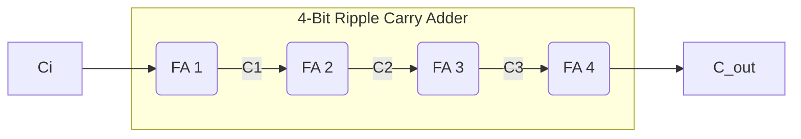

## Slide 1: Title Slide
# **Timing Performance of Nanometer Digital Circuits Under Process Variations** ⏱️

**Authors:** Victor Champac & Jose Garcia Gervacio
**Series:** Frontiers in Electronic Testing, Volume 39
**Year:** 2018

---

## Slide 2: Motivation: The Nanometer Challenge
### Why are Process Variations Critical Today?

*   **Technology Scaling:** Continuous scaling enables increased performance and complexity at constrained cost.
*   **Nanometer Regime:** At scaled semiconductor technologies (tens of nanometers), performance differences among fabricated circuits become significant.
*   **Process Variations (PV):** These differences are caused by fluctuating conditions during manufacturing.
*   **Major Impact:** PV severely impacts the yield and quality of circuits, affecting semiconductor company profitability.
*   **Digital Circuits:** While traditionally a concern for analog circuits, **PV now plays a major role in digital circuits** as scaling continues.

---

## Slide 3: Traditional vs. Modern Design 🛠️

*   **Traditional Approach (Corner Design):**
    *   Verifies circuit performance at extreme Process-Voltage-Temperature (PVT) conditions (e.g., SS, FF, LV, HT).
    *   Becomes **less efficient** and incurs **high-cost penalties** with technology scaling, primarily due to increased intra-die variations.
    *   Leads to **overdesign** (larger area and power consumption) to ensure timing closure at pessimistic, often unrealistic, corners.

*   **Modern Requirement (Statistical Design):**
    *   Requires considering the **statistical nature** of process variations and their impact on circuit performance.
    *   Allows chips to meet frequency specifications **more efficiently** by reducing the cost incurred by pessimistic worst-case analysis.

---

## Slide 4: Understanding Process Variations (PV)
### Classification and Behavior

PV leads to fluctuations in physical parameters (e.g., $L$, $W$, $T_{ox}$) which, in turn, cause electrical parameter variations (e.g., $V_{th}$) and ultimately, circuit performance variations (e.g., delay).

Process variations are classified by behavior:

1.  **Systematic (Deterministic):** Predictable and often correctable (e.g., due to Optical Proximity Effects, OPC).
2.  **Nonsystematic (Random):** Statistically modeled; the primary concern for modern digital design.
    *   **Inter-die (D2D/Global):** Affects all devices on a chip equally (e.g., wafer-to-wafer variations).
    *   **Intra-die (WID/Local):** Affects each device on a chip differently.

<br>
**Mermaid Diagram: Process Variation Hierarchy**
```mermaid
graph TD
    A[Process Variations] --> B{Systematic};
    A --> C{Nonsystematic (Random)};
    C --> D[Inter-die (D2D/Global)];
    C --> E[Intra-die (WID/Local)];
    E --> F[Pure Random];
    E --> G[Spatially Correlated];
```


---

## Slide 5: Sources of Variation (CMOS & FinFET)

| Parameter Affected | CMOS Sources (Planar) | FinFET Sources (3D) | Behavior Type |
| :--- | :--- | :--- | :--- |
| **$V_{th}$** | Random Dopant Fluctuation (RDF) | Work Function Variation (WFV) | Pure Random / Intra-Die |
| **$L, W$** | Photolithography & Etching non-idealities | Gate Line Edge Roughness (GER) | Random / Correlated |
| **$T_{ox}$** | Dielectric deposition quality | Fin Line Edge Roughness (FER) | Random / Correlated |

*   **Key Concept: RDF**
    *   Fluctuations in the amount and location of dopant atoms implanted in the channel are completely random.
    *   Threshold voltage deviation ($\sigma_{V_{th}}$) increases when shrinking feature size.

*   **Key Concept: LER**
    *   Random variation of polysilicon/gate edges.
    *   Major source of channel length variation.

---

## Slide 6: Modeling Variation: The Statistical Foundation 📊

Process parameters ($X$) are often modeled as Normal Random Variables ($\sim N(\mu, \sigma^2)$).

A statistical parameter $X$ considering inter-die (D2D), correlated intra-die ($WID, c$), and pure random ($WID, r$) variations is modeled as a linear sum:

$$
X = X_0 + X_{D2D} + X_{WID, c} + X_{WID, r}
$$
Where $X_0$ is the nominal value.

The total variance ($\sigma^2_X$) is the sum of the variances of the independent components:

$$
\sigma^2_X = \sigma^2_{X_{D2D}} + \sigma^2_{X_{WID, c}} + \sigma^2_{X_{WID, r}}
$$

### Spatial Correlation Modeling

The correlation ($\rho$) between two gates (i and j) separated by distance $d_{ij}$ is crucial for modeling delay in long paths. The Exponential Model is commonly used:

$$\rho(X_i, X_j) = K_{D2D} + K_{WID} \exp\left( -\frac{d_{ij}}{CD_{WID}} \right)$$

*   $K_{D2D}$: Percentage of inter-die variation (minimum correlation).
*   $K_{WID}$: Percentage of intra-die correlated variation.
*   $CD_{WID}$: Intra-die correlation distance.

---

## Slide 7: Statistical Timing: Gate Delay Formulation

The gate delay $D$ is a function of $k$ random variables $X_P$ (process parameters):
$$
D = f(X_{P1}, \dots, X_{Pk})
$$

We approximate this complex function using a **first-order Taylor series expansion** around the nominal parameter values ($\mu_{XP}$).

### Mean Delay ($\mu_D$)
For practical purposes, the mean delay is often approximated by the nominal delay. For higher accuracy, a second-order term is sometimes included:

$$\mu_D \approx f(\mu_{X_{P1}}, \dots, \mu_{X_{Pk}}) + \frac{1}{2} \sum_{m=1}^{k} \left[ \frac{\partial^2 f}{\partial X^2_{P_m}} \right]_{nom} \cdot \sigma^2_{X_{P_m}}$$

### Delay Variance ($\sigma^2_D$) - The Sensitivity Model

The delay variance is determined by the summation of contributions from each parameter, weighted by its square of sensitivity and its variance:

$$\sigma^2_D = \sum_{m=1}^{k} \left[ \frac{\partial f}{\partial X_{P_m}} \right]^2_{nom} \cdot \sigma^2_{X_{P_m}}$$
$$
\implies \sigma^2_D = \sum_{m=1}^{k} S^2_{D, P_m} \cdot \sigma^2_{X_{P_m}}
$$
Where $S_{D, P_m}$ is the **delay sensitivity** to parameter $P_m$.

---

## Slide 8: Case Study: Inverter Delay Variance

We focus on the inverter, the simplest gate, assuming $W, L, T_{ox}$ capture correlated variations and $V_{th}$ captures pure random variations.

$$\sigma^2_D = S^2_{D,W} \sigma^2_W + S^2_{D,L} \sigma^2_L + S^2_{D,T_{ox}} \sigma^2_{T_{ox}} + S^2_{D,V_{th}} \sigma^2_{V_{th}}$$

### Delay Sensitivity Calculation (SPICE Approach)
Sensitivities ($S_{D, P_m}$) are derived by observing the change in delay ($\Delta t_D$) resulting from a small change in parameter ($\Delta X$) around its nominal value ($X_0$):

$$
S_{D, P_m} \approx \frac{t_D(X_0+\Delta X) - t_D(X_0-\Delta X)}{(X_0 + \Delta X) - (X_0 - \Delta X)}
$$

*   This approach, using SPICE electrical simulation, accurately captures non-linear effects, unlike simple analytical models.
*   The parameter with the **highest product of sensitivity squared and variance** contributes most significantly to the total delay variance.

---

## Slide 9: Design Impact: Controlling Gate Variation

The standard deviation of gate delay ($\sigma_D$) is directly affected by design choices:

1.  **Sizing the Logic Gate (W):**
    *   Delay sensitivities generally reduce as the transistor channel width ($W$) increases.
    *   **Hint:** Sizing up the gate is an efficient way to reduce $\sigma_D$.

2.  **Load Capacitance ($C_L$):**
    *   Delay sensitivities increase linearly as load capacitance increases.
    *   **Hint:** Nodes with higher $C_L$ (high fan-out, long wire routing) significantly increase $\sigma_D$.

3.  **Power Supply Voltage ($V_{DD}$):**
    *   $\sigma_D$ increases significantly as $V_{DD}$ is reduced, especially at lower supply voltages.

4.  **Input Slew Time:**
    *   $\sigma_D$ increases as the input rise/fall time increases, as the network becomes more resistive.

---

## Slide 10: Statistical Path Delay (General Formulation)

A logic path is composed of $N$ gates ($D_1, D_2, \dots, D_N$). The total path delay variance ($\sigma^2_{DP}$) is given by the sum of individual gate variances plus the covariance terms between all pairs of gates:

$$
\sigma^2_{DP} = \sum_{i=1}^{N} \sigma^2_{D_i} + 2 \sum_{i=1}^{N} \sum_{j=i+1}^{N} \text{Cov}(D_i, D_j)
$$

### Covariance Term
The covariance $\text{Cov}(D_i, D_j)$ captures the dependence (spatial correlation) between the delays of gates $i$ and $j$:

$$
\text{Cov}(D_i, D_j) = \sum_{m=1}^{k} S_{D_i, P_m} \cdot S_{D_j, P_m} \cdot \rho_{P_m}^{D_i, D_j} \cdot \sigma_{P_m} \cdot \sigma_{P_m}
$$

*   This term is non-zero only for parameters ($P_m$) that exhibit **spatial correlation**.
*   It scales proportionally to the **product of the sensitivities** of both gates ($S_{D_i} \cdot S_{D_j}$).

---

## Slide 11: Impact of Spatial Correlation in Path Delay

*   **Scenario:** Two adjacent gates with high delay sensitivities.
*   **Observation:** The contribution of the spatial correlation ($2 \cdot \text{Cov}(D_1, D_2)$) to the total path delay variance is significantly larger for gates located very close ($\rho = 0.9$) than for gates located farther apart ($\rho = 0.1$).

**Hint:** Be aware of a pair of gates being located physically close **AND** having high delay sensitivities. These conditions dramatically increase the path delay variance.

### Impact of Logic Depth (N)
Logic depth dramatically changes how variations impact the path.

| Variation Type | Path Delay Variability ($\sigma_{DP} / \mu_{DP}$) | Impact with N |
| :--- | :--- | :--- |
| **Fully Correlated** ($\rho=1$) | $(\sigma/\mu)_{inv}$ (Constant) | **Does not decrease** as $N$ increases. |
| **Non-Correlated** ($\rho=0$) | $(\sigma/\mu)_{inv} \cdot \frac{1}{\sqrt{N}}$ | **Decreases** with the square root of $N$. |

**Key Takeaway:** Correlated variations impact the overall path delay more significantly than pure random variations as the path length increases.

---

## Slide 12: Corner Design vs. Statistical Design Cost 💸

Corner-based design assumes an unrealistic scenario where all critical parameters simultaneously hit their worst-case extreme (e.g., SS corner).

### Overdesign Overhead
A comparative analysis (using a 10-inverter chain example) showed the financial cost of this pessimism:

**Goal:** Meet a target delay of 661 ps.

| Design Metric | Statistical Design ($\mu + 3\sigma$) | Corner Design (SS) | Overhead (Corner vs. Statistical) |
| :--- | :--- | :--- | :--- |
| **Required Size** | 1.3X | 2.0X | - |
| **Area Increase** | - | - | **62.5% larger** |
| **Power Consumption** | - | - | **44% larger** |

*   **Statistical analysis** provides a maximum delay prediction (e.g., $\mu + 3\sigma$) that is much smaller than the pessimistic SS Corner delay.
*   Using statistical methods allows for meeting specifications with smaller, lower-power circuits.

---

## Slide 13: Advanced Topic: FinFET Technology 🔬

FinFETs (Fin Field-Effect Transistors) were adopted starting at the 22 nm node to overcome scaling limits of planar transistors.

### Structure and Sizing
*   The gate wraps around a thin silicon fin, greatly improving control over the channel and reducing short-channel effects.
*   Effective Channel Width ($W_{eff}$) becomes **quantized**, depending on physical dimensions ($H_{fin}, T_{fin}$) and design choices:
    $$W_{eff} = N_{FIN} \cdot (2 H_{fin} + T_{fin})$$
    (Where $N_{FIN}$ is the number of fins).
*   Designers use **multi-fin** and **multi-finger** devices to achieve the required driving strength.

### Fabrication Advances
*   **Self-aligned Double Patterning (SADP):** A lithography technique used to define narrow, highly uniform fins.
*   **Middle-of-Line (MOL) Interconnects:** Intermediate tungsten connection layers introduced between FEOL (devices) and BEOL (interconnects) to enable high-density standard cells.

---

## Slide 14: FinFET Statistical Variability

Two major sources of variation are critical in FinFET timing performance:

1.  **Work Function Variation (WFV):**
    *   Caused by random grain orientations in the metal gate.
    *   Introduced due to the use of high-k dielectrics and metal gates.
    *   Leads to random variations in the transistor threshold voltage ($\Phi_M$).

2.  **Line Edge Roughness (LER):**
    *   Leads to random fluctuations in fin thickness ($T_{fin}$) (Fin LER/FER) and gate length ($L_g$) (Gate LER/GER).
    *   **SADP Mitigation:** In SADP, variations on opposite edges of a feature are correlated, partially cancelling out the LER impact on line width.

### Statistical Delay in Multi-Fin Cells

For a multi-fin inverter with $N_{FIN}$ parallel fins, considering **Pure Random** (WFV) and **Inter-Die/Global** ($T_{fin}, L_g$) variations:

$$\sigma^2_D = N_{FIN} \cdot \left[ (S_{D,\Phi_M} \sigma_{\Phi_M})^2 \right] + N^2_{FIN} \left[ (S_{D,T_{fin}} \sigma_{T_{fin}})^2 + (S_{D,L_g} \sigma_{L_g})^2 \right]$$

*   **Pure Random $\sigma^2$** scales linearly with $N_{FIN}$ (Law of Large Numbers).
*   **Inter-Die $\sigma^2$** scales quadratically with $N_{FIN}$ (All fins shift together).

---

## Slide 15: Circuit Example: Ripple Carry Adder (RCA)

*   **Circuit:** 4-Bit RCA built from mirror adder cells.
*   **Critical Path:** The longest paths involve the ripple of the carry signal ($T_{carry}$) across the stages.
*   **Path 2 Delay:** $T_{Path-2} = N \cdot T_{carry}$ (linearly proportional to number of bits $N$).

### Optimization Hint 💡
To improve adder performance, focus optimization (e.g., resizing transistors) on the logic gates driving the carry signal in each full adder cell, specifically the left carry generator block.

**Mermaid Diagram: Logic Path Example**



---

## Slide 16: Circuit Example: SRAM Cell Stability

*   **6T-SRAM Cell:** Core component of memory, replicated in large arrays.
*   **Reliability Metrics:** Must maintain reliable Read, Write, and Hold operations under PV.
*   **Static Noise Margin (SNM):** Measures maximum voltage noise the cell can tolerate.

### High-Sigma Analysis (High Yield Requirements)
*   **Need:** Designs must guarantee correct performance for more than $3\sigma$ variations (e.g., $6\sigma$) for critical systems (avionics, medical) or high-volume/large array components (SRAM).
*   **PV Impact:** Process variations significantly reduce stability margins (SNM).
*   **Hold Margin:** Hold SNM is especially vulnerable at low supply voltages ($V_{DD}$) when attempting to reduce leakage power, potentially leading to data destruction.
*   **Hint:** Designs replicated many times must fulfill high-sigma constraints to guarantee reliability.

---

## Slide 17: Summary and Key Concepts

1.  **PV Impact:** Process variations, especially WID/Local variations (RDF, LER, WFV), are dominant timing challenges in nanometer circuits.
2.  **Modeling:** Statistical timing relies on approximating delay using a **first-order Taylor expansion** and focusing on **delay sensitivities** and parameter variances.
3.  **Path Delay:** Total path variance is the sum of gate variances plus covariance terms, with **spatial correlation** being critical for correlated parameters.
4.  **Design Trade-offs:** Sizing up gates effectively reduces local delay variance ($\sigma_D$).
5.  **Statistical Advantage:** Statistical design overcomes the pessimism of corner analysis, leading to significant reductions in area and power overhead.
6.  **FinFETs:** New architectures require new variation models, incorporating effects like WFV and analyzing delay scaling based on the number of fins ($N_{FIN}$).

---

## Slide 18: Further Reading & Q&A

**Key Design Hints:**

*   Identify physically close gates with high delay sensitivities to mitigate maximum $\text{Covariance}$ contributions.
*   Size up gates with low driving strength and high load capacitance to reduce path $\sigma_D$.
*   For critical cells (like SRAM), perform High-Sigma analysis (beyond $3\sigma$).

**Questions?** ❓
**Thank You!** 🙏

---
*(End of 30-minute presentation)*
