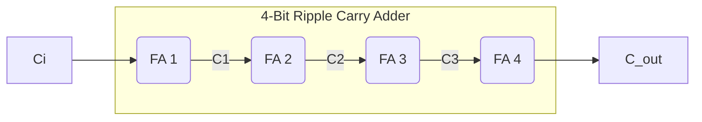

### Slide 1: Title Slide

# **Timing Performance of Nanometer Digital Circuits Under Process Variations** ⏱️

**Authors:** Victor Champac & Jose Garcia Gervacio
**Series:** Frontiers in Electronic Testing, Volume 39
**Year:** 2018

---

## Slide 2: Motivation: The Nanometer Challenge

### Why are Process Variations Critical Today?

-   **Technology Scaling:** Continuous scaling enables increased performance and complexity at constrained cost.
-   **Nanometer Regime:** At scaled semiconductor technologies (tens of nanometers), performance differences among fabricated circuits become significant.
-   **Process Variations (PV):** These differences are caused by fluctuating conditions during manufacturing.
-   **Major Impact:** PV severely impacts the yield and quality of circuits, affecting semiconductor company profitability.
-   **Digital Circuits:** While traditionally a concern for analog circuits, **PV now plays a major role in digital circuits** as scaling continues.

---

### Slide 3: Traditional vs. Modern Design 🛠️

-   **Traditional Approach (Corner Design):**

  -   Verifies circuit performance at extreme Process-Voltage-Temperature (PVT) conditions (e.g., SS, FF, LV, HT).
  -   Becomes **less efficient** and incurs **high-cost penalties** with technology scaling, primarily due to increased intra-die variations.
  -   Leads to **overdesign** (larger area and power consumption) to ensure timing closure at pessimistic, often unrealistic, corners.

-   **Modern Requirement (Statistical Design):**
  -   Requires considering the **statistical nature** of process variations and their impact on circuit performance.
  -   Allows chips to meet frequency specifications **more efficiently** by reducing the cost incurred by pessimistic worst-case analysis.

---

### Slide 4: Understanding Process Variations (PV)

### Classification and Behavior

PV leads to fluctuations in physical parameters (e.g., ${\color{royalblue}L}$, ${\color{royalblue}W}$, ${\color{royalblue}T_{ox} }$) which, in turn, cause electrical parameter variations (e.g., ${\color{royalblue}V_{th} }$) and ultimately, circuit performance variations (e.g., delay).

Process variations are classified by behavior:

1. **Systematic (Deterministic):** Predictable and often correctable (e.g., due to Optical Proximity Effects, OPC).
2. **Nonsystematic (Random):** Statistically modeled; the primary concern for modern digital design.
   -   **Inter-die (D2D/Global):** Affects all devices on a chip equally (e.g., wafer-to-wafer variations).
   -   **Intra-die (WID/Local):** Affects each device on a chip differently.

 
**Mermaid Diagram: Process Variation Hierarchy**
```mermaid
graph TD
    A[Process Variations] --> B{Systematic};
    A --> C{Nonsystematic (Random)};
    C --> D[Inter-die (D2D/Global)];
    C --> E[Intra-die (WID/Local)];
    E --> F[Pure Random];
    E --> G[Spatially Correlated];
```

---

### Slide 5: Sources of Variation (CMOS & FinFET)

| Parameter Affected | CMOS Sources (Planar)                     | FinFET Sources (3D)            | Behavior Type           |
| :----------------- | :---------------------------------------- | :----------------------------- | :---------------------- |
| **${\color{royalblue}V_{th} }$**       | Random Dopant Fluctuation (RDF)           | Work Function Variation (WFV)  | Pure Random / Intra-Die |
| **${\color{royalblue}L}, {\color{royalblue}W}$**         | Photolithography & Etching non-idealities | Gate Line Edge Roughness (GER) | Random / Correlated     |
| **${\color{royalblue}T_{ox} }$**       | Dielectric deposition quality             | Fin Line Edge Roughness (FER)  | Random / Correlated     |

-   **Key Concept: RDF**

  -   Fluctuations in the amount and location of dopant atoms implanted in the channel are completely random.
   -   Threshold voltage deviation (${\color{royalblue}\sigma_{V_{th} } }$) increases when shrinking feature size.

-   **Key Concept: LER**
  -   Random variation of polysilicon/gate edges.
  -   Major source of channel length variation.

---

### Slide 6: Modeling Variation: The Statistical Foundation 📊

Process parameters (${\color{green}X}$) are often modeled as Normal Random Variables ($\sim N({\color{royalblue}\mu}, {\color{royalblue}\sigma^2})$).

A statistical parameter ${\color{green}X}$ considering inter-die (D2D), correlated intra-die (${\color{royalblue}WID}, {\color{royalblue}c}$), and pure random (${\color{royalblue}WID}, {\color{royalblue}r}$) variations is modeled as a linear sum:

$$
{\color{green}X} = {\color{royalblue}X_0} + {\color{green}X_{D2D} } + {\color{green}X_{WID, c} } + {\color{green}X_{WID, r} }
$$

Where ${\color{royalblue}X_0}$ is the nominal value.

The total variance (${\color{royalblue}\sigma^2_X}$) is the sum of the variances of the independent components:

$$
{\color{royalblue}\sigma^2_X} = {\color{royalblue}\sigma^2_{X_{D2D} } } + {\color{royalblue}\sigma^2_{X_{WID, c} } } + {\color{royalblue}\sigma^2_{X_{WID, r} } }
$$

### Spatial Correlation Modeling

The correlation (${\color{royalblue}\rho}$) between two gates (i and j) separated by distance ${\color{royalblue}d_{ij} }$ is crucial for modeling delay in long paths. The Exponential Model is commonly used:

$${\color{royalblue}\rho}({\color{green}X_i}, {\color{green}X_j}) = {\color{royalblue}K_{D2D} } + {\color{royalblue}K_{WID} } \exp\left( -\frac{ {\color{royalblue}d_{ij} } }{ {\color{royalblue}CD_{WID} } } \right)$$

-   ${\color{royalblue}K_{D2D} }$: Percentage of inter-die variation (minimum correlation).
-   ${\color{royalblue}K_{WID} }$: Percentage of intra-die correlated variation.
-   ${\color{royalblue}CD_{WID} }$: Intra-die correlation distance.

---

### Slide 7: Statistical Timing: Gate Delay Formulation

The gate delay ${\color{salmon}D}$ is a function of ${\color{royalblue}k}$ random variables ${\color{green}X_P}$ (process parameters):

$$
{\color{salmon}D} = f({\color{green}X_{P1} }, \dots, {\color{green}X_{Pk} })
$$

We approximate this complex function using a **first-order Taylor series expansion** around the nominal parameter values (${\color{royalblue}\mu_{XP} }$).

### Mean Delay (${\color{firebrick}\mu_D}$)

For practical purposes, the mean delay is often approximated by the nominal delay. For higher accuracy, a second-order term is sometimes included:

$${\color{firebrick}\mu_D} \approx f({\color{royalblue}\mu_{X_{P1} } }, \dots, {\color{royalblue}\mu_{X_{Pk} } }) + \frac{1}{2} \sum_{ {\color{royalblue}m}=1}^{ {\color{royalblue}k} } \left[ \frac{\partial^2 f}{\partial {\color{green}X}^2_{ {\color{green}P_m} } } \right]_{nom} \cdot {\color{royalblue}\sigma^2_{X_{P_m} } }$$

### Delay Variance (${\color{firebrick}\sigma^2_D}$) - The Sensitivity Model

The delay variance is determined by the summation of contributions from each parameter, weighted by its square of sensitivity and its variance:

$${\color{firebrick}\sigma^2_D} = \sum_{ {\color{royalblue}m}=1}^{ {\color{royalblue}k} } \left[ \frac{\partial f}{\partial {\color{green}X}_{ {\color{green}P_m} } } \right]^2_{nom} \cdot {\color{royalblue}\sigma^2_{X_{P_m} } }$$

$$
\implies {\color{firebrick}\sigma^2_D} = \sum_{ {\color{royalblue}m}=1}^{ {\color{royalblue}k} } {\color{royalblue}S^2_{D, P_m} } \cdot {\color{royalblue}\sigma^2_{X_{P_m} } }
$$

Where ${\color{royalblue}S_{D, P_m} }$ is the **delay sensitivity** to parameter ${\color{royalblue}P_m}$.

---

### Slide 8: Case Study: Inverter Delay Variance

We focus on the inverter, the simplest gate, assuming ${\color{royalblue}W}, {\color{royalblue}L}, {\color{royalblue}T_{ox} }$ capture correlated variations and ${\color{royalblue}V_{th} }$ captures pure random variations.

$${\color{firebrick}\sigma^2_D} = {\color{royalblue}S^2_{D,W} } {\color{royalblue}\sigma^2_W} + {\color{royalblue}S^2_{D,L} } {\color{royalblue}\sigma^2_L} + {\color{royalblue}S^2_{D,T_{ox} } } {\color{royalblue}\sigma^2_{T_{ox} } } + {\color{royalblue}S^2_{D,V_{th} } } {\color{royalblue}\sigma^2_{V_{th} } }$$

### Delay Sensitivity Calculation (SPICE Approach)

Sensitivities (${\color{royalblue}S_{D, P_m} }$) are derived by observing the change in delay (${\color{firebrick}\Delta t_D}$) resulting from a small change in parameter (${\color{royalblue}\Delta X}$) around its nominal value (${\color{royalblue}X_0}$):

$$
{\color{royalblue}S_{D, P_m} } \approx \frac{ {\color{firebrick}t_D}({\color{royalblue}X_0}+{\color{royalblue}\Delta X}) - {\color{firebrick}t_D}({\color{royalblue}X_0}-{\color{royalblue}\Delta X})}{({\color{royalblue}X_0} + {\color{royalblue}\Delta X}) - ({\color{royalblue}X_0} - {\color{royalblue}\Delta X})}
$$

-   This approach, using SPICE electrical simulation, accurately captures non-linear effects, unlike simple analytical models.
-   The parameter with the **highest product of sensitivity squared and variance** contributes most significantly to the total delay variance.

---

### Slide 9: Design Impact: Controlling Gate Variation

The standard deviation of gate delay (${\color{firebrick}\sigma_D}$) is directly affected by design choices:

1. **Sizing the Logic Gate (W):**

   -   Delay sensitivities generally reduce as the transistor channel width (${\color{royalblue}W}$) increases.
   -   **Hint:** Sizing up the gate is an efficient way to reduce ${\color{firebrick}\sigma_D}$.

2. **Load Capacitance (${\color{royalblue}C_L}$):**

   -   Delay sensitivities increase linearly as load capacitance increases.
   -   **Hint:** Nodes with higher ${\color{royalblue}C_L}$ (high fan-out, long wire routing) significantly increase ${\color{firebrick}\sigma_D}$.

3. **Power Supply Voltage (${\color{royalblue}V_{DD} }$):**

   -   ${\color{firebrick}\sigma_D}$ increases significantly as ${\color{royalblue}V_{DD} }$ is reduced, especially at lower supply voltages.

4. **Input Slew Time:**
   -   ${\color{firebrick}\sigma_D}$ increases as the input rise/fall time increases, as the network becomes more resistive.

---

### Slide 10: Statistical Path Delay (General Formulation)

A logic path is composed of ${\color{royalblue}N}$ gates (${\color{salmon}D_1}, {\color{salmon}D_2}, \dots, {\color{salmon}D_N}$). The total path delay variance (${\color{lime}\sigma^2_{DP} }$) is given by the sum of individual gate variances plus the covariance terms between all pairs of gates:

$$
{\color{lime}\sigma^2_{DP} } = \sum_{ {\color{royalblue}i}=1}^{ {\color{royalblue}N} } {\color{firebrick}\sigma^2_{D_i} } + 2 \sum_{ {\color{royalblue}i}=1}^{ {\color{royalblue}N} } \sum_{ {\color{royalblue}j}={\color{royalblue}i}+1}^{ {\color{royalblue}N} } \text{Cov}({\color{salmon}D_i}, {\color{salmon}D_j})
$$

### Covariance Term

The covariance $\text{Cov}({\color{salmon}D_i}, {\color{salmon}D_j})$ captures the dependence (spatial correlation) between the delays of gates ${\color{royalblue}i}$ and ${\color{royalblue}j}$:

$$
\text{Cov}({\color{salmon}D_i}, {\color{salmon}D_j}) = \sum_{ {\color{royalblue}m}=1}^{ {\color{royalblue}k} } {\color{royalblue}S_{D_i, P_m} } \cdot {\color{royalblue}S_{D_j, P_m} } \cdot {\color{royalblue}\rho_{P_m}^{D_i, D_j} } \cdot {\color{royalblue}\sigma_{P_m} } \cdot {\color{royalblue}\sigma_{P_m} }
$$

-   This term is non-zero only for parameters (${\color{royalblue}P_m}$) that exhibit **spatial correlation**.
-   It scales proportionally to the **product of the sensitivities** of both gates (${\color{royalblue}S_{D_i} } \cdot {\color{royalblue}S_{D_j} }$).

---

### Slide 11: Impact of Spatial Correlation in Path Delay

-   **Scenario:** Two adjacent gates with high delay sensitivities.
-   **Observation:** The contribution of the spatial correlation ($2 \cdot \text{Cov}({\color{salmon}D_1}, {\color{salmon}D_2})$) to the total path delay variance is significantly larger for gates located very close (${\color{royalblue}\rho} = 0.9$) than for gates located farther apart (${\color{royalblue}\rho} = 0.1$).

**Hint:** Be aware of a pair of gates being located physically close **AND** having high delay sensitivities. These conditions dramatically increase the path delay variance.

### Impact of Logic Depth (N)

Logic depth dramatically changes how variations impact the path.

| Variation Type                  | Path Delay Variability (${\color{lime}\sigma_{DP} } / {\color{lime}\mu_{DP} }$) | Impact with N                              |
| :------------------------------ | :------------------------------------------------ | :----------------------------------------- |
| **Fully Correlated** (${\color{royalblue}\rho}=1$) | $({\color{firebrick}\sigma/\mu})_{inv}$ (Constant)                   | **Does not decrease** as ${\color{royalblue}N}$ increases.    |
| **Non-Correlated** (${\color{royalblue}\rho}=0$)   | $({\color{firebrick}\sigma/\mu})_{inv} \cdot \frac{1}{\sqrt{ {\color{royalblue}N} } }$    | **Decreases** with the square root of ${\color{royalblue}N}$. |

**Key Takeaway:** Correlated variations impact the overall path delay more significantly than pure random variations as the path length increases.

---

### Slide 12: Corner Design vs. Statistical Design Cost 💸

Corner-based design assumes an unrealistic scenario where all critical parameters simultaneously hit their worst-case extreme (e.g., SS corner).

### Overdesign Overhead

A comparative analysis (using a 10-inverter chain example) showed the financial cost of this pessimism:

**Goal:** Meet a target delay of 661 ps.

| Design Metric         | Statistical Design (${\color{royalblue}\mu} + 3{\color{royalblue}\sigma}$) | Corner Design (SS) | Overhead (Corner vs. Statistical) |
| :-------------------- | :----------------------------------- | :----------------- | :-------------------------------- |
| **Required Size**     | 1.3X                                 | 2.0X               | -                                 |
| **Area Increase**     | -                                    | -                  | **62.5% larger**                  |
| **Power Consumption** | -                                    | -                  | **44% larger**                    |

-   **Statistical analysis** provides a maximum delay prediction (e.g., ${\color{royalblue}\mu} + 3{\color{royalblue}\sigma}$) that is much smaller than the pessimistic SS Corner delay.
-   Using statistical methods allows for meeting specifications with smaller, lower-power circuits.

---

### Slide 13: Advanced Topic: FinFET Technology 🔬

FinFETs (Fin Field-Effect Transistors) were adopted starting at the 22 nm node to overcome scaling limits of planar transistors.

### Structure and Sizing

-   The gate wraps around a thin silicon fin, greatly improving control over the channel and reducing short-channel effects.
-   Effective Channel Width (${\color{royalblue}W_{eff} }$) becomes **quantized**, depending on physical dimensions (${\color{royalblue}H_{fin} }, {\color{royalblue}T_{fin} }$) and design choices:
  $${\color{royalblue}W_{eff} } = {\color{royalblue}N_{FIN} } \cdot (2 {\color{royalblue}H_{fin} } + {\color{royalblue}T_{fin} })$$
  (Where ${\color{royalblue}N_{FIN} }$ is the number of fins).
-   Designers use **multi-fin** and **multi-finger** devices to achieve the required driving strength.

### Fabrication Advances

-   **Self-aligned Double Patterning (SADP):** A lithography technique used to define narrow, highly uniform fins.
-   **Middle-of-Line (MOL) Interconnects:** Intermediate tungsten connection layers introduced between FEOL (devices) and BEOL (interconnects) to enable high-density standard cells.

---

### Slide 14: FinFET Statistical Variability

Two major sources of variation are critical in FinFET timing performance:

1. **Work Function Variation (WFV):**

   -   Caused by random grain orientations in the metal gate.
   -   Introduced due to the use of high-k dielectrics and metal gates.
   -   Leads to random variations in the transistor threshold voltage (${\color{royalblue}\Phi_M}$).

2. **Line Edge Roughness (LER):**
   -   Leads to random fluctuations in fin thickness (${\color{royalblue}T_{fin} }$) (Fin LER/FER) and gate length (${\color{royalblue}L_g}$) (Gate LER/GER).
   -   **SADP Mitigation:** In SADP, variations on opposite edges of a feature are correlated, partially cancelling out the LER impact on line width.

### Statistical Delay in Multi-Fin Cells

For a multi-fin inverter with ${\color{royalblue}N_{FIN} }$ parallel fins, considering **Pure Random** (WFV) and **Inter-Die/Global** (${\color{royalblue}T_{fin} }, {\color{royalblue}L_g}$) variations:

$${\color{firebrick}\sigma^2_D} = {\color{royalblue}N_{FIN} } \cdot \left[ ({\color{royalblue}S_{D,\Phi_M} } {\color{royalblue}\sigma_{\Phi_M} })^2 \right] + {\color{royalblue}N^2_{FIN} } \left[ ({\color{royalblue}S_{D,T_{fin} } } {\color{royalblue}\sigma_{T_{fin} } })^2 + ({\color{royalblue}S_{D,L_g} } {\color{royalblue}\sigma_{L_g} })^2 \right]$$

-   **Pure Random ${\color{royalblue}\sigma^2}$** scales linearly with ${\color{royalblue}N_{FIN} }$ (Law of Large Numbers).
-   **Inter-Die ${\color{royalblue}\sigma^2}$** scales quadratically with ${\color{royalblue}N_{FIN} }$ (All fins shift together).

---

### Slide 15: Circuit Example: Ripple Carry Adder (RCA)

-   **Circuit:** 4-Bit RCA built from mirror adder cells.
-   **Critical Path:** The longest paths involve the ripple of the carry signal (${\color{lime}T_{carry} }$) across the stages.
-   **Path 2 Delay:** ${\color{lime}T_{Path-2} } = {\color{royalblue}N} \cdot {\color{lime}T_{carry} }$ (linearly proportional to number of bits ${\color{royalblue}N}$).

### Optimization Hint 💡

To improve adder performance, focus optimization (e.g., resizing transistors) on the logic gates driving the carry signal in each full adder cell, specifically the left carry generator block.

## Mermaid Diagram: Logic Path Example

```mermaid
graph LR
    Ci --> FA1(FA 1)
    FA1 -- C1 --> FA2(FA 2)
    FA2 -- C2 --> FA3(FA 3)
    FA3 -- C3 --> FA4(FA 4)
    FA4 --> C_out
    subgraph 4-Bit Ripple Carry Adder
        direction LR
        FA1
        FA2
        FA3
        FA4
    end
```

---

### Slide 16: Circuit Example: SRAM Cell Stability

-   **6T-SRAM Cell:** Core component of memory, replicated in large arrays.
-   **Reliability Metrics:** Must maintain reliable Read, Write, and Hold operations under PV.
-   **Static Noise Margin (SNM):** Measures maximum voltage noise the cell can tolerate.

### High-Sigma Analysis (High Yield Requirements)

-   **Need:** Designs must guarantee correct performance for more than $3{\color{royalblue}\sigma}$ variations (e.g., $6{\color{royalblue}\sigma}$) for critical systems (avionics, medical) or high-volume/large array components (SRAM).
-   **PV Impact:** Process variations significantly reduce stability margins (SNM).
-   **Hold Margin:** Hold SNM is especially vulnerable at low supply voltages (${\color{royalblue}V_{DD} }$) when attempting to reduce leakage power, potentially leading to data destruction.
-   **Hint:** Designs replicated many times must fulfill high-sigma constraints to guarantee reliability.

---

### Slide 17: Summary and Key Concepts

1. **PV Impact:** Process variations, especially WID/Local variations (RDF, LER, WFV), are dominant timing challenges in nanometer circuits.
2. **Modeling:** Statistical timing relies on approximating delay using a **first-order Taylor expansion** and focusing on **delay sensitivities** and parameter variances.
3. **Path Delay:** Total path variance is the sum of gate variances plus covariance terms, with **spatial correlation** being critical for correlated parameters.
4. **Design Trade-offs:** Sizing up gates effectively reduces local delay variance (${\color{firebrick}\sigma_D}$).
5. **Statistical Advantage:** Statistical design overcomes the pessimism of corner analysis, leading to significant reductions in area and power overhead.
6. **FinFETs:** New architectures require new variation models, incorporating effects like WFV and analyzing delay scaling based on the number of fins (${\color{royalblue}N_{FIN} }$).

---

### Slide 18: Further Reading & Q&A

**Key Design Hints:**

-   Identify physically close gates with high delay sensitivities to mitigate maximum $\text{Covariance}$ contributions.
-   Size up gates with low driving strength and high load capacitance to reduce path ${\color{firebrick}\sigma_D}$.
-   For critical cells (like SRAM), perform High-Sigma analysis (beyond $3{\color{royalblue}\sigma}$).

**Questions?** ❓
**Thank You!** 🙏

---

## (End of 30-minute presentation)
