layout: true
class: typo, typo-selection

---

count: false
class: nord-dark, middle, center

# Lecture 1b: DFM For Dummies

@luk036

2024-09-04

---

## 📝 Abstract

DFM optimizes the ease of manufacturing and production costs of ICs while meeting performance, power, and reliability requirements. As ICs become increasingly miniaturized and complex, the manufacturing process is more sensitive to variations and defects. Chip quality and functionality may suffer if not addressed through Design for Manufacturing (DFM). DFM can be applied to multiple aspects of IC design, including circuit design, logic design, layout design, verification, and testing, to mitigate manufacturing issues.The lecture provides general guidelines for DFM. Best practices for DFM in IC layout design can reduce design iterations, improve collaboration with foundries, enhance product performance and functionality, and achieve faster time to market. Applying DFM techniques in the physical design stage can greatly benefit IC development. Lowering production costs. The lecture covers the challenges of Design for Manufacturability (DFM) as well as its market share. The lecture includes DFM analysis and verification, enhancement, optimization, and the algorithms used to solve DFM problems. The lecture includes DFM analysis and verification, enhancement, optimization, and the algorithms used to solve DFM problems. The course structure focuses on the problems that arise from DFM and presents them in mathematical forms.

---

## Faster, smaller & smarter

---

## Silicon Gold Rush?

---

## Current Transistors

- High-K dielectrics, Metal Gate (HKMG)

The significance of High-K dielectrics is that they have a higher
dielectric constant than traditional silicon dioxide (SiO2) dielectrics.
This allows for a thicker gate oxide layer to be used without increasing
the gate capacitance, which can improve the transistor's performance and
reduce leakage current.

Metal Gate refers to the use of a metal material (such as tungsten or
tantalum) for the gate electrode, instead of the traditional polysilicon
material. This is significant because metal gates can provide better
control over the transistor's threshold voltage, which can improve its
performance and reduce variability.

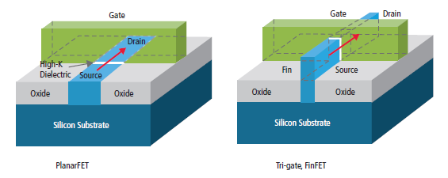

---

## New Transistor Type: Gate-All-Around

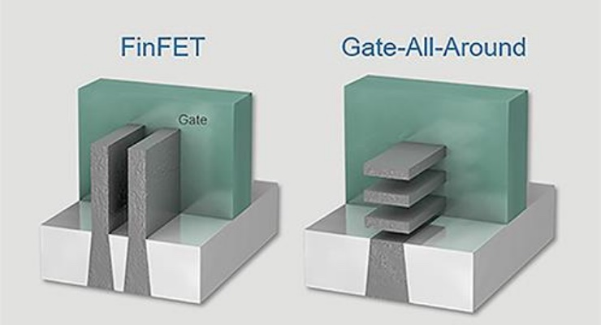

---

## Lithography

.pull-left[

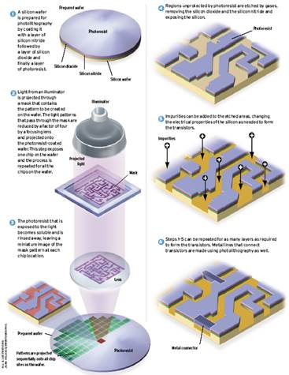

] .pull-right[

- Photo-resist coating
- Illumination
- Exposure
- Etching
- Impurities Doping
- Metal connection

]

---

## Process-Design Gap

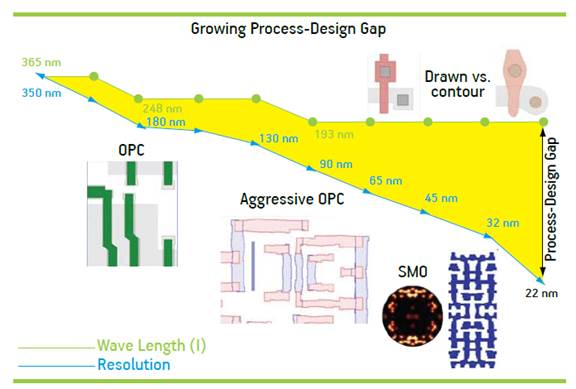

---

## Problem Visualization

One of the main impacts of lithography is that it can cause variations
in the dimensions and shapes of the IC's features, which can negatively
impact the performance and yield of the IC. This is because lithography
is a complex process that involves the use of light to transfer a
pattern from a mask to a wafer. Variations in the intensity, wavelength,
and angle of the light can cause deviations in the dimensions and shapes
of the features, which can lead to process-induced variation.

---

## Chemical Mechanical Polishing

Chemical Mechanical Polishing (CMP) is a process used in semiconductor
manufacturing to planarize the surface of a wafer. CMP is one of the
steps involved in the fabrication of integrated circuits, specifically
in the metal connection stage.

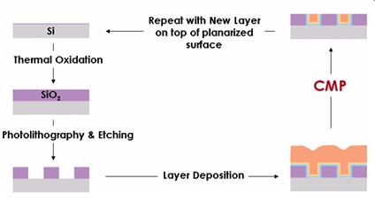

---

## Chemical Mechanical Polishing

.pull-left[

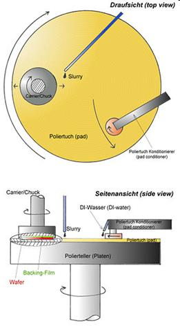

] .pull-right[

In terms of bridging the Process-Design Gap, CMP can help address the
issue of process-induced variation by improving the uniformity of the
wafer surface. This is important because process-induced variation can
cause deviations in the dimensions and electrical properties of the
transistors, which can negatively impact the performance and yield of
the IC.

]

---

## ECP & CMP

.pull-left[

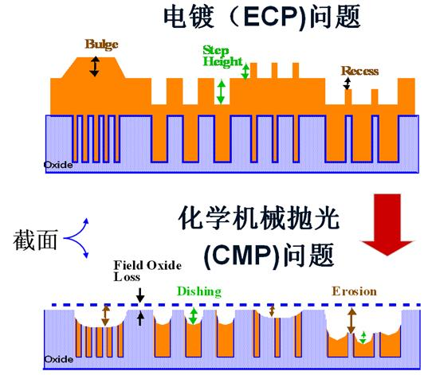

] .pull-right[

By using CMP to planarize the wafer surface, designers can reduce the
variability in the thickness of the metal layers, which can improve the
accuracy and consistency of the IC's electrical properties. This, in
turn, can help bridge the Process-Design Gap by ensuring that the ICs
are manufactured according to the intended design specifications.

]

---

count: false
class: nord-light, middle, center

# Process Variation

---

## Total Thickness Variation Per Node

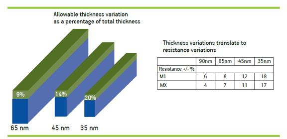

---

## "Slippery Fish" at 45nm

- Process variation, impacting yield and performance
- More restricted design rules (RDRs)
  - +3 or more rules at 45nm
  - +100 or more rules at 32nm
  - +250 or more rules at 22nm
- More rules implies larger die size, lower performance
- 10nm is not sci-fiction due to FinFET technology
- Gate-All-Around (GAA) in 2nm

---

count: false
class: nord-light, middle, center

# DFM

---

## What is DFM?

.pull-left[

- Design for 💰?
- Design for Manufacturing
- Design for Manufacturability
  - Refer to a group of challenges less than 130nm
  - A set of techniques to modify the design of ICs to improve their
    functional yield, parametric yield or their reliability

] .pull-right[

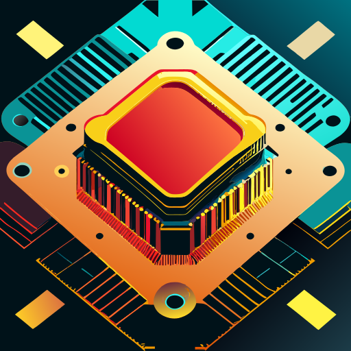

]

---

## Why is it important?

- Achieving high-yielding designs in the state-of-the-art VLSI
  technology is extremely challenging due to the miniaturization and
  complexity of leading-edge products
- The manufacturing process becomes more sensitive to variations and
  defects, which can degrade the quality and functionality of the
  chips
- DFM can help to address various manufacturing issues, such as
  lithography hotspots, CMP dishing and erosion, antenna effects,
  electromigration, stress effects, layout-dependent effects and more

---

## How is it applied?

- DFM can be applied to various aspects of IC design, such as circuit
  design, logic design, layout design, verification and testing
- Each aspect has its own specific DFM guidelines and best practices
  that designers should follow to ensure manufacturability
- For example, some general DFM guidelines for layout design are:
  - Use regular and uniform layout structures
  - Avoid narrow or long metal wires
  - Avoid acute angles or jogs in wires
  - Avoid isolated or floating features
  - Use dummy fill to improve planarity and density uniformity
  - Use recommended design rules and constraints from foundries

---

## What are the benefits?

- By applying DFM techniques in the physical design stage of IC
  development, designers can:
  - Reduce the number of design iterations
  - Improve the collaboration with foundries
  - Enhance the product performance and functionality
  - Achieve faster time to market and lower production costs

---

## 💹 DFM Market Share 2008

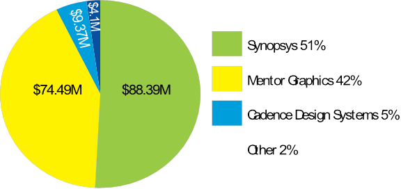

---

## 💹 DFM Forecast 2009 in $M

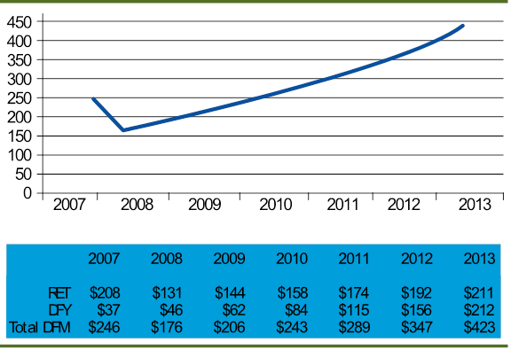

---

## Increasing Importance of DFM

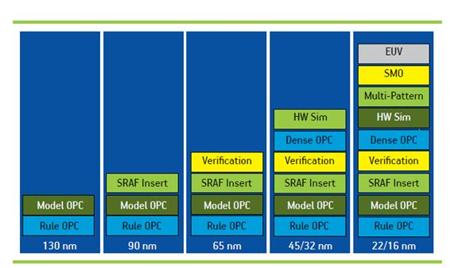

---

## DFM Analysis and Verification

.pull-left[

- Critical area analysis
- CMP modeling
- Statistical timing analysis
- Pattern matching
- Lithography simulation
- Lithographic hotspot verification

] .pull-right[

]

---

## 2D Pattern Matching in DRC+

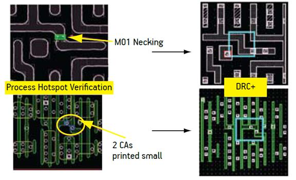

---

## Contour Based Extraction

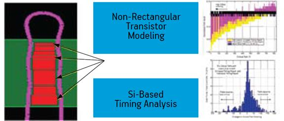

---

## DFM Enhancement and Optimization

.pull-left[

- Wire spreading
- Dummy Filling
- Redundant Via Insertion
- Optical proximity correlation (OPC)
- Phase Shift Masking (PSM)
- Double/Triple/Multiple Patterning
- Statistical timing and power optimization

] .pull-right[

]

---

## Dummy Filling

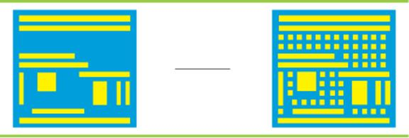

---

## "Smart" Filling

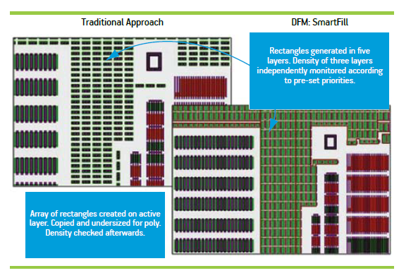

---

## Redundant Via Insertion

- Also known as double via insertion.
- Post-routing RVI (many EDA tools already have this feature)
- Considering RVI during routing

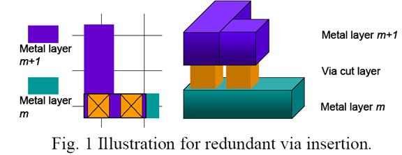

???

Looks good, right?

But actually only few people are using this!

Why?

---

## Multiple Patterning (MPL)

- Instead of exposing the photoresist layer once under one mask, MPL
  exposes it twice by splitting the mask into "k" parts, each with
  features less dense.

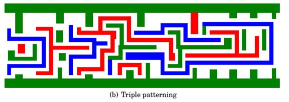

---

## What are the challenges of DFM?

- DFM is not a fixed set of rules, but rather a flexible and evolving
  methodology that depends on the product requirements, the
  manufacturing technology and the industry standards
- DFM can also be combined with other design methodologies, such as
  DFT, DFR, DFLP and DFS, to create a holistic approach to product
  development
- DFM requires strong capabilities in research, supply chain, talent,
  IP protection and government policies

---

## Course Structure

.pull-left[

- Describe the DFM problems that arise from.
- Abstract the problems in mathematical forms
- Describe the algorithms that solve the problems
- Discuss the alternative algorithms and possible improvement.
- Discuss if the algorithms can be applied to other area.
- Only describe the key idea in lectures. Details are left for paper
  reading if necessary.

] .pull-right[

]

---

## 🙈 Not covered

- Algorithms for 3D problems
- Packaging
- Machine Learning/AI Based algorithm

---

count: false
class: nord-dark, middle, center

.pull-left[

# 🙋 Q & A️

] .pull-right[

]
