layout: true
class: typo, typo-selection

---

count: false
class: nord-dark, middle, center

# Lecture 1b: DFM For Dummies

@luk036 👨‍💻

2025-09-10 📅

---

### Course Overview 📝

**Design for Manufacturability (DFM)** optimizes IC manufacturing processes while meeting performance, power, and reliability requirements. As ICs continue to shrink in size and grow in complexity, manufacturing becomes increasingly sensitive to variations and defects. This lecture presents:

- Core DFM principles and methodologies 🏗️
- Best practices for IC layout design ✏️
- DFM analysis and verification techniques 🔍
- Optimization algorithms for manufacturability challenges ⚡
- Mathematical formulations of DFM problems ➗

**Key Benefits**:

- Reduced design iterations 🔄
- Improved foundry collaboration 🤝
- Enhanced product performance 🚀
- Accelerated time-to-market ⏱️

---

### The Shrinking Technology Landscape

_The relentless pursuit of miniaturization in modern devices_

---

### High-K Metal Gate (HKMG) 🔬

- **High-K Dielectrics**: Replace traditional SiO₂ with higher dielectric constant materials
  - Enables thicker gate oxides without increasing capacitance
  - Reduces leakage current while maintaining performance
- **Metal Gates**: Utilize tungsten/tantalum instead of polysilicon
  - Provides better threshold voltage control
  - Reduces performance variability

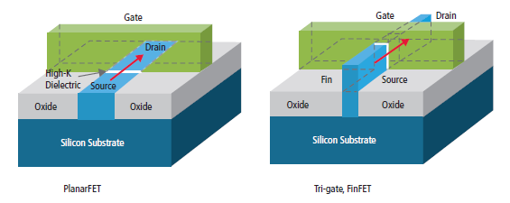

---

### Next-Generation Transistors: GAA

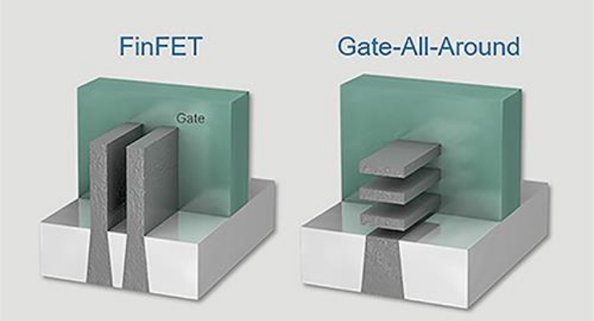

_The future of transistor architecture at 2nm nodes_

---

### Challenges in Shrinking Technology Nodes ⚠️

- **Sub-10nm Processes** 🔬

  Extreme miniaturization with significant manufacturing complexities

- **Process Variations**

  Amplified impact on circuit parameters and performance

- **Design Rule Complexity** 📏

  Over 2000 checks for advanced nodes like 14nm FinFET

Moving to lower technology nodes offers significant advantages in area reduction and performance gain, but introduces substantial manufacturing complexities. At these advanced nodes, designers must ensure that layouts are not just DRC-clean but also lithography-friendly and printable on real silicon, considering all potential variations in the fabrication process.

---

### Lithography Process Breakdown 🖨️

.pull-left[
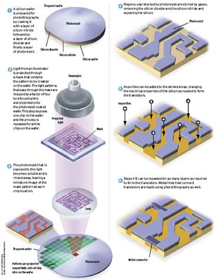
]

.pull-right[
**Process Steps**:

1. Photo-resist coating
2. Illumination
3. Pattern exposure
4. Etching
5. Doping
6. Metallization
   ]

---

### The Growing Process-Design Gap

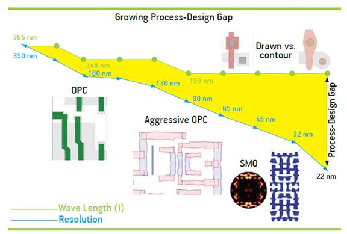

_Increasing divergence between design intent and manufacturing reality_

---

### Lithography-Induced Variations

**Variation Sources**:

- Light intensity fluctuations 💡
- Wavelength effects 🌈
- Angle of incidence variations 📐

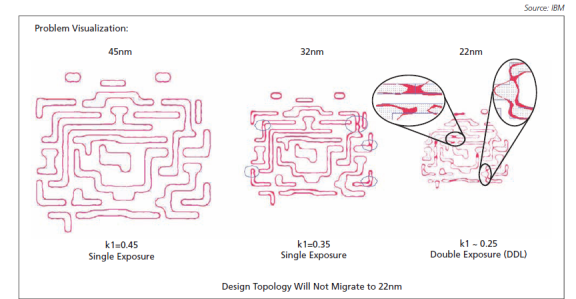

---

### Lithography Limitations 🖨️

- **Resolution Limits** 🔍

  Current advanced lithography primarily uses ArF excimer lasers (193nm wavelength), struggling to create ever-smaller features

- **Double Patterning** 🎭

  Decomposing single layers into two masks, introducing overlay errors, increased steps, and higher costs

- **Hotspots** 🔥

  Locations in layouts prone to manufacturing defects due to lithographic limitations

- **EUV Challenges** 💡

  Next-generation 13.5nm EUV lithography requires very high power sources for mass production

---

### Chemical Mechanical Polishing

Critical process for planarizing wafer surfaces during semiconductor fabrication, particularly in metal connection stages.

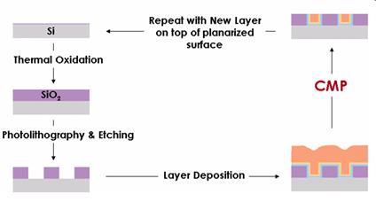

---

### Planarization Challenges

.pull-left[
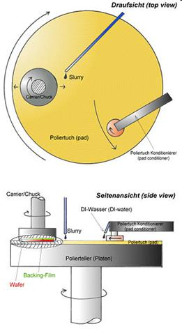
]

.pull-right[
**CMP Addresses**:

- Surface non-uniformities 🏔️
- Metal layer thickness variations 📏
- Topography-induced performance issues ⚡

_Essential for maintaining design intent through manufacturing_
]

---

### ECP & CMP Synergy

.pull-left[
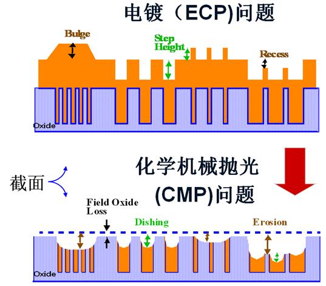
]

.pull-right[
**Key Benefits**:

- Reduces metal layer variability
- Improves electrical consistency
- Bridges Process-Design Gap
- Ensures manufacturing matches design specs
  ]

---

count: false
class: nord-light, middle, center

# Understanding Process Variation

---

### Node-to-Node Thickness Control

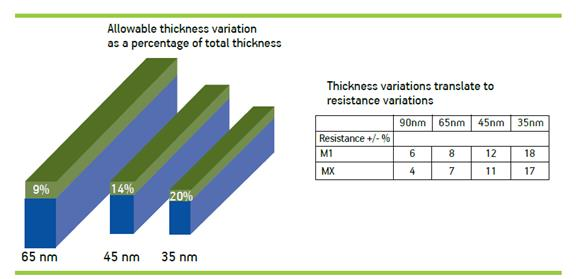
_Increasing challenges in thickness uniformity across technology nodes_

---

### The 45nm Challenge 𓆝 𓆟 𓆝 𓆟

**Key Developments**:

- Design rule explosion: 📜
  - 45nm: +3 rules
  - 32nm: +100 rules
  - 22nm: +250 rules
- Design impacts: 🏗️
  - Increased die sizes
  - Performance compromises
- Technology enablers: 🚀
  - FinFETs enabling 10nm
  - GAA for 2nm nodes

---

### Process Variations and Defects 🛑

- **Systematic Defects** 🔄

  Related to layout design style, design rules, and OPC techniques

- **Random Defects** 🎲

  Caused by random particles during fabrication, leading to open and short circuits

- **Parametric Defects**

  Variations in process parameters causing devices to fail specifications

- **CMP Issues** ⚠️

  Defects like oxide loss, dishing, erosion due to planarity problems

---

count: false
class: nord-light, middle, center

# DFM Fundamentals

---

### Defining DFM

.pull-left[
**What is DFM?**

- Design for Manufacturing
- Design for Manufacturability
  - Solves sub-130nm challenges
  - Improves:
    - Functional yield
    - Parametric yield
    - Reliability

_Not just "Design for 💰"_
]

.pull-right[

]

---

### Why DFM Matters

**Three Critical Reasons**:

1. **Miniaturization Challenges**

   - State-of-the-art VLSI demands precision
   - Increased sensitivity to variations

2. **Manufacturing Complexities**

   - Defect sensitivity grows exponentially
   - Quality/functionality impacts

3. **Problem Scope**
   - Addresses lithography hotspots
   - Solves CMP, antenna, EM issues
   - Manages layout-dependent effects

---

### Critical Manufacturing Concerns ⚠️

- **Design Rule Complexity** 📏

  The number of design rules has increased dramatically at lower technology nodes. These rules define restrictions on minimum distances between different metal shapes, constraints on wire geometries, and can be technology-specific or vary based on functional requirements.

- **Via Reliability** 🔌

  Via failure is a significant cause of lower reliability in designs, especially at advanced nodes. Lithography variations can lead to power opens if only a single via structure is used. Ensuring robust interconnections through techniques like via doubling is essential for chip functionality and longevity.

- **Timing Yield** ⏱️

  Process variations significantly impact delay characteristics of circuits at nanometer scales. Timing yield—the ratio of chips achieving target frequency—is directly affected by these variations. Accurate estimation of timing yield has become critical, as overestimation leads to conservative designs while underestimation results in chips failing specifications.

---

### DFM Implementation

**Application Areas**:

- Circuit design 🎛️
- Logic design 🧠
- Layout design ✏️
- Verification ✅
- Testing 🧪

**Layout Best Practices**:

- Regular, uniform structures 🔳
- Optimal metal width/length 📏
- Geometric constraints 📐
- Density management 🏗️
- Foundry rule compliance 🏭

---

### DFM Benefits

**Implementation Delivers**:

- Fewer design iterations 🔄
- Stronger foundry partnerships 🤝
- Enhanced product performance 🚀
- Faster time-to-market ⏱️
- Lower production costs 💰

---

### 2008 Market Share

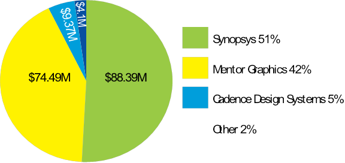

---

### 2009 Forecast ($M)

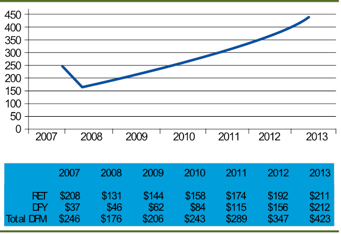

---

### DFM Growth Trends

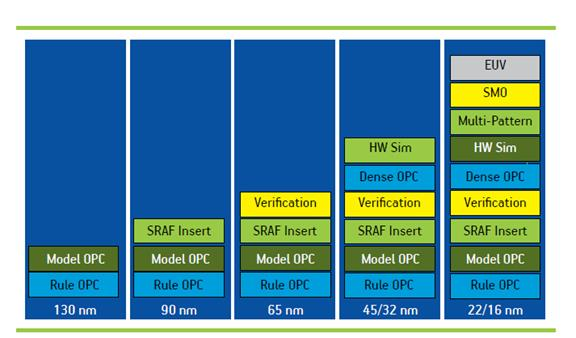
_Increasing DFM importance across semiconductor sectors_

---

### DFM Verification Techniques

.pull-left[

- Critical area analysis 🔍
- CMP modeling ⚗️
- Statistical timing
- Pattern matching 🧩
- Lithography simulation 🖨️
- Hotspot detection 🔥
  ]

.pull-right[

]

---

### Advanced Pattern Matching

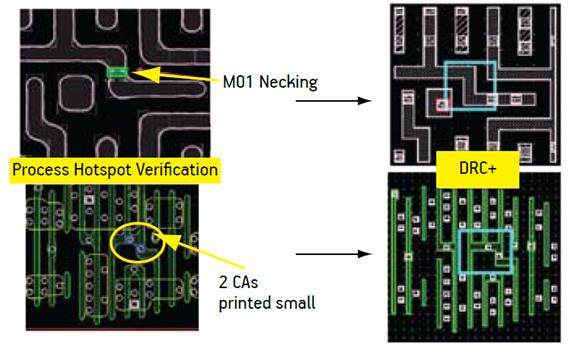
_2D pattern analysis in modern verification_

---

### Contour-Based Analysis

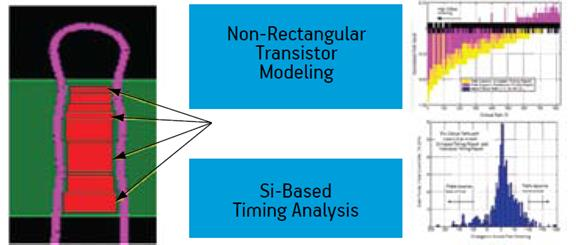
_Precision measurement of actual silicon features_

---

### DFM Optimization Methods

.pull-left[

- Wire spreading 🧵
- Smart filling 🧱
- Via redundancy 🔌
- OPC/PSM 🖨️
- Multiple patterning 🎨
- Statistical optimization 📈
  ]

.pull-right[

]

---

### Density Control Techniques

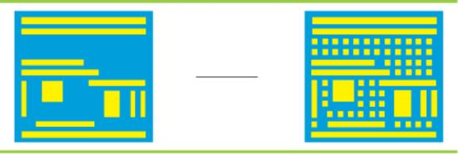
_Conventional vs. smart filling approaches_

---

### Layout Optimization Techniques

- **CMP Aware Fill (SmartFill)** 🧩

  Adding non-functional shapes to sparse areas to balance density and improve CMP planarity, reducing defects like dishing and erosion

- **Critical Area Analysis (CAA)** 🔍

  Identifying regions most susceptible to random defects and modifying layouts to reduce failure probability

- **Via Optimization** 🔌

  Implementing via doubling, via farms, and sufficient enclosure to improve interconnection reliability

- **Pattern Matching for DRC** 🧠

  Using libraries of problematic patterns for faster design rule checking compared to traditional methods

---

### Via Reliability Solutions

**Redundant Via Insertion (RVI)**:

- Also called double via insertion
- Implementation options:
  - Post-routing (common in EDA tools)
  - Routing-aware insertion

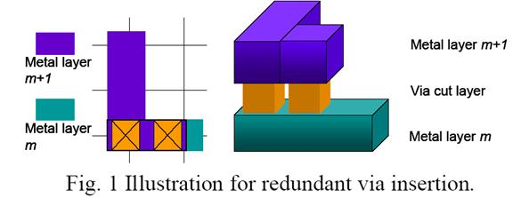

_Despite benefits, adoption remains limited due to..._

---

### Litho-Friendly Design Solutions 🖌️

- **Litho-Friendly Design (LFD)** 🏗️

  Creating layouts inherently easier to manufacture through lithography by considering process limitations early in design. Uses preferred shapes and orientations, ensuring sufficient spacing between critical features, and avoiding problematic patterns.

- **Optical Proximity Correction (OPC)** 🔄

  Modifying mask shapes to pre-compensate for optical effects during lithography, ensuring printed features on the wafer match the intended design. Complexity increases significantly at smaller feature sizes.

- **Double Patterning Technology** 🎭

  Splitting critical layers into two separate masks used sequentially to create fine features. Requires ensuring layouts are "two-colorable" and minimizing "stitches" between features printed by different masks.

---

### Patterning Solutions

**Multiple Patterning Lithography (MPL)**:

- Splits dense patterns across multiple exposures
- Reduces feature density per mask
- Enables continued scaling

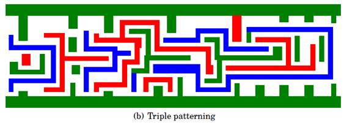

---

### Advanced DFM Methodologies 🚀

- **Manufacturing Analysis and Scoring (MAS)**

  Provides nuanced, analog grading of design manufacturability rather than binary pass/fail assessment. Replicates how well a design can be fabricated on real silicon, offering a technology-specific scoring system that considers various DFM rules for comprehensive assessment.

- **Statistical Static Timing Analysis (SSTA)** ⏳

  Addresses process variation impact on circuit delays by considering them statistically. Estimates delay and frequency performance as distributions, accounting for both die-to-die and within-die variations for more accurate timing yield prediction.

- **Design for Testability (DFT)** 🧪

  Incorporates test structures early in design to detect manufacturing defects during production testing. Feedback from test results refines both design and manufacturing processes, improving yields over time.

---

### DFM Implementation Challenges

**Key Considerations**:

1. **Methodology**

   - Not fixed rules, but evolving practices
   - Technology/product dependent

2. **Integration**

   - Combines with DFT, DFR, DFLP, DFS
   - Requires holistic approach

3. **Ecosystem**
   - Demands strong R&D
   - Needs supply chain coordination
   - Requires policy support

---

### Integration and Collaboration 🤝

- **Early Manufacturing Involvement**

  Bringing manufacturing expertise into design from initial stages to identify and resolve issues when changes are less costly

- **EDA Tool Integration** 💻

  Seamless integration of DFM features within design environments for DRC, OPC, lithography simulation, and CMP analysis

- **Continuous Verification** 🔄

  Iterative DFM checks throughout design process, not just at sign-off, preventing costly rework

- **Cross-Team Collaboration** 👥

  Regular interaction between design, process, and manufacturing teams to refine methodologies

---

### Future Trends in DFM 🔮

- **EUV Lithography** 💡

  The adoption of Extreme Ultraviolet lithography (13.5nm wavelength) could alleviate complexities of multi-patterning at extremely fine feature sizes, though challenges remain in power source intensity and cost-effectiveness for mass production.

- **AI and Machine Learning** 🤖

  Artificial intelligence techniques are increasingly important for accurate yield prediction, automated hotspot detection and fixing, and optimization of design rules. These approaches enable more sophisticated modeling of manufacturing processes.

- **Integrated Design Flows** 🔄

  Tighter integration of DFM with all stages of physical design will be essential for manufacturable high-performance designs. Standardized metrics for quantifying manufacturability will help compare design options and track DFM progress.

---

### Quiz ❓

1. What are the key benefits of implementing Design for Manufacturability (DFM)?
2. Briefly describe the "shrinking technology landscape" challenge in IC manufacturing.
3. What is the primary advantage of using High-K Dielectrics in High-K Metal Gates (HKMG)?
4. Explain the difference between FinFET and Gate-All-Around (GAA) transistor architectures.
5. List the main steps in the lithography process breakdown.
6. What are some of the key sources of variations induced by lithography?
7. What is Chemical Mechanical Polishing (CMP) and why is it critical in semiconductor fabrication?
8. Define what DFM is and what it aims to improve in integrated circuit (IC) manufacturing.
9. Name three critical reasons why DFM matters in modern IC design.

---

### Course Methodology

.pull-left[
**Learning Approach**:

1. Problem identification 🎯
2. Mathematical formulation ➗
3. Algorithm exploration ⚡
4. Alternative solutions 🔄
5. Cross-application potential 🤝

_Lectures focus on key concepts - details through paper reading_
]

.pull-right[

]

---

### Course Boundaries

**Not Covered**:

- 3D problem algorithms 🧊
- Packaging technologies 📦
- ML/AI-based approaches 🤖

---

count: false
class: nord-dark, middle, center

.pull-left[

# Q&A 🎤

] .pull-right[

]
