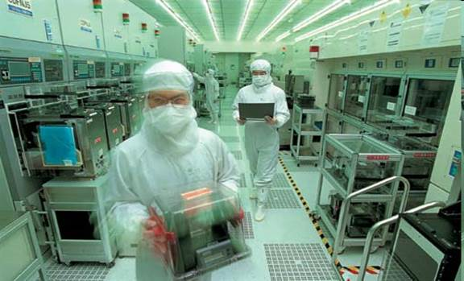

layout: true
class: typo, typo-selection

---

count: false
class: nord-dark, middle, center

# 📚 Lecture 1b: DFM For Dummies

@luk036  
📅 2024-09-04

---

## 📝 Course Overview

Design for Manufacturability (DFM) optimizes IC manufacturing processes while meeting performance, power, and reliability requirements. As ICs continue to shrink in size and grow in complexity, manufacturing becomes increasingly sensitive to variations and defects. This lecture presents:

- Core DFM principles and methodologies
- Best practices for IC layout design
- DFM analysis and verification techniques
- Optimization algorithms for manufacturability challenges
- Mathematical formulations of DFM problems

Key benefits of DFM implementation include reduced design iterations, improved foundry collaboration, enhanced product performance, and accelerated time-to-market.

---

## The Shrinking Technology Landscape

  
*The relentless pursuit of miniaturization*

---

## Semiconductor Manufacturing Growth

  
*China's expanding role in semiconductor production*

---

## High-K Metal Gate (HKMG)
- **High-K Dielectrics**: Replace traditional SiO₂ with higher dielectric constant materials
  - Enables thicker gate oxides without increasing capacitance
  - Reduces leakage current while maintaining performance
- **Metal Gates**: Utilize tungsten/tantalum instead of polysilicon
  - Provides better threshold voltage control
  - Reduces performance variability

---

## Next-Generation Transistors: GAA

  
*The future of transistor architecture at 2nm nodes*

---

## Lithography Process Breakdown

.pull-left[

]

.pull-right[
1. Photo-resist coating
2. Illumination
3. Pattern exposure
4. Etching
5. Doping
6. Metallization
]

---

## The Growing Process-Design Gap

  
*Increasing divergence between design intent and manufacturing reality*

---

## Lithography-Induced Variations

These variations stem from:
- Light intensity fluctuations
- Wavelength effects
- Angle of incidence variations

---

## Chemical Mechanical Polishing

Chemical Mechanical Polishing (CMP) is a process used in semiconductor
manufacturing to planarize the surface of a wafer. CMP is one of the
steps involved in the fabrication of integrated circuits, specifically
in the metal connection stage.

---

## Planarization Challenges

.pull-left[

]

.pull-right[
**Chemical Mechanical Polishing (CMP)** addresses:
- Surface non-uniformities
- Metal layer thickness variations
- Topography-induced performance issues

Critical for maintaining design intent through manufacturing.
]

---

## ECP & CMP

.pull-left[

] .pull-right[

By using CMP to planarize the wafer surface, designers can reduce the
variability in the thickness of the metal layers, which can improve the
accuracy and consistency of the IC's electrical properties. This, in
turn, can help bridge the Process-Design Gap by ensuring that the ICs
are manufactured according to the intended design specifications.

]

---

count: false
class: nord-light, middle, center

# Understanding Process Variation

---

## Node-to-Node Thickness Control

  
*Increasing challenges in thickness uniformity across technology nodes*

---

## The 45nm Challenge 𓆝 𓆟 𓆝 𓆟

Key developments at 45nm and beyond:
- Explosion of design rules:
  - 45nm: +3 rules
  - 32nm: +100 rules
  - 22nm: +250 rules
- Impact on design:
  - Increased die sizes
  - Performance compromises
- Technology enablers:
  - FinFETs enabling 10nm
  - GAA for 2nm nodes

---

count: false
class: nord-light, middle, center

# DFM Fundamentals

---

## Defining DFM

.pull-left[
- **Design for Manufacturing**  
- **Design for Manufacturability**
  - Addresses sub-130nm challenges
  - Techniques to improve:
    - Functional yield
    - Parametric yield
    - Reliability

*Not just "Design for 💰"*
]

.pull-right[

]

---

## DFM Importance

Three key reasons DFM matters:
1. **Miniaturization Challenges**  
   - State-of-the-art VLSI demands precision
   - Increased sensitivity to variations

2. **Manufacturing Complexities**  
   - Defect sensitivity grows exponentially
   - Quality/functionality impacts

3. **Problem Scope**  
   - Addresses lithography hotspots
   - Solves CMP, antenna, EM issues
   - Manages layout-dependent effects

---

## DFM Implementation

**Application Areas**:
- Circuit design
- Logic design
- Layout design
- Verification
- Testing

**Layout Best Practices**:
- Regular, uniform structures
- Optimal metal width/length
- Geometric constraints
- Density management
- Foundry rule compliance

---

## DFM Benefits

Implementing DFM delivers:
- Fewer design iterations
- Stronger foundry partnerships
- Enhanced product performance
- Faster time-to-market
- Lower production costs

---

## 2008 Market Share

---
## 2009 Forecast ($M)

---

## DFM Growth Trends

  
*Increasing DFM importance across semiconductor sectors*

---

## DFM Verification Techniques

.pull-left[
- Critical area analysis
- CMP modeling
- Statistical timing
- Pattern matching
- Lithography simulation
- Hotspot detection
]

.pull-right[

]

---

## Advanced Pattern Matching

  
*2D pattern analysis in modern verification*

---

## Contour-Based Analysis

  
*Precision measurement of actual silicon features*

---

## DFM Optimization Methods

.pull-left[
- Wire spreading
- Smart filling
- Via redundancy
- OPC/PSM
- Multiple patterning
- Statistical optimization
]

.pull-right[

]

---

## Density Control Techniques

  
*Conventional vs. smart filling approaches*

---

## Via Reliability Solutions

**Redundant Via Insertion (RVI)**:
- Also called double via insertion
- Implementation options:
  - Post-routing (common in EDA tools)
  - Routing-aware insertion

*Despite benefits, adoption remains limited due to...*

---

## Patterning Solutions

**Multiple Patterning Lithography (MPL)**:
- Splits dense patterns across multiple exposures
- Reduces feature density per mask
- Enables continued scaling

---

## DFM Implementation Challenges

Key considerations:
1. **Methodology**  
   - Not fixed rules, but evolving practices
   - Technology/product dependent

2. **Integration**  
   - Combines with DFT, DFR, DFLP, DFS
   - Requires holistic approach

3. **Ecosystem**  
   - Demands strong R&D
   - Needs supply chain coordination
   - Requires policy support

---

## Course Methodology

.pull-left[
1. Problem identification
2. Mathematical formulation
3. Algorithm exploration
4. Alternative solutions
5. Cross-application potential

*Lectures focus on key concepts - details through paper reading*
]

.pull-right[

]

---

## Course Boundaries

**Not Covered**:
- 3D problem algorithms
- Packaging technologies
- ML/AI-based approaches

---

count: false
class: nord-dark, middle, center

.pull-left[

# 🙋 Q & A

] .pull-right[

]