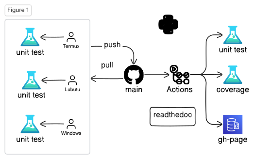
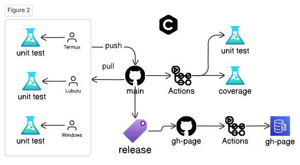
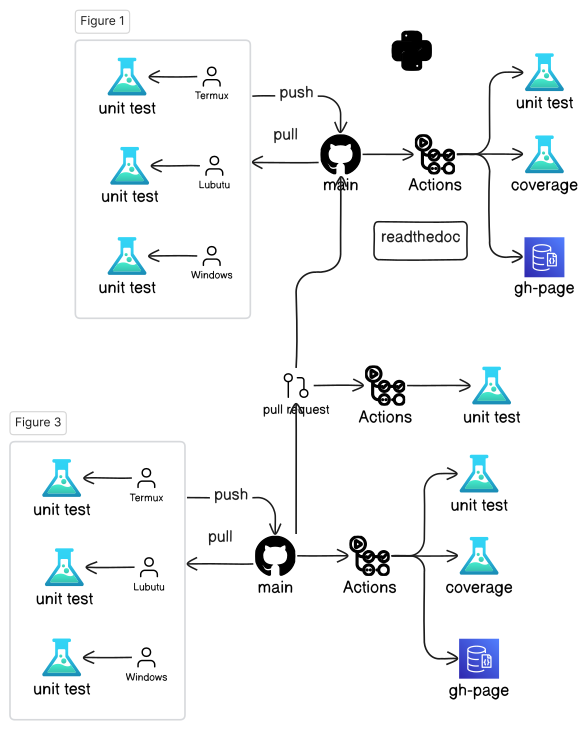

# Lecture 2a: Open-Source Software Development Flow

## 💬 Messages

- About 99% projects fail.
- Software is "soft"; Hardware is "hard"
- Automation is hard
- Nightly build concept (Microsoft)
- Agile software development
- Pair programming
- Extreme programming
- Opensource projects - Continuous Integration

## Platforms

- https://github.com
- gitpod.io - ☁️ cloud base
- GitHub's Codespaces - ☁️ cloud base
- Lubuntu
- Windows - MSVC++
- FydeOS (ChromeOS) - g++-13
- Android's Termux - clang-17

## Open-source Work Flow (Python 🐍)



## Open-source Work Flow (C++)



## Pull Request



## GitHub, Git

```{.bash}
git clone https://github.com/luk036/csdigit
cd csdigit
(edit)
git status
git diff
git diff README.md
git pull
git add .
git commit -m "message"
git push
git tag
git branch # list all branches
git branch develop # create a new branch
git switch develop
git switch master
```

## GitHub, gh

```{.bash}
gh repo create csdigit --public
gh repo clone csdigit
gh run list
gh run view
gh release list
gh release create
gh issue list
gh issue create
gh search repos digraphx
```

## 🐍 Python

- Create a new porject

```{.bash}
pip install pyscaffold[all]
putup -i --markdown --github-actions csdigit
```

- ⚙️ Setup

```{.bash}
cd csdigit
pip install -e .
pip install -r requirements.txt
```

- 🧪 Unit Testing

```{.bash}
pytest
pytest --doctest-modules src
```

- ☂️ Code Coverage

```{.bash}
pytest --cov=src/csdigit
```

## 🐍 Python

- 🪄 Formatting and static check

```{.bash}
pip install pre-commit
pre-commit run --all-files
```

- 📝 Documentation

```{.bash}
pip install -r docs/requirements.txt
cd docs
make html
python -m http.server
```

- 📊 Benchmarking

```{.bash}
pytest benches/test_bench.py
```

## 🦀 Rust

- Create a new project

.font-sm.mb-xs[

```{.bash}
cargo install cargo-generate
cargo generate -o --init --git https://github.com/rust-github/template.git
```

]

- ⚙️ Setup

```{.bash}
cd csd-rs
cargo build
```

- 🧪 Unit Testing

```{.bash}
cargo test
cargo test --lib
cargo test --doc
```

- ☂️ Code Coverage

```{.bash}
cargo tarpaulin (Windows)
```

## 🦀 Rust

- 🪄 Formatting and static check

```{.bash}
cargo fmt
cargo clippy
cargo clippy --fix
```

- 📝 Documentation

```{.bash}
cargo doc
cd target/doc
python -m http.server
```

- 📊 Benchmarking

```{.bash}
cargo bench
```

## C++ (CMake + CPM)

- Create a new project

  Use GitHub's ModernCppStarter template,

- ⚙️ Setup

```{.bash}
cd csd-cpp
cmake -Sall -Bbuild -DCMAKE_BUILD_TYPE=Release
cmake --build build
```

- 🧪 Unit Testing

```{.bash}
cmake --build build --target test
```

- ☂️ Code Coverage

```{.bash}
??
```

## C++ (CMake + CPM)

- 🪄 Formatting and static check

```{.bash}
pip install cmake-format clang-format
cmake -Sall -Bbuild -DCMAKE_BUILD_TYPE=Release
cmake --build build --target fix-format
```

- 📝 Documentation

```{.bash}
cmake --build build --target GenerateDocs
```

- 📊 Benchmarking

```{.bash}
./build/bench/BM_switch
```

## C++ (XMake)

- Create a new project

```{.bash}
xmake create -t static lds-cpp
xmake create -t console csd-cpp
```

- ⚙️ Setup

```{.bash}
xmake f -m debug
xmake
```

- 🧪 Unit Testing

```{.bash}
xmake run test_csd
```

- ☂️ Code Coverage

```{.bash}
??
```

## C++ (XMake)

- 🪄 Formatting and static check

```{.bash}
xmake format
```

- 📝 Documentation

```{.bash}
xmake doxygen
```

- 📊 Benchmarking

```{.bash}
xmake run test_bench
```

# Lecture 2b: Programming in the Age of AI 🤖

## Coding Tips 💡

- Test, test, test!!!
- Write cleaner code
- Refactor repeat codes
- Object oriented programming
- Generic programming
- Design Pattern
- Coroutine is your friend
- Learn from good codes, not bad ones.
- The last rescue: Google search.

## Code generation

- AWS CodeWhisperer (VSCode's extension)
  - generate testing code

## Documentation generation

Mintlify (VSCode's extension)

- Naming
- a, i, p, n ❌
- A x = b
- x: unknown, x_axis
- x, y, z

## Use better variable names

- p: point, polygon, polynomial, prev
- t: time, target, temp
- c: cost, cycle, coefficient
- d: distance, distribution
- e: edge
- v: vertex
- u, v, w: vertex1, vertex2
- i: index
- i, j: row, col
- i, j, k
- l, m: line1, line2
- n: dimension, node, next
- n, m: ndim, mdim
- w: weight, frequence (omega)

## 🚀 Performance Tips 💡

- Avoid string comparison
- Use sentinel
- Use cheaper measure, avoid `sqrt()`, `sin()`, `cos()`
- 🦥 Lazy evaluation
- Table lookup
- Avoid sequence search:
  - Backward pointers
  - Hash Table/Dictionary/Map

## Avoid string comparison

.pull-left[

Bad 👎:

```{.python}
if pin == "input":
    # ...
elif pin == "output":
    # ...
elif pin == "in_out":
    # ...
elif pin == "dont_care":
    # ...
else:
    # ...
```

]

.pull-right[

Better ⚡:

```{.python}
pin_type = dict({"input":0},
  {"output":1}, {"in_out":2},
  {"dont_care":3})
...
id = pin_type.get(pin, -1)
if id == 0:
    # ...
elif id == 1:
    # ...
elif id == 2:
    # ...
elif id == 3:
    # ...
else:
    # ...
```

]

## Use Sentinel

.pull-left[

Bad 👎:

.font-sm.mb-xs[

```{.python}
max = 0
bckt = [Dllist() for _ in range(high)]
# ...
def popleft():
    res = bckt[max].popleft()
    while max >= 0 and bckt[max].empty():
        max -= 1
    return res
```

]

] .pull-right[

Better ⚡:

.font-sm.mb-xs[

```{.python}
max = 0
sentinel = Dllink()
bckt = [Dllist() for _ in range(high+1)]
bckt[0].append(sentinel)  # sentinel
# ...
def popleft():
    res = bckt[max].popleft()
    while bckt[max].empty():
        max -= 1
    return res
# Saved a boundary check `max >= 0`
```

]

]

## Use cheaper measure

.pull-left[

Bad 👎:

```{.python}
mind = 10000
maxd = 0
for u, v in G.edges():
    t = vec[u] - vec[v]
    d = sqrt(t.dot(t))
    if mind > d: mind = d
    if maxd < d: maxd = d
return maxd - mind
```

] .pull-right[

Better ⚡:

```{.python}
minq = 10000
maxq = 0
for u, v in G.edges():
    t = vec[u] - vec[v]
    q = t.dot(t)
    if minq > q: minq = q
    if maxq < q: maxq = q
return sqrt(maxq) - sqrt(minq)
```

]

## Another Example

.pull-left[

Bad 👎:

```{.python}
mind = 10000
maxd = 0
for u, v in G.edges():
    t = 1 - vec[u].dot(vec[v])
    d = arcsin(sqrt(t))
    if mind > d: mind = d
    if maxd < d: maxd = d

return maxd - mind
```

] .pull-right[

Better ⚡:

```{.python}
minq = 10000
maxq = 0
for u, v in G.edges():
    q = 1 - vec[u].dot(vec[v])
    if minq > q: minq = q
    if maxq < q: maxq = q

return arcsin(sqrt(maxq)) \
         - arcsin(sqrt(minq))
```

]

## Optimization Tips 💡

- Convex optimization

- Network optimization

- Primal-dual paradigm
