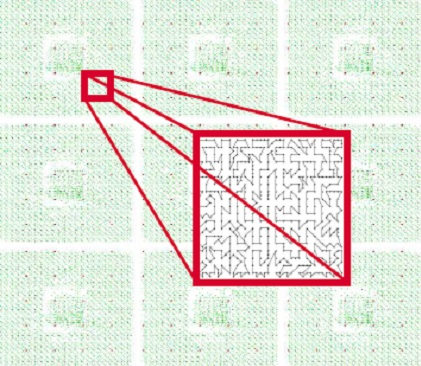

# Lecture 2d: Complexity Theory

@luk036 👨‍💻 · 2026 📅

## Overview 📋

-   Complexity theory

-   NP-completeness.

-   Approximation classes

-   Books and online resources.

### Complexity Theory

-   Big O-notation: O(${\color{royalblue}N}$), O(${\color{royalblue}N}\log {\color{royalblue}N}$), O(${\color{royalblue}N}^2$), O(${\color{royalblue}N}!$) ...

-   Interest in discrete problems in which ${\color{royalblue} N}$ is large.

-   Indeed, ${\color{royalblue} N}$ could be very large (multi-million) in EDA problems,
  except:

  -   Pins of a signal net (usually < 200)
  -   Vertices of polygon shapes (usually < 100)
  -   Number of routing layers (usually < 10)

-   Many Physical Design problems are geometrically related. Complexity
  (either time or space) could be reduced by exploiting properties
  such as locality, symmetry, planarity, or triangle inequality.

### NP-completeness

-   Many EDA problems are in fact NP-hard.

-   Whereas, some NP-complete problems admit good approximations with
  guarantee performance ratio (_pseudo-polynomial_). E.g. bin-packing
  problem and knapsack problem.

-   Whereas, some NP-complete problems (e.g. SAT) are intrinsically not
  "approximatable" unless P=NP.

-   See the book "Complexity and Approximation: Combinatorial
  Optimization Problems and Their Approximability Properties" for more
  details.

### Approximation Classes

-   NPO-hard

-   APX-hard

-   PTAS: polynomial-time approximation scheme

-   FPTAS: Fully PTAS (pseudo-polynomial)

    P < FPTAS < PTAS < APX < NPO

### E.g. Minimum Vertex Cover

-   Instance: Graph $G$ = (${\color{salmon}V}$, ${\color{lime}E}$)

-   Solution: A vertex cover for $G$, i.e., a subset ${\color{salmon}V'}$ such that, for
  each edge $({\color{salmon}u}, {\color{salmon}v}) \in {\color{lime}E}$, at least one of ${\color{salmon}u}$ and ${\color{salmon}v}$ belongs to
  ${\color{salmon}V'}$

-   Measure: Cardinality of the vertex cover, i.e. $|{\color{salmon}V'}|$

-   Bad News: APX-complete.

-   Comment: Admits a PTAS for _planar_ graphs \[Baker, 1994\]. The
  generalization to ${\color{royalblue} k}$-hypergraphs, for ${\color{royalblue} k}>1$, is approximable within
  ${\color{royalblue} k}$ \[Bar-Yehuda and Even, 1981\] and \[Hochbaum, 1982a\]. (HW:
  Implement the algorithms.)

-   Garey and Johnson: GT

### Minimum Maximal Matching

-   Instance: Graph $G$ = (${\color{salmon}V}$, ${\color{lime}E}$).

-   Solution: A maximal matching ${\color{lime}E'}$, i.e., a subset ${\color{lime}E'}$ such that no
  two edges in ${\color{lime}E'}$ shares a common endpoint and every edge in
  ${\color{lime}E} - {\color{lime}E'}$ shares a common endpoint with some edge in ${\color{lime}E'}$.

-   Measure: Cardinality of the matching, i.e. $|{\color{lime}E'}|$.

-   Bad News: APX-complete \[Yannakakis and Gavril, 1980\]

-   Comment: Transformation from Minimum Vertex Cover (HW: Implement the
  algorithm)

-   Garey and Johnson: GT10

### Minimum Steiner Tree

-   Instance: Complete graph $G$ = (${\color{salmon}V}$, ${\color{lime}E}$), a metric given by edge
  weights ${\color{royalblue} s}: {\color{lime}E} \mapsto N$ and a subset ${\color{salmon}S} \subset {\color{salmon}V}$ of required
  vertices.

-   Solution: A Steiner tree, i.e., a sub-tree of $G$ that includes all
  the vertices in ${\color{salmon}S}$.

-   Measure: The sum of the weights of the edges in the sub-tree.

-   Bad News: APX-complete.

-   Garey and Johnson: ND12

### Minimum Geometric Steiner Tree

-   Instance: Set ${\color{salmon}P} \subset Z \times Z$ of points in the plane.

-   Solution: A finite set of Steiner points, i.e.,
  ${\color{salmon}Q} \subset Z \times Z$

-   Good News: Admits a PTAS \[Arora, 1996\]

-   Comment: Admits a PTAS for any _geometric space_ of constant
  dimension ${\color{royalblue} d}$, e.g. in the rectilinear metric \[Arora, 1997\].

-   Garey and Johnson: ND13

### Traveling Salesman 🧳🕴

-   Instance: Set ${\color{salmon}C}$ of ${\color{royalblue} m}$ cities, distances ${\color{royalblue} d}({\color{salmon}c_i}, {\color{salmon}c_j}) \in N$ for
  each pair of cities ${\color{salmon}c_i}, {\color{salmon}c_j} \in {\color{salmon}C}$.

-   Solution: A tour of ${\color{salmon}C}$, i.e., a permutation
  $\pi : [1..{\color{royalblue} m}] \mapsto [1..{\color{royalblue} m}]$.

-   Measure: The length of the tour.


### Traveling Salesman 🧳🕴

-   Bad News: NPO-complete

-   Comment: The corresponding maximization problem (finding the tour of
  maximum length) is approximable within 7/5 if the distance function
  is _symmetric_ and 63/38 if it is asymmetric \[Kosaraju, Park, and
  Stein, 1994\]

-   Garey and Johnson: ND22

### Minimum _Metric_ TSP

-   Instance: Set ${\color{salmon}C}$ of ${\color{royalblue} m}$ cities, distances ${\color{royalblue} d}({\color{salmon}c_i}, {\color{salmon}c_j}) \in N$
  satisfying the _triangle inequality_
  (i.e. ${\color{royalblue} d}({\color{salmon}a}, {\color{salmon}b}) + {\color{royalblue} d}({\color{salmon}b}, {\color{salmon}c}) \geq {\color{royalblue} d}({\color{salmon}a}, {\color{salmon}c})$)

-   Solution: A permutation $\pi : [1..{\color{royalblue} m}] \mapsto [1..{\color{royalblue} m}]$.

-   Measure: The length of the tour.

-   Good news: Approximable within 3/2 \[Christofides 76\]

-   Bad News: APX-complete.

-   Comment: A variation in which vertices can be revisited and the goal
  is to minimize the sum of the latencies of all vertices, where the
  latency of a vertex $c$ is the length of the tour from the starting
  point to $c$, is approximable within 29 and is APX-complete

### Minimum Geometric TSP

-   Instance: Set ${\color{salmon}C} \subset Z \times Z$ of ${\color{royalblue} m}$ points in the plane.

-   Solution: A tour of ${\color{salmon}C}$, i.e., a permutation
  $\pi : [1..{\color{royalblue} m}] \mapsto [1..{\color{royalblue} m}]$.

-   Measure: The length of the tour, where the distance is the
  discretized Euclidean length.

-   Good news: Admits a PTAS \[Arora, 1996\]

-   Comment: In $\mathbb{R}^{\color{royalblue} m}$ the problem is APX-complete for any $l_p$
  metric \[Trevisan, 1997\].

-   Garey and Johnson: ND23

### Application - Punching Machine



### Summary

-   Some problems are intrinsically hard -- even good approximation does
  not exist unless P=NP (NPO-complete). In such cases, heuristic
  methods are used (see the \[next lecture\]).

-   "Better" algorithm could be obtained by exploiting more problem's
  properties: locality, symmetry, sparsity, planarity, convexity,
  monotonity, ... etc.

### 📚 Books and Online Resources

-   G. Ausiello et al. Complexity and Approximation: Combinatorial
  Optimization Problems and Their Approximability Properties.
  Springer, 1999. (O224 C737)

-   M. R. Garey and D. S. Johnson. Computers and Intractability: A Guide
  to the Theory of NP-completeness. Freeman, 1979.

## Lecture 2e: Algorithmic Paradigms

@luk036 👨‍💻 · 2026 📅

### Overview 📋

-   Greedy approach
-   Mathematical programming
-   Primal-dual algorithm
-   Randomized method
-   Dynamic programming
-   Local search
-   Simulated annealing
-   Books and online resource

#### Greedy Approach

-   Excellent for Minimum Spanning Tree (MST) and Channel Routing
  Problem
  -   Obtain optimal solution
-   Not bad for Knapsack problem
  -   At least half of optimal solution
-   Very bad for Feedback Arc Removal problem
  -   Even worse than a naïve method: randomly remove edges when
    traversing a graph, then reverses the set if $|{\color{lime}E'}|$ is greater
    than 0.5$|{\color{lime}E}|$.
-   Question: Any theory to predict the performance?

#### Knapsack Problem 💰

.pull-left[

-   A thief 🦹 considers taking ${\color{royalblue} b}$ pounds of loot 💰. The loot is in the
  form of ${\color{royalblue} n}$ items, each with weight ${\color{royalblue} a_i}$ and value ${\color{royalblue} p_i}$. Any
  amount of an item can be put in the knapsack as long as the weight
  limit ${\color{royalblue} b}$ is not exceeded

] .pull-right[


]

#### Greedy Approach

-   Take as much of the item with the highest value per pound
  (${\color{royalblue} p_i}$/${\color{royalblue} a_i}$) as you can. If you run out of that item, take from the
  next highest (${\color{royalblue} p_i}$/${\color{royalblue} a_i}$) item. Continue until knapsack is full.

#### Program 1: Greedy Knapsack

-   **Input**: Set of ${\color{royalblue} n}$ items, for each ${\color{green} x_i} \in {\color{salmon}X}$, values ${\color{royalblue} p_i}$,
  ${\color{royalblue} a_i}$, positive integer ${\color{royalblue} b}$;
-   **Output**: Subset ${\color{salmon}Y} \subset {\color{salmon}X}$ such that $\sum {\color{royalblue} a_i} \leq {\color{royalblue} b}$;
-   Sort ${\color{salmon}X}$ in non-increasing order with respect to the ratio
  ${\color{royalblue} p_i}$/${\color{royalblue} a_i}$;
-   Let (${\color{green} x_1}$, ${\color{green} x_2}$, ..., ${\color{green} x_n}$) be the sorted sequence
-   ${\color{salmon}Y}$ := $0$;
-   **for** ${\color{royalblue} i}$:=1 **to** ${\color{royalblue} n}$ **do**
  -   **if** ${\color{royalblue} b} \geq {\color{royalblue} a_i}$ **do**
    -   ${\color{salmon}Y}$ := ${\color{salmon}Y} \cup \{ {\color{green} x_i} \}$;
    -   ${\color{royalblue} b}$ := ${\color{royalblue} b} - {\color{royalblue} a_i}$;
-   **return** ${\color{salmon}Y}$

#### C++ code

```{.cpp}
template <class InputIt, typename T, typename F1, typename F2>
InputIt greedy_knapsack(InputIt first, InputIt last,
                        const T& b, F1&& price, F2&& weight)
{
    using Item = typename InputIt::value_type;
    std::sort(first, last, [&](const Item& i1, const Item& i2) {
        return weight(i1) * price(i2) < weight(i2) * price(i1);
    });
    T init(0);
    InputIt it = std::find_if(first, last, [&](Item& i) {
        return (init += weight(i)) > b;
    });
    return it;
}
```

-   Test program can be found in <http://ideone.com/9ZK6ol>.

#### Can the thief do better?

-   Theorem 1. Let m<sub>H</sub>(${\color{green} x}$) =
  max(${\color{royalblue} p}$<sub>max</sub>, m<sub>GR</sub>(${\color{green} x}$)),
  where ${\color{royalblue} p}$<sub>max</sub> is the maximum profit
  of an item 💍 in ${\color{green} x}$. Then m<sub>H</sub>(${\color{green} x}$) satisfies the
  following inequality: m(${\color{green} x}$)/m<sub>H</sub>(${\color{green} x}$) < 2. (p.42)
  (m(${\color{green} x}$) is the optimal solution)

-   As a consequence of the above theorem, a simple modification of
  Program 1 allows us to obtain a provably better algorithm.

-   HW: Implement the algorithm using C++ Template technique and
  iterators (generic programming style)

#### Linear Programming Relaxation

-   Formulate a problem as an integer linear program.

-   By relaxing the integrality constraints we obtain a new linear
  program, whose optimal solution can be found in polynomial time.

-   This solution, in some cases, can be used to obtain a feasible
  solution for the original integer linear program, by "rounding" the
  values of the variables that do not satisfy the integrality
  constraints.

#### Weighted Vertex Cover

-   Given a weighted graph $G=({\color{salmon}V}, {\color{lime}E})$, Minimum Weighted Vertex Cover
  (MWVC) can be formulated as the following integer program
  ILP<sub>VC</sub>($G$):

-   Minimize $\sum_{vi \in {\color{salmon}V} } {\color{royalblue} c_i} {\color{green} x_i}$

-   Subject to ${\color{green} x_i} + {\color{green} x_j} \geq 1$ for all $({\color{salmon}v_i}, {\color{salmon}v_j}) \in {\color{lime}E}$

-   ${\color{green} x_i} \in \{0, 1\}$ for all ${\color{salmon}v_i} \in {\color{salmon}V}$

#### Program 2.6 Rounding WVC

-   **Input** Graph $G=({\color{salmon}V}, {\color{lime}E})$ with non-negative vertex weights;
-   **Output** Vertex cover ${\color{salmon}V'}$ of $G$;
-   Let ILP<sub>VC</sub> be the linear integer
  programming formulation of the problem;
-   Let LP<sub>VC</sub> be the problem obtained
  from ILP<sub>VC</sub> by relaxing the
  integrality constraints;
-   Let ${\color{green} x}(G^*)$ be the optimal solution for
  LP<sub>VC</sub>;
-   ${\color{salmon}V'}$ := \{${\color{salmon}v} \mid {\color{green} x_v}(G^*) \geq 0.5$\};
-   **return** ${\color{salmon}V'}$

#### Linear Programming

-   Theorem 2.15. Given a graph $G$ with non-negative vertex weights,
  Program 2.6 finds a feasible solution of MWVC with value
  m<sub>LP</sub>($G$) such that
  m<sub>LP</sub>($G$)/m($G^*$) $\leq 2$.

-   Problem: need to solve the LP optimally.

#### ☯ Primal-dual WVC

-   **Input** Graph $G = ({\color{salmon}V}, {\color{lime}E})$ with non-negative vertex weights;
-   **Output** Vertex cover ${\color{salmon}V'}$ of $G$;
-   Let DLP<sub>VC</sub> be the dual of the LP
  relaxation of ILP<sub>VC</sub>;
-   **for** each dual variable ${\color{firebrick} y}$ of
  DLP<sub>VC</sub> **do** ${\color{firebrick} y} := 0$;
-   ${\color{salmon}V'} := 0$;
-   **while** ${\color{salmon}V'}$ is not a vertex cover **do**
  -   Let $({\color{salmon}v_i}, {\color{salmon}v_j})$ be an edge not covered by ${\color{salmon}V'}$;
  -   Increase ${\color{firebrick} y_{ij} }$ until a constraint of
    DLP<sub>VC</sub> becomes tight;
  -   **if** sum$({\color{firebrick} y_{ij} } | ({\color{royalblue} i}, {\color{royalblue} j}) \in {\color{lime}E} )$ is tight **then**
    -   ${\color{salmon}V'} := {\color{salmon}V'} \cup \{ {\color{salmon}v_i}\}$ (\* the i-th dual constraint is
      tight \*)
  -   **else**
    -   ${\color{salmon}V'} := {\color{salmon}V'} \cup \{ {\color{salmon}v_j}\}$ (\* the j-th dual constraint is
      tight \*)
-   **return** ${\color{salmon}V'}$

#### ☯ Primal-dual WVC

-   Theorem 2.16. Given a graph $G$ with non-negative weights, Program
  2.7 finds a feasible solution of MWVC such that
  $m_\text{PD}(G)/m(G^*) \leq 2$. (p. 69)

-   Much faster than Program 2.6 (only take linear time) because we
  don't need to solve the LP optimally.

-   Bonus: Sum of dual variables ${\color{firebrick} y_{ij} }$ gives the lower bound of the
  optimal solution.

#### Program - Random WVC

-   **Input** Graph $G= ({\color{salmon}V}, {\color{lime}E})$, weight function ${\color{royalblue} w}: {\color{salmon}V} \mapsto N$;
-   **Output** Vertex cover ${\color{salmon}U}$;
-   ${\color{salmon}U}$ := $\emptyset$;
-   **while** ${\color{lime}E}$ is not empty **do**
  -   Select an edge ${\color{lime}e} = ({\color{salmon}v}, {\color{salmon}t}) \in {\color{lime}E}$;
  -   Randomly choose ${\color{green} x}$ from $\{ {\color{salmon}v}, {\color{salmon}t}\}$ with Pr$\{ {\color{green} x}={\color{salmon}v}\}$ =
    ${\color{royalblue} w}({\color{salmon}t}) / ({\color{royalblue} w}({\color{salmon}v}) + {\color{royalblue} w}({\color{salmon}t}))$;
  -   ${\color{salmon}U}$ := ${\color{salmon}U} \cup \{ {\color{green} x}\}$;
  -   ${\color{lime}E}$ := ${\color{lime}E} - \{ {\color{lime}e} \mid {\color{green} x} \text{ is an endpoint of } {\color{lime}e}\}$
-   **return** ${\color{salmon}U}$

#### Randomized Algorithms

-   In many cases, a randomized algorithm is either simpler or faster
  (or both) than a deterministic algorithm.

-   However, it does not guarantee that the algorithm always finds a
  good approximation solution.

-   Theorem 5.1. The expect measure of the solution returned by the
  previous algorithm satisfied the following inequality:

    $$E[m_\text{RWVC}({\color{green} x})] \leq 2 m^*({\color{green} x})$$

-   HW: Implement MWVC solvers using all the above methods. Also extend
  all the methods to handle hypergraph

#### Dynamic Programming (I)

-   One passenger wants to go from city A to city H through the
  _shortest path_ according to the map on the right, where number of
  indicate distance between corresponding cities.

-   Reference: Pablo Pedregal, _Introduction to Optimization_, chapter
  5.8, Springer, 2003

#### Dynamic Programming (II)

-   Proposition 5.24 (Fundamental property of dynamic programming)
  -   If $S({\color{royalblue} t_j}, {\color{green} x})$ denotes the optimal cost from $({\color{royalblue} t_0}, {\color{green} x})$ to
    $({\color{royalblue} t_j}, {\color{green} x})$
  -   then we must have S(${\color{royalblue} t_{j+1} }$, ${\color{firebrick} y}$) =
    min<sub>j</sub> \[S(${\color{royalblue} t_j}$, ${\color{green} x}$) +
    ${\color{royalblue} c}$(${\color{royalblue} j}$,${\color{green} x}$,${\color{firebrick} y}$)\]

#### Dynamic Programming (III)

-   According to Proposition 5.24, we must proceed successively to
  determine S(${\color{royalblue} t_j}$, ${\color{green} x}$) for each ${\color{green} x}$ in
  A<sub>j</sub> to end with S(${\color{royalblue} t_n}$, ${\color{green} x_n}$). In the
  proposed example, we have four stages ${\color{royalblue} t_0}$, ${\color{royalblue} t_1}$, ${\color{royalblue} t_2}$, ${\color{royalblue} t_3}$
  with associated sets of feasible states

  -   A<sub>0</sub> = {A},
    A<sub>1</sub> = {B, C, D},
    A<sub>2</sub> = {E,F,G},
    A<sub>3</sub> = {H}

-   For each city in A<sub>1</sub>, there is a unique
  path from A, so that it must be optimal, and

  -   S(${\color{royalblue} t_1}$, B) = 7, S(${\color{royalblue} t_1}$, C) = 4, S(${\color{royalblue} t_1}$, D) = 1.

-   For each city in A<sub>2</sub>, we determine the
  optimal cost based on the fundamental property of dynamic
  programming,

  -   S(${\color{royalblue} t_{j+1} }$, ${\color{firebrick} y}$) = min<sub>j</sub> \[S(${\color{royalblue} t_j}$,
    ${\color{green} x}$) + ${\color{royalblue} c}$(${\color{royalblue} j}$,${\color{green} x}$,${\color{firebrick} y}$)\]

#### Local Search

-   **Input**: Instance ${\color{green} x}$;
-   **Output**: Solution ${\color{green}s}$
-   ${\color{green}s}$ := initial feasible solution ${\color{green}s}_0$;
-   (\* $\mathcal{N}$ denotes the neighborhood function \*)
-   **repeat**
  -   Select any ${\color{green}s'} \in \mathcal{N}({\color{green} x}, {\color{green}s})$ not yet considered;
  -   **if** $m({\color{green} x}, {\color{green}s'})$ < $m({\color{green} x}, {\color{green}s})$ **then**
    -   ${\color{green}s}$ := ${\color{green}s'}$;
-   **until** all solutions in $\mathcal{N}({\color{green} x}, {\color{green}s})$ have been
  visited;
-   **return** ${\color{green}s}$;

#### Simulated Annealing

-   **Input**: Instance ${\color{green} x}$;
-   **Output**: Solution ${\color{green}s}$
-   ${\color{royalblue} τ}$ := ${\color{royalblue} t}$;
-   ${\color{green}s}$ := initial feasible solution ${\color{green}s}_0$;
-   **repeat**
  -   **for** ${\color{royalblue} l}$ times **do**
    -   Select any unvisited ${\color{green}s'} \in \mathcal{N}({\color{green} x}, {\color{green}s})$
    -   **if** ($m({\color{green} x}, {\color{green}s'})$ < $m({\color{green} x}, {\color{green}s})$)
    -   ${\color{green}s}$ := ${\color{green}s'}$;
    -   **else**
    -   ${\color{royalblue} δ}$ := $m({\color{green} x}, {\color{green}s'}) - m({\color{green} x}, {\color{green}s})$;
    -   ${\color{green}s}$ := ${\color{green}s'}$ with probability exp($-{\color{royalblue} δ}/{\color{royalblue} t}$);
  -   ${\color{royalblue} τ}$ := ${\color{royalblue} r} \cdot {\color{royalblue} τ}$; (\* update of temperature \*)
-   **until** FROZEN;
-   **return** ${\color{green}s}$;

#### 📚 Books and Online Resources

-   G. Ausiello et al. Complexity and Approximation: Combinatorial
  Optimization Problems and Their Approximability Properties.
  Springer, 1999. (O224 C737)

-   M. R. Garey and D. S. Johnson. Computers and Intractability: A Guide
  to the Theory of NP-completeness. Freeman, 1979.

-   Pablo Pedregal. Introduction to Optimization. Springer, 2003 (O224
  P371)
