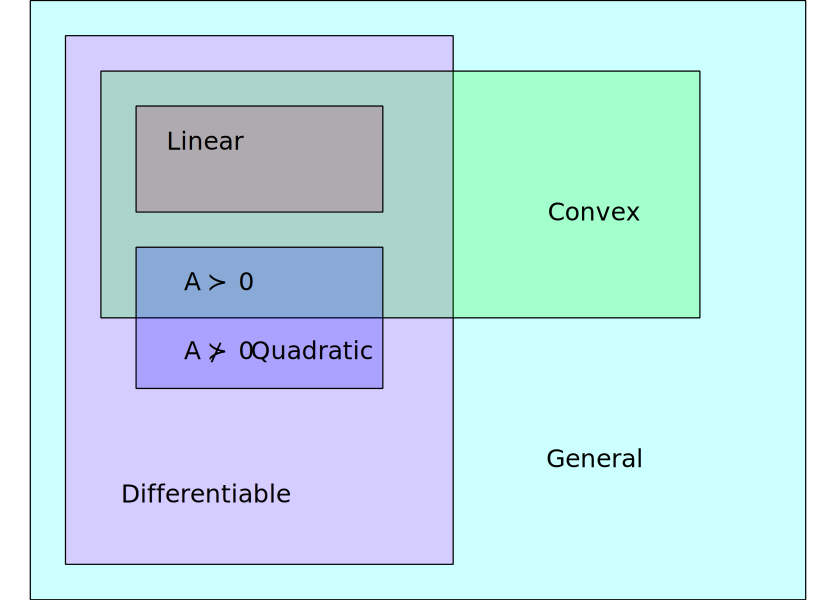

# Lecture 2c: Introduction to Convex Programming

@luk036 👨🏻‍🏫

2023-09-27 📅

## 📝 Abstract

This lecture provides an introduction to the convex programming and covers various aspects of optimization. The lecture begins with an overview of optimization, including linear and nonlinear programming, duality and convexity, and approximation techniques. It then delves into more specific topics within continuous optimization, such as linear programming problems and their standard form, transformations to standard form, and the duality of linear programming problems. The lecture also touches on nonlinear programming, discussing the standard form of an NLPP (nonlinear programming problem) and the necessary conditions of optimality known as the Karush-Kuhn-Tucker (KKT) conditions. Convexity is another important concept explored in the document, with explanations on the definition of convex functions and their properties. The lecture also discusses the duality of convex optimization problems and their usefulness in computation. Finally, the document briefly mentions various unconstrained optimization techniques, descent methods, and approximation methods under constraints.

## Overview 📋

- Introduction
- Linear programming
- Nonlinear programming
- Duality and Convexity
- Approximation techniques
- Convex Optimization
- Books and online resources.

## Classification of Optimizations

- Continuous
  - Linear vs Non-linear
  - Convex vs Non-convex
- Discrete
  - Polynomial time Solvable
  - NP-hard
    - Approximatable
    - Non-approximatable
- Mixed

## Continuous Optimization 🔧



## Linear Programming Problem

- An LPP in standard form is:
  $$\min\{ c^\mathsf{T} x \mid A x = b, x \ge 0\}.$$
- The ingredients of LPP are:
  - An $m \times n$ matrix $A$, with $n > m$
  - A vector $b \in \mathbb{R}^m$
  - A vector $c \in \mathbb{R}^n$

## 📚 Example

$$
\begin{array}{lll}
  \text{minimize} & 0.4 x_1 + 3.4 x_2 - 3.4 x_3 \\
  \text{subject to} & 0.5 x_1 + 0.5 x_2  & = 3.5 \\
  & 0.3 x_1 - 0.8 x_2 + 8.4 x_2 & = 4.5 \\
  & x_1, x_2, x_3 \ge 0
\end{array}
$$

## Transformations to Standard Form

- Theorem: Any LPP can be transformed into the standard form.
- Variables not restricted in sign:
  - Decompose $x$ to two new variables
    $x = x_1 - x_2, x_1, x_2 \geq 0$
- Transforming inequalities into equalities:
  - By putting slack variable $y = b - A x \geq 0$
  - Set $x' = (x, y), A' = (A, 1)$
- Transforming a max into a min
  - max(expression) = min($-$expression);

## Duality of LPP

- If the primal problem of the LPP:
  $\min\{ c^\mathsf{T} x \mid A x \ge b, x \ge 0\}$.
- Its dual is:
  $\max\{ y^\mathsf{T} b \mid A^\mathsf{T} y \leq c, y \ge 0\}$.
- If the primal problem is:
  $\min\{ c^\mathsf{T} x \mid A x = b, x \ge 0\}$.
- Its dual is: $\max\{ y^\mathsf{T} b \mid A^\mathsf{T} y \leq c\}$.

## Nonlinear Programming

- The standard form of an NLPP is
  $$\min\{f(x) \mid g(x) \leq 0, h(x)=0 \}.$$
- Necessary conditions of optimality, Karush- Kuhn-Tucker (KKT)
  conditions:
  - $\nabla f(x) + \mu \nabla g(x) + \lambda \nabla h(x) = 0$,
  - $\mu g(x) = 0$,
  - $\mu \geq 0, g(x) \leq 0, h(x) = 0$

## Convexity

- A function $f$: $K \subseteq \mathbb{R}^n \mapsto R$ is convex
  if $K$ is a convex set and
  $f(y) \ge f(x) + \nabla f(x) (y - x), \; y,x \in K$.

- **Theorem**: Assume that $f$ and $g$ are convex differentiable
  functions. If the pair $(x, m)$ satisfies the KKT conditions above,
  $x$ is an optimal solution of the problem. If in addition, $f$ is
  strictly convex, $x$ is the only solution of the problem.

  **(Local minimum = global minimum)**

## Duality and Convexity

- Dual is the NLPP: $$\max\{\theta(\mu, \lambda) \mid \mu \geq 0\},$$
  where
  $\theta(\mu, \lambda) = \inf_x [ f(x) + \mu g(x) + \lambda h(x) ]$

- Dual problem is always convex.

- Useful for computing the lower/upper bound.

## Applications

- Statistics
- Filter design
- Power control
- Machine learning
  - SVM classifier
  - logistic regression

class: nord-light, middle, center

# Convexify the non-convex's

## Change of curvature: square

Transform:
$$0.3 \leq {\color{red} \sqrt{x} } \leq 0.4$$
into:
$$0.09 \leq {\color{green} x} \leq 0.16 \, .$$

👉 Note that $\sqrt{\cdot}$ are **monotonic** **concave** functions in $(0, +\infty)$.

Generalization:

- Consider $|H(\omega)|^2$ (power) instead of $|H(\omega)|$ (magnitude).
- square root -> Spectral factorization

## Change of curvature: square

Transform:
$${\color{red} x^2 } + {\color{red} y^2 } \geq 0.16, \quad \text{(non-convex)}$$
into:
$${\color{green} x'} + {\color{green} y'} \geq 0.16, \quad x', y' \geq 0$$
Then:
$$x_\text{opt} = \pm\sqrt{x'_\text{opt} }, \quad y_\text{opt} = \pm\sqrt{y'_\text{opt} }.$$

## Change of curvature: sine

Transform:
$${\color{red} \sin^2{x} } \leq 0.4, \quad 0 \leq x \leq \pi/2$$
into:
$${\color{green} y} \leq 0.4, \quad 0 \leq y \leq 1$$
Then:
$$x_\text{opt} = \sin^{-1}(\sqrt{y_\text{opt} }).$$

👉 Note that $\sin(\cdot)$ are monotonic concave functions in $(0, \pi/2)$.

## Change of curvature: log

Transform:
$$\pi \leq {\color{red} x / y} \leq \phi$$
into:
$$\pi' \leq {\color{green} x' - y'} \leq \phi'$$
where $z' = \log(z)$.

Then:
$$z_\text{opt} = \exp(z'_\text{opt}).$$

Generalization:

- Geometric programming

## Change of curvature: inverse

Transform:
$${\color{red} \log(x) + \frac{c}{x} } \leq 0.3, \; x > 0$$
into:
$${\color{green} -\log(y) + c \cdot y } \leq 0.3, \; y > 0 \, .$$

Then:
$$x_\text{opt} = y^{-1}_\text{opt}.$$

👉 Note that $\sqrt{\cdot}$, $\log(\cdot)$, and $(\cdot)^{-1}$ are monotonic functions.

## Generalize to matrix inequalities

Transform:
$${\color{red} \log(\det X) + \text{Tr}(X^{-1} C)} \leq 0.3, \; X \succ 0$$
into:
$${\color{green} -\log(\det Y) + \text{Tr}(Y \cdot C)} \leq 0.3, \; Y \succ 0$$

Then:
$$X_\text{opt} = Y^{-1}_\text{opt}.$$

## Change of variables

Transform:
$$(a +  b \cdot {\color{red} y}) x \leq 0, \; x > 0$$

into:
$$a \cdot x + b \cdot {\color{green} z} \leq 0, \; x > 0$$
where $z = y x$.

Then:
$$y_\text{opt} = z_\text{opt} x^{-1}_\text{opt}$$

## Generalize to matrix inequalities

Transform:
$$(A + B {\color{red} Y}) X + X (A + B {\color{red} Y})^T  \prec 0, \; X \succ 0$$

into:
$$A X + X A^T + B {\color{green} Z} + {\color{green} Z}^T B^T \prec 0, \; X \succ 0$$
where $Z = Y X$.

Then:
$$Y_\text{opt} = Z_\text{opt} X^{-1}_\text{opt}$$

## Some operations that preserve convexity

- $-f$ is concave if and only if $f$ is convex.
- Nonnegative weighted sums:
  - if $w_1, \ldots, w_n \ge 0$ and $f_1, \ldots, f_n$ are all convex, then so is $w_1 f_1 + \cdots + w_n f_n.$ In particular, the sum of two convex functions is convex.
- Composition:
  - If $f$ and $g$ are convex functions and $g$ is non-decreasing over a univariate domain, then $h(x) = g(f(x))$ is convex. As an example, if $f$ is convex, then so is $e^{f(x)},$ because $e^x$ is convex and monotonically increasing.
  - If $f$ is concave and $g$ is convex and non-increasing over a univariate domain, then $h(x) = g(f(x))$ is convex.
  - Convexity is invariant under affine maps.

## Other thoughts

- Minimizing any quasi-convex function subject to convex constraints can easily be
  transformed into a convex programming.
- Replace a non-convex constraint with a sufficient condition
  (such as its lower bound). Less optimal.
- Relaxation + heuristic
- Decomposition

## Unconstraint Techniques

- Line search methods
- Fixed or variable step size
- Interpolation
- Golden section method
- Fibonacci's method
- Gradient methods
- Steepest descent
- Quasi-Newton methods
- Conjugate Gradient methods

## General Descent Method

1.  **Input**: a starting point $x \in$ dom $f$
2.  **Output**: $x^*$
3.  **repeat**
    1.  Determine a descent direction $p$.
    2.  Line search. Choose a step size $\alpha > 0$.
    3.  Update. $x := x + \alpha p$
4.  **until** stopping criterion satisfied.

## Some Common Descent Directions

- Gradient descent: $p = -\nabla f(x)^\mathsf{T}$
- Steepest descent:
  - $\triangle x_{nsd} = \argmin\{\nabla f(x)^\mathsf{T} v \mid \|v\|=1 \}$
  - $\triangle x$ = $\|\nabla f(x)\| \triangle x_{nsd}$
    (un-normalized)
- Newton's method:
  - $p = -\nabla^2 f(x)^{-1} \nabla f(x)$
- Conjugate gradient method:
  - $p$ is "orthogonal" to all previous $p$'s
- Stochastic subgradient method:
  - $p$ is calculated from a set of sample data (instead of using all data)
- Network flow problems:
  - $p$ is given by a "negative cycle" (or "negative cut").

## Approximation Under Constraints

- Penalization and barriers
- Dual method
- Interior Point method
- Augmented Lagrangian method

## 📚 Books and Online Resources

- Pablo Pedregal. Introduction to Optimization, Springer. 2003 (O224
  P371)
- Stephen Boyd and Lieven Vandenberghe, Convex Optimization, Dec. 2002
- Mittlemann, H. D. and Spellucci, P. Decision Tree for Optimization
  Software, World Wide Web, http://plato.la.asu.edu/guide.html, 2003

# Non-Parametric Spatial Correlation Estimation

## Abstract

This lecture discusses non-parametric spatial correlation estimation and its importance in analyzing the variability in semiconductor devices. The intra-die variation in these devices can exhibit spatially correlated patterns, which require accurate statistical analysis during the design stage. Anisotropic models are used to allow for variations in gate length, which exhibit stronger correlation in the horizontal direction than the vertical direction. Non-parametric approaches make sense for correlation functions, as earlier studies that used parametric forms were limited by the assumptions made about the correlation function. This lecture goes on to describe random fields and the properties of correlation functions before diving into problem formulation and solutions using maximum likelihood estimation and least squares estimation.

## Overview 📋

- Motivation:
  - Why is spatial correlation important?
  - Why anisotropic models?
  - Why do non-parametric approaches make sense?
- Problem Formulation
- Non-parametric estimation
  - Least squares estimation
  - Maximum Likelihood estimation
- Numerical experiment
- Conclusion

## Why Spatial Correlation?

- As the minimum feature size of semiconductor devices continues to shrink,
  - Process variations are inevitable. It is desirable to develop more accurate statistical analysis during the design stage.
- Intra-die variation exceeds inter-die variation
  - Becomes dominant over total process variation
  - Often exhibits spatially correlated patterns.
- Applications:
  - Statistical timing analysis -> Clock Skew Scheduling
  - Power/leakage minimization

## Why Anisotropic Model?

- Isotropic assumption assumes that the correlation depends only on the distance between two random variables. It was made to simplify the computation.
- Certain variations, such variations in gate length, exhibit significantly stronger correlation in the horizontal direction than in the vertical direction.

## Why Non-Parametric Approaches?

- In earlier studies, the parametric form of the correlation function was simple, such as an exponential, Gaussian or Matérn function:
- Pros: guaranteed to be **positive definite**.
- Cons:
  - non-convex; may be stuck in a local minimum
  - The actual correlation function may not necessarily be of this form.
  - isotropic model

## Related research 🔬🧪

- Piecewise linearization method (imprecise, not positive definite)
- Parametric method (non-convex, too smooth, isotropic)
  - Exponential function
  - Gaussian function
  - Matérn function
- Non-parametric method
  - Polynomial fitting
  - B-spline

## Random Field

- Random field is an indexed family of random variables denote as
  $\{\tilde{z}(s): s \in D\}$, where $D \subseteq \mathrm{R}^d$
- Covariance $C(s_i, s_j)$ = $\text{cov}(\tilde{z}(s_i),\tilde{z}(s_j))$ =
  $\mathrm{E}[(\tilde{z}(s_i) - \mathrm{E}[\tilde{z}(s_i)]) (\tilde{z}(s_j) - \mathrm{E}[\tilde{z}(s_j)])]$
- Correlation
  $R(s_i, s_j) = C(s_i, s_j)/\sqrt{C(s_i, s_i) C(s_j, s_j)}$
- The field is stationary, or homogeneous, if the distribution is
  unchanged when the point set is translated.
- The field is isotropic if the distribution is invariant under any
  rotation.
- In HIF, let $d = \| s_i - s_j \|_2$:
  - $C(s_i, s_j) = C(d)$
  - $R(s_i, s_j) = C(d)/C(0) = \sigma^2 \rho(d)$

## Properties of Correlation Function

- Even function, i.e. $\rho(\vec{h}) = \rho(-\vec{h}) \implies$ its Fourier transform
  is real.
- Positive definiteness (PD) $\implies$ its Fourier transform is positive
  (Bochner's theorem).
- Monotonicity: correlations are decreasing against $h$ 🤔
- Nonnegativeness: no negative correlation 🤔
- Discontinuity at the origin: nugget effect.

The nugget effect refers to the discontinuity at the origin in the correlation function of spatially correlated patterns. It indicates the presence of a small, non-zero correlation value between points that are very close to each other. In other words, it represents the variance component that cannot be explained by spatial correlation and is attributed to purely random variation.

## Problem Formulation

- Intra-die variation
  $\tilde{z} = z_{det} + \tilde{z}_{cor} + \tilde{z}_{rnd}$
  - $z_{det}$: deterministic component
  - $\tilde{z}_{cor}$: correlated random component
  - $\tilde{z}_{rnd}$: purely random component
- Given $M$ samples $(z_1, z_2, \ldots, z_M) \in \mathbb{R}^n$.
- Measured covariance matrix $Y$:
  - $Y = (1/M) \sum_{i=1}^M z_i z_i^\mathsf{T}$ (unlikely PD)
- In MATLAB, simply call `cov(Zs',1)` to obtain $Y$.
- In Python, simple call `np.cov(Zs, bias=True)` to obtain $Y$.

## Nearest PD Matrix Problem

- Given $Y$. Find a nearest matrix $\Sigma$ that is positive definite.

  $$
  \begin{array}{ll}
      \text{minimize}   & \| \Sigma - Y \|_F \\
      \text{subject to} & \Sigma \succeq 0
    \end{array}
  $$
  where $\| \Sigma - Y \|_F$ denotes the Frobenius norm, $A \succeq 0$ denotes $A$ is positive semidefinite.

- 👉 Note:
  1.  the problem is convex 😃
  2.  the problem can be solved easily using CVX 😃

## Maximum Likelihood Estimation

- Maximum likelihood estimation (MLE):
  $$
  \begin{array}{ll}
        \text{maximize}   & \log \det \Sigma^{-1} - \mathrm{Tr}(\Sigma^{-1}Y)  \\
        \text{subject to} & \Sigma \succeq 0
  \end{array}
  $$
  where $\mathrm{Tr}(A)$ denotes the trace of $A$.
- 👉 Note: 1st term is concave 😭, 2nd term is convex

## Maximum Likelihood Estimation (cont'd)

- Having $S = \Sigma^{-1}$, the problem becomes convex 😃:
  $$
  \begin{array}{ll}
      \text{minimize}   &   -\log \det S + \mathrm{Tr}(S Y) \\
      \text{subject to} & S \succeq 0
    \end{array}
  $$
- 👉 Note: the problem can be solved easily using MATLAB with the CVX
  package, or using Python with the cvxpy package.

## Matlab Code of CVX

```matlab
function Sig = log_mle_solver(Y);
ndim = size(Y,1);
cvx_quiet(false);
cvx_begin sdp
    variable S(ndim, ndim) symmetric
    maximize(log_det(S) - trace(S*Y))
    subject to
         S >= 0;
cvx_end
Sig = inv(S);
```

## 🐍 Python Code

```python
from cvxpy import *
from scipy import linalg

def mle_corr_mtx(Y):
  ndim = len(Y)
  S = Semidef(ndim)
  prob = Problem(Maximize(log_det(S) - trace(S*Y)))
  prob.solve()
  if prob.status != OPTIMAL:
      raise Exception('CVXPY Error')
  return linalg.inv(S.value)
```

## Correlation Function (I)

- Let $\rho(h) = \sum_i^m p_i \Psi_i(h)$, where
  - $p_i$'s are the unknown coefficients to be fitted
  - $\Psi_i$'s are a family of basis functions.
- Let $\{F_k\}_{i,j} =\Psi_k( \| s_i - s_j \|_2)$.

- The covariance matrix $\Omega(p)$ can be recast as:
  $$\Omega(p) = p_1 F_1 + \cdots + p_m F_m$$

- Note 1: affine transformation preserved convexity

- Note 2: inverse of matrix unfortunately **cannot** be expressed in
  convex form.

## Correlation Function (II)

- Choice of $\Psi_i(h)$:
  - Polynomial $P_i(h)$:
    - Easy to understand 👍
    - No guarantee of monotonicity; unstable for higher-order polynomials.
  - B-spline function $B_i(h)$
    - Shapes are easier to control 👍
    - No guarantee of positive definite 👎

## Correlation Function (III)

- To ensure that the resulting function is PD, additional constraints can be imposed according to Bochner's theorem, e.g.:
  - real(FFT($\{\Psi_i(h_k)\}$)) $\geq 0$

Bochner's theorem states that a continuous function is a valid covariance function if and only if its Fourier transform is a non-negative measure. In other words, a function can be a valid covariance function if and only if its Fourier transform is positive definite. This theorem is important in spatial statistics because it provides a way to check whether a given covariance function is valid or not.

## Non-Parametric Estimation

- Least squares estimation

  $$
  \begin{array}{ll}
    \min_{\kappa, p}   & \| \Omega(p) + \kappa I - Y \|_F \\
    \text{s.t.} & \Omega(p) \succeq 0,  \kappa \geq 0
  \end{array}
  $$

  👉 Note: convex problem 😃

- Maximum likelihood estimation (MLE):
  $$
  \begin{array}{ll}
    \min_{\kappa, p}   &      \log \det (\Omega(p) + \kappa I) + \mathrm{Tr}((\Omega(p) + \kappa I)^{-1}Y) \\
    \text{s.t.} & \Omega(p) \succeq 0, \kappa \geq 0
  \end{array}
  $$
  👉 Note:
  - The 1st term is concave 😭, the 2nd term is convex
  - However, the problem is **geodesically convex**.
  - If enough samples are available, then $Y \succeq 0$. Furthermore, the
    MLE is a convex problem in
    $Y \preceq \Omega(p) + \kappa I \preceq 2Y$

## Isotopic Case I

.pull-left[


: Data Sample

] .pull-right[


: Least Square Result

]

## Isotopic Case II

.pull-left[


: Data Sample

] .pull-right[


: Least Square Result

]

## 🌰 Convex Concave Procedure

- Let $\Sigma = \Omega + \kappa I$. Log-likelihood function is:
  - $\log \det \Sigma^{-1} - \mathrm{Tr}(\Sigma^{-1}Y)$
- Convexify the first term using the fact:
  - $\log \det \Sigma^{-1} \geq \log \det \Sigma_0^{-1} + \mathrm{Tr}(\Sigma_0^{-1} (\Sigma - \Sigma_0))$
  - minimize:
    $-\log \det \Sigma_0^{-1} + \mathrm{Tr}(\Sigma_0^{-1} (\Sigma - \Sigma_0)) + \mathrm{Tr}(\Sigma^{-1}Y)$
- At each iteration $k$, the following convex problem is solved:
  $$
  \begin{array}{ll}
      \min   &  \mathrm{Tr}(\Sigma_k^{-1} (\Sigma - \Sigma_k)) + \mathrm{Tr}(SY) \\
      \text{s.t.} & \left(
      \begin{array}{cc}
    \Sigma &  I_n \\
     I_n & S
      \end{array}
    \right)
          \succeq 0, \kappa \geq 0
    \end{array}
  $$
  👉 Note: Convergence to an optimal solution is not guaranteed, but is practically good.

## MATLAB Code

```matlab
% Geometric anisotropic parameters
alpha = 2;     % scaling factor
theta = pi/3;  % angle
Sc = [1   0; 0   alpha];
R = [sin(theta) cos(theta); -cos(theta) sin(theta)];
T = Sc*R;
Sig = ones(n,n);
for i=1:n-1,
   for j=i+1:n,
     dt = s(j,:)' - s(i,:)';
     d = T*dt;  % become isotropic after the location transformation
     Sig(i,j) = exp(-0.5*(d'*d)/(sdkern*sdkern)/2);
     Sig(j,i) = Sig(i,j);
   end
end
```

## Anisotopic Data


## Isotropic Result


## Anisotropic Result


## 🔮 Furue Work

- Porting MATLAB code to Python 🐍
- Real data, not computer generated data
- Barycentric B-spline.
- Sampling method optimization.
