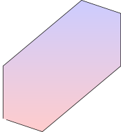

Lecture 4: Robust Analog Circuit Sizing Under Process Variations
=================================================================

## @luk036

2022-10-12

🔑 Keywords
--------

-   Analog circuit 模拟电路
-   Design for robustness 鲁棒性设计
-   Worst-case scenarios 最坏情景
-   Affine arithmetic 仿射运算
-   Convex programming 凸规划
-   Geometric programming 几何规划
-   Posynomial 正项式 (Positive + polynomial)
-   Ellipsoid method 椭球法


🗺️ Overview
------

-   Challenges of 20nm Analog Design

-   Design for variability

-   Design for robustness

-   Analog circuit sizing problem formulation

-   Robust geometric programming

-   Affine arithmetic for worst case scenarios

-   Design examples


📖 Introduction
------------

| Costs        | 28nm      | 20nm        |
| ------------ | --------- | ----------- |
| Fab Costs    | 3B        | 4B - 7B     |
| Process R&D  | 1.2B      | 2.1B - 3B   |
| Mask Costs   | 2M - 3M   | 5M - 8M     |
| Design Costs | 50M - 90M | 120M - 500M |

  : Fab, process, mask, and design costs are much higher at 20nm (IBS,
  May 2011)


Challenges at 20 nm
------------------

-   Double-patterning aware

-   Layout-dependent effects

-   New local interconnect layers

-   \>5,000 design rules

-   Device variation and sensitivity

-   New type of transistor - FinFET


Double Patterning
-----------------


Overlay Error (Mask Shift)
--------------------------

-   Parasitic matching becomes very challenging

    


Layout-Dependent Effects
------------------------

| Layout-Dependent Effects      | \> 40nm | At 40nm | \>= 28nm |
| ----------------------------- | :-----: | :-----: | :------: |
| Well Proximity Effect (WPE)   |    x    |    x    |    x     |
| Poly Spacing Effect (PSE)     |         |    x    |    x     |
| Length of Diffusion (LOD)     |    x    |    x    |    x     |
| OD to OD Spacing Effect (OSE) |         |    x    |    x     |


New Local Interconnect Layers
-----------------------------


New Transistor Type: FinFET
---------------------------


Design for Robustness
---------------------

-   Process variations must be included in the specification.


Basic Design Flow
-----------------

.pull-left70[


]


Top-down Design Phases
----------------------


Basic Flow of Analog Synthesis
------------------------------


Analog Circuit Sizing Problem
-----------------------------

-   Problem definition:
    -   Given a circuit topology, a set of specification requirements and technology, find the values of design variables that meet the specifications and optimize the circuit performance.
-   Difficulties:
    -   High degrees of freedom
    -   Performance is sensitive to variations


Main Approaches in CAD
----------------------

-   Knowledge-based
    -   Rely on circuit understanding, design heuristics
-   Optimization based
    -   **Equation based**
        -   Establish circuit equations and use numerical solvers
    -   Simulation based
        -   Rely on circuit simulation

In practice, you mix and match of them whenever appropriate.


Geometric Programming
---------------------

-   In recent years, techniques of using geometric programming (GP) are emerging.
-   In this lecture, we present a new idea of solving robust GP problems using **ellipsoid method** and **affine arithmetic**.


Lecture 04b - Robust Geometric Programming
============================

Outline
-------

-   Problem Definition for Robust Analog Circuit Sizing
-   Robust Geometric Programming
-   Affine Arithmetic
-   Example: CMOS Two-stage Op-Amp
-   Numerical Result
-   Conclusions


Robust Analog Circuit Sizing Problem
------------------------------------

-   Given a circuit topology and a set of specification requirements:

.font-sm.mb-xs[

| Constraint     | Spec.      | Units      |
| -------------- | ---------- | ---------- |
| Device Width   | $\geq 2.0$ | $\mu$m     |
| Device Length  | $\geq 1.0$ | $\mu$m     |
| Estimated Area | minimize   | $\mu$m$^2$ |
| $\vdots$       | $\vdots$   | $\vdots$   |
| CMRR           | $\geq 75$  | dB         |
| Neg. PSRR      | $\geq 80$  | dB         |
| Power          | $\leq 3$   | mW         |

]

-   Find the worst-case design variable values that meet the specification requirements and optimize circuit performance.


Robust Optimization Formulation
-------------------------------

-   Consider $$\begin{array}{ll}
        \text{minimize}   & \sup_{q \in {\mathbb{Q} }} f_0(x,q), \\
        \text{subject to} & f_j(x,q) \leq 0 \qquad \\
        & \forall q \in {\mathbb{Q} } \; \text{and} \; j = 1,2,\cdots,m, \\
      \end{array}$$ where
    -   $x \in {\mathbb{R} }^n$ represents a set of design variables
        (such as $L$, $W$),
    -   $q$ represents a set of varying parameters (such as $T_{OX}$)
    -   $f_j \leq 0$ represents the $j$th specification requirement (such
        as phase margin $\geq 60^\circ$).


Geometric Programming in Standard Form
--------------------------------------

-   We further assume that $f_i(x,q)$'s are convex for all $q \in {\mathbb{Q} }$.
-   Geometric programming is an optimization problem that takes the following standard form:
    $$\begin{array}{lll}
        \text{minimize}   & p_0(y) &  \\
        \text{subject to} & p_i(y) \leq 1, & i=1,\ldots,l  \\
          & g_j(y) = 1, & j=1,\ldots,m  \\
          & y_k > 0,& k=1,\ldots,n ,
      \end{array}$$ where
    -   $p_i$'s are posynomial functions and $g_j$'s are monomial functions.


Posynomial and Monomial Functions
---------------------------------

-   A monomial function is simply:
    $$g(y_1,\ldots,y_n) = c y_1^{ {\alpha}_{1} } y_2^{ {\alpha}_{2} } \cdots y_n^{ {\alpha}_{n} }, \quad y_k > 0.$$
    where
    -   $c$ is non-negative and ${\alpha}_{k}\in {\mathbb{R} }$.
-   A posynomial function is a sum of monomial functions:
    $$p(y_1,\ldots,y_n) = \sum_{s=1}^{T}{c_s y_1^{ {\alpha}_{1,s} } y_2^{ {\alpha}_{2,s} } \cdots y_n^{ {\alpha}_{n,s} }}, \quad y_k > 0 ,$$
-   A monomial can also be viewed as a special case of posynomial where there is only one term of the sum.


Geometric Programming in Convex Form
------------------------------------

-   Many engineering problems can be formulated as a GP.
-   On Boyd's website there is a Matlab package "GGPLAB" and an excellent tutorial material.
-   GP can be converted into a convex form by changing the variables $x_k = \log(y_k)$ and replacing $p_i$ with $\log p_i$:
    $$\begin{array}{lll}
          \text{minimize}   & \log p_0(\exp(x)) &  \\
          \text{subject to} & \log p_i(\exp(x)) \leq 0, & i=1,\ldots,l \\
          & a_j^\mathsf{T} x + b_j = 0, & j=1,\ldots,m
      \end{array}$$
    where
    -   $\exp(x) = (e^{x_1}, e^{x_2}, \cdots, e^{x_n})$
    -   $a_j = (\alpha_{1,j}, \cdots, \alpha_{n,j})$
    -   $b_j = \log(c_j)$


Robust GP
---------

-   GP in the convex form can be solved efficiently by interior-point methods.
-   In robust version, coefficients $c_s$ are functions of $q$.
-   The robust problem is still convex. Moreover, there is an infinite number of constraints.
-   Alternative approach: Ellipsoid Method.


Example - Profit Maximization Problem
-------------------------------------

This example is taken from [@Aliabadi2013Robust].

$$\begin{array}{ll}
   \text{maximize} & p(A x_1^\alpha x_2^\beta) - v_1 x_1 - v_2 x_2 \\
   \text{subject to}& x_1 \le k.
\end{array}$$

-   $p(A x_1^\alpha x_2^\beta)$ : Cobb-Douglas production function
-   $p$: the market price per unit
-   $A$: the scale of production
-   $\alpha, \beta$: the output elasticities
-   $x$: input quantity
-   $v$: output price
-   $k$: a given constant that restricts the quantity of $x_1$


Example - Profit maximization (cont'd)
-------------------------------------

-   The formulation is not in the convex form.
-   Rewrite the problem in the following form: $$\begin{array}{ll}
      \text{maximize} & t \\
      \text{subject to} & t  + v_1 x_1  + v_2 x_2 \le p A x_1^{\alpha} x_2^{\beta}\\
                    & x_1 \le k.
      \end{array}$$


Profit maximization in Convex Form
----------------------------------

-   By taking the logarithm of each variable:

    -   $y_1 = \log x_1$, $y_2 = \log x_2$.

-   We have the problem in a convex form:

$$\begin{array}{ll}
    \text{max}  & t \\
    \text{s.t.} & \log(t + v_1 e^{y_1} + v_2 e^{y_2}) - (\alpha y_1 + \beta y_2) \le \log(pA) \\
                & y_1 \le \log k.
\end{array}$$


.font-sm.mb-xs[

```python
class profit_oracle:
    def __init__(self, params, a, v):
        p, A, k = params
        self.log_pA = np.log(p * A)
        self.log_k = np.log(k)
        self.v = v
        self.a = a

    def __call__(self, y, t):
        fj = y[0] - self.log_k  # constraint
        if fj > 0.:
            g = np.array([1., 0.])
            return (g, fj), t
        log_Cobb = self.log_pA + self.a @ y
        x = np.exp(y)
        vx = self.v @ x
        te = t + vx
        fj = np.log(te) - log_Cobb
        if fj < 0.:
            te = np.exp(log_Cobb)
            t = te - vx
            fj = 0.
        g = (self.v * x) / te - self.a
        return (g, fj), t
```

]


.font-sm.mb-xs[

```python
# Main program

import numpy as np
from ellpy.cutting_plane import cutting_plane_dc
from ellpy.ell import ell
from .profit_oracle import profit_oracle

p, A, k = 20., 40., 30.5
params = p, A, k
alpha, beta = 0.1, 0.4
v1, v2 = 10., 35.
a = np.array([alpha, beta])
v = np.array([v1, v2])
y0 = np.array([0., 0.])  # initial x0
r = np.array([100., 100.])  # initial ellipsoid (sphere)
E = ell(r, y0)
P = profit_oracle(params, a, v)
yb1, ell_info = cutting_plane_dc(P, E, 0.)
print(ell_info.value, ell_info.feasible)
```

]


Example - Profit Maximization Problem (convex)
---------------------------------------------

$$\begin{array}{ll}
\text{max}  & t \\
\text{s.t.} & \log(t + \hat{v}_1 e^{y_1} + \hat{v}_2 e^{y_2}) - (\hat{\alpha} y_1 + \hat{\beta} y_2) \le \log(\hat{p}\,A)  \\
                  & y_1 \le \log \hat{k} ,
\end{array}$$

-   Now assume that:
    -   $\hat{\alpha}$ and $\hat{\beta}$ vary $\bar{\alpha} \pm e_1$ and
        $\bar{\beta} \pm e_2$ respectively.
    -   $\hat{p}$, $\hat{k}$, $\hat{v}_1$, and $\hat{v}_2$ all vary
        $\pm e_3$.


Example - Profit Maximization Problem (oracle)
---------------------------------------------

By detail analysis, the worst case happens when:

-   $p = \bar{p} - e_3$, $k = \bar{k} - e_3$
-   $v_1 = \bar{v}_1 + e_3$, $v_2 = \bar{v}_2 + e_3$,
-   if $y_1 > 0$, $\alpha = \bar{\alpha} - e_1$, else
    $\alpha = \bar{\alpha} + e_1$
-   if $y_2 > 0$, $\beta = \bar{\beta} - e_2$, else
    $\beta = \bar{\beta} + e_2$


```python
class profit_rb_oracle:
    def __init__(self, params, a, v, vparams):
        e1, e2, e3, e4, e5 = vparams
        self.a = a
        self.e = [e1, e2]
        p, A, k = params
        params_rb = p - e3, A, k - e4
        self.P = profit_oracle(params_rb, a, v + e5)

    def __call__(self, y, t):
        a_rb = self.a.copy()
        for i in [0, 1]:
            a_rb[i] += self.e[i] if y[i] <= 0 else -self.e[i]
        self.P.a = a_rb
        return self.P(y, t)
```


Oracle in Robust Optimization Formulation
-----------------------------------------

-   The oracle only needs to determine:
    -   If $f_j(x_0, q) > 0$ for some $j$ and $q = q_0$,
        then
        -   the cut $(g, \beta)$ =
            $(\partial f_j(x_0, q_0), f_j(x_0, q_0))$
    -   If $f_0(x_0, q) \geq t$ for some
        $q = q_0$, then
        -   the cut $(g, \beta)$ =
            $(\partial f_0(x_0, q_0), f_0(x_0, q_0) - t)$
    -   Otherwise, $x_0$ is feasible, then
        -   Let
            $q_{\max} = \text{argmax}_{q \in \mathbb Q} f_0(x_0, q)$.
        -   $t := f_0(x_0, q_{\max})$.
        -   The cut $(g, \beta)$ =
            $(\partial f_0(x_0, q_{\max}), 0)$

Remark:

-   for more complicated problems, affine arithmetic could be used [@liu2007robust].


Lecture 04c - Affine Arithmetic
===============================


A Simple Area Problem
---------------------

-   Suppose the points $p$, $q$ and $r$ vary within the region of 3 given rectangles.
-   Q: What is the upper and lower bound on the area of $\triangle pqr$?

.pull-right[


]


Method 1: Corner-based
----------------------

-   Calculate all the areas of triangles with different *corners*.
-   Problems:
    -   In practical applications, there may be many corners.
    -   What's more, in practical applications, the worst-case scenario may not be at the corners at all.


Method 2: Monte Carlo
---------------------

-   Monte-Carlo or Quasi Monte-Carlo:
    -   Calculate the area of triangles for different sampling points.
-   Advantage: more accurate when there are more sampling points.
-   Disadvantage: time consuming


class: center, middle

Interval Arithmetic vs. Affine Arithmetic
=========================================


Method 3: Interval Arithmetic
-----------------------------

-   Interval arithmetic (IA) estimation:
    -   Let px = [2, 3], py = [3, 4]
    -   Let qx = [-5, -4], qy = [-6, -5]
    -   Let rx = [6, 7] , ry = [-5, -4]
-   Area of triangle:
    -   = ((qx - px)(ry - py) - (qy - py)(rx - px))/2
    -   = [33 .. 61] (actually [36.5 .. 56.5])
-   Problem: cannot handle *correlation* between variables.


Method 4: Affine Arithmetic
---------------------------

-   (Definition to be given shortly)
-   More accurate estimation than IA:
    -   Area = [35 .. 57] in the previous example.
-   Take care of first-order correlation.
-   Usually faster than Monte-Carlo, but ....
    -   becomes inaccurate if the variations are large.
-   libaffa.a/YALAA package is publicly available:
    -   Provides functuins like +, -, \*, /, sin(), cos(), pow() etc.


Analog Circuit Example
----------------------

-   Unit Gain bandwidth
    -   `GBW = sqrt(A*Kp*Ib*(W2/L2)/(2*pi*Cc)` where some parameters are varying


Enabling Technologies
---------------------

-   C++ template and operator overloading features greatly simplify the coding effort:
-   E.g., the following code can be applied to both `<double>` and `<AAF>`:

    ```cpp
    template <typename Tp>
    Tp area(const Tp& px, const Tp& qx, const Tp& rx,
            const Tp& py, const Tp& qy, const Tp& ry) {
        return ((qx-px)*(ry-py) - (qy-py)*(rx-px)) / 2;
    }
    ```

-   In other words, some existing code can be reused with minimal modification.


Applications of AA
------------------

-   Analog Circuit Sizing
-   Worst-Case Timing Analysis
-   Statistical Static Timing Analysis
-   Parameter Variation Interconnect Model Order Reduction [CMU02]
-   Clock Skew Analysis
-   Bounded Skew Clock Tree Synthesis


Limitations of AA
-----------------

-   Something AA can't replace `<double>`:
    -   Iterative methods (no fixed point in AA)
    -   No Multiplicative inverse operation (no LU decomposition)
    -   Not total ordering, can't sort (???)
-   AA can only handle linear correlation, which means you can't expect an accurate approximation of `abs(x)` near zero.
-   Fortunately the ellipsoid method is one of the few algorithms that works with AA.


Circuit Sizing for Op. Amp.
---------------------------

-   Geometric Programming formulation for CMOS Op. Amp.
-   Min-max convex programming under Parametric variations (PVT)
-   Ellipsoid Method


What is Affine Arithmetic?
--------------------------

-   Represents a quantity x with an affine form (AAF):
    $$\hat{x} = x_0 + x_1 \epsilon_1 + \ldots + x_n \epsilon_n$$ where
    -   noise symbols $\epsilon_i \in [-1, 1]$
    -   central value $x_0 \in \mathbb{R}$
    -   partial deviations $x_i \in \mathbb{R}$
    -   $n$ is not fixed - new noise symbols are generated during the computation process.
-   IA -\> AA : $[3..4] \rightarrow 3.5 + 0.5 \epsilon_1$


Geometry of AA
--------------

.pull-left70[

-   Affine forms that share noise symbols are dependent:
    -   $\hat{x} = x_0 + x_1 \epsilon_1 + \ldots + x_n \epsilon_n$
    -   $\hat{y} = y_0 + y_1 \epsilon_1 + \ldots + y_m \epsilon_m$
-   The region containing (x, y) is:
    -   $Z = \{(x, y) : \epsilon_i \in [-1, 1]\}$
    -   This region is a centrally symmetric convex polygon called "zonotope".

] .pull-right30[



]


Affine Arithmetic
-----------------

How to find $\sup_{q \in {\mathbb{Q} }} f_j(x,q)$ efficiently?

-   $\sup_{q \in {\mathbb{Q} }} f_j(x,q)$ is in general difficult to obtain.
-   Provided that variations are small or nearly linear, we propose using Affine Arithmetic (AA) to solve this problem.
-   Features of AA:
    -   Handle correlation of variations by sharing *noise symbols*.
    -   Enabling technology: template and operator overloading features of C++.
    -   A C++ package "YALAA" is publicly available.


Affine Arithmetic for Worst Case Analysis
-----------------------------------------

-   An uncertain quantity is represented in an affine form (AAF):
    $$\hat{a} = a_0 + a_1 \varepsilon_1 + a_2 \varepsilon_2 +
      \cdots +  a_k \varepsilon_k = a_0 + \sum_{i=1}^{k} a_i \varepsilon_i,$$
    where
    -   $\varepsilon_i \in [-1, 1]$ is called *noise symbol*.
-   Exact results for affine operations ($\hat{a}+\hat{b}$,
    $\hat{a}-\hat{b}$ and $\alpha \cdot \hat{a}$)
-   Results of non-affine operations (such as $\hat{a} \cdot \hat{b}$, $\hat{a}/\hat{b}$, $\max(\hat{a}, \hat{b}), \log(\hat{a})$) are *approximated* in an affine form.
-   AA has been applied to a wide range of applications recently when process variations are considered.


Affine Arithmetic for Optimization
----------------------------------

In our robust GP problem:

-   First, represent every elements in $q$ in affine forms.
-   For each ellipsoid iteration, $f(x_c,q)$ is obtained by *approximating* $f(x_c,\hat{q})$ in an affine form:
    $$\hat{f} = f_0 + f_1 \varepsilon_1 + f_2 \varepsilon_2 + \cdots +  f_k \varepsilon_k.$$
-   Then the maximum of $\hat{f}$ is determined by:
    $$\varepsilon_j = \left\{ \begin{array}{ll}
                  +1 & \qquad \text{if} \; f_j > 0 \\
                  -1 & \qquad \text{if} \; f_j < 0
                \end{array}
      \right.   \quad j=1, \cdots, k.$$


.pull-left70[


]


Performance Specification
-------------------------

.column-2.font-sm.mb-xs[

| Constraint       | Spec.         | Units         |
| ---------------- | ------------- | ------------- |
| Device Width     | $\geq 2.0$    | $\mu$m        |
| Device Length    | $\geq 1.0$    | $\mu$m        |
| Estimated Area   | minimize      | $\mu$m$^2$    |
| Input CM Voltage | $[0.45,0.55]$ | x $V_{DD}$    |
| Output Range     | $[0.1,0.9]$   | x $V_{DD}$    |
| Gain             | $\geq 80$     | dB            |
| Unity Gain Freq. | $\geq 50$     | MHz           |
| Phase Margin     | $\geq 60$     | degree        |
| Slew Rate        | $\geq 50$     | V/$\mu$s      |
| CMRR             | $\geq 75$     | dB            |
| Neg. PSRR        | $\geq 80$     | dB            |
| Power            | $\leq 3$      | mW            |
| Noise, Flicker   | $\leq 800$    | nV/Hz$^{0.5}$ |

]


Open-Loop Gain (Example)
-----------------------

-   Open-loop gain $A_v$ can be approximated as a monomial function:

    $$A_v =  \frac{2 C_{ox} }{(\lambda_n + \lambda_p)^2} \sqrt{\mu_n \mu_p \frac{W_1 W_6}{L_1 L_6 I_1 I_6} }$$

    where $I_1$ and $I_6$ are monomial functions.

-   Corresponding C++ code fragment:

    ```cpp
    // Open Loop Gain
    monomial<aaf> OLG = 2*COX/square(LAMBDAN+LAMBDAP)*
         sqrt(KP*KN*W[1]/L[1]*W[6]/L[6]/I1/I6);
    ```


Results of Design Variables
---------------------------

.column-2.font-sm.mb-xs[

| Variable   | Units  | GGPLAB  | Our   | Robust |
| ---------- | ------ | ------- | ----- | ------ |
| $W_1$      | $\mu$m | 44.8    | 44.9  | 45.4   |
| $W_8$      | $\mu$m | 3.94    | 3.98  | 3.8    |
| $W_{10}$   | $\mu$m | 2.0     | 2.0   | 2.0    |
| $W_{13}$   | $\mu$m | 2.0     | 2.0   | 2.1    |
| $L_1$      | $\mu$m | 1.0     | 1.0   | 1.0    |
| $L_8$      | $\mu$m | 1.0     | 1.0   | 1.0    |
| $L_{10}$   | $\mu$m | 1.0     | 1.0   | 1.0    |
| $L_{13}$   | $\mu$m | 1.0     | 1.0   | 1.0    |
| $A$        | N/A    | 10.4    | 10.3  | 12.0   |
| $B$        | N/A    | 61.9    | 61.3  | 69.1   |
| $C_c$      | pF     | 1.0     | 1.0   | 1.0    |
| $I_{bias}$ | $\mu$A | 6.12    | 6.19  | 5.54   |

]


Performances
------------

.font-sm.mb-xs[

  | Performance (units)            | Spec.        | Std.         | Robust       |
  | ------------------------------ | ------------ | ------------ | ------------ |
  | Estimated Area ($\mu$m$^2$)    | minimize     | 5678.4       | 6119.2       |
  | Output Range (x $V_{DD}$)      | [0.1, 0.9]   | [0.07, 0.92] | [0.07, 0.92] |
  | Comm Inp Range (x $V_{DD}$)    | [0.45, 0.55] | [0.41, 0.59] | [0.39, 0.61] |
  | Gain (dB)                      | $\geq 80$    | 80           | [80.0, 81.1] |
  | Unity Gain Freq. (MHz)         | $\geq 50$    | 50           | [50.0, 53.1] |
  | Phase Margin (degree)          | $\geq 60$    | 86.5         | [86.1, 86.6] |
  | Slew Rate (V/$\mu$s)           | $\geq 50$    | 64           | [66.7, 66.7] |
  | CMRR (dB)                      | $\geq 75$    | 77.5         | [77.5, 78.6] |
  | Neg. PSRR (dB)                 | $\geq 80$    | 83.5         | [83.5, 84.6] |
  | Power (mW)                     | $\leq 3$     | 1.5          | [1.5, 1.5]   |
  | Noise, Flicker (nV/Hz$^{0.5}$) | $\leq 800$   | $600$        | [578, 616]   |

]


Conclusions
-----------

-   Our ellipsoid method is fast enough for practical analog circuit
    sizing (take \< 1 sec. running on a 3GHz Intel CPU for our example).
-   Our method is reliable, in the sense that the solution, once
    produced, always satisfies the specification requirement in the
    worst case.


Comments
--------

-   The marriage of AA (algebra) and Zonotope (geometry) has the potential to provide us with a powerful tool for algorithm design.
-   AA does not solve all problems. E.g. Iterative method does not apply to AA because AA is not in the Banach space (the fixed-point theorem does not hold).
-   AA \* and + do not obey the laws of distribution (c.f. floating-point arithmetic)
-   AA can only perform first-order approximations. In other words, it can only be applied to nearly linear variations.
-   In practice, we still need to combine AA with other methods, such as statistical method or the (quasi-) Monte Carlo method.


