# Lecture 05a - ⏳ Clock Skew Scheduling Under Process Variations

@luk036

2022-10-19

## 🔑 Keywords

- Static timing analysis, STA 静态时序分析
- Statistical STA 统计静态时序分析
- Clock skew 时钟偏差/偏斜
- Zero skew design 零偏差设计
  - Critical paths 关键路径
  - Negative slack 负时序裕量
- Useful skew design 有效偏差设计
  - Critical cycles 关键环
  - Negative cycles 负环
- Clock skew scheduling ⏳ (CSS) 时钟偏差安排/规划
- Yield-driven CSS 产品率驱动时钟偏差安排

## 🗺️ Overview

- Background

- Problem formulation

- Traditional clock skew scheduling ⏳

- Yield-driven clock skew scheduling ⏳

- Minimum cost-to-time ratio formulation

## Sequential Logic

- Local data path

  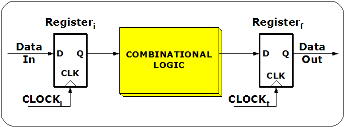

## Sequential Logic (cont'd)

- Graph

  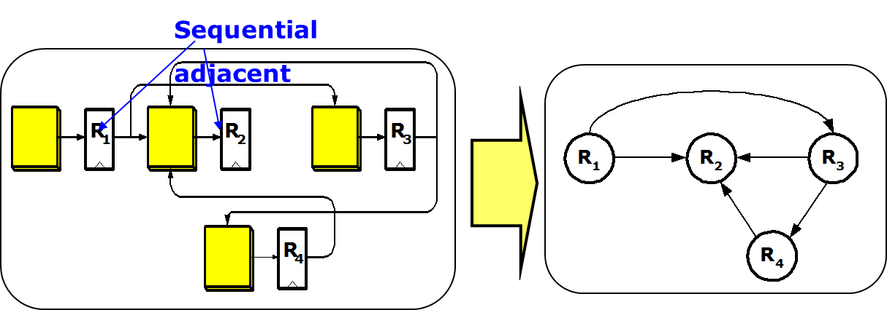

## Clock Skew

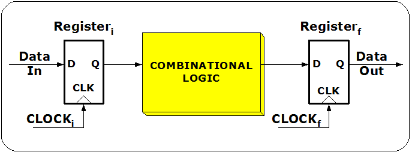

- $T_\text{skew}(i,f) = t_i - t_f$, where
  - $t_i$: clock signal delay at the initial register
  - $t_f$: clock signal delay at the final register

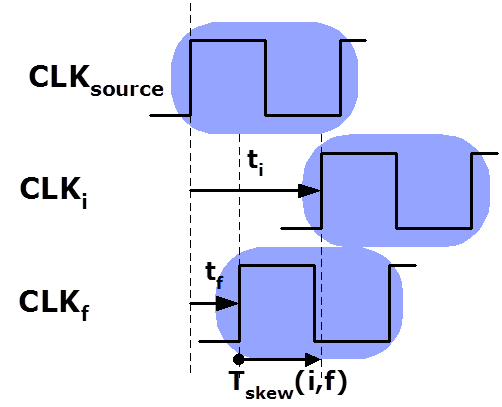

## Timing Constraint

- Setup time constraint
  $$T_\text{skew}(i,f) \le T_\text{CP} - D_{if} - T_\text{setup} = u_{if}$$
  While this constraint destroyed, cycle time violation (zero
  clocking) occurs.

- Hold time constraint
  $$T_\text{skew}(i,f) \ge T_\text{hold} - d_{if} = l_{if}$$ While
  this constraint destroyed, race condition (double clocking) occurs.

## Zero skew vs. Useful skew

- Zero skew ($t_i = t_f$) : Relatively easy to implement.

- Useful skew. Improve:

  - The performance of the circuit by permitting a higher maximum
    clock frequency, or
  - The safety margins of the clock skew within the permissible
    ranges.

- Max./min. path delays are got from static timing analysis
  (STA).

## Timing Constraint Graph

- Create a graph by
  - replacing the hold time constraint with a _h-edge_ with cost
    $-(T_\text{hold} - d_{ij})$ from $\text{FF}_i$ to $\text{FF}_j$,
    and
  - replacing the setup time constraint with an s-edge with cost
    $T_\text{CP} - D_{ij} - T_\text{setup}$ from $\text{FF}_j$ to
    $\text{FF}_i$.
- Two sets of constraints stemming from clock skew definition:
  - The sum of skews for paths having the same starting and ending
    flip-flop to be the same;
  - The sum of clock skews of all cycles to be zero

## Timing Constraint Graph (TCG)

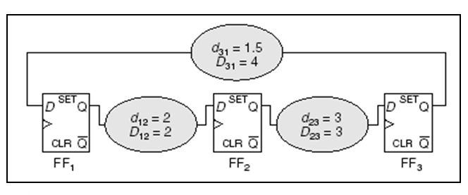

## Timing Constraint Graph (TCG)

Assume $T_\text{setup} = T_\text{hold}$ = 0

Clock period $T_\text{CP}$ is feasible if and only if current graph contains no
negative cost cycles.

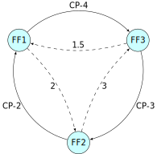

## Minimize Clock Period

- Linear programming (LP) formulation

  $$
  \begin{array}{ll}
      \text{minimize}   & T_\text{CP} \\
      \text{subject to} & l_{ij} \leq T_i - T_j \leq u_{ij}
  \end{array}
  $$

  where $\text{FF}_i$ and $\text{FF}_j$ are sequential adjacent

- The above constraint condition is so-called **system of difference
  constraints** (see Introduction to Algorithms, MIT):

- 👉 Note: easy to check if a feasible solution exists by detecting
  negative cycle using for example Bellman-Ford algorithm.

## Basic Bellman-Ford Algorithm

.font-sm.mb-xs[

```matlab
function BellmanFord(list vertices, list edges, vertex source)
    // Step 1: initialize graph
    for each vertex i in vertices:
        if i is source then u[i] := 0
        else u[i] := inf
        predecessor[i] := null

    // Step 2: relax edges repeatedly
    for i from 1 to size(vertices)-1:
        for each edge (i, j) with weight d in edges:
*           if u[j] > u[i] + d[i,j]:
*               u[j] := u[i] + d[i,j]
*               predecessor[j] := i

    // Step 3: check for negative-weight cycles
    for each edge (i, j) with weight d in edges:
        if u[j] > u[i] + d[i,j]:
            error "Graph contains a negative-weight cycle"
return u[], predecessor[]
```

]

## Problems with Bellman-Ford Algorithm

- The algorithm is originally used for finding the shortest paths.
- Detecting negative cycle is just a side product of the algorithm.
- The algorithm is simple, but...
  - detects negative cycle at the end only.
  - has to compute all `d[i,j]`.
  - Restart the initialization with `u[i] := inf`.
  - requests the input graph must have a source node.

Various improvements have been proposed extensively.

## Minimize clock period (I)

- Fast algorithm for solving the LP:
  - Use binary search method for finding the minimum clock period.
  - In each iteration, Bellman-Ford algorithm is called to detect if
    the timing constraint graph contains negative weighted edge
    cycle.
- 👉 Note: Originally Bellman-Ford algorithm is used to find a
  shortest-path of a graph.

## Minimize clock period (II)

- When the optimal clock period is solved, the corresponding skew
  schedule is got simultaneously.

- However, many skew values are on the bounds of feasible range.


## Yield-driven Clock Skew Scheduling

- When process variations increase more and more,
  timing-failure-induced yield loss becomes a significant problem.

- Yield-driven Clock Skew Scheduling becomes important.

- Primary goal of this scheduling is to minimize the yield loss
  instead of minimizing the clock period.

## Timing Yield Definition

- The circuit is called functionally correct if all the setup- and
  hold-time constraints are satisfied under a group of determinate
  process parameters.

- Timing Yield = (functional correct times) / sample number \* 100%

## Primitive solution (1)

- Pre-allocate timing margins (usually equivalent to maximum timing
  uncertainty) at both ends of the FSR's (Feasible Skew Region).
  $$l_{ij}  \leq s_{ij} \leq u_{ij} \implies l_{ij} + \Delta d \leq s_{ij}  \leq u_{ij} - \Delta d$$

- Then perform clock period optimization.

## Problems with this method

- The maximum timing uncertainty is too pessimistic. Lose some
  performance;

- $\Delta d$ is fixed; it does not consider data path delay
  differences between cycle edges.

## 📑 References (1)

- "Clock skew optimization", IEEE Trans. Computers, 1990

- "A graph-theoretic approach to clock skew optimization", ISCAS'94

- "Cycle time and slack optimization for VLSI-chips", ICCAD'99

- "Clock scheduling and clocktree construction for high performance
  Asics", ICCAD'03

- "ExtensiveSlackBalance: an Approach to Make Front-end Tools Aware of
  Clock Skew Scheduling", DAC'06

## Primitive solution (2)

- Formulate as LCES (Least Center Error Square) problem

  - A simple observation suggests that, to maximize slack, skew
    values should be chosen as close as possible to the middle
    points of their FSR's.

  $$l_{ij} + lm_k (u_{ij} - l_{ij}) \leq s_{ij}  \leq u_{ij} - um_k (u_{ij} - l_{ij})$$

  $$
  \begin{array}{ll}
    \text{minimize}   & \sum_k (0.5 - \min(lm_k, um_k) )^2 \\
    \text{subject to} & 0 \leq lm_k \leq 0.5 \\
    & 0 \leq um_k \leq 0.5
  \end{array}
  $$

## 📑 References (2)

- Graph-based algorithm
  - (J. L. Neves and E. G. Friedman, "Optimal Clock Skew Scheduling
    Tolerant to Process Variations", DAC'96)
- Quadratic Programming method
  - (I. S. Kourtev and E. G. Fredman, "Clock skew scheduling ⏳ for
    improved reliability via quadratic programming", ICCAD'99)

Shortcoming: might reduce some slacks to be zero to minimum **total** CES.
This is not optimal for yield.

## Primitive solution (3)

- Incremental Slack Distribution
  - (Xinjie Wei, Yici CAI and Xianlong Hong, "Clock skew scheduling ⏳
    under process variations", ISQED'06)
- Advantage: check all skew constraints

- Disadvantage: didn't take the path delay difference into
  consideration

## Minimum Mean Cycle Based

- **Even**: solve the slack optimization problem using a minimum mean
  cycle formulation.

- **Prop**: distribute slack along the most timing-critical cycle
  proportional to path delays

- **FP-Prop**: use sensitizable-critical-path search algorithm for
  clock skew scheduling.

## Slack Maximization (EVEN)

- Slack Maximization Scheduling

  $$
  \begin{array}{ll}
      \text{maximize}   & t \\
      \text{subject to} & T_j - T_i \leq \mu_{ij} - t
  \end{array}
  $$

- Equivalent to the so-called minimum mean cycle problem (MMC), where
  $$t^* = \frac{1}{|C|} \sum\limits_{(i,j)\in C} \mu_{ij}$$ $C$:
  critical cycle (first negative cycle)

- Can be solved efficiently by the above method.

## Even - iterative slack optimization

- Identify the circuit's most timing-critical cycle,

- Distribute the slack along the cycle,

- Freeze the clock skews on the cycle, and

- Repeat the process iteratively.

## Most timing-critical cycle

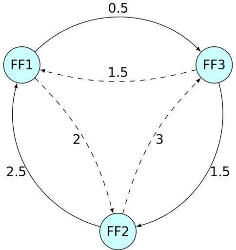

## Identify the timing-critical cycle

- Identify the circuit's most timing-critical cycle

- Solve the minimum mean-weight cycle problem by
  - Karp's algorithm
  - A. Dasdan and R.K.Gupta, "Faster Maximum and Minimum Mean Cycle
    Algorithms for System-Performance", TCAD'98.

## Distribute the slack

Distribute the slack evenly along the most timing-critical cycle.

 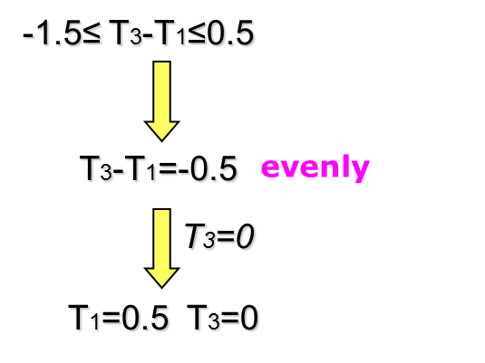

## Freeze the clock skews (I)

Replace the critical cycle with super vertex.

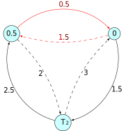 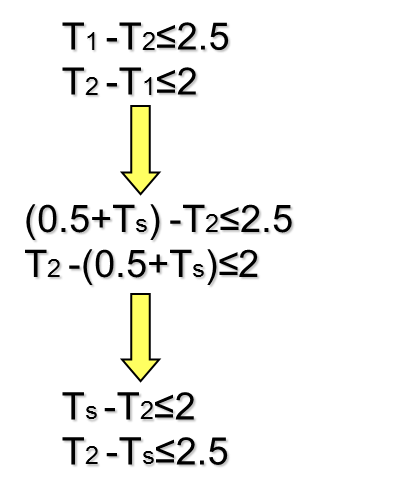

## Freeze the clock skews (II)

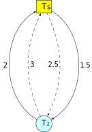 

To determine the optimal slacks and skews for the rest of the graph,
we replace the critical cycle with super vertex.

## Repeat the process (I)

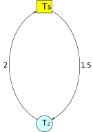 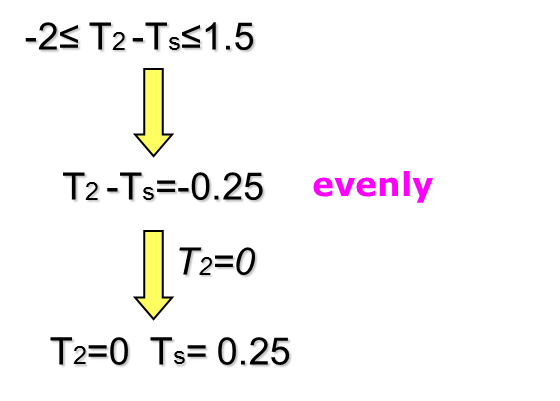

## Repeat the process (II)

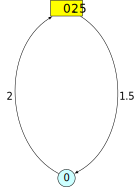 

## Final result

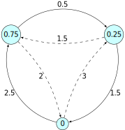

- $\text{Skew}_{12}$ = 0.75
- $\text{Skew}_{23}$ = -0.25
- $\text{Skew}_{31}$ = -0.5

- $\text{Slack}_{12}$ = 1.75
- $\text{Slack}_{23}$ = 1.75
- $\text{Slack}_{31}$ = 1

where $\text{Slack}_{ij} = T_\text{CP} - D_{ij} - T_\text{setup} - \text{Skew}_{ij}$

## Problems with Even

- Assume all variances are the same.
- However, the timing uncertainty of a long combinational path is
  usually larger than that of a shorter path.
- Therefore, the even slack distribution along timing-critical cycles
  performed by **Even** is not optimal for yield if data path delays
  along the cycles are different.

## Prop-Based on Gaussian model (I)

- Assuming there are $n$ gates with delay $N(\mu,\sigma^2)$ in a path,
  then this path delay is $N(n\mu,n\sigma^2)$
- Distribute slack along the most timing-critical cycle, according to
  the square root of each edge's path delays (???).
- To achieve this, update the weights of s-edges and h-edges:
  $$
  \begin{array}{ll}
  T_\text{CP} - (D_{ij} + \alpha \sqrt{D_{ij} } \sigma) - T_\text{setup} \\
  -T_\text{hold} + (d_{ij} - \alpha \sqrt{d_{ij} } \sigma)
  \end{array}$$ where $\alpha$ ensures a minimum timing margin for
  each timing constraint.

## Prop-Based on Gaussian model (II)

- Given a specific clock period $T_\text{CP}$, we gradually increase $\alpha$ and
  use the Bellman-Ford algorithm to detect whether it is still feasible.
- After finding the maximum $\alpha$, the edges along the most
  timing-critical cycle will have slacks equal to the pre-allocated
  timing margins.
- Many edges in a circuit have sufficiently large slack. Therefore, we
  can perform proportional slack distribution only for the most
  timing-critical cycle. Assign the rest of skews using **Even**.

## Problems with Prop

- Assume all gate delay has the same distribution.
- Not justify using the square root of path delay for timing margin.

## FP-Prop (I)

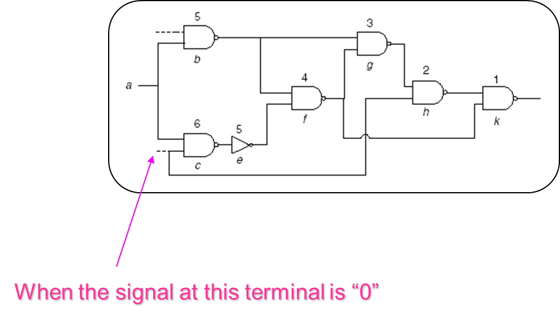
False path

## FP-Prop (II)

- If we do not consider false path, some non timing-critical cycles
  become timing-critical. Then, more slacks are distributed to these
  cycles, but the slacks in actually timing-critical cycles are not
  sufficient. As a result, the overall timing yield decreases.

## Problems with FP-Prop

- Same problems as Prop

## 🧪 Experimental Results

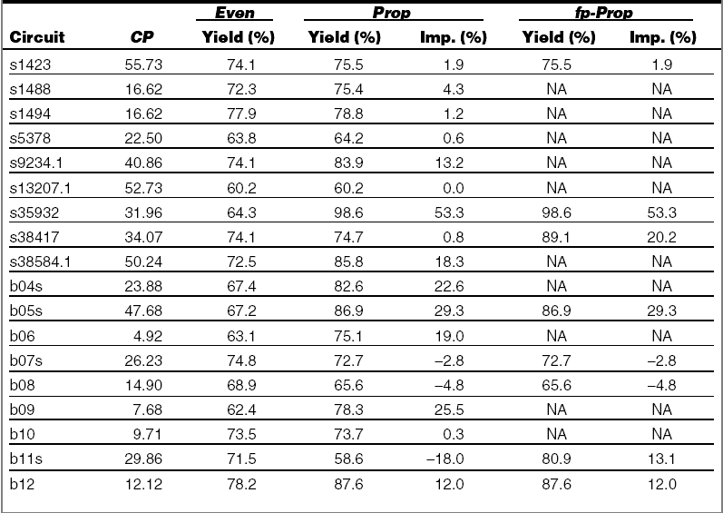

## 📈 Statistical Method

- Setup time constraint

  $$T_\text{skew}(i,f) \le T_\text{CP} - \tilde{D}_{if} - T_\text{setup}$$

- Hold time constraint

  $$T_\text{skew}(i,f) \ge T_\text{hold} - \tilde{d}_{if}$$

  where $\tilde{D}_{if} \text{ and } \tilde{d}_{if}$
  are random variable under process variations.

## 📈 Statistical TC Graph

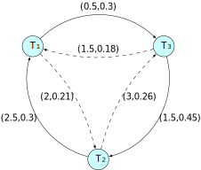

After SSTA, edge weight is represented as a pair of value (mean, variance).

## Most Critical Cycle

- Traditional criteria: minimum mean cycle
  $$\min_{C \in \mathcal{C} } \frac{\sum_{(i,j)\in C} \mu_{ij} }{|C|}$$

- New criteria:
  $$\min_{C \in \mathcal{C} } \frac{\sum_{(i,j)\in C} \mu_{ij} }{\sum_{(i,j)\in C} \sigma_{ij} }$$

  (We show the correctness later)

## Slack Maximization (C-PROP)

- Slack Maximization Scheduling $$\begin{array}{ll}
        \text{maximize} & t \\
        \text{subject to} & T_j - T_i \leq \mu_{ij} - \sigma_{ij} t
    \end{array}$$
- Equivalent to the _minimum cost-to-time ratio_ problem (MMC), where:
  - $t^* = \sum_{(i,j)\in C} \mu_{ij} / \sum_{(i,j)\in C} \sigma_{ij}$
  - $C$: critical cycle (first negative cycle)

## Probability Observation

- Prob(timing failure) turns out to be an Error function that solely
  depends on this ratio. Therefore, it is justified to use this ratio
  as critical criteria.

## Whole flow

- After determining the clock arrival time at each vertex in the most
  critical cycle, the cycle is replaced with a super vertex $v'$.

- In-edge $(u, v)$ from outside vertex $u$ to cycle member $v$ is
  replaced by an in-edge $(u, v')$ with weight mean
  $\mu(u, v) - T_v$.

- Out-edge $(v, u)$ is replaced by out-edge $(v', u)$ with
  weight mean $\mu(v, u) + T_v$. However, the variance of the edge
  weight is not changed. And parallel edges can be remained.

- Repeat the process iteratively until the graph is reduced to a
  single super vertex, or the edges number is zero.

## Data structure

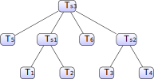

Final result: $T_1=T_1+T_{s_1}+T_{s_3}$

## Advantages of This Method

- Justified by probability observation.
- Fast algorithm exists for minimum cost-to-time ratio problem.
- Reduce to Even when all variances are equal.
- When a variance tends to zero, it makes sense that only minimal
  slack is assigned to this variable, and hence others can be assigned
  more.

## Results

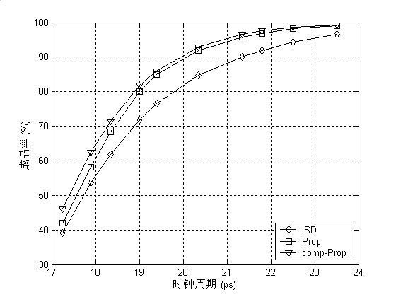\

## 📑 Main Reference

- Jeng-Liang Tsai, Dong Hyum Baik, Charlie Chung-Ping Chen, and Kewal
  K. Saluja, "Yield-Driven, False-Path-Aware Clock Skew Scheduling",
  IEEE Design & Test of Computers, May-June 2005

# Lecture 05b - ⏳ Clock Skew Scheduling Under Process Variations (2)

## 🗺️ Overview

- A Review of CSS Issues

- General Formulation

- Yield-driven Clock Skew Scheduling

- Numerical Results

## Minimum Clock Period Problem

- Linear programming (LP) formulation $$\begin{array}{ll}
      \text{minimize}   & T_\text{CP} \\
      \text{subject to} & l_{ij} \leq T_i - T_j \leq u_{ij}
    \end{array}$$ where $\text{FF}_i$ and $\text{FF}_j$ are
  sequentially adjacent to each other.

- The above constraints are called _system of difference
  constraints_ (see Introduction to Algorithms, MIT):
  - Key: it is easy to check if a feasible solution exists by detecting
    negative cycles using the Bellman-Ford algorithm.

## System of Difference Constraints

- In some cases, you may need to do some transformations, e.g.
  - $T_i \leq \min_k \{T_k + a_{ik}\} \rightarrow T_i - T_k \leq a_{ik}, \; \forall k$
  - $T_i \geq \max_k \{T_k + b_{ik}\} \rightarrow b_{ik} \leq T_i - T_k, \; \forall k$

## Slack Maximization (EVEN)

- Slack Maximization Scheduling $$\begin{array}{ll}
      \text{maximum}    & t \\
      \text{subject to} & T_j - T_i \leq \mu_{ij} - t
    \end{array}$$ (👉 Note: $\mu_{ij} \text{ is not equal to } \mu_{ji}$)

- is equivalent to the so-called _minimum mean cycle problem_ (MMC),
  where:

  - $t^* = \sum_{(i,j) \in C} \mu_{ij} / |C|$,
  - $C$: critical cycle (first negative cycle)

- Can be efficiently solved by the parametric shortest path methods.

## Slack Maximization (C-PROP)

- Slack Maximization Scheduling $$\begin{array}{ll}
      \text{maximum}   & t \\
      \text{subject to} & T_j - T_i \leq \mu_{ij} - \sigma_{ij} t
    \end{array}$$ (we show the correctness later)

- is equivalent to the _minimum cost-to-time ratio problem_ (MCR), where:
  - $t^* = \sum_{(i,j) \in C} \mu_{ij} / \sum_{(i,j) \in C} \sigma_{ij}$,
  - $C$: critical cycle

## General Formulation

- General form: $$\begin{array}{ll}
      \text{maximum}   & g(t) \\
      \text{subject to} & T_i - T_j \leq f_{ij}(t), \; \forall (i,j) \in E
    \end{array}$$ where $f_{ij}(t)$ a linear function that represents
  various problems defined above.

| Problem | $g(t)$ | $f_{ij}(t)$ (setup)                                 | $f_{ji}(t)$ (hold)                        |
| ------- | ------ | --------------------------------------------------- | ----------------------------------------- |
| Min. CP | $-t$   | $t - D_{ij} - T_\text{setup}$                       | $-T_\text{hold} + d_{ij}$                 |
| EVEN    | $t$    | $T_\text{CP} - D_{ij} - T_\text{setup} - t$         | $-T_\text{hold} + d_{ij} - t$             |
| C-PROP  | $t$    | $T_\text{CP}-D_{ij}-T_\text{setup} - \sigma_{ij} t$ | $-T_\text{hold} + d_{ij} - \sigma_{ij} t$ |

## General Formulation (cont'd)

- In fact, $g(t)$ and $f_{ij}(t)$ are not necessarily linear functions.
  Any monotonic decreasing function will do.

- Theorem: if $g(t)$ and $f_{ij}(t)$ are _monotonic decreasing_
  functions for all $i$ and $j$, then there is a unique solution to the problem.
  (prove later).

- Question 1: Does this generalization have any application?

- Question 2: What if $g(t)$ and $f_{ij}(t)$ are convex but not monotone?

## 🔕 Non-Gaussian Distribution

- 65nm and below, the path delay is likely to have a non-Gaussian distribution:

  👉 Note: central limit theorem does not apply because

  - random variables are correlated (why?)
  - delays are non-negative

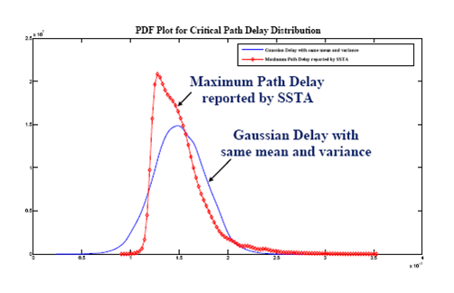

## Timing Yield Maximization

- Formulation:

  - $\max\{\min\{\text{Pr}\{T_j - T_i \leq \tilde{W}_{ij} \}\}\}$
  - is not exactly timing yield but reasonable.

- It is equivalent to:

  $$
  \begin{array}{ll}
    \text{maximum} & t \\
    \text{subject to} & T_i - T_j \le T_\text{CP} - F^{-1}_{ji}(t) \\
      & T_j - T_i \le F^{-1}_{ij}(1 - t)
  \end{array}
  $$

  where $F_{ij}(\cdot) \text{ is CDF of } \tilde{W}_{ij}$

- Luckily, any CDF must be a monotonic increasing function.

## 📈 Statistical Interpretations of C-PROP

- Reduce to C-PROP when $\tilde{W}_{ij}$ is Gaussian, or precisely

  $$F_{ij}(x) = K((x - \mu_{ij})/\sigma_{ij})$$

- EVEN: identical distribution up to shifting

  $$F_{ij}(x) = H(x - \mu_{ij})$$

  Not necessarily worse than C-PROP

## Comparison

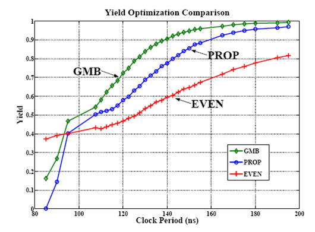\

## Three Solving Methods in General

- Binary search based
  - Local convergence is slow.
- Cycle based
  - Idea: if a solution is infeasible, there exists a negative cycle
    which can always be "zero-out" with minimum effort (proof of
    optimality)
- Path based
  - Idea: if a solution is feasible, there exists a (shortest) path
    from where we can always improve the solution.

## Parametric Shortest Path Algorithms

- Lawler's algorithm (binary search)

- Howard's algorithm (based on cycle cancellation)

- Hybrid method

- Improved Howard's algorithm

- Input:

  - Interval [tmin, tmax] that includes t\*
  - Tol: tolerance
  - G(V, E): timing graph

- Output:
  - Optimal t\* and its corresponding critical cycle C

## Lawler's Algorithm

```uml
@startuml
 while ((tmax - tmin) > tol)
    : t := (tmin + tmax) / 2;
    if (a neg. cycle C under t exists) then
       : tmax := t;
    else
       : tmin := t;
    endif
 endwhile
 : t* := t;
@enduml
```


## Howard's Algorithm

```uml
@startuml
 : t := tmax;
 while (a neg. cycle C under t exists)
    : find t' such that
      sum{(i,j) in C | fij(t')} = 0;
    : t := t';
 endwhile
 : t* := t;
@enduml
```


## Hybrid Method

```uml
@startuml
 while ((tmax - tmin) > tol)
    : t := (tmin + tmax) / 2;
    if (a neg. cycle C under t exists) then
       : find t' such that
         sum{(i,j) in C | fij(t')} = 0;
       : t := t';
       : tmax := t;
    else
       : tmin := t;
    endif
 endwhile
 : t* := t;
@enduml
```


## Improved Howard's Algorithm

```uml
@startuml
 : t := (tmin + tmax) / 2;
 while (no neg. cycle under t)
    : tmin := t;
    : t := (tmin + tmax) / 2;
 endwhile
 while (a neg. cycle C under t exists)
    : find t' such that
      sum{(i,j) in C | fij(t')} = 0;
    : t := t';
 endwhile
 : t* := t;
@enduml
```

]

# ⏳ Clock Skew Scheduling for Unimodal Distributed Delay Models

@luk036

2022-10-26

## Useful Skew Design: Why and Why not?

Bad 👎:

- Needs more engineer training.
- Balanced clock-trees are harder to build.
- Don't know how to handle process variation, multi-corner multi-mode, ..., etc.

Good 👍:

If you do it right,

- spend less time struggling about timing, or
- get better chip performance or yield.

## What can modern STA tools do today?

- Manually assign clock arrival times to registers (all zeros by default)
- Grouping: Non-critical parts can be grouped as a single unit.
  In other words, there is no need for full-chip optimization.
- Takes care of multi-cycle paths, slew rate, clock-gating, false paths etc. All we need are the reported **slacks**.
- Provide 3-sigma statistics for slacks/path delays (POCV).
- However, the full probability density function and correlation information are not available.

## Unimodality

- In statistics, a unimodal probability distribution or unimodal distribution is a probability distribution with a single peak.

- In continuous distributions, unimodality can be defined through the behavior of the cumulative distribution function (cdf). If the cdf is _convex_ for $x < m$ and _concave_ for $x > m$, then the distribution is unimodal, $m$ being the _mode_.

- Examples
  - Normal distribution
  - Log-normal distribution
  - Log-logistic distribution
  - Weibull distribution

## Quantile function

- The quantile function $z_p$ of a distribution is the inverse of the cumulative distribution function $\Phi^{-1}(p)$.

- Close-form expression for some unimodal distributions:

  - Normal: $\mu + \sigma\sqrt 2 \text{erf}^{-1}(2p - 1)$
  - Log-normal: $\exp\left( \mu + \sigma\sqrt 2 \text{erf}^{-1}(2p - 1)\right)$
  - Log-logistic: $\alpha\left( \frac{p}{1-p} \right)^{1/\beta}$
  - Weibull: $\lambda {(-\ln(1-p))}^{1/k}$

- For log-normal distribution:
  - mode: $\exp(\mu - \sigma^2)$
  - CDF at mode: $1/2 (1 + \text{erf}(-\sigma / \sqrt 2))$

## Normal vs. Log-normal Delay Model

Normal/Gaussian:

- Convertible to a linear network optimization problem.
- Supported over the whole real line. Negative delays are possible.
- Symmetric, obviously not adaptable to the 3-sigma results.

Log-normal:

- Non-linear, but still can be solved efficiently with network optimization.
- Supported only on the positive side.
- Non-symmetric, may be able to fit into the 3-sigma results. (???)

## Setup- and Hold-time Constraints

- Let $T_\text{skew}(i,f) = t_i - t_f$, where
  - $t_i$: clock signal delay at the initial register
  - $t_f$: clock signal delay at the final register
  - Assume in zero-skew, i.e. $T_\text{skew}(i,f) = 0$, the reported setup- and hold-time slacks are _$S_{if}$
    and _$H\_{if}$ respectively.
- Then, in useful skew design:
  $$T_\text{skew}(i,f) \le  S_{if} \implies t_i - t_f \le S_{if}$$
  $$T_\text{skew}(i,f) \ge  -H_{if} \implies t_f - t_i \le H_{if} $$
- In principle, $H_{if} \text{ and } T_\text{CP} - S_{if}$ represent the minimum- and maximum-path delay, and should be always greater than zero.
- Let $D_{if} = T_\text{CP} - S_{if}$

## Yield-driven Optimization

- Max-Min Formulation:

  - $\max\{\min\{ \text{Pr}\{t_j - t_i \le \tilde{W}_{ij} \}\}\}$,
  - No need for correlation information between paths.
  - Not exactly the timing yield objective but reasonable.

- Equivalent to:

$$
\begin{array}{ll}
  \text{maximum} & \beta \\
  \text{subject to} & \text{Pr}\{t_i - t_j \le T_\text{CP} - \tilde{D}_{ij} \} \ge \beta \\
  & \text{Pr}\{t_j - t_i \le \tilde{H}_{ij} \} \ge \beta
\end{array}
$$

- or:

$$
\begin{array}{ll}
  \text{maximum} & \beta \\
  \text{subject to} & t_i - t_j \le T_\text{CP} - \Phi^{-1}_{D_{ij}\ }(\beta) \\
    & t_j - t_i \le \Phi^{-1}_{H_{ij}\ }(1 - \beta)
\end{array}
$$

## Yield-driven Optimization (cont'd)

- In general, Lawler's algorithm (binary search) can be used.
- Depending on the distribution, there are several other ways to solve problem.

## Gaussian Delay Model

- Reduce to:

$$
\begin{array}{ll}
  \text{maximum} & \beta \\
  \text{subject to} & t_i - t_j \le T_\text{CP} - (\mu^D_{ij} + \sigma^D_{ij} {\color{red}\sqrt 2\text{erf}^{-1}(2\beta - 1)} ) \\
    & t_j - t_i \le \mu^H_{ij} + \sigma^H_{ij} {\color{red}\sqrt 2 \text{erf}^{-1}(2(1 - \beta)-1)}
\end{array}
$$

- Linearization. Since $\text{erf}^{-1}(\cdot)$ is anti-symmetric and monotonic, we have:

$$
\begin{array}{ll}
  \text{maximum} & {\color{red}\beta'} \\
  \text{subject to} & t_i - t_j \le T_\text{CP} - \mu^D_{ij} - \sigma^D_{ij} {\color{red}\beta'} \\
    & t_j - t_i \le \mu^H_{ij} - \sigma^H_{ij} {\color{red}\beta'}
\end{array}
$$

- is equivalent to the minimum cost-to-time ratio (linear).

- However, actual path delay distributions are non-Gaussian.

## Log-normal Delay Model

- Reduce to:

$$
\begin{array}{ll}
  \text{maximum} & \beta \\
  \text{subject to} & t_i - t_j \le T_\text{CP} - \exp(\mu^D_{ij} + \sigma^D_{ij} {\color{red}\sqrt 2\text{erf}^{-1}(2\beta - 1)} ) \\
    & t_j - t_i \le \exp(\mu^H_{ij} + \sigma^H_{ij} {\color{red}\sqrt 2 \text{erf}^{-1}(2(1 - \beta)-1)})
\end{array}
$$

- Since $\text{erf}^{-1}(\cdot)$ is anti-symmetric and monotonic, we have:

$$
\begin{array}{ll}
  \text{maximum} & {\color{red}\beta'} \\
  \text{subject to} & t_i - t_j \le T_\text{CP} - \exp(\mu^D_{ij} + \sigma^D_{ij} {\color{red}\beta'}) \\
    & t_j - t_i \le \exp(\mu^H_{ij} - \sigma^H_{ij} {\color{red}\beta'})
\end{array}
$$

- Bypass evaluating error function. Non-linear and non-convex, but still can be solved efficiently by for example binary search on $\beta'$.

## Weibull Delay Model

- Reduce to:

$$
\begin{array}{ll}
  \text{maximum} & \beta \\
  \text{subject to} & t_i - t_j \le T_\text{CP} - \lambda^D_{ij} (-\ln(1-\beta))^{1/k^D_{ij} }\\
  & t_j - t_i \le \lambda^H_{ij} (-\ln(\beta))^{1/k^H_{ij}\ }
\end{array}
$$
