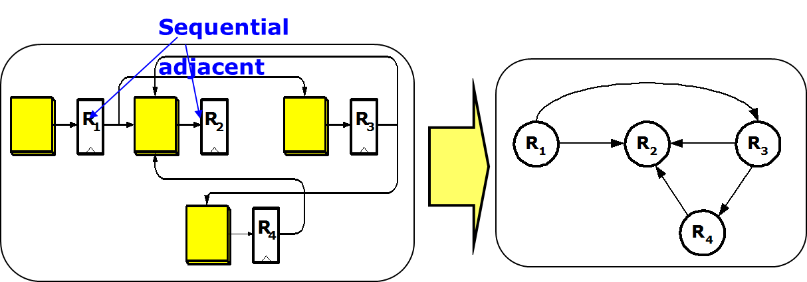
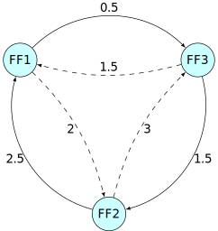
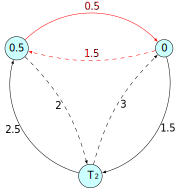
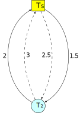
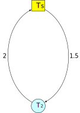
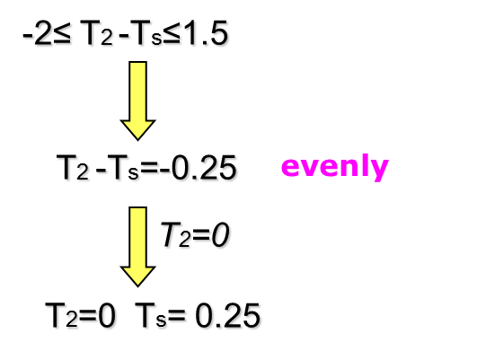
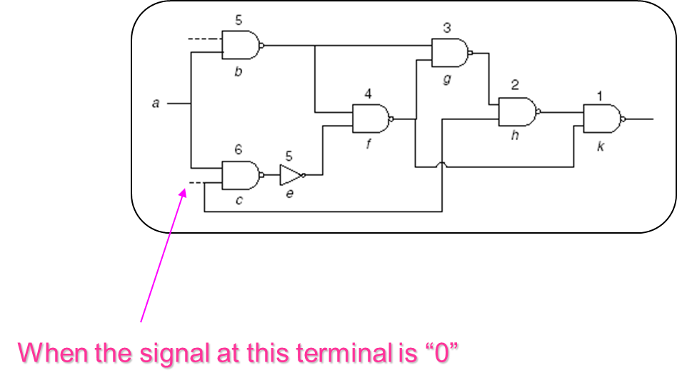
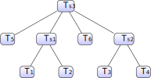

# Lecture 05a - ⌚ Clock Skew Scheduling Under Process Variations

@luk036

2022-10-19

## 📝 Abstract

The main topic of the lecture is clock skew scheduling under process variations. The lecture discusses various techniques and methods for optimizing clock skew in order to improve circuit performance or minimize timing failures.

The lecture begins with an overview of the problem and the background of clock skew scheduling. It then explains the concept of clock skew and the difference between zero skew and useful skew designs. The importance of meeting timing constraints, such as setup time and hold time, is discussed along with the potential issues that can occur if these constraints are violated.

The lecture presents different approaches to clock skew scheduling, such as traditional scheduling, yield-driven scheduling, and minimum cost-to-time ratio cycle formulation. It also explores various methods for finding the optimal clock period and the corresponding skew schedule, including linear programming and the use of the Bellman-Ford algorithm.

Further in the lecture, primitive solutions and their shortcomings are discussed, such as pre-allocating timing margins and utilizing least center error square (LCES) problem formulation. The lecture also presents more advanced techniques like Slack Maximization (EVEN) and Prop-based methods, which distribute slack along the most timing-critical cycle based on Gaussian models. The drawbacks of these methods are highlighted, particularly their assumptions about gate delay distributions.

Finally, the lecture discusses statistical static timing analysis (SSTA) and the use of statistical methods for accounting for process variations. The concept of the most critical cycle is introduced, and the lecture provides experimental results to demonstrate the effectiveness of the different clock skew scheduling techniques.

Overall, the lecture explores various techniques and methods for optimizing clock skew scheduling under process variations, highlighting the challenges and potential solutions to improve circuit performance or minimize timing failures.

## 🔑 Keywords

- Static timing analysis, STA 静态时序分析
- Statistical STA 统计静态时序分析
- Clock skew 时钟偏差/偏斜
- Zero skew design 零偏差设计
  - Critical paths 关键路径
  - Negative slack 负时序裕量
- Useful skew design 有效偏差设计
  - Critical cycles 关键环
  - Negative cycles 负环
- Clock skew scheduling ⌚ (CSS) 时钟偏差安排/规划
- Yield-driven CSS 产品率驱动时钟偏差安排

## 🗺️ Overview

- Background

- Problem formulation

- Traditional clock skew scheduling ⌚

- Yield-driven clock skew scheduling ⌚

- Minimum cost-to-time ratio cycle formulation

## Sequential Logic

- Local data path

  

## Sequential Logic (cont'd)

- Graph

  

## Clock Skew


- $T_\text{skew}(i,f) = t_i - t_f$, where
  - $t_i$: clock signal delay at the initial register
  - $t_f$: clock signal delay at the final register


## Timing Constraint

- Setup time constraint
  $$T_\text{skew}(i,f) \le T_\text{CP} - D_{if} - T_\text{setup} = u_{if}$$
  While this constraint destroyed, cycle time violation (zero
  clocking) occurs.

- Hold time constraint
  $$T_\text{skew}(i,f) \ge T_\text{hold} - d_{if} = l_{if}$$ While
  this constraint destroyed, race condition (double clocking) occurs.

## Zero skew vs. Useful skew

- Zero skew ($t_i = t_f$) : Relatively easy to implement.

- Useful skew. Improve:

  - The performance of the circuit by permitting a higher maximum
    clock frequency, or
  - The safety margins of the clock skew within the permissible
    ranges.

- Max./min. path delays are got from static timing analysis
  (STA).

## Timing Constraint Graph

- Create a graph by
  - replacing the hold time constraint with a _h-edge_ with cost
    $-(T_\text{hold} - d_{ij})$ from $\text{FF}_i$ to $\text{FF}_j$,
    and
  - replacing the setup time constraint with an s-edge with cost
    $T_\text{CP} - D_{ij} - T_\text{setup}$ from $\text{FF}_j$ to
    $\text{FF}_i$.
- Two sets of constraints stemming from clock skew definition:
  - The sum of skews for paths having the same starting and ending
    flip-flop to be the same;
  - The sum of clock skews of all cycles to be zero

## Timing Constraint Graph (TCG)


## Timing Constraint Graph (TCG)

Assume $T_\text{setup} = T_\text{hold}$ = 0

Clock period $T_\text{CP}$ is feasible if and only if current graph contains no
negative cost cycles.


## Minimize Clock Period

- Linear programming (LP) formulation

  $$
  \begin{array}{ll}
      \text{minimize}   & T_\text{CP} \\
      \text{subject to} & l_{ij} \leq T_i - T_j \leq u_{ij}
  \end{array}
  $$

  where $\text{FF}_i$ and $\text{FF}_j$ are sequential adjacent

- The above constraint condition is so-called **system of difference
  constraints** (see Introduction to Algorithms, MIT):

- 👉 Note: easy to check if a feasible solution exists by detecting
  negative cycle using for example Bellman-Ford algorithm.

## Basic Bellman-Ford Algorithm

.font-sm.mb-xs[

```matlab
function BellmanFord(list vertices, list edges, vertex source)
    // Step 1: initialize graph
    for each vertex i in vertices:
        if i is source then u[i] := 0
        else u[i] := inf
        predecessor[i] := null

    // Step 2: relax edges repeatedly
    for i from 1 to size(vertices)-1:
        for each edge (i, j) with weight d in edges:
            if u[j] > u[i] + d[i,j]:
                u[j] := u[i] + d[i,j]
                predecessor[j] := i

    // Step 3: check for negative-weight cycles
    for each edge (i, j) with weight d in edges:
        if u[j] > u[i] + d[i,j]:
            error "Graph contains a negative-weight cycle"
return u[], predecessor[]
```

]

## Problems with Bellman-Ford Algorithm

- The algorithm is originally used for finding the shortest paths.
- Detecting negative cycle is just a side product of the algorithm.
- The algorithm is simple, but...
  - detects negative cycle at the end only.
  - has to compute all `d[i,j]`.
  - Restart the initialization with `u[i] := inf`.
  - requests the input graph must have a source node.

Various improvements have been proposed extensively.

## Minimize clock period (I)

- Fast algorithm for solving the LP:
  - Use binary search method for finding the minimum clock period.
  - In each iteration, Bellman-Ford algorithm is called to detect if
    the timing constraint graph contains negative weighted edge
    cycle.
- 👉 Note: Originally Bellman-Ford algorithm is used to find a
  shortest-path of a graph.

## Minimize clock period (II)

- When the optimal clock period is solved, the corresponding skew
  schedule is got simultaneously.

- However, many skew values are on the bounds of feasible range.


## Yield-driven Clock Skew Scheduling

- When process variations increase more and more,
  timing-failure-induced yield loss becomes a significant problem.

- Yield-driven Clock Skew Scheduling becomes important.

- Primary goal of this scheduling is to minimize the yield loss
  instead of minimizing the clock period.

## Timing Yield Definition

- The circuit is called functionally correct if all the setup- and
  hold-time constraints are satisfied under a group of determinate
  process parameters.

- Timing Yield = (functional correct times) / sample number \* 100%

## Primitive solution (1)

- Pre-allocate timing margins (usually equivalent to maximum timing
  uncertainty) at both ends of the FSR's (Feasible Skew Region).
  $$l_{ij}  \leq s_{ij} \leq u_{ij} \implies l_{ij} + \Delta d \leq s_{ij}  \leq u_{ij} - \Delta d$$

- Then perform clock period optimization.

## Problems with this method

- The maximum timing uncertainty is too pessimistic. Lose some
  performance;

- $\Delta d$ is fixed; it does not consider data path delay
  differences between cycle edges.

## 📑 References (1)

- "Clock skew optimization", IEEE Trans. Computers, 1990

- "A graph-theoretic approach to clock skew optimization", ISCAS'94

- "Cycle time and slack optimization for VLSI-chips", ICCAD'99

- "Clock scheduling and clocktree construction for high performance
  Asics", ICCAD'03

- "ExtensiveSlackBalance: an Approach to Make Front-end Tools Aware of
  Clock Skew Scheduling", DAC'06

## Primitive solution (2)

- Formulate as LCES (Least Center Error Square) problem

  - A simple observation suggests that, to maximize slack, skew
    values should be chosen as close as possible to the middle
    points of their FSR's.

  $$l_{ij} + lm_k (u_{ij} - l_{ij}) \leq s_{ij}  \leq u_{ij} - um_k (u_{ij} - l_{ij})$$

  $$
  \begin{array}{ll}
    \text{minimize}   & \sum_k (0.5 - \min(lm_k, um_k) )^2 \\
    \text{subject to} & 0 \leq lm_k \leq 0.5 \\
    & 0 \leq um_k \leq 0.5
  \end{array}
  $$

## 📑 References (2)

- Graph-based algorithm
  - (J. L. Neves and E. G. Friedman, "Optimal Clock Skew Scheduling
    Tolerant to Process Variations", DAC'96)
- Quadratic Programming method
  - (I. S. Kourtev and E. G. Fredman, "Clock skew scheduling ⌚ for
    improved reliability via quadratic programming", ICCAD'99)

Shortcoming: might reduce some slacks to be zero to minimum **total** CES.
This is not optimal for yield.

## Primitive solution (3)

- Incremental Slack Distribution
  - (Xinjie Wei, Yici CAI and Xianlong Hong, "Clock skew scheduling ⌚
    under process variations", ISQED'06)
- Advantage: check all skew constraints

- Disadvantage: didn't take the path delay difference into
  consideration

## Minimum Mean Cycle Based

- **Even**: solve the slack optimization problem using a minimum mean
  cycle formulation.

- **Prop**: distribute slack along the most timing-critical cycle
  proportional to path delays

- **FP-Prop**: use sensitizable-critical-path search algorithm for
  clock skew scheduling.

## Slack Maximization (EVEN)

- Slack Maximization Scheduling

  $$
  \begin{array}{ll}
      \text{maximize}   & t \\
      \text{subject to} & T_j - T_i \leq \mu_{ij} - t
  \end{array}
  $$

- Equivalent to the so-called minimum mean cycle problem (MMC), where
  $$t^* = \frac{1}{|C|} \sum\limits_{(i,j)\in C} \mu_{ij}$$ $C$:
  critical cycle (first negative cycle)

- Can be solved efficiently by the above method.

## Even - iterative slack optimization

- Identify the circuit's most timing-critical cycle,

- Distribute the slack along the cycle,

- Freeze the clock skews on the cycle, and

- Repeat the process iteratively.

## Most timing-critical cycle



## Identify the timing-critical cycle

- Identify the circuit's most timing-critical cycle

- Solve the minimum mean-weight cycle problem by
  - Karp's algorithm
  - A. Dasdan and R.K.Gupta, "Faster Maximum and Minimum Mean Cycle
    Algorithms for System-Performance", TCAD'98.

## Distribute the slack

Distribute the slack evenly along the most timing-critical cycle.

 

## Freeze the clock skews (I)

Replace the critical cycle with super vertex.

 

## Freeze the clock skews (II)

 

To determine the optimal slacks and skews for the rest of the graph,
we replace the critical cycle with super vertex.

## Repeat the process (I)

 

## Repeat the process (II)

 

## Final result


- $\text{Skew}_{12}$ = 0.75
- $\text{Skew}_{23}$ = -0.25
- $\text{Skew}_{31}$ = -0.5

- $\text{Slack}_{12}$ = 1.75
- $\text{Slack}_{23}$ = 1.75
- $\text{Slack}_{31}$ = 1

where $\text{Slack}_{ij} = T_\text{CP} - D_{ij} - T_\text{setup} - \text{Skew}_{ij}$

## Problems with Even

- Assume all variances are the same.
- However, the timing uncertainty of a long combinational path is
  usually larger than that of a shorter path.
- Therefore, the even slack distribution along timing-critical cycles
  performed by **Even** is not optimal for yield if data path delays
  along the cycles are different.

## Prop-Based on Gaussian model (I)

- Assuming there are $n$ gates with delay $N(\mu,\sigma^2)$ in a path,
  then this path delay is $N(n\mu,n\sigma^2)$
- Distribute slack along the most timing-critical cycle, according to
  the square root of each edge's path delays (???).
- To achieve this, update the weights of s-edges and h-edges:
  $$
  \begin{array}{ll}
  T_\text{CP} - (D_{ij} + \alpha \sqrt{D_{ij} } \sigma) - T_\text{setup} \\
  -T_\text{hold} + (d_{ij} - \alpha \sqrt{d_{ij} } \sigma)
  \end{array}
  $$
  where $\alpha$ ensures a minimum timing margin for each timing constraint.

## Prop-Based on Gaussian model (II)

- Given a specific clock period $T_\text{CP}$, we gradually increase $\alpha$ and
  use the Bellman-Ford algorithm to detect whether it is still feasible.
- After finding the maximum $\alpha$, the edges along the most
  timing-critical cycle will have slacks equal to the pre-allocated
  timing margins.
- Many edges in a circuit have sufficiently large slack. Therefore, we
  can perform proportional slack distribution only for the most
  timing-critical cycle. Assign the rest of skews using **Even**.

## Problems with Prop

- Assume all gate delay has the same distribution.
- Not justify using the square root of path delay for timing margin.

## FP-Prop (I)


False path

## FP-Prop (II)

- If we do not consider false path, some non timing-critical cycles
  become timing-critical. Then, more slacks are distributed to these
  cycles, but the slacks in actually timing-critical cycles are not
  sufficient. As a result, the overall timing yield decreases.

## Problems with FP-Prop

- Same problems as Prop

## 🧪 Experimental Results


## 📈 Statistical Method

- Setup time constraint

  $$T_\text{skew}(i,f) \le T_\text{CP} - \tilde{D}_{if} - T_\text{setup}$$

- Hold time constraint

  $$T_\text{skew}(i,f) \ge T_\text{hold} - \tilde{d}_{if}$$

  where $\tilde{D}_{if} \text{ and } \tilde{d}_{if}$
  are random variable under process variations.

## 📈 Statistical TC Graph


After SSTA, edge weight is represented as a pair of value (mean, variance).

## Most Critical Cycle

- Traditional criteria: minimum mean cycle
  $$\min_{C \in \mathcal{C} } \frac{\sum_{(i,j)\in C} \mu_{ij} }{|C|}$$

- 🆕 New criteria:
  $$\min_{C \in \mathcal{C} } \frac{\sum_{(i,j)\in C} \mu_{ij} }{\sum_{(i,j)\in C} \sigma_{ij} }$$

  (We show the correctness later)

## Slack Maximization (C-PROP)

- Slack Maximization Scheduling $$\begin{array}{ll}
        \text{maximize} & t \\
        \text{subject to} & T_j - T_i \leq \mu_{ij} - \sigma_{ij} t
    \end{array}$$
- Equivalent to the _minimum cost-to-time ratio cycle_ problem (MMC), where:
  - $t^* = \sum_{(i,j)\in C} \mu_{ij} / \sum_{(i,j)\in C} \sigma_{ij}$
  - $C$: critical cycle (first negative cycle)

## Probability Observation

- Prob(timing failure) turns out to be an Error function that solely
  depends on this ratio. Therefore, it is justified to use this ratio
  as critical criteria.

## Whole flow

- After determining the clock arrival time at each vertex in the most
  critical cycle, the cycle is replaced with a super vertex $v'$.

- In-edge $(u, v)$ from outside vertex $u$ to cycle member $v$ is
  replaced by an in-edge $(u, v')$ with weight mean
  $\mu(u, v) - T_v$.

- Out-edge $(v, u)$ is replaced by out-edge $(v', u)$ with
  weight mean $\mu(v, u) + T_v$. However, the variance of the edge
  weight is not changed. And parallel edges can be remained.

- Repeat the process iteratively until the graph is reduced to a
  single super vertex, or the edges number is zero.

## Data structure



Final result: $T_1=T_1+T_{s_1}+T_{s_3}$

## Advantages of This Method

- Justified by probability observation.
- Fast algorithm exists for minimum cost-to-time ratio cycle problem.
- Reduce to Even when all variances are equal.
- When a variance tends to zero, it makes sense that only minimal
  slack is assigned to this variable, and hence others can be assigned
  more.

## Results

\

## 📑 Main Reference

- Jeng-Liang Tsai, Dong Hyum Baik, Charlie Chung-Ping Chen, and Kewal
  K. Saluja, "Yield-Driven, False-Path-Aware Clock Skew Scheduling",
  IEEE Design & Test of Computers, May-June 2005
