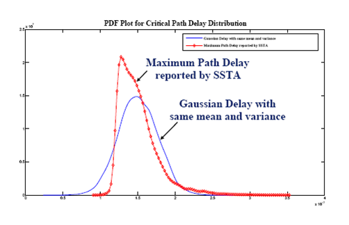
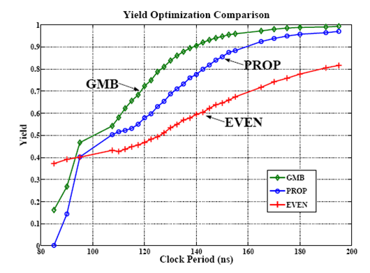

# Lecture 05b - ⌚ Clock Skew Scheduling Under Process Variations (2)

## Overview 📋

-   A Review of CSS Issues

-   General Formulation

-   Yield-driven Clock Skew Scheduling

-   Numerical Results

### Minimum Clock Period Problem

-   Linear programming (LP) formulation $$\begin{array}{ll}
      \text{minimize} & {\color{coral}T_\text{CP}} \\
      \text{subject to} & {\color{coral}l}_{ij} \leq {\color{green}T}_i - {\color{green}T}_j \leq {\color{coral}u}_{ij}
    \end{array}$$ where ${\color{salmon}\text{FF}}_i$ and ${\color{salmon}\text{FF}}_j$ are
  sequentially adjacent to each other.

-   The above constraints are called _system of difference
  constraints_ (see Introduction to Algorithms, MIT):
  -   Key: it is easy to check if a feasible solution exists by detecting
    negative cycles using the Bellman-Ford algorithm.

### System of Difference Constraints

-   In some cases, you may need to do some transformations, e.g.
  -   ${\color{green}T}_i \leq \min_k \{{\color{green}T}_k + {\color{coral}a}_{ik}\} \rightarrow {\color{green}T}_i - {\color{green}T}_k \leq {\color{coral}a}_{ik}, \; \forall k$
  -   ${\color{green}T}_i \geq \max_k \{{\color{green}T}_k + {\color{coral}b}_{ik}\} \rightarrow {\color{coral}b}_{ik} \leq {\color{green}T}_i - {\color{green}T}_k, \; \forall k$

### Slack Maximization (EVEN)

-   Slack Maximization Scheduling $$\begin{array}{ll}
      \text{maximum}    & {\color{green}t} \\
      \text{subject to} & {\color{green}T}_j - {\color{green}T}_i \leq {\color{coral}\mu}_{ij} - {\color{green}t}
    \end{array}$$ (👉 Note: ${\color{coral}\mu}_{ij} \text{ is not equal to } {\color{coral}\mu}_{ji}$)

-   is equivalent to the so-called _minimum mean cycle problem_ (MMC),
  where:

  -   ${\color{green}t}^* = \sum_{(i,j) \in {\color{lime}C}} {\color{coral}\mu}_{ij} / |{\color{lime}C}|$,
  -   ${\color{lime}C}$: critical cycle (first negative cycle)

-   Can be efficiently solved by the parametric shortest path methods.

### Slack Maximization (C-PROP)

-   Slack Maximization Scheduling $$\begin{array}{ll}
      \text{maximum} & {\color{green}t} \\
      \text{subject to} & {\color{green}T}_j - {\color{green}T}_i \leq {\color{coral}\mu}_{ij} - {\color{coral}\sigma}_{ij} {\color{green}t}
    \end{array}$$ (we show the correctness later)

-   is equivalent to the _minimum cost-to-time ratio cycle problem_ (MCR), where:
  -   ${\color{green}t}^* = \sum_{(i,j) \in {\color{lime}C}} {\color{coral}\mu}_{ij} / \sum_{(i,j) \in {\color{lime}C}} {\color{coral}\sigma}_{ij}$,
  -   ${\color{lime}C}$: critical cycle

### General Formulation

-   General form: $$\begin{array}{ll}
      \text{maximum} & g(t) \\
      \text{subject to} & {\color{green}T}_i - {\color{green}T}_j \leq f_{ij}(t), \; \forall (i,j) \in {\color{lime}E}
    \end{array}$$ where $f_{ij}(t)$ a linear function that represents
  various problems defined above.

| Problem | $g(t)$ | $f_{ij}(t)$ (setup)                                 | $f_{ji}(t)$ (hold)                        |
| ------- | ------ | --------------------------------------------------- | ----------------------------------------- |
| Min. CP | $-{\color{green}t}$   | ${\color{green}t} - {\color{coral}D}_{ij} - {\color{coral}T_\text{setup}}$                       | $-{\color{coral}T_\text{hold}} + {\color{coral}d}_{ij}$                 |
| EVEN    | ${\color{green}t}$    | ${\color{coral}T_\text{CP}} - {\color{coral}D}_{ij} - {\color{coral}T_\text{setup}} - {\color{green}t}$         | $-{\color{coral}T_\text{hold}} + {\color{coral}d}_{ij} - {\color{green}t}$             |
| C-PROP  | ${\color{green}t}$    | ${\color{coral}T_\text{CP}}-{\color{coral}D}_{ij}-{\color{coral}T_\text{setup}} - {\color{coral}\sigma}_{ij} {\color{green}t}$ | $-{\color{coral}T_\text{hold}} + {\color{coral}d}_{ij} - {\color{coral}\sigma}_{ij} {\color{green}t}$ |

### General Formulation (cont'd)

-   In fact, $g(t)$ and $f_{ij}(t)$ are not necessarily linear functions.
  Any monotonic decreasing function will do.

-   Theorem: if $g(t)$ and $f_{ij}(t)$ are _monotonic decreasing_
  functions for all $i$ and $j$, then there is a unique solution to the problem.
  (prove later).

-   Question 1: Does this generalization have any application?

-   Question 2: What if $g(t)$ and $f_{ij}(t)$ are convex but not monotone?

### 🔕 Non-Gaussian Distribution

-   65nm and below, the path delay is likely to have a non-Gaussian distribution:

    👉 Note: central limit theorem does not apply because

  -   random variables are correlated (why?)
  -   delays are non-negative

### Timing Yield Maximization

-   Formulation:

  -   $\max\{\min\{\text{Pr}\{{\color{green}T}_j - {\color{green}T}_i \leq {\color{coral}\tilde{W}}_{ij} \}\}\}$
  -   is not exactly timing yield but reasonable.

-   It is equivalent to:

  $$
  \begin{array}{ll}
    \text{maximum} & {\color{green}t} \\
    \text{subject to} & {\color{green}T}_i - {\color{green}T}_j \le {\color{coral}T_\text{CP}} - F^{-1}_{ji}({\color{green}t}) \\
      & {\color{green}T}_j - {\color{green}T}_i \le F^{-1}_{ij}(1 - {\color{green}t})
  \end{array}
  $$

    where $F_{ij}(\cdot) \text{ is CDF of } {\color{coral}\tilde{W}}_{ij}$

-   Luckily, any CDF must be a monotonic increasing function.

### 📈 Statistical Interpretations of C-PROP

-   Reduce to C-PROP when ${\color{coral}\tilde{W}}_{ij}$ is Gaussian, or precisely

    $$F_{ij}(x) = K((x - {\color{coral}\mu}_{ij})/{\color{coral}\sigma}_{ij})$$

-   EVEN: identical distribution up to shifting

    $$F_{ij}(x) = H(x - {\color{coral}\mu}_{ij})$$

    Not necessarily worse than C-PROP

### ⚖️ Comparison

\

### Three Solving Methods in General

-   Binary search based
  -   Local convergence is slow.
-   Cycle based
  -   Idea: if a solution is infeasible, there exists a negative cycle
    which can always be "zero-out" with minimum effort (proof of
    optimality)
-   🛤️ Path based
  -   Idea: if a solution is feasible, there exists a (shortest) path
    from where we can always improve the solution.

### Parametric Shortest Path Algorithms

-   Lawler's algorithm (binary search)

-   Howard's algorithm (based on cycle cancellation)

-   Hybrid method

-   Improved Howard's algorithm

-   Input:

  -   Interval [tmin, tmax] that includes t\*
  -   Tol: tolerance
  -   G({\color{salmon}V}, {\color{lime}E}): timing graph

-   Output:
  -   Optimal t\* and its corresponding critical cycle C

## ⌚ Clock Skew Scheduling for Unimodal Distributed Delay Models

@luk036 👨‍💻 · 2026 📅

### Useful Skew Design: Why and Why not?

Bad 👎:

-   Needs more engineer training.
-   Balanced clock-trees are harder to build.
-   Don't know how to handle process variation, multi-corner multi-mode, ..., etc.

Good 👍:

If you do it right,

-   spend less time struggling about timing, or
-   get better chip performance or yield.

#### What can modern STA tools do today?

-   Manually assign clock arrival times to registers (all zeros by default)
-   Grouping: Non-critical parts can be grouped as a single unit.
  In other words, there is no need for full-chip optimization.
-   Takes care of multi-cycle paths, slew rate, clock-gating, false paths etc. All we need are the reported **slacks**.
-   Provide 3-sigma statistics for slacks/path delays (POCV).
-   However, the full probability density function and correlation information are not available.

#### Unimodality

-   In statistics, a unimodal probability distribution or unimodal distribution is a probability distribution with a single peak.

-   In continuous distributions, unimodality can be defined through the behavior of the cumulative distribution function (cdf). If the cdf is _convex_ for $x < {\color{coral}m}$ and _concave_ for $x > {\color{coral}m}$, then the distribution is unimodal, ${\color{coral}m}$ being the _mode_.

-   📚 Examples
  -   Normal distribution
  -   Log-normal distribution
  -   Log-logistic distribution
  -   Weibull distribution

#### Quantile function

-   The quantile function $z_p$ of a distribution is the inverse of the cumulative distribution function $\Phi^{-1}({\color{coral}p})$.

-   Close-form expression for some unimodal distributions:

  -   Normal: ${\color{coral}\mu} + {\color{coral}\sigma}\sqrt 2 \text{erf}^{-1}(2{\color{coral}p} - 1)$
  -   Log-normal: $\exp\left( {\color{coral}\mu} + {\color{coral}\sigma}\sqrt 2 \text{erf}^{-1}(2{\color{coral}p} - 1)\right)$
  -   Log-logistic: ${\color{coral}\alpha}\left( \frac{{\color{coral}p}}{1-{\color{coral}p}} \right)^{1/{\color{coral}\beta}}$
  -   Weibull: ${\color{coral}\lambda} {(-\ln(1-{\color{coral}p}))}^{1/{\color{coral}k}}$

-   For log-normal distribution:
  -   mode: $\exp({\color{coral}\mu} - {\color{coral}\sigma}^2)$
  -   CDF at mode: $1/2 (1 + \text{erf}(-{\color{coral}\sigma} / \sqrt 2))$

#### Normal vs. Log-normal Delay Model

Normal/Gaussian:

-   Convertible to a linear network optimization problem.
-   Supported over the whole real line. Negative delays are possible.
-   Symmetric, obviously not adaptable to the 3-sigma results.

Log-normal:

-   Non-linear, but still can be solved efficiently with network optimization.
-   Supported only on the positive side.
-   Non-symmetric, may be able to fit into the 3-sigma results. (???)

#### Setup- and Hold-time Constraints

-   Let $T_\text{skew}(i,f) = {\color{green}t}_i - {\color{green}t}_f$, where
  -   ${\color{green}t}_i$: clock signal delay at the initial register
  -   ${\color{green}t}_f$: clock signal delay at the final register
  -   Assume in zero-skew, i.e. $T_\text{skew}(i,f) = 0$, the reported setup- and hold-time slacks are _${\color{coral}S}_{if}$
    and _${\color{coral}H}\_{if}$ respectively.
-   Then, in useful skew design:
  $$T_\text{skew}(i,f) \le {\color{coral}S}_{if} \implies {\color{green}t}_i - {\color{green}t}_f \le {\color{coral}S}_{if}$$
  $$T_\text{skew}(i,f) \ge -{\color{coral}H}_{if} \implies {\color{green}t}_f - {\color{green}t}_i \le {\color{coral}H}_{if} $$
-   In principle, ${\color{coral}H}_{if} \text{ and } {\color{coral}T_\text{CP}} - {\color{coral}S}_{if}$ represent the minimum- and maximum-path delay, and should be always greater than zero.
-   Let ${\color{coral}D}_{if} = {\color{coral}T_\text{CP}} - {\color{coral}S}_{if}$

#### Yield-driven Optimization

-   Max-Min Formulation:

  -   $\max\{\min\{ \text{Pr}\{{\color{green}t}_j - {\color{green}t}_i \le {\color{coral}\tilde{W}}_{ij} \}\}\}$,
  -   No need for correlation information between paths.
  -   Not exactly the timing yield objective but reasonable.

-   Equivalent to:

$$
\begin{array}{ll}
  \text{maximum} & {\color{red}\beta} \\
  \text{subject to} & \text{Pr}\{{\color{green}t}_i - {\color{green}t}_j \le {\color{coral}T_\text{CP}} - {\color{coral}\tilde{D}}_{ij} \} \ge {\color{red}\beta} \\
  & \text{Pr}\{{\color{green}t}_j - {\color{green}t}_i \le {\color{coral}\tilde{H}}_{ij} \} \ge {\color{red}\beta}
\end{array}
$$

-   or:

$$
\begin{array}{ll}
  \text{maximum} & {\color{red}\beta} \\
  \text{subject to} & {\color{green}t}_i - {\color{green}t}_j \le {\color{coral}T_\text{CP}} - \Phi^{-1}_{{\color{coral}D}_{ij}\ }({\color{red}\beta}) \\
    & {\color{green}t}_j - {\color{green}t}_i \le \Phi^{-1}_{{\color{coral}H}_{ij}\ }(1 - {\color{red}\beta})
\end{array}
$$

#### Yield-driven Optimization (cont'd)

-   In general, Lawler's algorithm (binary search) can be used.
-   Depending on the distribution, there are several other ways to solve problem.

#### Gaussian Delay (Bell shape 🔔) Model

-   Reduce to:

$$
\begin{array}{ll}
  \text{maximum} & {\color{red}\beta} \\
  \text{subject to} & {\color{green}t}_i - {\color{green}t}_j \le {\color{coral}T_\text{CP}} - ({\color{coral}\mu^D_{ij}} + {\color{coral}\sigma^D_{ij}} {\color{red}\sqrt 2\text{erf}^{-1}(2\beta - 1)} ) \\
    & {\color{green}t}_j - {\color{green}t}_i \le {\color{coral}\mu^H_{ij}} + {\color{coral}\sigma^H_{ij}} {\color{red}\sqrt 2 \text{erf}^{-1}(2(1 - \beta)-1)}
\end{array}
$$

-   Linearization. Since $\text{erf}^{-1}(\cdot)$ is anti-symmetric and monotonic, we have:

$$
\begin{array}{ll}
  \text{maximum} & {\color{red}\beta'} \\
  \text{subject to} & {\color{green}t}_i - {\color{green}t}_j \le {\color{coral}T_\text{CP}} - {\color{coral}\mu^D_{ij}} - {\color{coral}\sigma^D_{ij}} {\color{red}\beta'} \\
    & {\color{green}t}_j - {\color{green}t}_i \le {\color{coral}\mu^H_{ij}} - {\color{coral}\sigma^H_{ij}} {\color{red}\beta'}
\end{array}
$$

-   is equivalent to the minimum cost-to-time ratio cycle (linear).

-   However, actual path delay distributions are non-Gaussian.

#### Log-normal Delay Model

-   Reduce to:

$$
\begin{array}{ll}
  \text{maximum} & {\color{red}\beta} \\
  \text{subject to} & {\color{green}t}_i - {\color{green}t}_j \le {\color{coral}T_\text{CP}} - \exp({\color{coral}\mu^D_{ij}} + {\color{coral}\sigma^D_{ij}} {\color{red}\sqrt 2\text{erf}^{-1}(2\beta - 1)} ) \\
    & {\color{green}t}_j - {\color{green}t}_i \le \exp({\color{coral}\mu^H_{ij}} + {\color{coral}\sigma^H_{ij}} {\color{red}\sqrt 2 \text{erf}^{-1}(2(1 - \beta)-1)})
\end{array}
$$

-   Since $\text{erf}^{-1}(\cdot)$ is anti-symmetric and monotonic, we have:

$$
\begin{array}{ll}
  \text{maximum} & {\color{red}\beta'} \\
  \text{subject to} & {\color{green}t}_i - {\color{green}t}_j \le {\color{coral}T_\text{CP}} - \exp({\color{coral}\mu^D_{ij}} + {\color{coral}\sigma^D_{ij}} {\color{red}\beta'}) \\
    & {\color{green}t}_j - {\color{green}t}_i \le \exp({\color{coral}\mu^H_{ij}} - {\color{coral}\sigma^H_{ij}} {\color{red}\beta'})
\end{array}
$$

-   Bypass evaluating error function. Non-linear and non-convex, but still can be solved efficiently by for example binary search on ${\color{red}\beta'}$.

#### Weibull Delay Model

-   Reduce to:

$$
\begin{array}{ll}
  \text{maximum} & {\color{red}\beta} \\
  \text{subject to} & {\color{green}t}_i - {\color{green}t}_j \le {\color{coral}T_\text{CP}} - {\color{coral}\lambda^D_{ij}} (-\ln(1-{\color{red}\beta}))^{1/{\color{coral}k^D_{ij}} }\\
  & {\color{green}t}_j - {\color{green}t}_i \le {\color{coral}\lambda^H_{ij}} (-\ln({\color{red}\beta}))^{1/{\color{coral}k^H_{ij}}\ }
\end{array}
$$
