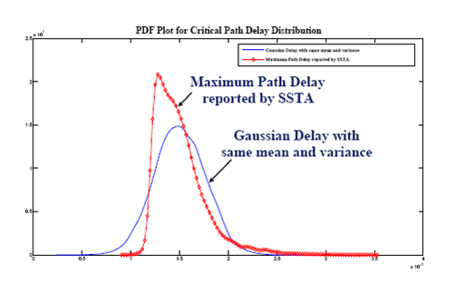

Lecture 05b - ⏳ Clock Skew Scheduling Under Process Variations (2)
================================================================

🗺️ Overview
------

-   A Review of CSS Issues

-   General Formulation

-   Yield-driven Clock Skew Scheduling

-   Numerical Results

Minimum Clock Period Problem
----------------------------

-   Linear programming (LP) formulation $$\begin{array}{ll}
      \text{minimize}   & T_\text{CP} \\
      \text{subject to} & l_{ij} \leq T_i - T_j \leq u_{ij}
    \end{array}$$ where $\text{FF}_i$ and $\text{FF}_j$ are
    sequentially adjacent to each other.

-   The above constraints are called *system of difference
    constraints* (see Introduction to Algorithms, MIT):
    -   Key: it is easy to check if a feasible solution exists by detecting
        negative cycles using the Bellman-Ford algorithm.

System of Difference Constraints
--------------------------------

-   In some cases, you may need to do some transformations, e.g.
    -   $T_i \leq \min_k \{T_k + a_{ik}\} \rightarrow T_i - T_k \leq a_{ik}, \; \forall k$
    -   $T_i \geq \max_k \{T_k + b_{ik}\} \rightarrow b_{ik} \leq T_i - T_k, \; \forall k$

Slack Maximization (EVEN)
-------------------------

-   Slack Maximization Scheduling $$\begin{array}{ll}
      \text{maximum}    & t \\
      \text{subject to} & T_j - T_i \leq \mu_{ij} - t
    \end{array}$$ (👉 Note: $\mu_{ij} \text{ is not equal to } \mu_{ji}$)

-   is equivalent to the so-called *minimum mean cycle problem* (MMC),
    where:
    -   $t^* = \sum_{(i,j) \in C} \mu_{ij} / |C|$,
    -   $C$: critical cycle (first negative cycle)

-   Can be efficiently solved by the parametric shortest path methods.

Slack Maximization (C-PROP)
---------------------------

-   Slack Maximization Scheduling $$\begin{array}{ll}
      \text{maximum}   & t \\
      \text{subject to} & T_j - T_i \leq \mu_{ij} - \sigma_{ij} t
    \end{array}$$ (we show the correctness later)

-   is equivalent to the *minimum cost-to-time ratio problem* (MCR), where:
    -   $t^* = \sum_{(i,j) \in C} \mu_{ij} / \sum_{(i,j) \in C} \sigma_{ij}$,
    -   $C$: critical cycle

General Formulation
-------------------

-   General form: $$\begin{array}{ll}
      \text{maximum}   & g(t) \\
      \text{subject to} & T_i - T_j \leq f_{ij}(t), \; \forall (i,j) \in E
    \end{array}$$ where $f_{ij}(t)$ a linear function that represents
    various problems defined above.

| Problem | $g(t)$ | $f_{ij}(t)$ (setup)                                 | $f_{ji}(t)$ (hold)                        |
| ------- | ------ | --------------------------------------------------- | ----------------------------------------- |
| Min. CP | $-t$   | $t - D_{ij} - T_\text{setup}$                       | $-T_\text{hold} + d_{ij}$                 |
| EVEN    | $t$    | $T_\text{CP} - D_{ij} - T_\text{setup} - t$         | $-T_\text{hold} + d_{ij} - t$             |
| C-PROP  | $t$    | $T_\text{CP}-D_{ij}-T_\text{setup} - \sigma_{ij} t$ | $-T_\text{hold} + d_{ij} - \sigma_{ij} t$ |

General Formulation (cont'd)
----------------------------

-   In fact, $g(t)$ and $f_{ij}(t)$ are not necessarily linear functions.
    Any monotonic decreasing function will do.

-   Theorem: if $g(t)$ and $f_{ij}(t)$ are *monotonic decreasing*
    functions for all $i$ and $j$, then there is a unique solution to the problem.
    (prove later).

-   Question 1: Does this generalization have any application?

-   Question 2: What if $g(t)$ and $f_{ij}(t)$ are convex but not monotone?

Non-Gaussian Distribution
-------------------------

-   65nm and below, the path delay is likely to have a non-Gaussian distribution:

    👉 Note: central limit theorem does not apply because
       - random variables are correlated (why?)
       - delays are non-negative

Timing Yield Maximization
-------------------------

-   Formulation:
    -   $\max\{\min\{\text{Pr}\{T_j - T_i \leq \tilde{W}_{ij} \}\}\}$
    -   is not exactly timing yield but reasonable.

-   It is equivalent to: 
$$\begin{array}{ll}
  \text{maximum} & t \\
  \text{subject to} & T_i - T_j \le T_\text{CP} - F^{-1}_{ji}(t) \\
    & T_j - T_i \le F^{-1}_{ij}(1 - t)
\end{array}$$
where $F_{ij}(\cdot) \text{ is CDF of } \tilde{W}_{ij}$

-   Luckily, any CDF must be a monotonic increasing function. 

Statistical Interpretations of C-PROP
-------------------------------------

-   Reduce to C-PROP when $\tilde{W}_{ij}$ is Gaussian, or precisely

    $$F_{ij}(x) = K((x - \mu_{ij})/\sigma_{ij})$$

-   EVEN: identical distribution up to shifting

    $$F_{ij}(x) = H(x - \mu_{ij})$$

    Not necessarily worse than C-PROP

Comparison
----------

\

Three Solving Methods in General
--------------------------------

-   Binary search based
    -   Local convergence is slow.
-   Cycle based
    -   Idea: if a solution is infeasible, there exists a negative cycle
        which can always be "zero-out" with minimum effort (proof of
        optimality)
-   Path based
    -   Idea: if a solution is feasible, there exists a (shortest) path
        from where we can always improve the solution.

Parametric Shortest Path Algorithms
-----------------------------------

-   Lawler's algorithm (binary search)

-   Howard's algorithm (based on cycle cancellation)

-   Hybrid method

-   Improved Howard's algorithm

-   Input:
    -   Interval [tmin, tmax] that includes t\*
    -   Tol: tolerance
    -   G(V, E): timing graph

-   Output:
    -   Optimal t\* and its corresponding critical cycle C

# ⏳ Clock Skew Scheduling for Unimodal Distributed Delay Models

@luk036

2022-10-26

## Useful Skew Design: Why and Why not?

Bad 👎:

- Needs more engineer training.
- Balanced clock-trees are harder to build.
- Don't know how to handle process variation, multi-corner multi-mode, ..., etc.

Good 👍:

If you do it right,

- spend less time struggling about timing, or
- get better chip performance or yield.

## What can modern STA tools do today? 

- Manually assign clock arrival times to registers (all zeros by default)
- Grouping: Non-critical parts can be grouped as a single unit.
  In other words, there is no need for full-chip optimization.
- Takes care of multi-cycle paths, slew rate, clock-gating, false paths etc. All we need are the reported **slacks**.
- Provide 3-sigma statistics for slacks/path delays (POCV).
- However, the full probability density function and correlation information are not available.

## Unimodality

- In statistics, a unimodal probability distribution or unimodal distribution is a probability distribution with a single peak. 

- In continuous distributions, unimodality can be defined through the behavior of the cumulative distribution function (cdf). If the cdf is *convex* for $x < m$ and *concave* for $x > m$, then the distribution is unimodal, $m$ being the *mode*.

- Examples
  - Normal distribution
  - Log-normal distribution
  - Log-logistic distribution
  - Weibull distribution

## Quantile function

- The quantile function $z_p$ of a distribution is the inverse of the cumulative distribution function $\Phi^{-1}(p)$.

- Close-form expression for some unimodal distributions:
  - Normal: $\mu + \sigma\sqrt 2 \text{erf}^{-1}(2p - 1)$
  - Log-normal: $\exp\left( \mu + \sigma\sqrt 2 \text{erf}^{-1}(2p - 1)\right)$
  - Log-logistic: $\alpha\left( \frac{p}{1-p} \right)^{1/\beta}$ 
  - Weibull: $\lambda {(-\ln(1-p))}^{1/k}$

- For log-normal distribution:
  - mode: $\exp(\mu - \sigma^2)$
  - CDF at mode: $1/2 (1 + \text{erf}(-\sigma / \sqrt 2))$

## Normal vs. Log-normal Delay Model

Normal/Gaussian:

- Convertible to a linear network optimization problem.
- Supported over the whole real line. Negative delays are possible.
- Symmetric, obviously not adaptable to the 3-sigma results.

Log-normal:

- Non-linear, but still can be solved efficiently with network optimization.
- Supported only on the positive side.
- Non-symmetric, may be able to fit into the 3-sigma results. (???)

## Setup- and Hold-time Constraints

- Let $T_\text{skew}(i,f) = t_i - t_f$, where
  - $t_i$: clock signal delay at the initial register
  - $t_f$: clock signal delay at the final register
  - Assume in zero-skew, i.e. $T_\text{skew}(i,f) = 0$, the reported setup- and hold-time slacks are _$S_{if}$
    and _$H_{if}$ respectively.
- Then, in useful skew design:
    $$T_\text{skew}(i,f) \le  S_{if} \implies t_i - t_f \le S_{if}$$
    $$T_\text{skew}(i,f) \ge  -H_{if} \implies t_f - t_i \le H_{if} $$
- In principle, $H_{if} \text{ and } T_\text{CP} - S_{if}$ represent the minimum- and maximum-path delay, and should be always greater than zero.
- Let $D_{if} = T_\text{CP} - S_{if}$

## Yield-driven Optimization

- Max-Min Formulation:
  - $\max\{\min\{ \text{Pr}\{t_j - t_i \le \tilde{W}_{ij} \}\}\}$,
  - No need for correlation information between paths.
  - Not exactly the timing yield objective but reasonable.

- Equivalent to:

$$\begin{array}{ll}
  \text{maximum} & \beta \\
  \text{subject to} & \text{Pr}\{t_i - t_j \le T_\text{CP} - \tilde{D}_{ij} \} \ge \beta \\
  & \text{Pr}\{t_j - t_i \le \tilde{H}_{ij} \} \ge \beta
\end{array}$$

- or:

$$\begin{array}{ll}
  \text{maximum} & \beta \\
  \text{subject to} & t_i - t_j \le T_\text{CP} - \Phi^{-1}_{D_{ij}\ }(\beta) \\
    & t_j - t_i \le \Phi^{-1}_{H_{ij}\ }(1 - \beta)
\end{array}$$

## Yield-driven Optimization (cont'd)

- In general, Lawler's algorithm (binary search) can be used.
- Depending on the distribution, there are several other ways to solve problem.

## Gaussian Delay Model

- Reduce to:

$$\begin{array}{ll}
  \text{maximum} & \beta \\
  \text{subject to} & t_i - t_j \le T_\text{CP} - (\mu^D_{ij} + \sigma^D_{ij} {\color{red}\sqrt 2\text{erf}^{-1}(2\beta - 1)} ) \\
    & t_j - t_i \le \mu^H_{ij} + \sigma^H_{ij} {\color{red}\sqrt 2 \text{erf}^{-1}(2(1 - \beta)-1)}
\end{array}$$

- Linearization. Since $\text{erf}^{-1}(\cdot)$ is anti-symmetric and monotonic, we have:

$$\begin{array}{ll}
  \text{maximum} & {\color{red}\beta'} \\
  \text{subject to} & t_i - t_j \le T_\text{CP} - \mu^D_{ij} - \sigma^D_{ij} {\color{red}\beta'} \\
    & t_j - t_i \le \mu^H_{ij} - \sigma^H_{ij} {\color{red}\beta'}
\end{array}$$

- is equivalent to the minimum cost-to-time ratio (linear).

- However, actual path delay distributions are non-Gaussian.

## Log-normal Delay Model

- Reduce to:

$$\begin{array}{ll}
  \text{maximum} & \beta \\
  \text{subject to} & t_i - t_j \le T_\text{CP} - \exp(\mu^D_{ij} + \sigma^D_{ij} {\color{red}\sqrt 2\text{erf}^{-1}(2\beta - 1)} ) \\
    & t_j - t_i \le \exp(\mu^H_{ij} + \sigma^H_{ij} {\color{red}\sqrt 2 \text{erf}^{-1}(2(1 - \beta)-1)})
\end{array}$$

- Since $\text{erf}^{-1}(\cdot)$ is anti-symmetric and monotonic, we have:

$$\begin{array}{ll}
  \text{maximum} & {\color{red}\beta'} \\
  \text{subject to} & t_i - t_j \le T_\text{CP} - \exp(\mu^D_{ij} + \sigma^D_{ij} {\color{red}\beta'}) \\
    & t_j - t_i \le \exp(\mu^H_{ij} - \sigma^H_{ij} {\color{red}\beta'})
\end{array}$$

- Bypass evaluating error function. Non-linear and non-convex, but still can be solved efficiently by for example binary search on $\beta'$.

## Weibull Delay Model

- Reduce to:

$$\begin{array}{ll}
  \text{maximum} & \beta \\
  \text{subject to} & t_i - t_j \le T_\text{CP} - \lambda^D_{ij} (-\ln(1-\beta))^{1/k^D_{ij} }\\
  & t_j - t_i \le \lambda^H_{ij} (-\ln(\beta))^{1/k^H_{ij}\ } 
\end{array}$$

