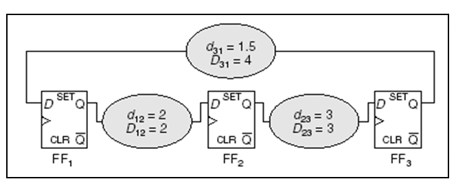
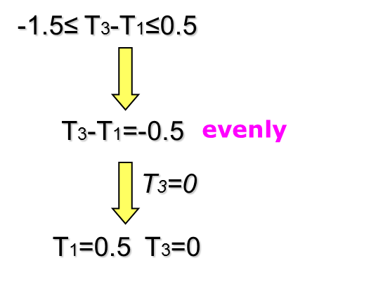
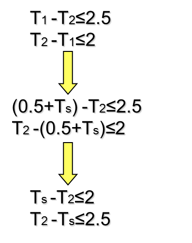
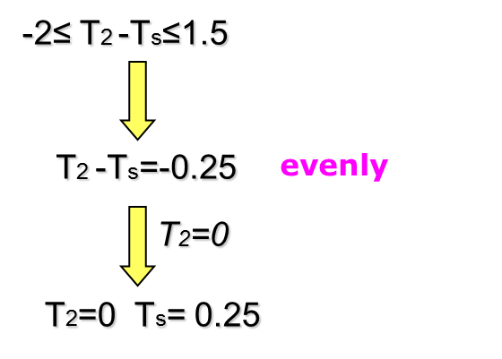

# When "Convex Optimization" Meets "Network Flow"

@luk036 👨‍💻 · 2026 📅

## 🎬 Introduction

### Overview

-   Network flow problems can be solved efficiently and have a wide range of applications.

-   Unfortunately, some problems may have other additional constraints that make them impossible to solve with current network flow techniques.

-   In addition, in some problems, the objective function is quasi-convex rather than convex.

-   In this lecture, we will investigate some problems that can still be solved by network flow techniques with the help of convex optimization.

## Parametric Potential Problems

### Parametric potential problems

Consider:

$$
\begin{array}{ll}
\text{maximize} & {\color{olive}g}({\color{coral}\beta}), \\
\text{subject to} & {\color{blue}y} \leq {\color{olive}d}({\color{coral}\beta}), \\
& {\color{green}A} {\color{firebrick}u} = {\color{blue}y},
\end{array}
$$

where ${\color{olive}g}({\color{coral}\beta})$ and ${\color{olive}d}({\color{coral}\beta})$ are concave.

👉 Note: the parametric flow problems can be defined in a similar way.

#### Network flow says

-   For fixed ${\color{coral}\beta}$, the problem is feasible precisely when there exists no negative cycle

-   Negative cycle detection can be done efficiently using the Bellman-Ford-like methods

-   If a negative cycle ${\color{lime}C}$ is found, then $\sum_{(i,j)\in {\color{lime}C} } {\color{olive}d}_{ij}({\color{coral}\beta}) < 0$

#### 🥚 Convex Optimization says

-   If both sub-gradients of ${\color{olive}g}({\color{coral}\beta})$ and ${\color{olive}d}({\color{coral}\beta})$ are known, then the _bisection method_ can be used for solving the problem efficiently.

-   Also, for multi-parameter problems, the _ellipsoid method_ can be used.

#### Quasi-convex Minimization

Consider:

$$
    \begin{array}{ll}
        \text{maximize} & {\color{olive}f}({\color{coral}\beta}), \\
        \text{subject to}    & {\color{blue}y} \leq {\color{olive}d}({\color{coral}\beta}), \\
                             & {\color{green}A} {\color{firebrick}u} = {\color{blue}y},
    \end{array}
$$

where ${\color{olive}f}({\color{coral}\beta})$ is _quasi-convex_ and ${\color{olive}d}({\color{coral}\beta})$ are concave.

#### 📚 Example of Quasi-Convex Functions

-   $\sqrt{|{\color{blue}y}|}$ is quasi-convex on $\mathbb{R}$

-   $\log({\color{blue}y})$ is quasi-linear on $\mathbb{R}_{++}$

-   ${\color{olive}f}({\color{green}x}, {\color{blue}y}) = {\color{green}x}{\color{blue}y}$ is quasi-concave on $\mathbb{R}_{++}^2$

-   Linear-fractional function:

  -   ${\color{olive}f}({\color{green}x})$ = $({\color{coral}a}^\mathsf{T} {\color{green}x} + {\color{coral}b})/({\color{coral}c}^\mathsf{T} {\color{green}x} + {\color{coral}d})$

  -   dom ${\color{olive}f}$ = $\{ {\color{green}x} \,|\, {\color{coral}c}^\mathsf{T} {\color{green}x} + {\color{coral}d} > 0 \}$

-   Distance ratio function:

  -   ${\color{olive}f}({\color{green}x})$ = $\| {\color{green}x} - {\color{coral}a}\|_2 / \| {\color{green}x} - {\color{coral}b} \|_2$

  -   dom ${\color{olive}f}$ = $\{ {\color{green}x} \,|\, \| {\color{green}x} - {\color{coral}a}\|_2 \le \| {\color{green}x} - {\color{coral}b} \|_2 \}$

#### 🥚 Convex Optimization says

If ${\color{olive}f}$ is quasi-convex, there exists a family of functions ${\color{olive}\phi}_{ {\color{coral}t} }$ such that:

-   ${\color{olive}\phi}_{ {\color{coral}t} }({\color{coral}\beta})$ is convex w.r.t. ${\color{coral}\beta}$ for fixed ${\color{coral}t}$

-   ${\color{olive}\phi}_{ {\color{coral}t} }({\color{coral}\beta})$ is non-increasing w.r.t. ${\color{coral}t}$ for fixed ${\color{coral}\beta}$

-   ${\color{coral}t}$-sublevel set of ${\color{olive}f}$ is $0$-sublevel set of ${\color{olive}\phi}_{ {\color{coral}t} }$, i.e., ${\color{olive}f}({\color{coral}\beta}) \le {\color{coral}t}$ iff ${\color{olive}\phi}_{ {\color{coral}t} }({\color{coral}\beta}) \le 0$

For example:

-   ${\color{olive}f}({\color{coral}\beta}) = {\color{olive}p}({\color{coral}\beta})/{\color{olive}q}({\color{coral}\beta})$ with ${\color{olive}p}$ convex, ${\color{olive}q}$ concave ${\color{olive}p}({\color{coral}\beta}) \ge 0$, ${\color{olive}q}({\color{coral}\beta}) > 0$ on dom ${\color{olive}f}$,

-   can take ${\color{olive}\phi}_{ {\color{coral}t} }({\color{coral}\beta})$ = ${\color{olive}p}({\color{coral}\beta}) - {\color{coral}t} \cdot {\color{olive}q}({\color{coral}\beta})$

#### 🥚 Convex Optimization says

Consider a convex feasibility problem:

$$

    \begin{array}{ll}
        \text{find}      & {\color{olive}f}({\color{coral}\beta}), \\
        \text{s. t.}     & {\color{olive}\phi}_{ {\color{coral}t} }({\color{coral}\beta}) \le 0, \\
                         & {\color{blue}y} \leq {\color{olive}d}({\color{coral}\beta}),  {\color{green}A} {\color{firebrick}u} = {\color{blue}y},
    \end{array}

$$

-   If feasible, we conclude that ${\color{coral}t} \ge {\color{coral}p^*}$;

-   If infeasible, ${\color{coral}t} < {\color{coral}p^*}$.

Binary search on ${\color{coral}t}$ can be used for obtaining ${\color{coral}p^*}$.

#### Quasi-convex Network Problem

-   Again, the feasibility problem ([eq:quasi]) can be solved efficiently by the bisection method or the ellipsoid method, together with the negatie cycle detection technique.

-   Any EDA's applications ???

#### Monotonic Minimization

-   Consider the following problem:

  $$
  \begin{array}{ll}
    \text{minimize} & \max_{ij} {\color{olive}f}_{ij}({\color{blue}y}_{ij}), \\
    \text{subject to}    & {\color{green}A} {\color{firebrick}u} = {\color{blue}y},
  \end{array}
  $$

    where ${\color{olive}f}_{ij}({\color{blue}y}_{ij})$ is non-decreasing.

-   The problem can be recast as:

  $$
  \begin{array}{ll}
    \text{maximize} & {\color{coral}\beta}, \\
    \text{subject to} & {\color{blue}y} \leq {\color{olive}f}^{-1}({\color{coral}\beta}), \\
    & {\color{green}A} {\color{firebrick}u} = {\color{blue}y},
  \end{array}
  $$

    where ${\color{olive}f}^{-1}({\color{coral}\beta})$ is non-deceasing w.r.t. ${\color{coral}\beta}$.

#### E.g. Yield-driven Optimization

-   Consider the following problem:

  $$
  \begin{array}{ll}
    \text{maximize} & \min_{ij} \Pr({\color{blue}y}_{ij} \leq {\color{blue}\tilde{d} }_{ij}) \\
    \text{subject to} & {\color{green}A} {\color{firebrick}u} = {\color{blue}y},
  \end{array}
  $$

    where ${\color{blue}\tilde{d} }_{ij}$ is a random variables.

-   Equivalent to the problem:

  $$
  \begin{array}{ll}
    \text{maximize} & {\color{coral}\beta}, \\
    \text{subject to} & {\color{coral}\beta} \leq \Pr({\color{blue}y}_{ij} \leq {\color{blue}\tilde{d} }_{ij}), \\
    & {\color{green}A} {\color{firebrick}u} = {\color{blue}y},
  \end{array}
  $$

    where ${\color{olive}f}_{ij}^{-1}({\color{coral}\beta})$ is non-deceasing w.r.t. ${\color{coral}\beta}$.

#### E.g. Yield-driven Optimization (II)

-   Let ${\color{olive}F}({\color{green}x})$ is the cdf of ${\color{blue}\tilde{d} }$.

-   Then:

  $$
  \begin{array}{lll}
  & & {\color{coral}\beta} \leq \Pr({\color{blue}y}_{ij} \leq {\color{blue}\tilde{d} }_{ij}) \leq {\color{coral}t} \\
  & \Rightarrow & {\color{coral}\beta} \leq 1 - {\color{olive}F}_{ij}({\color{blue}y}_{ij}) \\
  & \Rightarrow & {\color{blue}y}_{ij} \leq {\color{olive}F}_{ij}^{-1}(1 - {\color{coral}\beta})
  \end{array}
  $$

-   The problem becomes:

  $$
  \begin{array}{ll}
    \text{maximize} & {\color{coral}\beta}, \\
    \text{subject to} & {\color{blue}y}_{ij} \leq {\color{olive}F}_{ij}^{-1}(1 - {\color{coral}\beta}), \\
    & {\color{green}A} {\color{firebrick}u} = {\color{blue}y},
  \end{array}
  $$

#### Network flow says

-   Monotonic problem can be solved efficiently
  using cycle-cancelling methods such as Howard's algorithm.

## Min-cost flow problems

### Min-Cost Flow Problem (linear)

Consider:

$$
\begin{array}{ll}
  \text{min} & {\color{blue}d}^\mathsf{T} {\color{green}x} + {\color{green}p} \\
  \text{s. t.} & {\color{green}c^-} \leq {\color{green}x} \leq {\color{green}c^+}, \\
    & {\color{blue}A}^\mathsf{T} {\color{green}x} = {\color{firebrick}b}, \; {\color{firebrick}b}({\color{salmon}V})=0
\end{array}
$$

-   some ${\color{green}c^+}$ could be $+\infty$ some ${\color{green}c^-}$ could be $-\infty$.
-   ${\color{blue}A}^\mathsf{T}$ is the incidence matrix of a network ${\color{lime}G}$.

#### Conventional Algorithms

-   Augmented-path based:
  -   Start with an infeasible solution
  -   Inject minimal flow into the augmented path while maintaining infeasibility in each iteration
  -   Stop when there is no flow to inject into the path.
-   Cycle cancelling based:
  -   Start with a feasible solution ${\color{green}x_0}$
  -   find a better sol'n ${\color{green}x_1} = {\color{green}x_0} + {\color{coral}\alpha} {\color{green}\triangle x}$, where
    ${\color{coral}\alpha}$ is positive and ${\color{green}\triangle x}$ is a negative cycle indicator.

#### General Descent Method

1. **Input**: a starting ${\color{green}x} \in$ dom ${\color{olive}f}$
2. **Output**: ${\color{green}x^*}$
3. **repeat**
    1. Determine a descent direction ${\color{green}p}$.
    2. Line search. Choose a step size ${\color{coral}\alpha} > 0$.
    3. Update. ${\color{green}x} := {\color{green}x} + {\color{coral}\alpha} {\color{green}p}$
4. **until** a stopping criterion is satisfied.

#### Some Common Descent Directions

-   For convex problems, the search direction must satisfy $\nabla {\color{olive}f}({\color{green}x})^\mathsf{T} {\color{green}p} < 0$.
-   Gradient descent:
  -   ${\color{green}p} = -\nabla {\color{olive}f}({\color{green}x})^\mathsf{T}$
-   Steepest descent:
  -   ${\color{green}\triangle x}^{nsd}$ = \argmin$\{\nabla {\color{olive}f}({\color{green}x})^\mathsf{T} {\color{green}v} \mid \|{\color{green}v}\|=1 \}$.
  -   ${\color{green}\triangle x}^{sd}$ = $\|\nabla {\color{olive}f}({\color{green}x})\| {\color{green}\triangle x}^{nsd}$ (un-normalized)
-   Newton's method:
  -   ${\color{green}p} = -\nabla^2 {\color{olive}f}({\color{green}x})^{-1} \nabla {\color{olive}f}({\color{green}x})$

#### Network flow says (II)

-   Here, there is a better way to choose ${\color{green}p}$!
-   Let ${\color{green}x} := {\color{green}x} + {\color{coral}\alpha} {\color{green}p}$, then we have: $$\begin{array}{lll}
      \text{min} & {\color{blue}d}^\mathsf{T} {\color{green}x_0} + {\color{coral}\alpha} {\color{blue}d}^\mathsf{T} {\color{green}p} & \Rightarrow {\color{blue}d}^\mathsf{T} < 0 \\
      \text{s. t.} & -{\color{green}x_0} \leq {\color{coral}\alpha} {\color{green}p} \leq {\color{green}c}-{\color{green}x_0} & \Rightarrow \text{residual graph} \\
      & {\color{blue}A}^\mathsf{T} {\color{green}p} = 0 & \Rightarrow {\color{green}p} \text{ is a cycle!}
    \end{array}$$
-   In other words, choose ${\color{green}p}$ to be a negative cycle with cost ${\color{blue}d}$!
  -   Simple negative cycle, or
  -   Minimum mean cycle

#### Network flow says (III)

-   Step size is limited by the capacity constraints:
  -   ${\color{coral}\alpha}_1 = \min_{ij} \{ {\color{green}c^+} - {\color{green}x_0}\}$, for ${\color{green}\triangle x}_{ij} > 0$
  -   ${\color{coral}\alpha}_2 = \min_{ij} \{ {\color{green}x_0} - {\color{green}c^-}\}$, for ${\color{green}\triangle x}_{ij} < 0$
  -   ${\color{coral}\alpha}_\mathrm{lin}$ = min$\{ {\color{coral}\alpha}_1, {\color{coral}\alpha}_2\}$
-   If ${\color{coral}\alpha}_\mathrm{lin} = +\infty$, the problem is unbounded.

#### Network flow says (IV)

-   An initial feasible solution can be obtained by a similar construction of the residual graph and cost vector.
-   The LEMON package implements this cycle cancelling algorithm.

#### Min-Cost Flow Convex Problem

-   Problem Formulation:
  $$
  \begin{array}{ll}
    \text{min} & {\color{olive}f}({\color{green}x}) \\
    \text{s. t.} & 0 \leq {\color{green}x} \leq {\color{green}c}, \\
     & {\color{blue}A}^\mathsf{T} {\color{green}x} = {\color{firebrick}b}, \; {\color{firebrick}b}({\color{salmon}V})=0
  \end{array}
  $$

#### Common Types of Line Search

-   Exact line search: ${\color{coral}t} = \argmin_{ {\color{coral}t}>0} {\color{olive}f}({\color{green}x} + {\color{coral}t}{\color{green}\triangle x})$
-   Backtracking line search (with parameters ${\color{coral}\alpha} \in (0,1/2), {\color{coral}\beta} \in (0,1)$)
  -   starting from ${\color{coral}t} = 1$, repeat ${\color{coral}t} := {\color{coral}\beta} {\color{coral}t}$ until
    $${\color{olive}f}({\color{green}x} + {\color{coral}t}{\color{green}\triangle x}) < {\color{olive}f}({\color{green}x}) + {\color{coral}\alpha} {\color{coral}t} \nabla {\color{olive}f}({\color{green}x})^\mathsf{T} {\color{green}\triangle x}$$
  -   graphical interpretation: backtrack until ${\color{coral}t} \leq {\color{coral}t_0}$

#### Network flow says (V)

-   The step size is further limited by the following:
  -   ${\color{coral}\alpha}_\mathrm{cvx} = \min\{ {\color{coral}\alpha}_\mathrm{lin}, {\color{coral}t}\}$
-   In each iteration, choose ${\color{green}\triangle x}$ as a negative cycle of ${\color{lime}G}_{ {\color{green}x} }$,
  with cost $\nabla {\color{olive}f}({\color{green}x})$ such that $\nabla {\color{olive}f}({\color{green}x})^\mathsf{T} {\color{green}\triangle x} < 0$

#### Quasi-convex Minimization (new)

-   Problem Formulation: $$\begin{array}{ll}
      \text{min} & {\color{olive}f}({\color{green}x}) \\
      \text{s. t.} & 0 \leq {\color{green}x} \leq {\color{green}c}, \\
      & {\color{blue}A}^\mathsf{T} {\color{green}x} = {\color{firebrick}b}, \; {\color{firebrick}b}({\color{salmon}V})=0
    \end{array}$$

-   The problem can be recast as: $$\begin{array}{ll}
      \text{min} & {\color{coral}t} \\
      \text{s. t.} & {\color{olive}f}({\color{green}x}) \leq {\color{coral}t}, \\
      & 0 \leq {\color{green}x} \leq {\color{green}c}, \\
      & {\color{blue}A}^\mathsf{T} {\color{green}x} = {\color{firebrick}b}, \; {\color{firebrick}b}({\color{salmon}V})=0
    \end{array}$$

#### 🥚 Convex Optimization says (II)

-   Consider a convex feasibility problem: $$\begin{array}{ll}
      \text{find} & {\color{green}x} \\
      \text{s. t.} & {\color{olive}\phi}_{ {\color{coral}t} }({\color{green}x}) \leq 0, \\
      & 0 \leq {\color{green}x} \leq {\color{green}c}, \\
      & {\color{blue}A}^\mathsf{T} {\color{green}x} = {\color{firebrick}b}, \; {\color{firebrick}b}({\color{salmon}V})=0
    \end{array}$$
  -   If feasible, we conclude that ${\color{coral}t} \ge {\color{coral}p^*}$;
  -   If infeasible, ${\color{coral}t} < {\color{coral}p^*}$.
-   Binary search on ${\color{coral}t}$ can be used for obtaining ${\color{coral}p^*}$.

#### Network flow says (VI)

-   Choose ${\color{green}\triangle x}$ as a negative cycle of ${\color{lime}G}_{ {\color{green}x} }$ with cost $\nabla {\color{olive}\phi}_{ {\color{coral}t} }({\color{green}x})$
-   If no negative cycle is found, and ${\color{olive}\phi}_{ {\color{coral}t} }({\color{green}x}) > 0$, we conclude that the problem is infeasible.
-   Iterate until ${\color{green}x}$ becomes feasible, i.e. ${\color{olive}\phi}_{ {\color{coral}t} }({\color{green}x}) \leq 0$.

#### E.g. Linear-Fractional Cost

-   Problem Formulation: $$\begin{array}{ll}
      \text{min} & ({\color{coral}e}^\mathsf{T} {\color{green}x} + {\color{coral}f}) / ({\color{coral}g}^\mathsf{T} {\color{green}x} + {\color{coral}h}) \\
      \text{s. t.} & 0 \leq {\color{green}x} \leq {\color{green}c}, \\
      & {\color{blue}A}^\mathsf{T} {\color{green}x} = {\color{firebrick}b}, \; {\color{firebrick}b}({\color{salmon}V})=0
    \end{array}$$

-   The problem can be recast as: $$\begin{array}{ll}
      \text{min} & {\color{coral}t} \\
      \text{s. t.} & ({\color{coral}e}^\mathsf{T} {\color{green}x} + {\color{coral}f}) - {\color{coral}t}({\color{coral}g}^\mathsf{T} {\color{green}x} + {\color{coral}h}) \leq 0 \\
      & 0 \leq {\color{green}x} \leq {\color{green}c}, \\
      & {\color{blue}A}^\mathsf{T} {\color{green}x} = {\color{firebrick}b}, \; {\color{firebrick}b}({\color{salmon}V})=0
    \end{array}$$

#### 🥚 Convex Optimization says (III)

-   Consider a convex feasibility problem: $$\begin{array}{ll}
      \text{find} & {\color{green}x} \\
      \text{s. t.} & ({\color{coral}e} - {\color{coral}t}\cdot {\color{coral}g})^\mathsf{T} {\color{green}x} + ({\color{coral}f} - {\color{coral}t}\cdot {\color{coral}h}) \leq 0, \\
                   & 0 \leq {\color{green}x} \leq {\color{green}c}, \\
                   & {\color{blue}A}^\mathsf{T} {\color{green}x} = {\color{firebrick}b}, \; {\color{firebrick}b}({\color{salmon}V})=0
    \end{array}$$
  -   If feasible, we conclude that ${\color{coral}t} \ge {\color{coral}p^*}$;
  -   If infeasible, ${\color{coral}t} < {\color{coral}p^*}$.
-   Binary search on ${\color{coral}t}$ can be used for obtaining ${\color{coral}p^*}$.

#### Network flow says (VII)

-   Choose ${\color{green}\triangle x}$ to be a negative cycle of ${\color{lime}G}_{ {\color{green}x} }$ with cost $({\color{coral}e} - {\color{coral}t}\cdot {\color{coral}g})$, i.e. $({\color{coral}e} - {\color{coral}t}\cdot {\color{coral}g})^\mathsf{T}{\color{green}\triangle x} < 0$
-   If no negative cycle is found, and $({\color{coral}e} - {\color{coral}t}\cdot {\color{coral}g})^\mathsf{T} {\color{green}x_0} + ({\color{coral}f} - {\color{coral}t}\cdot {\color{coral}h}) > 0$, we conclude that the problem is infeasible.
-   Iterate until $({\color{coral}e} - {\color{coral}t}\cdot {\color{coral}g})^\mathsf{T} {\color{green}x_0} + ({\color{coral}f} - {\color{coral}t}\cdot {\color{coral}h}) \leq 0$.

#### E.g. Statistical Optimization

-   Consider the quasi-convex problem:

  $$
  \begin{array}{ll}
    \text{min} & \Pr({\color{blue}\mathbf{d} }^\mathsf{T} {\color{green}x} > {\color{coral}\alpha}) \\
    \text{s. t.} & 0 \leq {\color{green}x} \leq {\color{green}c}, \\
    & {\color{blue}A}^\mathsf{T} {\color{green}x} = {\color{firebrick}b}, \; {\color{firebrick}b}({\color{salmon}V})=0
  \end{array}
  $$

  -   ${\color{blue}\mathbf{d} }$ is random vector with mean ${\color{blue}d}$ and covariance
    ${\color{coral}\Sigma}$.
  -   Hence, ${\color{blue}\mathbf{d} }^\mathsf{T} {\color{green}x}$ is a random variable with mean
    ${\color{blue}d}^\mathsf{T} {\color{green}x}$ and variance ${\color{green}x}^\mathsf{T} {\color{coral}\Sigma} {\color{green}x}$.

#### 📈 Statistical Optimization

-   The problem can be recast as: $$\begin{array}{ll}
      \text{min} & {\color{coral}t} \\
      \text{s. t.} & \Pr({\color{blue}\mathbf{d} }^\mathsf{T} {\color{green}x} > {\color{coral}\alpha}) \leq {\color{coral}t} \\
      & 0 \leq {\color{green}x} \leq {\color{green}c}, \\
      & {\color{blue}A}^\mathsf{T} {\color{green}x} = {\color{firebrick}b}, \; {\color{firebrick}b}({\color{salmon}V})=0
    \end{array}$$

👉 Note: $$\begin{array}{lll}
      & & \Pr({\color{blue}\mathbf{d} }^\mathsf{T} {\color{green}x} > {\color{coral}\alpha}) \leq {\color{coral}t} \\
      & \Rightarrow & {\color{blue}d}^\mathsf{T} {\color{green}x}  + {\color{olive}F}^{-1}(1-{\color{coral}t}) \| {\color{coral}\Sigma}^{1/2} {\color{green}x} \|_2 \leq {\color{coral}\alpha}
    \end{array}$$ (convex quadratic constraint w.r.t ${\color{green}x}$)

#### Recall

Recall that the gradient of ${\color{blue}d}^\mathsf{T} {\color{green}x} + {\color{olive}F}^{-1}(1-{\color{coral}t}) \| {\color{coral}\Sigma}^{1/2} {\color{green}x} \|_2$ is ${\color{blue}d} + {\color{olive}F}^{-1}(1-{\color{coral}t}) (\| {\color{coral}\Sigma}^{1/2} {\color{green}x} \|_2)^{-1} {\color{coral}\Sigma} {\color{green}x}$.

#### Problem w/ additional Constraints (new)

-   Problem Formulation: $$\begin{array}{ll}
              \text{min} & {\color{olive}f}({\color{green}x}) \\
              \text{s. t.} & 0 \leq {\color{green}x} \leq {\color{green}c}, \\
                           & {\color{blue}A}^\mathsf{T} {\color{green}x} = {\color{firebrick}b}, \; {\color{firebrick}b}({\color{salmon}V})=0 \\
                           & \color{green}{s^\mathsf{T} x \leq \gamma}
    \end{array}$$

#### E.g. Yield-driven Delay Padding

-   Consider the following problem: $$\begin{array}{ll}
      \text{maximize} & {\color{coral}\gamma}\,{\color{coral}\beta} - {\color{coral}c}^\mathsf{T} {\color{green}p}, \\
      \text{subject to} & {\color{coral}\beta} \leq \Pr({\color{blue}y}_{ij} \leq {\color{blue}\mathbf{d} }_{ij} + {\color{green}p}_{ij}), \\
       & {\color{green}A} {\color{firebrick}u} = {\color{blue}y}, \; {\color{green}p} \geq 0
    \end{array}$$

  -   ${\color{green}p}$: delay padding
  -   ${\color{coral}\gamma}$: weight (determined by a trade-off curve of yield and buffer cost)
  -   ${\color{blue}\mathbf{d} }_{ij}$: Gaussian random variable with mean ${\color{blue}d}_{ij}$ and variance ${\color{blue}s}_{ij}$.

#### E.g. Yield-driven Delay Padding (II)

.pull-left[

-   The problem is equivalent to: $$\begin{array}{ll}
       \text{max} & {\color{green}\gamma\,\beta} - {\color{coral}c}^\mathsf{T} {\color{green}p}, \\
       \text{s.t.} & {\color{blue}y} \leq {\color{blue}d} {\color{green}- \beta s} + {\color{green}p}, \\
          & {\color{green}A} {\color{firebrick}u} = {\color{blue}y}, {\color{green}p} \geq 0
    \end{array}$$

]

.pull-right[

-   or its dual: $$\begin{array}{ll}
      \text{min} & {\color{blue}d}^\mathsf{T} {\color{green}x} \\
      \text{s.t.} & 0 \leq {\color{green}x} \leq {\color{green}c}, \\
          & {\color{blue}A}^\mathsf{T} {\color{green}x} = {\color{firebrick}b}, \; {\color{firebrick}b}({\color{salmon}V})=0 \\
          & {\color{green}s^\mathsf{T} x \leq \gamma}
    \end{array}$$

]

#### Recall

-   Yield drive CSS: $$\begin{array}{ll}
      \text{max} & {\color{coral}\beta}, \\
      \text{s.t.} & {\color{blue}y} \leq {\color{blue}d} - {\color{coral}\beta} {\color{blue}s}, \\
      & {\color{green}A} {\color{firebrick}u} = {\color{blue}y},
    \end{array}$$

-   Delay padding $$\begin{array}{ll}
      \text{max} & -{\color{coral}c}^\mathsf{T} {\color{green}p}, \\
      \text{s.t.} & {\color{blue}y} \leq {\color{blue}d} + {\color{green}p}, \\
      & {\color{green}A} {\color{firebrick}u} = {\color{blue}y}, \; {\color{green}p} \geq 0
    \end{array}$$

#### Considering Barrier Method

-   Approximation via logarithmic barrier:

  $$
  \begin{array}{ll}
    \text{min} & {\color{olive}f}({\color{green}x}) + (1/{\color{coral}t}) {\color{olive}\phi}({\color{green}x})\\
    \text{s.t.} & 0 \leq {\color{green}x} \leq {\color{green}c}, \\
    & {\color{blue}A}^\mathsf{T} {\color{green}x} = {\color{firebrick}b}, \; {\color{firebrick}b}({\color{salmon}V})=0 \\
  \end{array}
  $$

  -   where ${\color{olive}\phi}({\color{green}x}) = -\log ({\color{coral}\gamma} - {\color{blue}s}^\mathsf{T} {\color{green}x})$
  -   Approximation improves as ${\color{coral}t} \rightarrow \infty$
  -   Here, $\nabla {\color{olive}\phi}({\color{green}x}) = {\color{blue}s} / ({\color{coral}\gamma} - {\color{blue}s}^\mathsf{T} {\color{green}x})$

#### Barrier Method

-   **Input**: a feasible ${\color{green}x}$, ${\color{coral}t} := {\color{coral}t}^{(0)}$, ${\color{firebrick}\mu} > 1$, tolerance ${\color{coral}\varepsilon} > 0$
-   **Output**: ${\color{green}x^*}$
-   **repeat**
  1. Centering step. Compute ${\color{green}x^*}({\color{coral}t})$ by minimizing ${\color{coral}t}\,{\color{olive}f} + {\color{olive}\phi}$
  2. Update ${\color{green}x} := {\color{green}x^*}({\color{coral}t})$.
  3. Increase ${\color{coral}t}$. ${\color{coral}t} := {\color{firebrick}\mu} {\color{coral}t}$
-   **until** $1/{\color{coral}t} < {\color{coral}\varepsilon}$.

👉 Note: Centering is usually done by Newton's method in general.

#### Network flow says (VIII)

In the centering step, instead of using the Newton descent direction, we can replace it with a negative cycle on the residual graph.

## Useful Skew Design Flow

### Useful Skew Design: Why vs. Why Not {#sec:first}

#### Why not

Some common challenges when implementing useful skew design include:

-   need more engineer training
-   difficulty in building a balanced clock-tree
-   uncertainty in how to handle process variation and multi-corner multi-mode issues
  ..., etc.

#### Why

If these challenges are overcome and useful skew design is implemented correctly,

-   it can lead to less time spent on timing issues
-   get better chip performance or yield

#### Clock Arrival Time vs. Clock Skew

-   Clock signal runs periodically.

-   Thus, absolute clock arrival time ${\color{firebrick}u_i}$ is not so important.

-   Instead, the skew ${\color{blue}y}_{ij} = {\color{firebrick}u_i} - {\color{firebrick}u_j}$ is more important in this
  scenario.

#### Useful Skew Design vs. Zero-Skew Design

-   "Critical cycle" instead of "critical path".
-   "Negative cycle" instead of "negative slack".
-   If there is a negative cycle, it means that there is no positive
  slack solution no matter how to schedule.
-   Others are pretty much the same.
-   Same design principle:
  -   Always tackle the most critical one first!

#### Linear Programming vs. Network Flow Formulation

-   Linear programming formulation
  -   can handle more complex constraints
-   Network flow formulation
  -   usually more efficient
  -   return the most critical cycle as a bonus
  -   can handle quantized buffer delay (???)
-   Anyway, timing analysis is much more time-consuming than the
  optimization solving.

#### Target Skew vs. Actual Skew

Don't mess up these two concepts:

-   Target skew:
  -   the skew we want to achieve in the scheduling stage.
  -   Usually deterministic (we schedule a meeting at 10:00, rather
    than 10:00 $\pm$ 34 minutes, right?)
-   Actual skew
  -   the skew that the clock tree actually generates.
  -   Can be formulated as a random variable.

#### A Simple Case

To warm up, let us start with a simple case:

-   Assume equal path delay variations.
-   Single-corner.
-   Before a clock tree is built.
-   No adjustable delay buffer (ADB).

#### Network

#### Definition (Network)

A _network_ is a collection of finite-dimensional vector spaces of
_nodes_ and _edges_/_arcs_:

-   ${\color{salmon}V} = \{ {\color{brown}v_1}, {\color{brown}v_2}, \cdots, {\color{brown}v_N} \}$, where $|{\color{salmon}V}| = N$
-   ${\color{lime}E} = \{ {\color{darkgreen}e_1}, {\color{darkgreen}e_2}, {\color{darkgreen}e_3}, \cdots, {\color{darkgreen}e_M} \}$ where $|{\color{lime}E}| = M$

which satisfies 2 requirements:

1. The boundary of each edge is comprised of the union of nodes
2. The intersection of any edges is either empty or a boundary node of
    both edges.

#### 📚 Example

\begin{figure}[hp]
\centering
\input{lec07.files/network.tikz}
\caption{A network}%
\label{fig:network}
\end{figure}

#### Orientation

#### Definition (Orientation)

An _orientation_ of an edge is an ordering of its boundary node
$({\color{brown}s}, {\color{brown}t})$, where

-   ${\color{brown}s}$ is called a source/initial node
-   ${\color{brown}t}$ is called a target/terminal node

#### Definition (Coherent)

Two orientations to be the same is called _coherent_

#### Node-edge Incidence Matrix

#### Definition (Incidence Matrix)

A $N \times M$ matrix ${\color{blue}A}^\mathsf{T}$ is a node-edge incidence matrix
with entries: $${\color{green}A}(i,j) = \begin{cases}
  +1 & \text{if ${\color{darkgreen}e_i}$ is coherent with ${\color{brown}v_j}$}, \\
  -1 & \text{if ${\color{darkgreen}e_i}$ is not coherent with ${\color{brown}v_j}$}, \\
   0 & \text{otherwise.}
  \end{cases}$$

#### 📚 Example (II)

${\color{blue}A}^\mathsf{T} = \begin{bmatrix} 0 & -1 & 1 & 1 & 0 \\ 1 & 1 & 0 & -1 & -1 \\ -1 & 0 & -1 & 0 & 1 \end{bmatrix}$

#### Timing Constraint

-   Setup time constraint
  $${\color{blue}y}_\text{skew}(i,f) \le {\color{coral}T}_\text{CP} - {\color{blue}D}_{if} - {\color{coral}T}_\text{setup} = {\color{firebrick}u}_{if}$$
  While this constraint destroyed, cycle time violation (zero
  clocking) occurs.
-   Hold time constraint
  $${\color{blue}y}_\text{skew}(i,f) \ge {\color{coral}T}_\text{hold} - {\color{blue}d}_{if} = {\color{blue}l}_{if}$$ While
  this constraint destroyed, race condition (double clocking) occurs.

#### Timing Constraint Graph

-   Create a graph (network) by
  -   replacing the hold time constraint with an _h-edge_ with cost
    $-({\color{coral}T}_\text{hold} - {\color{blue}d}_{ij})$ from $\text{FF}_i$ to $\text{FF}_j$,
    and
  -   replacing the setup time constraint with an s-edge with cost
    ${\color{coral}T}_\text{CP} - {\color{blue}D}_{ij} - {\color{coral}T}_\text{setup}$ from $\text{FF}_j$ to
    $\text{FF}_i$.
-   Two sets of constraints stemming from clock skew definition:
  -   The sum of skews for paths having the same starting and ending
    flip-flop to be the same;
  -   The sum of clock skews of all cycles to be zero

#### Timing Constraint Graph (TCG)

\begin{figure}[h!]
\centering
\input{lec05.files/tcgraph.tikz}
\end{figure}

## First Thing First

### Meet all timing constraints

-   Find ${\color{blue}y}$ in $\{ {\color{blue}y} \in \mathbb{R}^{ {\color{coral}n} } \mid {\color{blue}y} \leq {\color{blue}d}, {\color{green}A}\,{\color{firebrick}u} = {\color{blue}y}\}$
-   How to solve:
  1. Find a negative cycle, fix it.
  2. Iterate until no negative cycle is found.
-   Bellman-Ford-like algorithm (and its variants are publicly
  available):
  -   Strongly suggest "Lazy Evaluation":
    -   Don't do full timing analysis on the whole timing graph at
      the beginning!
    -   Instead, perform timing analysis only when the algorithm
      needs.
  -   Stop immediately whenever a negative cycle is detected.

#### Delay Padding (DP)

-   Delay padding is a technique that fixes the timing issue by
  intentionally **solely** "increasing" delays.
-   Usually formulated as:
  -   Find ${\color{green}p}, {\color{blue}y}$ in
    $\{ {\color{green}p}, {\color{blue}y} \in \mathbb{R}^{ {\color{coral}n} } \mid {\color{blue}y} \leq {\color{blue}d} + {\color{green}p}, {\color{green}A}\,{\color{firebrick}u} = {\color{blue}y}, {\color{green}p} \geq 0\}$
-   If the objective is to minimize the sum of ${\color{green}p}$, then the problem is
  the dual of the standard _min-cost flow_ problem, which can be
  solved efficiently by the _network simplex_ algorithm (publicly
  available).
-   Beautiful right?

#### Delay Padding (II)

-   No, the above formulation is impractical.
-   In modern design, "inserting" a delay may mean swapping a faster
  cell with a slower cell from the cell library. Thus, no need to
  minimize the sum of ${\color{green}p}$.
-   More importantly, it may not be possible to find a position to
  insert delay for some delay paths.
-   Some papers consider only allowing insert delays to the max-delay
  path only. Some papers consider only allowing insert delays to both
  the max- and min-delay paths together only. None of them are
  perfect.

#### Delay Padding (III)

-   My suggestion. Instead of calculating the necessary ${\color{green}p}$'s and then
  look for the suitable position to insert, it is easier (and more
  flexible) to determine the position first and then calculate the
  suitable values.
-   It can be achieved by modifying the timing graph and solve a
  feasibility problem. Easy enough!
-   Quantized delay can be handled too (???).

#### Four possible ways to insert delay

\begin{figure}[htpb]
\centering
\subfigure[No delay can be inserted]{
\input{lec07.files/no_delay.tikz}
}
\subfigure[${\color{green}p_s}$, ${\color{green}p_h}$ independently]{
\input{lec07.files/independent.tikz}
}
\subfigure[${\color{green}p_s} = {\color{green}p_h}$]{
\input{lec07.files/same_delay.tikz}
}
\subfigure[${\color{green}p_s} \geq {\color{green}p_h}$]{
\input{lec07.files/setup_greater.tikz}
}
\caption{}
\end{figure}

#### Delay Padding (cont'd)

-   If there exists a negative cycle in the modified timing graph, it
  implies that the timing problem cannot be fixed by simply the delay
  padding technique.
  -   Then, try decrease ${\color{blue}D}_{ij}$, or increase ${\color{coral}T}_\text{CP}$
-   Be aware of the min-delay path is still the min-delay path after a
  certain amount of delay is inserted (how???).

## Variation Issue

### Yield-driven Clock Skew Scheduling

-   Assume all timing issues are fixed.
-   Now, how to schedule the arrival times to maximize yield?
-   According to the critical-first principle, we seek for the most
  critical cycle first.
-   The problem can be formulated as:
  -   $\max\{ {\color{coral}\beta} \in \mathbb{R} \mid {\color{blue}y} \leq {\color{blue}d} - {\color{coral}\beta}, {\color{green}A}\,{\color{firebrick}u} = {\color{blue}y}\}$.
-   It is equivalent to the _minimum mean cycle_ problem, which can be
  solved efficiently by for example _Howard's algorithm_ (publicly
  available).

#### Minimum Balancing Algorithm

-   Then we evenly distribute the slack on this cycle.
-   To continue the next most critical cycle, we contract the first one
  into a "super vertex" and repeat the process.
-   The process stops when the timing graph remains only a single
  vertex.
-   The overall method is known as _minimum balancing_ (MB) algorithm in
  the literature.

#### 📚 Example: Most timing-critical cycle

The most vulnerable timing constraint

\input{lec05.files/tcgraph2.tikz}

#### 📚 Example: Distribute the slack

-   Distribute the slack evenly along the most timing-critical cycle.

\input{lec05.files/tcgraph3.tikz}

#### 📚 Example: Distribute the slack (cont'd)

-   To determine the optimal slacks and skews for the rest of the graph,
  we replace the critical cycle with a super vertex.

\input{lec05.files/tcgraph4.tikz}
\input{lec05.files/tcgraph5.tikz}

#### Repeat the process iteratively

\input{lec05.files/tcgraph6.tikz}

#### Repeat the process iteratively (II)

\input{lec05.files/tcgraph7.tikz}

#### Final result

-   Skew$_{12}$ = 0.75
-   Skew$_{23}$ = -0.25
-   Skew$_{31}$ = -0.5

-   Slack$_{12}$ = 1.75
-   Slack$_{23}$ = 1.75
-   Slack$_{31}$ = 1

    where Slack$_{ij}$ = CP - D$_{ij}$ - T$_\text{setup}$ - Skew$_{ij}$

\begin{tikzpicture}
\def \radius {2cm}

\node[draw, circle, fill=cyan!20] at ({30}:\radius) (n1) {0.25};
\node[draw, circle, fill=cyan!20] at ({150}:\radius) (n2) {0.75};
\node[draw, circle, fill=cyan!20] at ({270}:\radius) (n3) {0};

\path[->, >=latex] (n2) edge [bend left=45] node[above]{0.5} (n1);
\path[->, >=latex] (n3) edge [bend left=45] node[left]{2.5} (n2);
\path[->, >=latex] (n1) edge [bend left=45] node[right]{1.5} (n3);

\path[dashed, ->, >=latex] (n1) edge [bend left=15] node[above]{1.5} (n2);
\path[dashed, ->, >=latex] (n2) edge [bend left=15] node[left]{2} (n3);
\path[dashed, ->, >=latex] (n3) edge [bend left=15] node[right]{3} (n1);

\end{tikzpicture}

#### What the MB algorithm really give us?

-   The MB algorithm not only give us the scheduling solution, but also
  a tree-topology that represents the order of "criticality"!

\begin{figure}
\centering
\input{lec05.files/hierachy.tikz}
\end{figure}

#### Clock-Tree 🕓🌳 Synthesis and Placement

-   I strongly suggest that the topology of the Clock-Tree 🕓🌳 precisely
  follows the order of "criticality"!
  -   since the lower branch of Clock-Tree 🕓🌳 has smaller skew variation.
-   I also suggest that the placer should follow the topology of the
  clock-tree:
  -   Physically place the registers of the same branch together.
  -   The locality implies stronger correlation of variations and
    implies even smaller skew variation due to the cancellation
    effect.
  -   Note that the current SSTA does not provide the correlation
    information, so this is the best you can do!

#### Second Example: Yield-driven Clock Skew Scheduling

-   Now assume that SSTA (or STA+OCV, POCV, AOCV) is performed.
-   Let (${\color{blue}\bar{d} }$, ${\color{blue}s}$) be the (mean, variance) of ${\color{blue}\mathbf{d} }$
-   The most critical cycle can be obtained by solving:
  -   $\max\{ {\color{coral}\beta} \in \mathbb{R} \mid {\color{blue}y} \leq {\color{blue}\bar{d} } - {\color{coral}\beta} {\color{blue}s}, {\color{green}A}\,{\color{firebrick}u} = {\color{blue}y}\}$
-   It is equivalent to the minimum cost-to-time ratio cycle problem,
  which can be solved efficiently by for example Howard's algorithm
  (publicly available).
-   Gaussian distribution is assumed. For arbitrary distribution, see my
  DAC'08 paper.

#### What About the Correlation?

-   In the above formulation, we minimum the maximum possibility of
  timing violation of each _individual_ timing constraint. So only
  individual delay distribution is needed.
-   Yes, the objective function is not the true timing-yield. But it is
  reasonable, easy to solve, and is the best you can do so far.

## Multi-Corner Issue

### Meet all timing constraints in Multi-Corner

-   Assume no Adjustable Delay Buffer (ADB)
-   Find ${\color{blue}y}$ in
  $\{ {\color{blue}y} \in \mathbb{R}^{ {\color{coral}n} } \mid {\color{blue}y} \leq {\color{blue}d}^{(k)}, {\color{green}A}\,{\color{firebrick}u} = {\color{blue}y}, \forall k\in[1..{\color{salmon}K}]\}$
-   Equivalent to finding ${\color{blue}y}$ in
  $\{ {\color{blue}y} \in \mathbb{R}^{ {\color{coral}n} } \mid {\color{blue}y} \leq \min_k\{ {\color{blue}d}^{(k)}\}, {\color{green}A}\,{\color{firebrick}u} = {\color{blue}y} \}$
-   Feasibility problem
-   How to solve:
  1. Find a negative cycle, fix it.
  2. Iterate until no negative cycle is found.
-   Better avoid fixing the timing issue corner-by-corner. Inducing
  ping-pong effect.

#### Delay padding (DP) in Multi-Corner

-   The problem CANNOT be formulated as a network flow problem. But
  still you can solve it by a linear programming formulation.
-   Or, decompose the problem into sub-problems for each corner.
-   Again use the modified timing graph technique.
-   Then, ${\color{blue}y}$'s are shared variables of sub-problems.
-   If we solve each sub-problem individually, the solution will not
  agree with each other. Induce _ping-pong effect_.
-   Need something to drive the agreement.

#### Delay Padding (DP) in Multi-Corner (cont'd)

-   Follow the idea of _dual decomposition_: If a solution is above the
  average. then introduce a punishment cost. If a solution is below
  the average, then introduce a rewarding cost.
-   Then, each subproblem is a min-cost potential problem, which can be
  solved efficiently.
-   If some subproblems do not have feasible solutions, it implies that
  the problem cannot be fixed by simply delay padding.
-   The process repeats until all solutions converge. If not, it implies
  that the problem cannot be fixed by simply delay padding.

#### Yield-driven Clock Skew Scheduling

-   $\max\{ {\color{coral}\beta} \in \mathbb{R} \mid {\color{blue}y} \leq {\color{blue}d}^{(k)} - {\color{coral}\beta} {\color{blue}s}, {\color{green}A}\,{\color{firebrick}u} = {\color{blue}y}, \forall k\in[1..{\color{salmon}K}]\}$
-   More or less the same as in Single Corner.

## Clock-Tree 🕓🌳 Issue

### Clock Tree Synthesis (CTS)

-   Construct merging location
  -   DME algorithm, Elmore delay, buffer insertion
-   Some research on _bounded-skew DME algorithm_. But the algorithm is
  too complicated in my opinion.
-   If the previous stage is over-optimized, the clock tree is hard to
  implement. If it happens, some budgeting techniques should be
  invoked (engineering issue)
-   After a clock tree is constructed, more detailed timing (rather than
  Elmore delay) can be obtained via timing analysis.

#### Co-optimization Issue

-   After a clock tree is built, we have a clearer picture.
-   Should I perform the re-scheduling? And how?
-   Some papers suggest adding a factor to the timing constraint, say:
  $$1.2 {\color{firebrick}u_i} - 0.8 {\color{firebrick}u_j} \leq {\color{blue}w}_{ij}$$.
-   Then the formulation is not a kind of network-flow, but may still be
  solvable by linear programming.
-   Need to investigate more deeply.

## Adjustable Delay Buffer Issue

### Adjustable delay buffers in Multi-Mode

-   Assume adjustable delay buffers are added solely to the clock tree
-   Hence, each mode can have a different set of arrival times.
-   Easier for clock skew scheduling, harder for Clock-Tree 🕓🌳 synthesis.

#### Meet timing constraint in Multi-Mode

-   find ${\color{blue}y}^{(m)}$ in
  $\{ {\color{blue}y}^{(m)} \in \mathbb{R}^{ {\color{coral}n} } \mid {\color{blue}y}^{(m)} \leq {\color{blue}d}^{(m)}, {\color{green}A}\,{\color{firebrick}u}^{(m)} = {\color{blue}y}^{(m)}, \forall m\in[1..{\color{salmon}M}]\}$
-   Can be done in parallel.
-   find a negative cycle, fix it (do not need to know all ${\color{blue}d}_i^{(m)}$
  at the beginning) for every mode in parallel.

#### Delay Padding (DP) in Multi-mode

-   Again use a modified timing graph technique.
-   NOT a network flow problem. Use LP, or
-   Dual decomposition -\> min-cost potential problem for each mode
  -   Only ${\color{green}p}$'s are shared variables.
  -   Initial feasible solution obtained by the single-mode method
    -   A negative cycle =\> problem cannot be fixed by DP
-   Not converge =\> problem cannot be fixed by DP
  -   Try decrease ${\color{blue}D}_{ij}$, or increase ${\color{coral}T}_\text{CP}$

#### Yield-driven Clock Skew Scheduling

-   $\max\{ {\color{coral}\beta} \in \mathbb{R} \mid {\color{blue}y}^{(m)} \leq {\color{blue}d}^{(m)} - {\color{coral}\beta} {\color{blue}s}, {\color{green}A}\,{\color{firebrick}u}^{(m)} = {\color{blue}y}^{(m)}, \forall m\in[1..{\color{salmon}M}]\}$
-   Pretty much the same as Single-Mode.

#### Difficulty in ADB Multi-Mode Design

-   How to design the clock-tree?
-   What is the order of criticality?
-   How to determine the minimum range of ADB?
