# Lecture 8: Phase Shifting Mask

@luk036

2022-11-26

## 🗺️ Overview

- Background
- What is Phase Shifting Mask?
- Phase Conflict Graph
- Phase Assignment Problem
  - Greedy Approach
  - Planar Graph Approach

class: middle, center

## Background

## Background

.pull-left[

- In the past, chips have continued to get smaller and smaller, and therefore consume less and less power.

- However, we are rapidly approaching the end of the road and optical lithography cannot take us to the next place we need to go.

]
.pull-right[

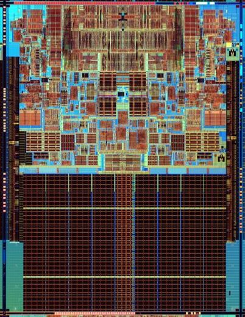

]

## Process of Lithography

.pull-left[

1. Photo-resist coating (光阻涂层)

2. Illumination (光照)

3. Exposure (曝光)

4. Etching (蚀刻)

5. Impurities doping (杂质掺杂)

6. Metal connection

]
.pull-right[

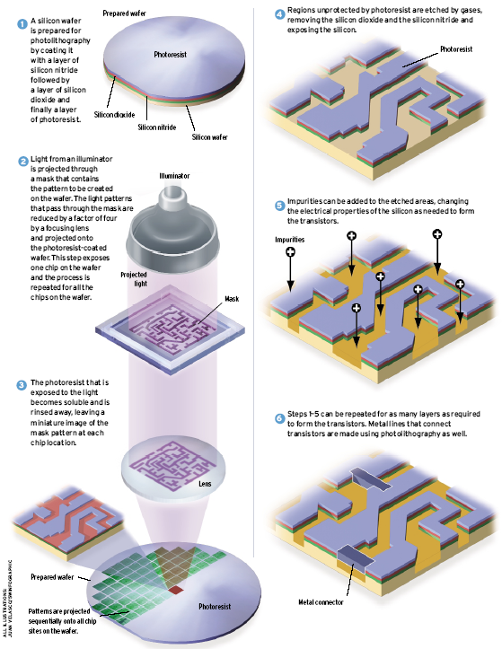

]

## Sub-wavelength Lithography

.pull-left[

- Feature size is much smaller than the lithography wavelength
  - 45nm vs. 193nm

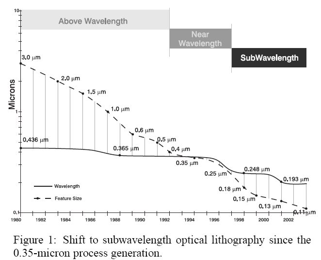

]
.pull-right[

- What you see in the mask/layout is **not** what you get on the chip:
  - Features are distored
  - Yields are declined

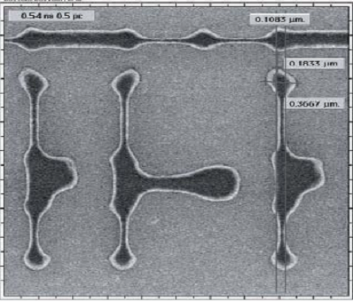

]

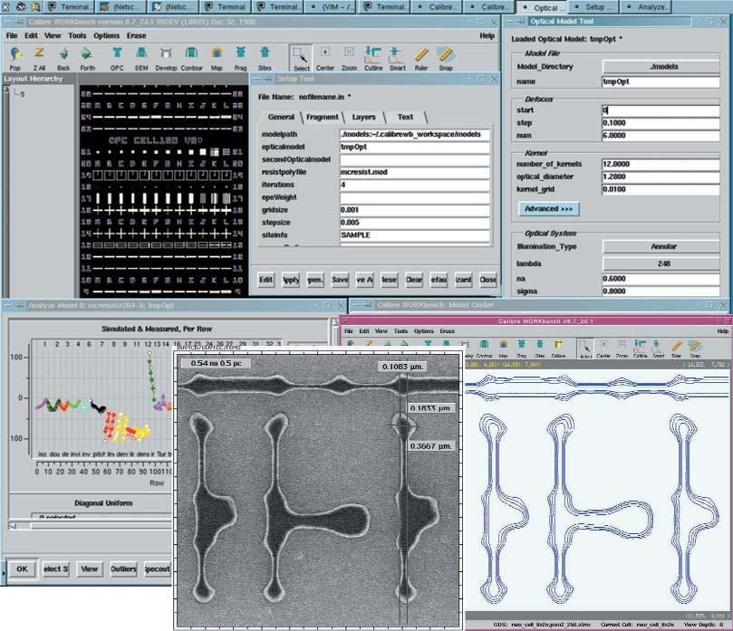

## DFM Tool (Mentor Graphics)

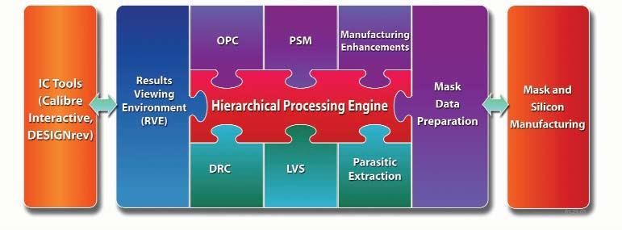

## OPC and PSM

.pull-left[

- Results of OPC on PSM:
  - A = original layout
  - B = uncorrected layout
  - C = after PSM and OPC

]
.pull-right[

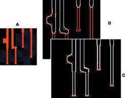

]

## Phase Shifting Mask

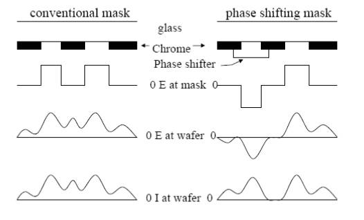

## Phase Conflict Graph

- Edge between two features with separation of $\leq b$ (dark field)
- Similar conflict graph for "bright field".
- Construction method: plane sweeping method + dynamic priority search tree
  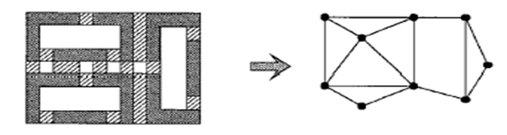

## Phase Assignment Problem

.pull-left[

- Instance: Graph $G = (V, E)$
- Solution: A color assignment $c: V \to [1..k]$ (here $k=2$)
- Goal: Minimize the weights of the monochromatic edges.
  (Question: How can we model the weights?)

]
.pull-right[

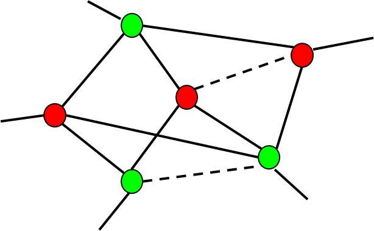

]

## Phase Assignment Problem

- In general, the problem is NP-hard.
- It is solvable in polynomial time for planar graphs with $k=2$, since the problem is equivalent to the T-join problem in the dual graph [Hadlock75].
- For planar graphs with $k=2$, the problem can be solved approximately in the ratio of two using the primal-dual method.

## Overview of Greedy Algorithm

- Create a maximum weighted spanning tree (MST) of $G$
  (can be found in LEDA package)
- Assign colors to the nodes of the MST.
- Reinsert edges that do not conflict.
- Time complexity: $O(N \log N)$
- Can be applied to non-planar graphs.

## Greedy Algorithm

.pull-left[

- Step 1: Construct a maximum spanning tree $T$ of $G$ (using e.g. Kruskal's algorithm, which is available in the LEDA package).

]
.pull-right[

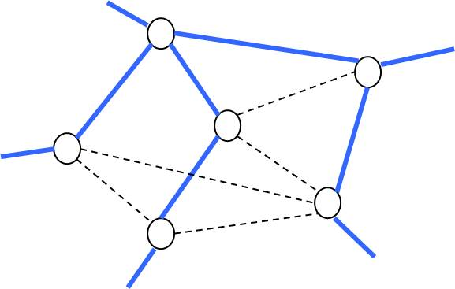

]

## Greedy Algorithm (Cont'd)

.pull-left[

- Step 2: Assign colors to the nodes of $T$.

]
.pull-right[

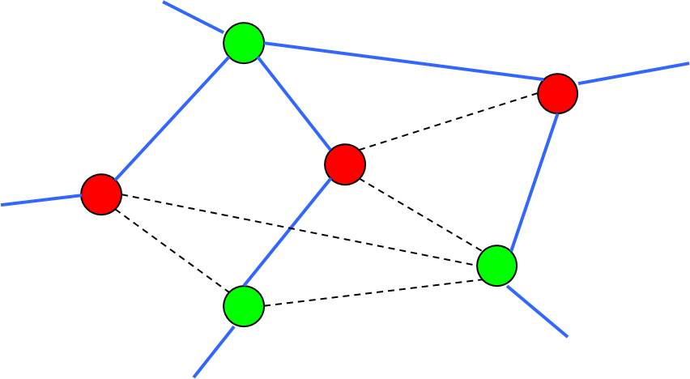

]

## Greedy Algorithm (Cont'd)

.pull-left[

- Step 3: Reinsert edges that do not conflict.

]
.pull-right[

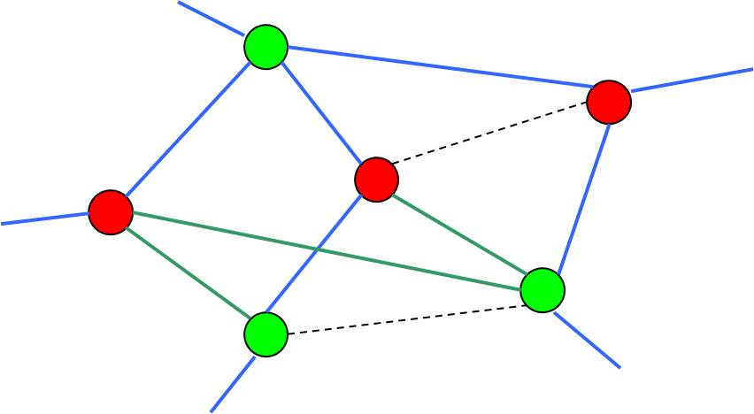

]

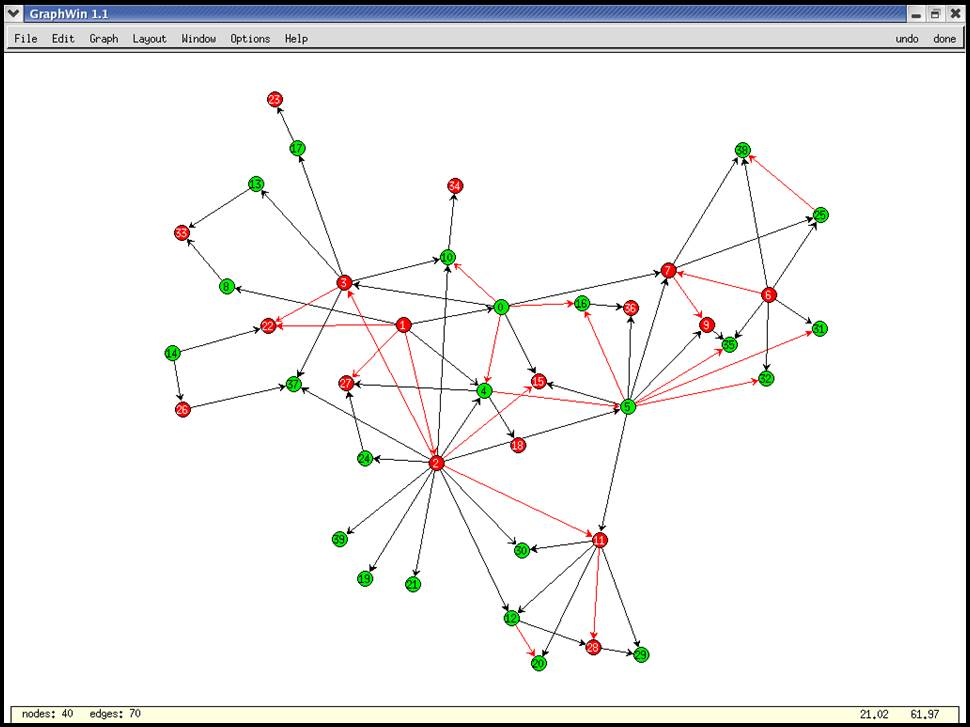

## Other Approaches

- Reformulate the problem as a MAX-CUT problem. 
  Note that the MAX-CUT problem is approximatable within a factor of 1.1383
  using the "semi-definite programming" relaxation technique [Goemans and Williamson 93].

- Planar graph approach: Convert $G$ to a planar graph by removing the minimal edges, and then apply the methods to the resulting planar graph. 
  
  👉 Note: the optimal "planar sub-graph" problem is NP-hard.

## Overview of Planar Graph Approach (Hadlock's algorithm)

1. Approximate $G$ by a planar graph $G'$
2. Decompose $G'$ into its bi-connected components.
3. For each bi-connected component in $G'$,
    1. construct a planar embedding
    2. construct a dual graph $G^*$
    3. construct a complete graph $C(V, E)$, where
       - $V$ is a set of odd-degree vertices in $G^*$
       - the weight of each edge is the shortest path of two vertices
    4. find the minimum perfect matching 💯👬🏻 solution. 
       The matching edges are the conflict edges that have to be deleted.
4. Reinsert the non-conflicting edges from $G$.

## Planar Graph Approach

.pull-left[

- Step 1: Approximate $G$ with a planar graph $G'$
  - It is NP-hard.
  - The naive greedy algorithm takes $O(n^2)$ time.
  - Any good suggestion?

]
.pull-right[

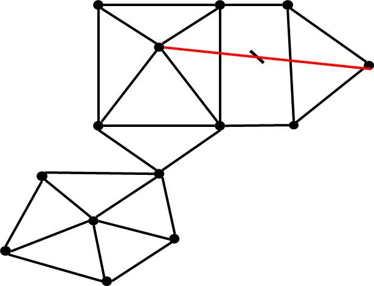

]

## Planar Graph Approach

- Step 2: Decompose $G'$ into its bi-connected components in
  linear time (available in the LEDA package).

  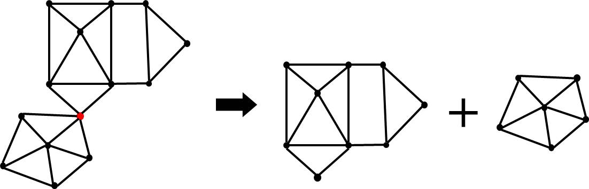

## Planar Graph Approach

- Step 3: For each bi-connected component in $G'$, construct a planar embedding in linear time (available in the LEDA package)

  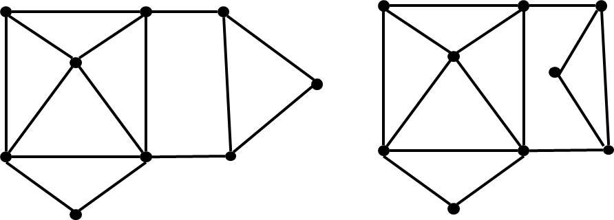

👉 Note: planar embedding may not be unique unless $G$ is tri-connected.

## Planar Graph Approach

.pull-left[

- Step 4: For each bi-connected component, construct its dual
  graph $G^*$ in linear time.

]
.pull-right[

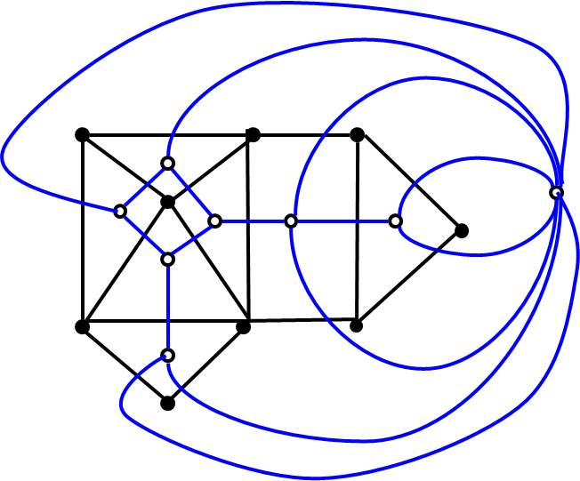

]

## Planar Graph Approach

.pull-left[

- Step 5: Find the minimum weight perfect matching 💯👬🏻 of $G^*$.
  - Polynomial time solvable.
  - Can be formulated as a network flow problem.

  👉 Note: complete graph vs. Voronoi graph

]
.pull-right[

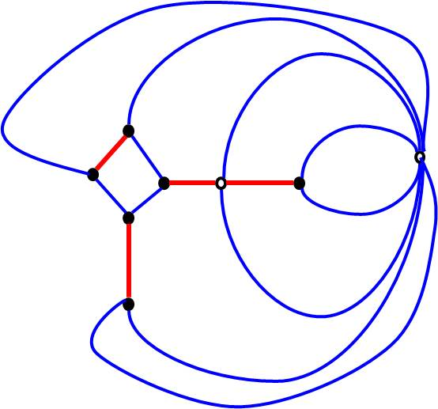

]

## Planar Graph Approach

.pull-left[

- Step 6: reinsert the non-conflicting edges in $G$.

👉 Note: practically we keep track of conflicting edges.

]
.pull-right[

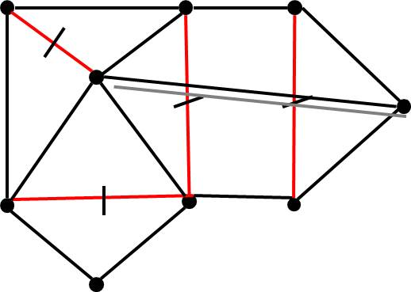

]

