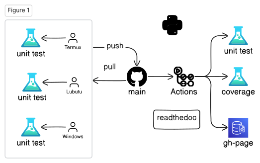

layout: true
class: typo, typo-selection

---

count: false
class: nord-dark, middle, center

# Lecture 2a: Open-Source Software Development Flow

@luk036

📅 2024-09-11

---

## 💬 Key Messages

.pull-left[

- 🚨 About 99% of projects fail  
- 💻 Software is "soft"; Hardware is "hard"  
- ⚙️ Automation is challenging  
- 🌙 Nightly build concept (Microsoft)  
- 🏃 Agile software development  
- 👥 Pair programming  
- 🔥 Extreme programming  
- 🛠️ Open-source projects - Continuous Integration  

] .pull-right[


]

---

## 🖥️ Development Platforms

- 🌐 [GitHub](https://github.com)  
- ☁️ [Gitpod.io](https://gitpod.io) - Cloud-based  
- ☁️ GitHub's Codespaces - Cloud-based  
- 🐧 Lubuntu  
- 🪟 Windows - MSVC++  
- 🌐 FydeOS (ChromeOS) - g++-14  
- 📱 Android's Termux - clang-18  

---

## Open-source Work Flow (Python 🐍)



---

## Open-source Work Flow (C++)


---

## 🔀 Pull Request Process

- test
  

---

## GitHub & Git Basics

```bash
git clone https://github.com/luk036/csdigit
cd csdigit
# Make your changes
git status
git diff
git diff README.md
git pull
git add .
git commit -m "Your commit message"
git push
git tag
git branch          # List all branches
git branch develop  # Create new branch
git switch develop  # Switch to branch
git switch master   # Switch back to master
```

---

## 📚 Example - git status

.font-sm.mb-xs[

```terminal
ubuntu@ubuntu:~/github/ellalgo$ git status
On branch master
Your branch is up to date with 'origin/master'.

Changes not staged for commit:
  (use "git add <file>..." to update what will be committed)
  (use "git checkout -- <file>..." to discard changes in working directory)

    <span style="color:red;">modified:   .pytest_cache/v/cache/lastfailed</span>
    <span style="color:red;">modified:   .pytest_cache/v/cache/nodeids</span>

Untracked files:
  (use "git add <file>..." to include in what will be committed)

    <span style="color:red;">ellalgo/</span>
    <span style="color:red;">test.html</span>

no changes added to commit (use "git add" and/or "git commit -a")
```

]

---

## 📚 Example - git pull

.font-sm.mb-xs[

```terminal
lubuntu@lubuntu:~/github/luk036.github.io$ git pull
remote: Enumerating objects: 29, done.
remote: Counting objects: 100% (29/29), done.
remote: Compressing objects: 100% (8/8), done.
remote: Total 19 (delta 14), reused 16 (delta 11), pack-reused 0
Unpacking objects: 100% (19/19), done.
From ssh://github.com/luk036/luk036.github.io
   461191c..d335266  master     -> origin/master
Updating 461191c..d335266
Fast-forward
 algo4dfm/swdevtips.html  |  36 <span style="color:green;">++++++++</span><span style="color:red;">--</span>
 algo4dfm/swdevtips.md    |  27 <span style="color:green;">+++++++</span><span style="color:red;">-</span>
 algo4dfm/swdevtools.html |  22 <span style="color:green;">+++++</span><span style="color:red;">--</span>
 algo4dfm/swdevtools.md   |  89 <span style="color:green;">++++++++++++++++++++++++</span><span style="color:red;">-</span>
 markdown/remark.html     |  45 <span style="color:green;">++++++++</span><span style="color:red;">-----</span>
 5 files changed, 251 insertions(+), 198 deletions(-)
```

]

---

## GitHub CLI (gh)

```bash
gh auth login
gh repo create csdigit --public
gh repo clone csdigit
gh run list
gh run view
gh release list
gh release create
gh issue list
gh issue create
gh search repos digraphx
```

---

## 🐍 Python Development

- 🆕 Create a new project

```bash
pip install pyscaffold[markdown]
putup -i --markdown --github-actions csdigit
```

- ⚙️ Setup

```bash
cd csdigit
pip install -e .
pip install -r requirements.txt
```

- 🧪 Unit Testing

```bash
pytest
pytest --doctest-modules src
```

- ☂️ Code Coverage

```bash
pytest --cov=src/csdigit
```

---

## 🐍 Python Tools

- 🪄 Formatting and static checks

```bash
ruff format
ruff check
ruff check --fix
```

- 📝 Documentation

```bash
pip install -r docs/requirements.txt
cd docs
make html
cd _build/html
python -m http.server
```

- 📊 Benchmarking

```bash
pytest benches/test_bench.py
```

---

## 📊 Benchmarking Example

.font-sm.mb-xs[

```terminal
ubuntu@ubuntu:~/github/ellalgo$ pytest tests/test_lmi.py
<span style="font-weight:bold;">============================= test session starts ==============================</span>
platform linux -- Python 3.7.3, pytest-5.1.2, py-1.8.0, pluggy-0.13.0 -- /media/ubuntu/casper-rw/miniconda3/bin/python
cachedir: .pytest_cache
benchmark: 3.2.2 (defaults: timer=time.perf_counter disable_gc=False min_rounds=5 min_time=0.000005 max_time=1.0 calibration_precision=10 warmup=False warmup_iterations=100000)
rootdir: /media/ubuntu/casper-rw/github/ellalgo, inifile: setup.cfg
plugins: benchmark-3.2.2, cov-2.7.1
<span style="font-weight:bold;">collecting ... </span>collected 2 items

tests/test_lmi.py::test_lmi_lazy <span style="color:green;">PASSED</span><span style="color:teal;">                                  [ 50%]</span>
tests/test_lmi.py::test_lmi_old <span style="color:green;">PASSED</span><span style="color:teal;">                                   [100%]</span><span style="color:red;"></span>

<span style="color:olive;">------------ benchmark: 2 tests -----------</span>
Name (time in ms)         Min                Max               Mean            StdDev             Median               IQR            Outliers      OPS            Rounds  Iterations
<span style="color:olive;">-------------------------------------------</span>
test_lmi_lazy       <span style="color:green;"></span><span style="font-weight:bold;color:green;">  13.0504 (1.0)    </span><span style="color:green;"></span><span style="font-weight:bold;color:green;">  13.2587 (1.0)    </span><span style="color:green;"></span><span style="font-weight:bold;color:green;">  13.1461 (1.0)    </span><span style="color:red;"></span><span style="font-weight:bold;color:red;">  0.0432 (1.91)   </span><span style="color:green;"></span><span style="font-weight:bold;color:green;">  13.1471 (1.0)    </span><span style="color:red;"></span><span style="font-weight:bold;color:red;">  0.0514 (1.66)   </span>      25;1<span style="color:green;"></span><span style="font-weight:bold;color:green;">  76.0682 (1.0)    </span>      75           1
test_lmi_old        <span style="color:red;"></span><span style="font-weight:bold;color:red;">  13.6855 (1.05)   </span><span style="color:red;"></span><span style="font-weight:bold;color:red;">  13.7888 (1.04)   </span><span style="color:red;"></span><span style="font-weight:bold;color:red;">  13.7279 (1.04)   </span><span style="color:green;"></span><span style="font-weight:bold;color:green;">  0.0225 (1.0)    </span><span style="color:red;"></span><span style="font-weight:bold;color:red;">  13.7271 (1.04)   </span><span style="color:green;"></span><span style="font-weight:bold;color:green;">  0.0310 (1.0)    </span>      24;1<span style="color:red;"></span><span style="font-weight:bold;color:red;">  72.8445 (0.96)   </span>      72           1
<span style="color:olive;">-------------------------------------------</span>

Legend:
  Outliers: 1 Standard Deviation from Mean; 1.5 IQR (InterQuartile Range) from 1st Quartile and 3rd Quartile.
  OPS: Operations Per Second, computed as 1 / Mean
<span style="color:green;"></span><span style="font-weight:bold;color:green;">============================== 2 passed in 3.27s ===============================</span>
```

]

---

## 🦀 Rust Development

- 🆕 Create a new project

```bash
cargo install cargo-generate
cargo generate -o --init --git https://github.com/rust-github/template.git
```

- ⚙️ Setup

```bash
cd csd-rs
cargo build --release
```

- 🧪 Unit Testing

```bash
cargo test --release
cargo test --lib --release
cargo test --doc --release
```

- ☂️ Code Coverage (Linux)

```bash
cargo llvm-cov
```

---

## 🦀 Rust Tools

- 🪄 Formatting and static checks

```bash
cargo fmt
cargo clippy
cargo clippy --fix
```

- 📝 Documentation

```bash
cargo doc
cd target/doc
python -m http.server
```

- 📊 Benchmarking

```bash
cargo bench
```

---

## 🏗️ C++ (CMake + CPM)

- 🆕 Create a new project  
  Use GitHub's ModernCppStarter template

- ⚙️ Setup

```bash
cd csd-cpp
cmake -Sall -Bbuild -DCMAKE_BUILD_TYPE=Release
cmake --build build
```

- 🧪 Unit Testing

```bash
cmake --build build --target test
```

- ☂️ Code Coverage  
  (Implementation needed)

---

## 🏗️ C++ (CMake + CPM) Tools

- 🪄 Formatting and static checks

```bash
pip install cmake-format clang-format
cmake -Sall -Bbuild -DCMAKE_BUILD_TYPE=Release
cmake --build build --target fix-format
```

- 📝 Documentation

```bash
cmake --build build --target GenerateDocs
```

- 📊 Benchmarking

```bash
./build/bench/BM_switch
```

---

## 🏗️ C++ (XMake)

- 🆕 Create a new project

```bash
xmake create -t static lds-cpp
xmake create -t console csd-cpp
```

- ⚙️ Setup

```bash
xmake f -m debug
xmake
```

- 🧪 Unit Testing

```bash
xmake run test_csd
```

- ☂️ Code Coverage  
  (Implementation needed)

---

## 🏗️ C++ (XMake) Tools

- 🪄 Formatting

```bash
xmake format
```

- 📝 Documentation  
  ❌ xmake doxygen (Not working)

- 📊 Benchmarking

```bash
xmake run test_bench
```

---

class: nord-dark, middle, center

.pull-left[

# 🙋 Q & A️

] .pull-right[


]
