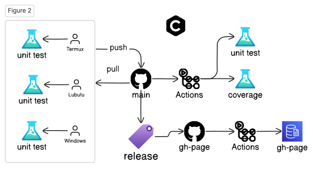
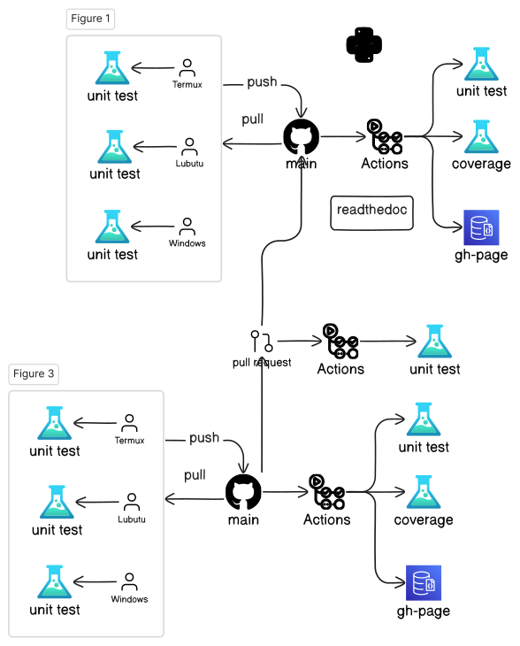

layout: true
class: typo, typo-selection

---

count: false
class: nord-dark, middle, center

# Lecture 2a: Open-Source Software Development Flow

.pull-left[

## @luk036

2023-09-13

] .pull-right[


] 


---

# Platforms

* https://github.com
* gitpod.io - ☁️ cloud base
* Github's Codespaces - ☁️ cloud base
* Lubuntu
* Windows - MSVC++
* FydeOS (ChromeOS) - g++-13
* Android's Termux - clang-17 

---

# Open-source Work Flow (Python)


---

# Open-source Work Flow (C++)



---

# Pull Request



---

# GitHub, Git

```bash
git clone https://github.com/luk036/csdigit
cd csdigit
(edit)
git status
git diff
git diff README.md
git pull
git add .
git commit -m "message"
git push
git tag
git branch # list all branches
git branch develop # create a new branch
git switch develop
git switch master

```

---

# GitHub, gh

```bash
gh repo create csdigit --public
gh repo clone csdigit
gh run list
gh run view
gh release list
gh release create
gh issue list
gh issue create
gh search repos digraphx
```

---

# Python:

* Create a new porject

```bash
pip install pyscaffold[all]
putup -i --markdown --github-actions csdigit
```

* Setup

```bash
cd csdigit
pip install -e .
pip install -r requirements.txt
```

* Test

```bash
pytest
pytest --doctest-modules src
```

* Code Coverage

```bash
pytest --cov=src/csdigit
```

---

# Python:

* Formatting and static check

```bash
pip install pre-commit
pre-commit run --all-files
```

* Documentation

```bash
pip install -r docs/requirements.txt
cd docs
make html
python -m http.server
```

* Benchmarking

```bash
pytest benches/test_bench.py
```

---

# Rust:

* Create a new project

```bash
cargo install cargo-generate
cargo generate -o --init --git https://github.com/rust-github/template.git
```

* Setup

```bash
cd csd-rs
cargo build
```

* Test

```bash
cargo test
cargo test --lib
cargo test --doc
```

* Code Coverage

```bash
cargo tarpaulin (Windows)
```

---

# Rust:

* Formatting and static check

```bash
cargo fmt
cargo clippy
cargo clippy --fix
```

* Documentation

```bash
cargo doc
cd target/doc
python -m http.server
```

* benchmarking

```bash
cargo bench
```

---

# C++ (CMake + CPM):

* Create a new project

Use GitHub's ModernCppStarter template,

* Setup

```bash
cd csd-cpp
cmake -Sall -Bbuild -DCMAKE_BUILD_TYPE=Release -DCMAKE_EXPORT_COMPILE_COMMANDS=1
cmake --build build
```

* Test

```bash
cmake --build build --target test
```

* Code Coverage

```bash
??
```

---

# C++ (CMake + CPM):

* Formatting and static check

```bash
pip install cmake-format clang-format
cmake -Sall -Bbuild -DCMAKE_BUILD_TYPE=Release -DCMAKE_EXPORT_COMPILE_COMMANDS=1
cmake --build build --target fix-format
```

* Documentation

```bash
cmake --build build --target GenerateDocs
```

* benchmarking

```bash
./build/bench/BM_switch
```

---

# C++ (XMake):

* Create a new project

```bash
xmake create -t static lds-cpp
xmake create -t console csd-cpp
```

* Setup

```bash
xmake f -m debug
xmake
```

* Test

```bash
xmake run test_csd
```

* Code Coverage

```bash
??
```

---

# C++ (XMake):

* Formatting and static check

```bash
xmake format
```

* Documentation

```bash
xmake doxygen
```

* benchmarking

```bash
xmake run test_bench
```

---

class: nord-dark, middle, center

.pull-left[

# Q & A 🙋️

] .pull-right[


] 

