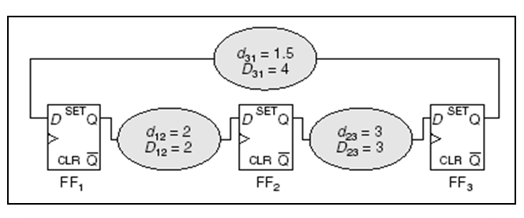

## Useful Skew Design: Why vs. Why Not {#sec:first}

### Why not

Some common challenges when implementing useful skew design include:

- need more engineer training
- difficulty in building a balanced clock-tree
- uncertainty in how to handle process variation and multi-corner multi-mode issues
  ..., etc.

### Why

If these challenges are overcome and useful skew design is implemented correctly,

- it can lead to less time spent on timing issues
- get better chip performance or yield

---

## Clock Arrival Time vs. Clock Skew

- Clock signal runs periodically.

- Thus, absolute clock arrival time $u_i$ is not so important.

- Instead, the skew $y_{ij} = u_i - u_j$ is more important in this
  scenario.

---

## Useful Skew Design vs. Zero-Skew Design

- "Critical cycle" instead of "critical path".
- "Negative cycle" instead of "negative slack".
- If there is a negative cycle, it means that there is no positive
  slack solution no matter how to schedule.
- Others are pretty much the same.
- Same design principle:
  - Always tackle the most critical one first!

---

## Linear Programming vs. Network Flow Formulation

- Linear programming formulation
  - can handle more complex constraints
- Network flow formulation
  - usually more efficient
  - return the most critical cycle as a bonus
  - can handle quantized buffer delay (???)
- Anyway, timing analysis is much more time-consuming than the
  optimization solving.

---

## Target Skew vs. Actual Skew

Don't mess up these two concepts:

- Target skew:
  - the skew we want to achieve in the scheduling stage.
  - Usually deterministic (we schedule a meeting at 10:00, rather
    than 10:00 $\pm$ 34 minutes, right?)
- Actual skew
  - the skew that the clock tree actually generates.
  - Can be formulated as a random variable.

---

## A Simple Case

To warm up, let us start with a simple case:

- Assume equal path delay variations.
- Single-corner.
- Before a clock tree is built.
- No adjustable delay buffer (ADB).

---

## Network

### Definition (Network)

A _network_ is a collection of finite-dimensional vector spaces of
_nodes_ and _edges_/_arcs_:

- $V = \{v_1, v_2, \cdots, v_N \}$, where $|V| = N$
- $E = \{e_1, e_2, e_3, \cdots, e_M \}$ where $|E| = M$

which satisfies 2 requirements:

1.  The boundary of each edge is comprised of the union of nodes
2.  The intersection of any edges is either empty or a boundary node of
    both edges.

---

## Example

\begin{figure}[hp]
\centering
\input{lec07.files/network.tikz}
\caption{A network}%
\label{fig:network}
\end{figure}

---

## Orientation

### Definition (Orientation)

An _orientation_ of an edge is an ordering of its boundary node
$(s, t)$, where

- $s$ is called a source/initial node
- $t$ is called a target/terminal node

### Definition (Coherent)

Two orientations to be the same is called _coherent_

---

## Node-edge Incidence Matrix

### Definition (Incidence Matrix)

A $N \times M$ matrix $A^\mathsf{T}$ is a node-edge incidence matrix
with entries: $$A(i,j) = \begin{cases}
  +1 & \text{if $e_i$ is coherent with $v_j$}, \\
  -1 & \text{if $e_i$ is not coherent with $v_j$}, \\
   0 & \text{otherwise.}
  \end{cases}$$

### Example (II)

$A^\mathsf{T} = \begin{bmatrix} 0 & -1 & 1 & 1 & 0 \\ 1 & 1 & 0 & -1 & -1 \\ -1 & 0 & -1 & 0 & 1 \end{bmatrix}$

---

## Timing Constraint

- Setup time constraint
  $$y_\text{skew}(i,f) \le T_\text{CP} - D_{if} - T_\text{setup} = u_{if}$$
  While this constraint destroyed, cycle time violation (zero
  clocking) occurs.
- Hold time constraint
  $$y_\text{skew}(i,f) \ge T_\text{hold} - d_{if} = l_{if}$$ While
  this constraint destroyed, race condition (double clocking) occurs.

---

## Timing Constraint Graph

- Create a graph (network) by
  - replacing the hold time constraint with an _h-edge_ with cost
    $-(T_\text{hold} - d_{ij})$ from $\text{FF}_i$ to $\text{FF}_j$,
    and
  - replacing the setup time constraint with an s-edge with cost
    $T_\text{CP} - D_{ij} - T_\text{setup}$ from $\text{FF}_j$ to
    $\text{FF}_i$.
- Two sets of constraints stemming from clock skew definition:
  - The sum of skews for paths having the same starting and ending
    flip-flop to be the same;
  - The sum of clock skews of all cycles to be zero

---

## Timing Constraint Graph (TCG)

\columnsbegin
\column{.5\textwidth}


\column{.5\textwidth}

\begin{figure}[h!]
\centering
\input{lec05.files/tcgraph.tikz}
\end{figure}
\columnsend

# First Thing First

---

## Meet all timing constraints

- Find $y$ in $\{y \in \mathbb{R}^n \mid y \leq d, A\,u = y\}$
- How to solve:
  1.  Find a negative cycle, fix it.
  2.  Iterate until no negative cycle is found.
- Bellman-Ford-like algorithm (and its variants are publicly
  available):
  - Strongly suggest "Lazy Evaluation":
    - Don't do full timing analysis on the whole timing graph at
      the beginning!
    - Instead, perform timing analysis only when the algorithm
      needs.
  - Stop immediately whenever a negative cycle is detected.

---

## Delay Padding (DP)

- Delay padding is a technique that fixes the timing issue by
  intentionally **solely** "increasing" delays.
- Usually formulated as:
  - Find $p, y$ in
    $\{p, y \in \mathbb{R}^n \mid y \leq d + p, A\,u = y, p \geq 0\}$
- If the objective is to minimize the sum of $p$, then the problem is
  the dual of the standard _min-cost flow_ problem, which can be
  solved efficiently by the _network simplex_ algorithm (publicly
  available).
- Beautiful right?

---

## Delay Padding (II)

- No, the above formulation is impractical.
- In modern design, "inserting" a delay may mean swapping a faster
  cell with a slower cell from the cell library. Thus, no need to
  minimize the sum of $p$.
- More importantly, it may not be possible to find a position to
  insert delay for some delay paths.
- Some papers consider only allowing insert delays to the max-delay
  path only. Some papers consider only allowing insert delays to both
  the max- and min-delay paths together only. None of them are
  perfect.

---

## Delay Padding (III)

- My suggestion. Instead of calculating the necessary $p's$ and then
  look for the suitable position to insert, it is easier (and more
  flexible) to determine the position first and then calculate the
  suitable values.
- It can be achieved by modifying the timing graph and solve a
  feasibility problem. Easy enough!
- Quantized delay can be handled too (???).

---

## Four possible ways to insert delay

\begin{figure}[htpb]
\centering
\subfigure[No delay can be inserted]{
\input{lec07.files/no_delay.tikz}
}
\subfigure[$p_s$, $p_h$ independently]{
\input{lec07.files/independent.tikz}
}
\subfigure[$p_s = p_h$]{
\input{lec07.files/same_delay.tikz}
}
\subfigure[$p_s \geq p_h$]{
\input{lec07.files/setup_greater.tikz}
}
\caption{}
\end{figure}

---

## Delay Padding (cont'd)

- If there exists a negative cycle in the modified timing graph, it
  implies that the timing problem cannot be fixed by simply the delay
  padding technique.
  - Then, try decrease $D_{ij}$, or increase $T_\text{CP}$
- Be aware of the min-delay path is still the min-delay path after a
  certain amount of delay is inserted (how???).

# Variation Issue

---

## Yield-driven Clock Skew Scheduling

- Assume all timing issues are fixed.
- Now, how to schedule the arrival times to maximize yield?
- According to the critical-first principle, we seek for the most
  critical cycle first.
- The problem can be formulated as:
  - $\max\{\beta \in \mathbb{R} \mid y \leq d - \beta, A\,u = y\}$.
- It is equivalent to the _minimum mean cycle_ problem, which can be
  solved efficiently by for example _Howard's algorithm_ (publicly
  available).

---

## Minimum Balancing Algorithm

- Then we evenly distribute the slack on this cycle.
- To continue the next most critical cycle, we contract the first one
  into a "super vertex" and repeat the process.
- The process stops when the timing graph remains only a single
  vertex.
- The overall method is known as _minimum balancing_ (MB) algorithm in
  the literature.

---

## Example: Most timing-critical cycle

The most vulnerable timing constraint

\input{lec05.files/tcgraph2.tikz}

---

## Example: Distribute the slack

- Distribute the slack evenly along the most timing-critical cycle.

\columnsbegin
\column{.6\textwidth}
\input{lec05.files/tcgraph3.tikz}
\pause
\column{.4\textwidth}
\
\columnsend

---

## Example: Distribute the slack (cont'd)

- To determine the optimal slacks and skews for the rest of the graph,
  we replace the critical cycle with a super vertex.

\columnsbegin
\column{.4\textwidth}
\input{lec05.files/tcgraph4.tikz}
\pause
\column{.3\textwidth}
\input{lec05.files/tcgraph5.tikz}
\pause
\column{.3\textwidth}
\
\columnsend

---

## Repeat the process iteratively

\columnsbegin
\column{.5\textwidth}
\input{lec05.files/tcgraph6.tikz}
\pause
\column{.5\textwidth}
\
\columnsend

---

## Repeat the process iteratively (II)

\columnsbegin
\column{.5\textwidth}
\input{lec05.files/tcgraph7.tikz}
\column{.5\textwidth}
\
\columnsend

---

## Final result

\columnsbegin
\column{.5\textwidth}

- Skew$_{12}$ = 0.75
- Skew$_{23}$ = -0.25
- Skew$_{31}$ = -0.5

- Slack$_{12}$ = 1.75
- Slack$_{23}$ = 1.75
- Slack$_{31}$ = 1

  where Slack$_{ij}$ = CP - D$_{ij}$ - T$_\text{setup}$ - Skew$_{ij}$

\column{.5\textwidth}
\begin{tikzpicture}
\def \radius {2cm}

\node[draw, circle, fill=cyan!20] at ({30}:\radius) (n1) {0.25};
\node[draw, circle, fill=cyan!20] at ({150}:\radius) (n2) {0.75};
\node[draw, circle, fill=cyan!20] at ({270}:\radius) (n3) {0};

\path[->, >=latex] (n2) edge [bend left=45] node[above]{0.5} (n1);
\path[->, >=latex] (n3) edge [bend left=45] node[left]{2.5} (n2);
\path[->, >=latex] (n1) edge [bend left=45] node[right]{1.5} (n3);

\path[dashed, ->, >=latex] (n1) edge [bend left=15] node[above]{1.5} (n2);
\path[dashed, ->, >=latex] (n2) edge [bend left=15] node[left]{2} (n3);
\path[dashed, ->, >=latex] (n3) edge [bend left=15] node[right]{3} (n1);

\end{tikzpicture}
\columnsend

---

## What the MB algorithm really give us?

- The MB algorithm not only give us the scheduling solution, but also
  a tree-topology that represents the order of "criticality"!

\begin{figure}
\centering
\input{lec05.files/hierachy.tikz}
\end{figure}

---

## Clock-Tree 🕓🌳 Synthesis and Placement

- I strongly suggest that the topology of the Clock-Tree 🕓🌳 precisely
  follows the order of "criticality"!
  - since the lower branch of Clock-Tree 🕓🌳 has smaller skew variation.
- I also suggest that the placer should follow the topology of the
  clock-tree:
  - Physically place the registers of the same branch together.
  - The locality implies stronger correlation of variations and
    implies even smaller skew variation due to the cancellation
    effect.
  - Note that the current SSTA does not provide the correlation
    information, so this is the best you can do!

---

## Second Example: Yield-driven Clock Skew Scheduling

- Now assume that SSTA (or STA+OCV, POCV, AOCV) is performed.
- Let ($\bar{d}$, $s$) be the (mean, variance) of $\mathbf{d}$
- The most critical cycle can be obtained by solving:
  - $\max\{\beta \in \mathbb{R} \mid y \leq \bar{d} - \beta s, A\,u = y\}$
- It is equivalent to the minimum cost-to-time ratio cycle problem,
  which can be solved efficiently by for example Howard's algorithm
  (publicly available).
- Gaussian distribution is assumed. For arbitrary distribution, see my
  DAC'08 paper.

---

## What About the Correlation?

- In the above formulation, we minimum the maximum possibility of
  timing violation of each _individual_ timing constraint. So only
  individual delay distribution is needed.
- Yes, the objective function is not the true timing-yield. But it is
  reasonable, easy to solve, and is the best you can do so far.

# Multi-Corner Issue

---

## Meet all timing constraints in Multi-Corner

- Assume no Adjustable Delay Buffer (ADB)
- Find $y$ in
  $\{y \in \mathbb{R}^n \mid y \leq d^{(k)}, A\,u = y, \forall k\in[1..K]\}$
- Equivalent to finding $y$ in
  $\{y \in \mathbb{R}^n \mid y \leq \min_k\{ d^{(k)}\}, A\,u = y \}$
- Feasibility problem
- How to solve:
  1.  Find a negative cycle, fix it.
  2.  Iterate until no negative cycle is found.
- Better avoid fixing the timing issue corner-by-corner. Inducing
  ping-pong effect.

---

## Delay padding (DP) in Multi-Corner

- The problem CANNOT be formulated as a network flow problem. But
  still you can solve it by a linear programming formulation.
- Or, decompose the problem into sub-problems for each corner.
- Again use the modified timing graph technique.
- Then, $y$'s are shared variables of sub-problems.
- If we solve each sub-problem individually, the solution will not
  agree with each other. Induce _ping-pong effect_.
- Need something to drive the agreement.

---

## Delay Padding (DP) in Multi-Corner (cont'd)

- Follow the idea of _dual decomposition_: If a solution is above the
  average. then introduce a punishment cost. If a solution is below
  the average, then introduce a rewarding cost.
- Then, each subproblem is a min-cost potential problem, which can be
  solved efficiently.
- If some subproblems do not have feasible solutions, it implies that
  the problem cannot be fixed by simply delay padding.
- The process repeats until all solutions converge. If not, it implies
  that the problem cannot be fixed by simply delay padding.

---

## Yield-driven Clock Skew Scheduling

- $\max\{\beta \in \mathbb{R} \mid y \leq d^{(k)} - \beta s, A\,u = y, \forall k\in[1..K]\}$
- More or less the same as in Single Corner.

# Clock-Tree 🕓🌳 Issue

---

## Clock Tree Synthesis (CTS)

- Construct merging location
  - DME algorithm, Elmore delay, buffer insertion
- Some research on _bounded-skew DME algorithm_. But the algorithm is
  too complicated in my opinion.
- If the previous stage is over-optimized, the clock tree is hard to
  implement. If it happens, some budgeting techniques should be
  invoked (engineering issue)
- After a clock tree is constructed, more detailed timing (rather than
  Elmore delay) can be obtained via timing analysis.

---

## Co-optimization Issue

- After a clock tree is built, we have a clearer picture.
- Should I perform the re-scheduling? And how?
- Some papers suggest adding a factor to the timing constraint, say:
  $$1.2 u_i - 0.8 u_j \leq w_{ij}$$.
- Then the formulation is not a kind of network-flow, but may still be
  solvable by linear programming.
- Need to investigate more deeply.

---

# Adjustable Delay Buffer Issue

---

## Adjustable delay buffers in Multi-Mode

- Assume adjustable delay buffers are added solely to the clock tree
- Hence, each mode can have a different set of arrival times.
- Easier for clock skew scheduling, harder for Clock-Tree 🕓🌳 synthesis.

---

## Meet timing constraint in Multi-Mode:

- find $y^{(m)}$ in
  $\{y^{(m)} \in \mathbb{R}^n \mid y^{(m)} \leq d^{(m)}, A\,u^{(m)} = y^{(m)}, \forall m\in[1..M]\}$
- Can be done in parallel.
- find a negative cycle, fix it (do not need to know all $d_i^{(m)}$
  at the beginning) for every mode in parallel.

---

## Delay Padding (DP) in Multi-mode

- Again use a modified timing graph technique.
- NOT a network flow problem. Use LP, or
- Dual decomposition -\> min-cost potential problem for each mode
  - Only $p$'s are shared variables.
  - Initial feasible solution obtained by the single-mode method
    - A negative cycle =\> problem cannot be fixed by DP
- Not converge =\> problem cannot be fixed by DP
  - Try decrease $D_{ij}$, or increase $T_\text{CP}$

---

## Yield-driven Clock Skew Scheduling

- $\max\{\beta \in \mathbb{R} \mid y^{(m)} \leq d^{(m)} - \beta s, A\,u^{(m)} = y^{(m)}, \forall m\in[1..M]\}$
- Pretty much the same as Single-Mode.

---

## Difficulty in ADB Multi-Mode Design

- How to design the clock-tree?
- What is the order of criticality?
- How to determine the minimum range of ADB?

---

# 🙋 Q & A

---

## Backup

```{.bash}
pandoc -s -t beamer --toc useful_skew.md beamer.yaml \
       -o useful_skew.pdf
```
