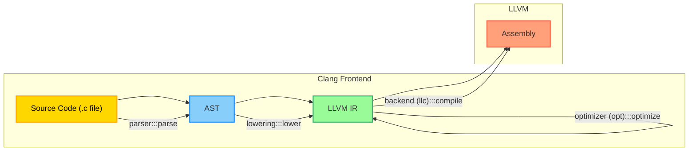
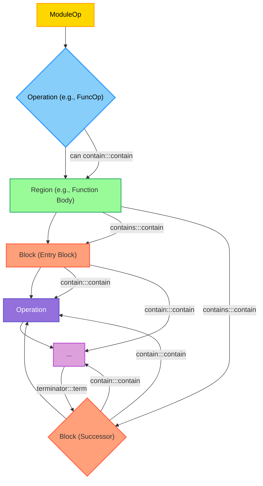
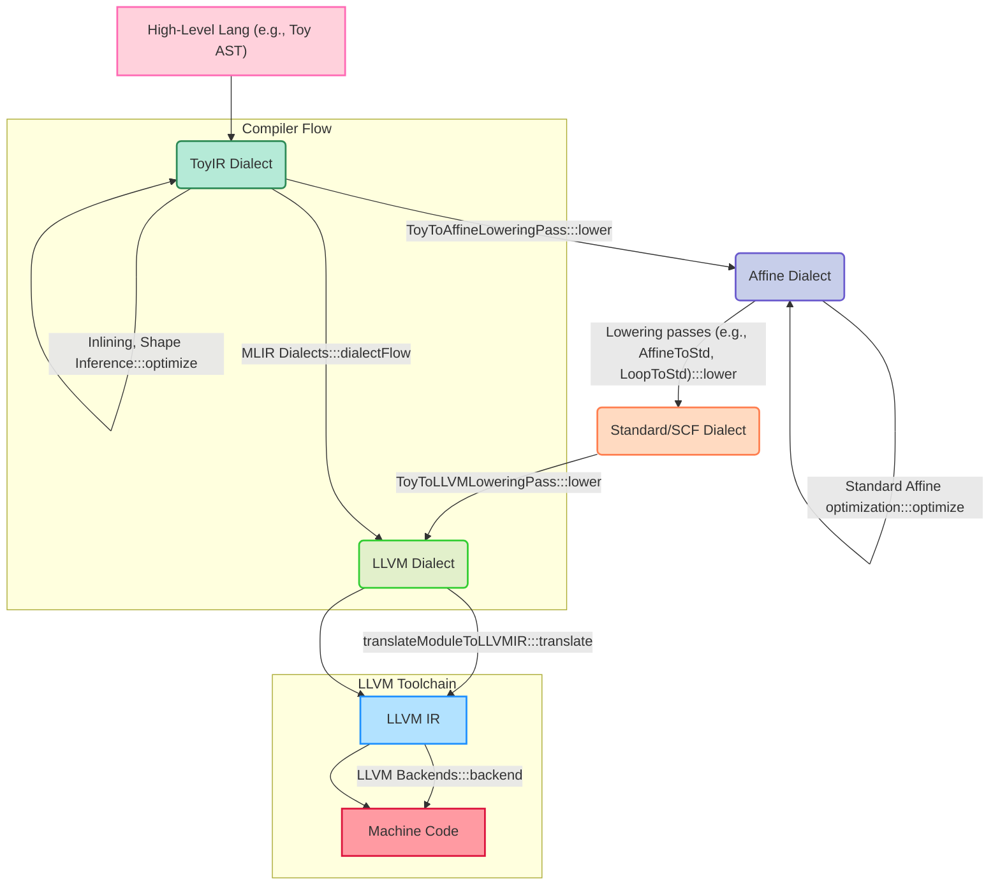

# 🚀 Understanding Compilers: LLVM IR & MLIR 🌌

---

## Welcome! 👋🎉

*   **Title:** Understanding Compilers: LLVM IR & MLIR
*   **Goal:** Demystify Intermediate Representations (IRs) and how they power modern compilers. 🧠
*   **Key takeaway:** Reading IR reveals how the compiler *thinks* about your code. 💭

---

## Why Care About Compiler IRs? 🤔🔍

*   **For Performance Critical Code:** Understanding your optimizer's IR is a useful tool. ⚡
*   **Beyond Assembly:** 🏗️
    *   Reading assembly helps understand what your *processor* is doing. 💻
    *   Learning LLVM IR helps understand what your *compiler* is doing to create highly optimized code. 🛠️
*   **Developer Productivity:** Compilers are fundamental tools that boost developer productivity by automating the conversion between different levels of abstraction. �

---

## What is LLVM? 🛠️🏗️

*   **Umbrella Name:** "LLVM" is an umbrella name for a number of software components used to build compilers. 🌂
*   **Flagship Product:** Clang, a high-end C/C++/Objective-C compiler. 🏆
*   **Compiler Architecture:** Clang follows the orthodox compiler architecture: 🔄
    1.  **Frontend (Parser):** Parses source code into an Abstract Syntax Tree (AST). 🌳
    2.  **Lowering:** Converts AST into an **Intermediate Representation (IR)**. ⬇️
    3.  **Optimizer (Middle-end):** Transforms IR into "better" IR. ✨
    4.  **Backend (llc):** Converts IR into machine code for a particular platform. 💾

*Diagram based on.* 📊

---

## LLVM IR: The Core Language 📖🔧

*   **Popular & Well-Documented:** LLVM IR is very popular, well-documented, and reasonably well-specified, allowing it to be treated as a programming language. 📚
*   **Compilation Target:** It's a very good compilation target due to its documentation and stability, allowing language implementers to reuse thousands of engineering hours. ⏳
*   **Forms:** LLVM IR exists as a binary format (bitcode) and a human-readable text format (using `.ll` extension). 💽📝
    *   Compilers like Clang (`clang++ -S -emit-llvm foo.cc`) and Rust (`rustc --emit=llvm-ir foo.rs`) can emit LLVM IR. 🎯
*   **Strongly Typed:** Unlike most assembly languages, LLVM IR is strongly typed and requires explicit type annotations almost everywhere. 🏷️

---

## LLVM IR: Basic Structure - Functions & Types 📝🧩

*   **Function Definitions:** Introduced with `define`. 🏗️
    *   Example: `define void @do_nothing () { ret void }`. 🎭
*   **External Symbols:** `declare` brings external symbols (functions without a body) into scope, similar to C. 🌐
*   **Sigils:** User-defined symbols start with a sigil indicating type: 🔣
    *   `@`: Global and functions (addressable, `ptr`-typed when used as a value). 🌍
    *   `%`: Local variables, often called "registers" (LLVM IR is like assembly for an abstract machine with infinite registers). 💾
*   **Primitive Types:** 🧱
    *   `iN`: Arbitrary-bit integers (e.g., `i32`, `i64`). No inherent signed/unsigned, defined by instructions. `i1` is used for booleans. 🔢
    *   `void`: Only used as a return value. 🕳️
    *   `ptr`: Untyped pointer. 👉
*   **Arithmetic Operations:** `add`, `sub`, `mul`, `and`, `or`, `xor`, `shl`, `sdiv`, `udiv`, `srem`, `urem`, `ashr`, `lshr`. ➕➖✖️
*   **Type Conversion:** `trunc`, `zext` (zero-extend), `sext` (sign-extend). 🔄

---

## LLVM IR: Control Flow & SSA 🔄🔄

*   **Function Body:** Resembles assembly – a list of labels and instructions. 📜
*   **Basic Blocks:** A sequence of non-control flow operations, ending with a control flow instruction. They form the Control Flow Graph (CFG). 🧱
*   **Branch Instruction (`br`):** General branch operation. 🌿
    *   Conditional: `br i1 %cond, label %a, label %b` (if/else). 🤔
    *   Unconditional: `br label %a` (simple goto). 🏃
*   **Switch Instruction (`switch`):** Similar to C switch, easier for LLVM to generate jump tables. 🔀
*   **`unreachable` Instruction:** Represents a codepath the compiler assumes is never executed. Triggers undefined behavior (UB) upon being called. ☠️
    *   Used in dead code elimination (DCE): `unreachable`s "bubble upwards" in the CFG, dissolving parts of it. 💀
*   **Static Single Assignment (SSA):** Every register is assigned by at most one instruction per function. ✋
    *   **Advantages:** Simplifies optimizations like global value numbering and constant-folding. 🎯
    *   Mutation is reinterpreted as "versions" of a variable (e.g., `%x.1 = add i32 %x.0, %y.0`). 🔄
*   **Phi Nodes (`phi`):** Handle values where control flow merges (e.g., in loops). 🔄
    *   Selects a value based on which basic block was jumped from. 🎚️
    *   Can refer to values not defined in all dominating blocks, allowing dynamic versions. 🎭

---

## LLVM IR: Aggregates & Other Operations 🏗️🧩

*   **Aggregate Types:** 🧱
    *   `[n x T]`: Arrays (e.g., `[1024 x i8]`). 📦
    *   `{T1, T2, ...}`: Structs (fields indexed, no names). `<{...}>` for packed structs. 🏛️
    *   `<n x T>`: Vectors (for SIMD operations). ➕
*   **Aggregate Operations:** 🛠️
    *   `insertvalue`, `extractvalue`: Statically access/change struct/array fields (does *not* mutate in-place due to SSA). 👐
*   **`getelementptr` (GEP):** Pointer arithmetic instruction. 👉
    *   Calculates an offset pointer into a struct or array. 📍
    *   Takes an untyped pointer, has an extra index parameter (even for single elements), and explicit types for indices. 🔢
*   **Function Calls:** `call`, `invoke` (for C++ `try {}` blocks). 📞
*   **Synchronization:** `load atomic`, `store atomic`, `fence`, `cmpxchg` (CAS), `atomicrmw` (read-modify-write). ⚛️
    *   Can be marked `volatile` (compiler-invisible side-effects). 💥
*   **Reinterpret Operations:** 🔄
    *   `bitcast`: Converts non-aggregate types of same bit width (e.g., `double` to `i64`). Used to cast pointer types before opaque pointers were standard. 🎭
    *   `inttoptr`, `ptrtoint`: Convert between pointer and integer data (sketchy semantics). 🤹
*   **Intrinsics:** Functions starting with `llvm.` (e.g., `llvm.memcpy`). 🎩

---

## LLVM IR: Undefined Behavior (UB) & Poison ☠️💀

*   **Purpose of UB:** LLVM declares certain machine states "impossible" to enable optimizations and simplify code. 🎭
*   **Examples:** `unreachable` execution, division by zero, out-of-bounds memory access. 🚫
*   **Poisoned Values:** Many LLVM UBs factor through "poisoned values". ☣️
    *   A poison value can "take on every value at once," convenient for optimization. 🎭
    *   Using a poison value (e.g., as a pointer in `load`/`store`/`call`, or as a denominator in `udiv`, or in `br`/`switch`) *must* be UB. ☠️
    *   LLVM can propagate UB forward through dataflow analysis (e.g., "time traveling UB"). ⏳
*   **Poison Generation:** Many operations generate poison instead of defined behavior (e.g., `add nsw` for signed overflow). ➗
    *   `udiv exact`, `getelementptr inbounds`, `nnan`/`ninf` floating point operations. 🌊
*   **Key Distinction:** Creating poison is *not* UB; *only using it is*. This is weaker than C's UB, allowing more reordering and simplification of operational semantics. ⚖️

---

## LLVM IR: The Other Side of the Coin 🪙⚖️

*   **Centralization:** LLVM IR's role as the central IR for frontends and backends creates a high bar for changing the IR itself. 🎯
    *   **Forks:** Leads to many different flavors of LLVM forks, which are costly to maintain and update. 🔄
*   **Evolution vs. Compatibility:** LLVM IR co-evolves with analyses and transformations, resulting in weak compatibility guarantees. ⏳
    *   **Hardware Drivers:** Not ideal for device drivers (e.g., in cell phones) where updates are infrequent, leading to compatibility issues. 📱
    *   **SPIR Example:** Standard Portable Intermediate Representation (SPIR) tried to use LLVM IR but found it unsuitable for bridging software and hardware, leading to SPIR-V. 🌉
*   **Domain Specificity:** The fundamental problem is strong coupling across application domains and compiler transformation paths. 🧩
    *   LLVM's design, while good for general languages, struggles to provide top performance for *all* applications and specialized hardware. 🎯

---

## Enter MLIR: Multi-Level IR 🌟🚀

*   **What is MLIR?** An open-source compiler infrastructure project developed as a sub-project of LLVM. 🏗️
*   **Purpose:** Provides a modular and extensible IR framework to facilitate building domain-specific compilers and improve compilation for heterogeneous computing platforms. 🧩
*   **Origin:** Developed by Chris Lattner at Google in 2018 to address challenges in building compilers for modern workloads like machine learning, hardware acceleration, and high-level synthesis. 📅
    *   It was open-sourced as part of the LLVM monorepository in 2019. 🎁
*   **Multi-Level:** MLIR models computations at various abstraction levels and progressively lowers them toward machine code. ⬇️
*   **Beyond ML:** While it serves machine learning, MLIR is a general-purpose compiler infrastructure for any domain ("ML" stood for "everything but Machine Learning" initially). 🌐

---

## MLIR Core Concepts: Operations & Regions 💡🧩

*   **Operations (Ops):** The fundamental unit in MLIR. ⚙️
    *   Fully extensible; no fixed list of operations. ∞
    *   Represent concepts from high-level (function definitions, ML graphs) to low-level (target-specific instructions). 📊
    *   **SSA-based:** Values are results of exactly one operation or block argument. MLIR avoids traditional PHI nodes by using block arguments in conjunction with control-flow operation operands. 🔄
    *   Can return zero or more results, take zero or more operands, have attributes and properties, and contain regions. 🎛️
*   **Regions:** Ordered lists of MLIR Blocks. 🏗️
    *   Contained within operations, enabling hierarchical structures. 🏛️
    *   **Encapsulation:** Values defined in a region do not escape to the enclosing region. 🛡️
    *   **Types of Regions:** 🔄
        *   **SSACFG Regions:** Describe control flow between blocks (like traditional basic blocks in LLVM IR). Control flow enters via the "entry" block. 🚪
        *   **Graph Regions:** For concurrent semantics without control flow, or modeling generic directed graphs. Only contain a single basic block. 🕸️

*Diagram based on.* 📊

---

## MLIR Core Concepts: Dialects ✨🗣️

*   **The Key to Extensibility:** Dialects are MLIR's primary mechanism for extensibility. 🔑
*   **Logical Grouping:** A dialect is a self-contained namespace of: 🗂️
    *   **Operations** ⚙️
    *   **Types** 🏷️
    *   **Attributes** 🎨
    *   **Other constructs** 🧩
*   **Defining Rules and Semantics:** Dialects provide: 📜
    *   **Verifiers** for operation invariants (e.g., `toy.print` must have a single operand). ✔️
    *   **Semantics** (e.g., `has-no-side-effects`, `constant-folding`, `CSE-allowed`). 🎭
    *   **Passes** (analysis, transformations, dialect conversions). 🔄
    *   Possibly custom parser and assembly printer for readability. 📖
*   **Co-existence:** Multiple dialects can co-exist within one module. 🤝
*   **Examples of Built-in Dialects:** `arith`, `memref`, `affine` (for polyhedral optimization), `scf` (structured control flow), `func`, `gpu`, `tosa`, and even `llvm` (mapping to LLVM IR). 📚

---

## MLIR: Traits & Interfaces 🤝🎭

*   **Traits:** Mixins that define additional functionality, properties, and verification on an Attribute/Operation/Type. 🎨
    *   Indicate that an operation satisfies certain properties (e.g., `Commutative`, `Terminator`, `ZeroOperands`). ✔️
    *   Presence checked opaquely by analyses/transformations. 🔍
*   **Interfaces:** Abstract classes that allow opaque manipulation of MLIR entities. 🖇️
    *   Group of methods implemented by an attribute/dialect/operation/type. 🧩
    *   **Cornerstone of Extensibility & Reusability:** Allow generic transformation passes to operate on operations without knowing their actual implementation, relying only on interface properties. ♻️
    *   Example: `CallOpInterface` for callgraph modeling, `ShapeInferenceOpInterface`. 📞
    *   Dialects implement interfaces to enable and reuse generic transformations. 🔄

---

## MLIR: Progressive Lowering ⬇️🏗️

*   **Multi-level Abstraction:** MLIR enables dialects and operations to model concepts at different abstraction levels (vertically). 📊
*   **Seamless Flow:** Different levels can be represented using the same infrastructure, making the flow between them seamless. 🌊
*   **Lowering Process:** 🔄
    *   **Dialect Conversion:** The primary mechanism for lowering, converting operations from source dialects into "legal" target dialects. 🔧
        *   **Conversion Target:** Defines legal operations/dialects for the conversion. 🎯
        *   **Operation Conversion:** Dag-to-Dag rewrite patterns transform illegal ops to legal ones. 🛠️
        *   **Type Conversion:** Transforms illegal types to legal ones. 🔄
    *   **Modes:** Can be `Partial` (subset of operations converted) or `Full` (all operations converted). ↔️
*   **Benefits:** ✨
    *   Separates concerns, allowing each layer to focus on a dedicated task. 🎯
    *   Avoids lowering too early and losing high-level information. ⏳
    *   Allows mixing levels of abstraction (e.g., Toy dialect ops cohabiting with affine and other ops in the same function). 🤝

---

*Diagram inspired by.* 📊

---

## MLIR in Action: Ecosystem & Applications 🌐🚀

*   **Growing Ecosystem:** MLIR has fostered a vibrant open-source ecosystem, production compilers, and experimental toolchains. 🌱
*   **Key Applications:** 🎯
    *   **Machine Learning:** TensorFlow/XLA, IREE, torch-mlir, ONNX-MLIR, TPU-MLIR, Triton-MLIR. 🤖
    *   **Systems Programming Languages:** Mojo (integrates Python syntax with low-level performance, built on MLIR). 🐍
    *   **Hardware Design:** CIRCT project for high-level synthesis. 🖥️
    *   **Runtimes:** TFRT. ⚡
    *   **Research:** Quantum computing, homomorphic encryption. 🔬
*   **"Dialects, dialects, dialects":** The infrastructure helps define operations and form logical groups (dialects) based on functionality. 🗣️

---

## The Future: Democratizing AI Compute? 💭🌍

*   **Unbundling Compilers & IRs:** MLIR aims to further decouple compilers, breaking down monolithic IRs into mixable dialects. 🧩
    *   Enables defining new "partial" IRs easily. ➕
    *   Developing domain-specific compilers could become as simple as choosing, customizing, and mixing existing dialects. 🛠️
*   **Challenges:** ⚠️
    *   Early explosion of AI-specific dialects created fragmentation and made some designs not ideal for evolving requirements (e.g., GenAI, PyTorch support). 💥
    *   Identity crisis: Is MLIR a general compiler framework or an AI solution? 🤔
    *   Governance and corporate rivalries have complicated its evolution towards a unified end-to-end AI solution. 🏢
*   **The Vision:** MLIR seeks to harmonize compute across many different hardware makers and accelerate development of domain-specific solutions. 🌈

---

## Key Takeaways & Discussion 🎯💡

*   **LLVM IR:** Powerful, well-documented, SSA-based, but its monolithic nature and weak compatibility can be limiting for specialized domains. ⚖️
*   **MLIR:** A framework for *building* compilers, offering multi-level abstraction, extensible dialects, and reusable infrastructure (operations, regions, traits, interfaces). 🏗️
*   **The Evolution:** From single, monolithic IRs to modular, decentralized approaches, allowing greater flexibility and domain-specific optimizations. 🔄

---

## Thank You! Questions? 🙏❓

*   **MLIR Project Website:** [https://mlir.llvm.org/](https://mlir.llvm.org/) 🌐
*   **LLVM Project Website:** [https://llvm.org/](https://llvm.org/) 🌐
*   **Sources Consulted:** 📚
    *   "A Gentle Introduction to LLVM IR - mcyoung" 📖
    *   "Compilers and IRs: LLVM IR, SPIR-V, and MLIR - Lei.Chat()" 💬
    *   "MLIR (software) - Wikipedia" 🧠
    *   "MLIR For Beginners: A series of articles on the MLIR framework - Hacker News" 🆕
    *   "MLIR Language Reference" 📖
    *   "MLIR dialect design best practise? : r/Compilers - Reddit" 💬
    *   "MLIR: Multi-Level Intermediate Representation - LLVM" 🏗️
    *   "Open Projects - MLIR - LLVM" 🚪
    *   "What about the MLIR compiler infrastructure? (Democratizing AI Compute, Part 8) - Modular" 🤖
    *   "Writing an LLVM Pass — LLVM 21.0.0git documentation" 📝
