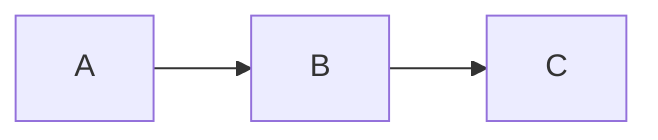

# Converting Presentation Markdown to Remark.js

This document describes how to convert a presentation markdown file (with Mermaid diagrams, LaTeX math, and slide separators) into a Remark.js HTML slideshow. Both patterns used in the `net_optim` site are covered.

---

## 1. Two Remark.js Approaches

| Approach | File | Description |
|----------|------|-------------|
| **Inline** | `quickstart.html` | Markdown lives inside `<textarea id="source">` in the HTML |
| **External source** | `digraphx-remark.html` | HTML loads `.md` source via `remark.create({ sourceUrl: 'file.md' })` |

### Inline pattern (`quickstart.html`)

The markdown content is placed directly inside a `<textarea id="source">` element in the HTML. This is self-contained — the HTML has everything it needs. Best for presentations with Mermaid diagrams and KaTeX math (which need to run initialization JS against the DOM).

### External source pattern (`digraphx-remark.html`)

The HTML is minimal — it loads the markdown from a separate `.md` file via `sourceUrl`. Best for content that doesn't need custom JS initialization (no mermaid, no katex in that page).

### Choosing an approach

- **Use inline** if the presentation has Mermaid diagrams and/or LaTeX math — both need custom JS to render.
- **Use external** if the presentation is pure markdown with code blocks and images only.

---

## 2. Markdown Source Format

A Remark.js presentation markdown file uses standard markdown with two extensions:

### Layout directive

Place at the top of the file to set defaults for all slides:

```markdown
layout: true
class: typo, typo-selection

---
```

The `layout: true` directive means the class above applies to every slide.
Individual slides can override with their own `class:` line.

### Slide separator

Slides are separated by `---` on its own line:

```markdown
## First Slide

Content here

---

## Second Slide

More content
```

### Per-slide class annotation

Add classes for specific slides:

```markdown
count: false
class: nord-dark, middle, center

# Title Slide

This slide is excluded from page count and centered on dark background.
```

Available CSS classes (from `net_optim` theme files):

| Class | Purpose |
|-------|---------|
| `nord-dark` | Dark background (title slides, Q&A) |
| `nord-light` | Light background (section transitions) |
| `middle, center` | Vertically and horizontally centers content |
| `typo, typo-selection` | Default body text styling |
| `pull-left` / `pull-right` | Two-column layout |

---

## 3. Mermaid Diagram Handling

Remark.js does not natively understand ` ```mermaid ` code fences. The `net_optim` site uses a custom convention: wrap mermaid source inside a `.mermaid[` block with `<pre>` tags.

### Before (standard markdown):

````markdown

````

### After (Remark.js compatible):

```markdown
.mermaid[
<pre>
graph LR
    A --> B
    B --> C
</pre>
]
```

The `.mermaid` class is targeted by the initialization JS, which reads the `<pre>` content and passes it to `mermaid.mermaidAPI.render()`.

### Why this format?

The markdown lives inside a `<textarea>` element, so raw HTML tags are treated as text content rather than rendered elements. The `.mermaid[...]` syntax is Remark.js's way of injecting raw HTML into a slide. The `<pre>` preserves whitespace and line breaks inside the mermaid source.

### Key details

- The opening delimiter is `.mermaid[\n<pre>` (`.mermaid[` on its own line, then `<pre>` on the next).
- The closing delimiter is `</pre>\n]`.
- For `flowchart` diagrams using `<br/>` in node labels, the JS code replaces `\n` with `<br/>` (note the double-escaped `\\n` in the JS regex).

---

## 4. LaTeX Math Rendering

The `net_optim` site uses **KaTeX** (not MathJax). It's loaded from the `katex/` directory:

```html
<link rel="stylesheet" type="text/css" href="../katex/katex.min.css" />
<script src="../katex/katex.min.js" type="text/javascript"></script>
<script src="../katex/contrib/auto-render.min.js" type="text/javascript"></script>
```

The auto-render script scans the `#source` textarea and renders math:

```javascript
renderMathInElement(document.getElementById('source'), {
  delimiters: [
    { left: '$$', right: '$$', display: true },
    { left: '$', right: '$', display: false },
  ],
});
```

Both `$...$` (inline) and `$$...$$` (display) math are supported. KaTeX is faster than MathJax and produces cleaner output.

> **Note:** The earlier PDF conversion experiment used MathJax instead. For Remark.js presentations, KaTeX is the standard on this site.

---

## 5. HTML Wrapper Structure

### Inline pattern template

```html
<!doctype html>
<html>
  <head>
    <title>Presentation Title</title>
    <meta charset="utf-8" />
    <meta name="viewport"
      content="user-scalable=no,initial-scale=1,maximum-scale=1,minimum-scale=1,width=device-width" />

    <!-- Stylesheets (order matters) -->
    <link rel="stylesheet" type="text/css" href="../katex/katex.min.css" />
    <link rel="stylesheet" type="text/css" href="../css/spaces.css" />
    <link rel="stylesheet" type="text/css" href="../css/slides.css" />
    <link rel="stylesheet" type="text/css" href="../css/nord-dark.css" />
    <link rel="stylesheet" type="text/css" href="../css/nord-light.css" />
    <link rel="stylesheet" type="text/css" href="../css/font-nord.css" />
    <link rel="stylesheet" type="text/css" href="../css/bg-nord.css" />
    <link rel="stylesheet" type="text/css" href="../css/style.css" />
  </head>
  <body>
    <textarea id="source">
      <!-- Remark.js markdown content goes here -->
    </textarea>

    <!-- Dependencies -->
    <script src="../js/remark.min.js"></script>
    <script src="../js/quasar.umd.min.js"></script>
    <script src="../js/mermaid.min.js"></script>
    <script src="../katex/katex.min.js" type="text/javascript"></script>
    <script src="../katex/contrib/auto-render.min.js" type="text/javascript"></script>

    <script>
      // Initialization code (see sections below)
    </script>
  </body>
</html>
```

### External source pattern template

```html
<!doctype html>
<html>
  <head>
    <title>Presentation Title</title>
    <meta charset="utf-8" />
    <meta name="viewport" content="..." />
    <link rel="stylesheet" type="text/css" href="../css/spaces.css" />
    <link rel="stylesheet" type="text/css" href="../css/slides.css" />
    <link rel="stylesheet" type="text/css" href="../css/nord-dark.css" />
    <link rel="stylesheet" type="text/css" href="../css/nord-light.css" />
    <link rel="stylesheet" type="text/css" href="../css/font-nord.css" />
    <link rel="stylesheet" type="text/css" href="../css/bg-nord.css" />
    <link rel="stylesheet" type="text/css" href="../css/style.css" />
    <script>
      function create() {
        return remark.create({
          sourceUrl: 'presentation.md',
          ratio: '4:3',
          highlightStyle: 'tomorrow-night-eighties',
          highlightLines: true,
          countIncrementalSlides: false,
          navigation: { scroll: false, touch: true, click: false },
        });
      }
    </script>
  </head>
  <body onload="slideshow = create()">
    <script src="../js/remark.min.js"></script>
  </body>
</html>
```

---

## 6. Remark.js Configuration

The core configuration options used across the site:

```javascript
var slideshow = remark.create({
  ratio: '16:9',           // Aspect ratio: '4:3' or '16:9'
  highlightStyle: 'tomorrow-night-eighties',  // Code highlight theme
  highlightLines: true,    // Enable line highlighting in code blocks
  countIncrementalSlides: false,  // Don't count fragment steps as slides
  navigation: {
    scroll: false,          // Disable scroll navigation
    touch: true,            // Enable touch swipe navigation
    click: false,           // Disable click navigation
  },
});
```

---

## 7. Mermaid Initialization

The Mermaid initialization code handles the `.mermaid[<pre>...` custom format:

```javascript
mermaid.mermaidAPI.initialize({
  startOnLoad: false,    // We render manually
  theme: 'forest',       // Mermaid color theme
  themeCSS: '.tick>text { font-size:26px; }',
  gantt: { fontSize: 26, barHeight: 30, useMaxWidth: false },
});

var mermaidCmps = document.querySelectorAll('.mermaid');
for (var i = 0; i < mermaidCmps.length; i++) {
  var mermaidCmp = mermaidCmps[i];
  var insertSvg = function (svgCode, bindFunctions) {
    mermaidCmp.innerHTML = svgCode;
  };

  var graphDefinition = '';
  let pCmps = mermaidCmp.querySelectorAll('pre');
  for (var pCmp of pCmps) {
    graphDefinition += pCmp.textContent.replace(/\\n/g, '<br/>');
  }

  var graph = mermaid.mermaidAPI.render('graphDiv' + i, graphDefinition, insertSvg);
}
```

Key points:
- `startOnLoad: false` because we call `render()` manually after the slideshow is ready.
- The `.mermaid` elements' `<pre>` children are read for source text.
- `\\n` is replaced with `<br/>` for multi-line node labels in `flowchart` diagrams.
- Each diagram gets a unique `graphDiv` + index as its container ID.

---

## 8. Conversion Pipeline (MD → Remark.js HTML)

When converting a standard presentation markdown file to the Remark.js format, these transformations are needed:

### Step 1: Split into slides

Split the source markdown on `\n---\n` (a `---` horizontal rule on its own line). Each segment becomes one slide.

### Step 2: Add layout directive

Prepend to the overall content:

```markdown
layout: true
class: typo, typo-selection

---
```

### Step 3: Annotate slides with classes

- **Title slide** → `count: false` + `class: nord-dark, middle, center`
- **Section transition slides** (standalone `## Heading`) → `class: nord-light, middle, center`
- **Thank you / Q&A slide** → `count: false` + `class: nord-dark, middle, center`
- **Content slides** → inherit default `typo, typo-selection` from layout

### Step 4: Convert mermaid code fences

Replace ` ```mermaid ` blocks with the `.mermaid[<pre>...</pre>]` syntax:

```
Find:    ```mermaid\n...\n```
Replace: .mermaid[\n<pre>\n...\n</pre>\n]
```

### Step 5: Wrap in HTML

Build the HTML document with the correct stylesheet links, script sources, and initialization code matching either the inline or external-source pattern.

### Step 6: Handle assets

- Image references (``) need the SVG files at the correct relative path from the HTML output directory.
- If the output directory differs from the source directory, copy or symlink images.

---

## 9. Common Pitfalls

### Trailing `---` separator

Do NOT add a trailing `---` after the last slide — Remark.js will create an empty final slide.

### Encoding

Windows consoles (PowerShell, cmd) default to GBK/CP437 and cannot print emoji. Use `$env:PYTHONIOENCODING='utf-8'` when running Python scripts that write or print Unicode.

### Path resolution

When output target uses `../../` relative paths from the workspace root, trace carefully:

```
Workspace:  D:/github/py/netlistx/
../../luk036.github.io/net_optim/  →  D:/github/luk036.github.io/net_optim/
```

Use `os.path.abspath(os.path.join(...))` to verify resolved paths.

### Mermaid `---` inside diagrams

Mermaid uses `---` as edge connectors and `-.-` as dashed edges. Within a `.mermaid[` block these are harmless (inside `<pre>`), but if converting naively at the text level, ensure you don't split on `---` that appears inside mermaid source.

### `<br/>` in flowchart labels

Mermaid flowchart nodes use `<br/>` for multi-line labels. In the `.mermaid[<pre>...</pre>]` format inside a `<textarea>`, these HTML tags are preserved as text. The JS code handles the `\n` → `<br/>` replacement for mermaid source text.

### Dependency paths

All CSS and JS paths are relative to the HTML file's location under `net_optim/`. Verify that symlinks or copies of `css/`, `js/`, and `katex/` exist at the expected parent level.

---

## 10. Quick Reference: Slide Class Cheatsheet

```markdown
layout: true
class: typo, typo-selection

---

count: false
class: nord-dark, middle, center

# Title Slide

Dark background, centered, excluded from counter.

---

## Content Slide

Default styling from layout.

---

class: nord-light, middle, center

## Section Heading

Light background for topic transitions.

---

count: false
class: nord-dark, middle, center

## Q&A 🎤

Final slide, dark background, no page number.
```

---

## 11. Conversion Script Pattern

The conversion can be automated with a Python script. The core pipeline:

```python
def convert_mermaid_blocks(md_text):
    """Replace ```mermaid blocks with .mermaid[<pre>...</pre>]."""
    ...

def build_remark_content(md_text):
    """Split slides, add directives, convert mermaid, wrap."""
    slides = md_text.split('\n---\n')
    # Prepend layout directive
    # Annotate first/last/section slides
    # Join with --- separators
    ...

def build_html(remark_content, title):
    """Wrap in HTML with CSS, JS, initialization."""
    ...
```

---

## References

- [Remark.js Wiki](https://github.com/gnab/remark/wiki)
- [Mermaid.js Documentation](https://mermaid.js.org/)
- [KaTeX Documentation](https://katex.org/docs/autorender.html)
- Site examples: `quickstart.html`, `digraphx-remark.html`, `hadlock-remark.html`
