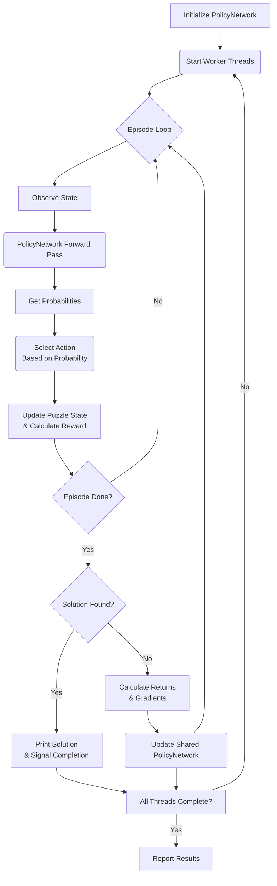

layout: true
class: typo, typo-selection

---

count: false
class: nord-dark, middle, center

# Finding Optimal Cyclic Quorum Systems 📊
### Exhaustive Search and Deep Reinforcement Learning 🧠⚡

@luk036 👨‍💻

2025-06-09 📅

---

### Introduction - The Need for Coordination 🤝

*   In distributed computing, coordination, consistency, and efficient resource use among independent entities are paramount. ⚖️
*   Think of multiple computers needing to agree on something or access a shared resource without conflicts. 💻🔗
*   **Quorum Systems** have emerged as a fundamental concept for achieving these goals. 🏛️
    *   They are particularly useful in scenarios like mutual exclusion (ensuring only one process accesses a critical resource at a time) or reliable distributed data processing. 🔒📈

---

### What is a Quorum System? ❓

*   A quorum system $\mathcal{Q}$ is a collection of subsets (called **quorums**) of participating entities (sites or processes) $U = \{P_1, P_2, \dots, P_N\}$. 🧩
*   The **defining property** is the **non-empty intersection property**:
    *   Any two quorums must have at least one entity in common. ✖️➡️✔️
    *   $\forall G, H \in \mathcal{Q} : G \cap H \neq \emptyset$.
*   This property is crucial because it guarantees that any two operations requiring a quorum will interact at some common site, allowing for conflict detection and resolution. ⚡🔍

---

### Desirable Properties of Quorum Systems 🌟

*   Beyond the intersection property, certain additional properties are often desirable for fairness and efficiency in applications like distributed mutual exclusion. ⚖️
*   **A1. Site Inclusion:** Each site is in its own quorum (implicitly assumed or explicitly defined). 🏠
*   **A2. Non-empty Intersection:** The core property - any two quorums must intersect. ✖️➡️✔️
*   **A3. Equal Work:** All quorums have the same size, denoted by $d$ or $k$.
    *   $|S_i| = d$ for all $i \in \{1, 2, \dots, N\}$. ⚖️📏
*   **A4. Equal Responsibility:** Each site is contained in the same number of quorums.
    *   For all $P_i \in U$, $P_i$ is contained in $d$ quorums. 🔄
*   A set of quorums satisfying A3 and A4 is called **symmetric**. 🔄⚖️

---

### Challenges in Designing Optimal Quorums 🏗️

*   Designing efficient, fair, and scalable quorum systems is challenging. 🧩
*   Goal: Minimize the quorum size $d$ while maintaining properties like equal work and equal responsibility. 🎯
*   **Theoretical Lower Bound** on quorum size $d$: approximately $O(\sqrt{N})$ or $O(\sqrt{P})$ for $N$ sites or $P$ processes, satisfying symmetric properties.
    *   More precisely, $d \ge \lceil \sqrt{N} \rceil$. 📉
*   Finding systems that meet this lower bound (e.g., where $N = d(d-1) + 1$) is equivalent to constructing finite projective planes, which don't exist for all system sizes. 🏗️❌
*   Exhaustive search for optimal quorum systems is computationally intractable for large $N$. ⏳💻
*   Grid-based systems are simple but often result in quorum sizes roughly twice the lower bound ($2\sqrt{N} - 1$ for square grids). 📊

---

### Introducing Cyclic Quorum Systems (CQS) 🔄

*   **Cyclic Quorum Systems (CQS)** offer a structured approach to constructing quorum systems that often achieve or come very close to the desirable symmetric properties. 🏗️
*   They are based on concepts from combinatorial theory, particularly **cyclic block designs** and **cyclic difference sets**. 🧮
*   **Defining Characteristic:** The entire set of $N$ quorums can be generated **cyclically** from a single **base quorum**. 🔄

---

### CQS Definition and Construction 🏗️

*   Let the $N$ sites be $U = \{0, 1, \dots, N-1\}$, viewed as elements in $\mathbb{Z}_N$ (additive group modulo N). 🔢
*   **Definition:** A group of cyclic quorums $\{B_0, B_1, \dots, B_{N-1}\}$ is derived from a base quorum $B_0 = \{a_1, a_2, \dots, a_k\} \subseteq \{0, 1, \dots, N-1\}$ by adding $i$ modulo $N$ to each element.
    *   $B_i = \{a_1 + i, a_2 + i, \dots, a_k + i\} \pmod N$. 🔄
*   For this collection to be a valid quorum system, it must satisfy the **non-empty intersection property**: $B_i \cap B_j \neq \emptyset$ for all $i, j$. ✖️➡️✔️
*   The cyclic construction **automatically ensures** the **equal work** ($|B_i| = d$ for all $i$) and **equal responsibility** (each element appears in $d$ quorums) properties. ⚖️

---

### CQS and Difference Sets 🔢

*   The existence and properties of CQS are deeply connected to the theory of **difference sets**. 🧮
*   **Definition: Cyclic $(N, d, \lambda)$-Difference Set**
    *   A set $M = \{a_1, \dots, a_d\} \subseteq \{0, \dots, N-1\}$ is a cyclic $(N, d, \lambda)$-difference set if for every $m \not\equiv 0 \pmod N$, there are exactly $\lambda$ pairs $(a_i, a_j)$ with $a_i, a_j \in M$ such that $a_i - a_j \equiv m \pmod N$. 🔄
*   For CQS, the crucial concept is the **Relaxed Cyclic $(N, d)$-Difference Set**.
    *   **Definition: Relaxed Cyclic $(N, d)$-Difference Set**
        *   A set $M = \{a_1, \dots, a_d\} \subseteq \{0, \dots, N-1\}$ is a relaxed $(N, d)$-difference set if for every $m \not\equiv 0 \pmod N$, there is **at least one** pair $(a_i, a_j)$ with $a_i, a_j \in M$ such that $a_i - a_j \equiv m \pmod N$. 🔄

---

### Connection Formalized ⚡

*   A base quorum $B_0$ forms a valid CQS if and only if the set of its elements forms a **relaxed $(N, d)$-difference set**. 🔄
*   The intersection property $B_i \cap B_j \neq \emptyset$ for all $i, j$ is equivalent to requiring that for any difference $m = j - i \pmod N$, there exist $a_u, a_v \in B_0$ such that $a_u + i \equiv a_v + j \pmod N$.
*   This simplifies to $a_u - a_v \equiv j - i \pmod N \equiv m \pmod N$.
*   Thus, **every possible non-zero difference modulo $N$ must be formed by at least one pair of elements in the base quorum's set**. 🔄

---

### CQS Construction Example (N=8, d=4) 📊

*   Let's use the base quorum $B_0 = \{0, 1, 2, 4\} \pmod 8$ for $N=8$, $d=4$.
*   The full set of 8 quorums is generated by adding $i \in \{0, 1, \dots, 7\} \pmod 8$:
    *   $B_0 = \{0, 1, 2, 4\}$
    *   $B_1 = \{1, 2, 3, 5\}$
    *   $B_2 = \{2, 3, 4, 6\}$
    *   $B_3 = \{3, 4, 5, 7\}$
    *   $B_4 = \{4, 5, 6, 0\}$
    *   $B_5 = \{5, 6, 7, 1\}$
    *   $B_6 = \{6, 7, 0, 2\}$
    *   $B_7 = \{7, 0, 1, 3\}$
*   This set forms a valid CQS. ✅
*   Equal work: Each quorum has size 4. ⚖️
*   Equal responsibility: Each site appears in 4 quorums (e.g., site 0 in $B_0, B_4, B_6, B_7$). 🔄
*   Intersection property: E.g., $B_0 \cap B_1 = \{1, 2\} \neq \emptyset$. ✖️➡️✔️

---

### Finding the Optimal Base Quorum 🔍

*   Finding a base quorum $B_0$ that forms a CQS with the minimum size $d$ is equivalent to finding a **relaxed $(N, d)$-difference set with minimum $d$**. 🎯
*   For specific $N$ values (like $N = d^2 - d + 1$ where $d-1$ is a prime power), cyclic $(N, d, 1)$-difference sets (Singer difference sets) exist and form efficient CQS. �
*   For other values of $N$, finding the optimal base quorum often requires **search**. 🔍
*   The challenge is finding the base quorum $\{a_1, \dots, a_d\}$ for a given $N$ such that the resulting cyclic sets satisfy the intersection property and $d$ is minimized. 🏗️

---

### What is a Difference Cover? 🧩

*   The problem of finding the base quorum for an optimal CQS is closely related to the **Difference Cover Problem**. 🔄
*   **Definition: Difference Cover**
    *   Given a range of numbers from 0 to $N-1$ and a required set size $d$.
    *   Task: Select $d$ numbers $\{a_1, \dots, a_d\}$ such that the **positive differences** between every unique pair of selected numbers **modulo $N$ include all possible values from 1 to $N-1$ at least once**. 🔄
*   This is equivalent to finding a relaxed $(N, d)$-difference set where the differences cover all non-zero residues modulo $N$.
*   Constraints for valid inputs $(N, d)$: $N \ge 3$, $d \ge 3$, and $N \le d(d-1)+1$. 📏

---

### Finding Difference Covers: Two Approaches 🛠️

*   The source explores two distinct computational approaches for finding difference covers (and thus optimal CQS base quorums):
    1.  A systematic **Recursive Search Algorithm**. 🔍
    2.  A trial-and-error method based on **Reinforcement Learning (RL)**. 🤖
*   Both approaches leverage **parallel processing** to enhance efficiency. ⚡

---

### Approach 1: Recursive Search 🔄

*   This is a **systematic, algorithmic method**. 🧠
*   Described as a "puzzle solver". 🧩
*   Based on a **sophisticated recursive search algorithm combined with parallel processing**. ⚡
*   Core logic: `DcGenerator` class.
*   Methodology: **Generate-and-test with intelligent pruning**. ✂️
*   Process:
    *   Build potential solutions incrementally, adding one number at a time. 🔢
    *   Calculate differences with previously selected numbers. ➖
    *   Track which differences have been seen using an array (`differences`). 📊

---

### Recursive Search: Backtracking and Pruning ↩️

*   Key technique: **Backtracking**.
    *   When a partial solution cannot lead to a valid complete solution ("dead end"), the algorithm backs up, undoes the last choice, and tries another. ↩️
    *   `step_forward` and `step_backward` functions manage updating and reverting difference counts. 🔄
*   **Optimization (Pruning):** Avoid wasting time on impossible paths. ✂️
    *   Before exploring deeper, check if enough unique differences are covered by the current partial set. 🔍
    *   Abandon paths immediately if this condition isn't met. ❌
    *   Use arrays to track seen differences (`differences`) and count unique ones (`count`). 📊

---

### Recursive Search: Symmetry Breaking 🔄

*   **Symmetry-breaking optimizations** are included to avoid generating equivalent solutions (rotations, reversals). 🔄
*   `CheckRev` function compares the current partial sequence with its reversal. ↩️
*   Inspired by efficient algorithms for generating combinatorial objects like **bracelets with fixed density**. 🧮
*   Bracelets are symmetric under both rotation and reversal. Efficiently generating them, especially with a fixed number of non-zero elements (fixed density), requires advanced techniques to avoid generating duplicates. 🔄
*   Algorithms for fixed-density necklaces (rotation symmetry) and general bracelets (rotation + reversal symmetry) exist, aiming for **Constant Amortized Time (CAT)** performance. ⏱️
*   The `BraceFD` function implements this bracelet generation logic within the difference cover search. 🧩

---

### Recursive Search: Parallel Processing ⚡

*   Search is accelerated using **parallel processing** via a **thread pool**. 🧵
*   Work is divided by having different threads **start their searches from different initial values**. 🔢
*   `InitParallel` function initializes threads and enqueues tasks for different starting values. 🏁
*   Each thread runs an instance of `DcGenerator`.
*   Multiple CPU cores work simultaneously on different parts of the search space, significantly reducing computation time. ⏱️

### Exhaustive Search: Speeding it Up ⚡️🤝🚀

*   To speed up computation, the program uses **parallel processing** through a **thread pool**.
*   It **divides the work** by having different threads start their searches from different initial values.
*   This allows **multiple CPU cores** to work simultaneously. 💻💻💻
*   The program coordinates these parallel workers and displays progress. 📊

.mermaid[
<pre>
graph LR
    Main[Main Thread]:::main -->|Divides Range| Pool[Thread Pool]:::pool
    Pool --> Worker1[Worker 1]:::worker1
    Pool --> Worker2[Worker 2]:::worker2
    Pool --> Worker3[...]:::worker3
    Pool --> WorkerN[Worker N]:::workerN
    Worker1 --> Search1[Recursive Search]:::search
    Worker2 --> Search2[Recursive Search]:::search
    WorkerN --> SearchN[Recursive Search]:::search
    Search1 --> Results[Results]:::results
    Search2 --> Results
    SearchN --> Results

    classDef main fill:#673AB7,stroke:#5E35B1,color:white
    classDef pool fill:#3F51B5,stroke:#3949AB,color:white
    classDef worker1 fill:#FF5722,stroke:#E64A19,color:white
    classDef worker2 fill:#FF9800,stroke:#F57C00,color:black
    classDef worker3 fill:#FFC107,stroke:#FFA000,color:black
    classDef workerN fill:#FFEB3B,stroke:#FBC02D,color:black
    classDef search fill:#4CAF50,stroke:#388E3C,color:white
    classDef results fill:#607D8B,stroke:#455A64,color:white
</pre>
]

---

### Approach 2: Reinforcement Learning (RL) 🤖

*   Treats the problem as a **strategic game** solved by AI. 🎮
*   Uses **Reinforcement Learning (RL)**, akin to teaching through **trial and error**. 🔄
*   The AI learns by experimenting with strategies and improving over time. 📈
*   Core component: **PolicyNetwork** (an artificial "brain"). 🧠
    *   A neural network for decision-making.
    *   Typically three layers: Input, Hidden, Output.
    *   Learns over time by remembering successful decisions.
    *   Initialized using Xavier initialization, uses ReLU activation in hidden layers.

---

### RL Process: Episodes and State 📊

*   Learning occurs over many **episodes** (attempts to pick $d$ numbers). 🔄
*   **State Representation:** In each step, the AI observes the **current situation** of the puzzle.
    *   Which numbers are already picked.
    *   Which mathematical differences are covered.
    *   Converted into a numerical **"state vector"**.
*   State vector size: 2*N.
    *   N elements for chosen numbers (1 if chosen, 0 otherwise).
    *   N elements for covered residues/differences (1 if covered, 0 otherwise).

---

### RL Process: Decision Making 🤔

*   **Decision Making:** The PolicyNetwork takes the state vector as input.
    *   **Forward pass:** Processes input through layers.
    *   Calculates **"logits"** (raw scores) for picking each number.
    *   Converts logits to **probabilities** using the **Softmax function**.
    *   $$ \text{Softmax}(z_i) = \frac{e^{z_i - \max(z)}}{\sum_j e^{z_j - \max(z)}} $$
    *   Masks already chosen numbers.
    *   More promising numbers get higher probabilities.
*   **Action Selection:** AI **randomly selects a number** based on the probabilities.
    *   Allows exploring different strategies.

---

### RL Process: Reward and Learning 🎯

*   **Reward Calculation:** After selecting a number, the AI gets a **"reward"**.
    *   Based on **how many new differences the choice covers**.
    *   More new coverage = higher reward.
*   **Learning:** After an episode, the AI analyzes outcomes and rewards.
    *   If successful (found solution, good rewards), adjust PolicyNetwork parameters.
    *   Adjustment involves calculating **"gradients"** (how parameters should change) using a policy gradient method.
    *   Parameters (weights W, biases b) updated:
        $$ \text{parameter} = \text{parameter} - \text{LEARNING RATE} \times \text{gradient} $$
    *   Rewards are often aggregated into discounted returns and normalized for stable training.

---

### RL Process: Parallel Processing ⚡

*   Learning accelerated using **multi-threading**. 🧵
*   Multiple **"worker threads"** run simultaneously, acting as independent AI agents.
*   All workers **share the same PolicyNetwork**.
*   Workers learn from each other by contributing calculated gradients to update the shared network.
*   `workerThread` function encapsulates logic for a single thread.
*   Uses **mutexes** (`networkMutex`, `outputMutex`) for thread-safe access to shared network and output.
*   `findDifferenceCoverRL` orchestrates the process.

---

### RL Process Diagram (Mermaid) 📊

*Illustrative flow of the RL learning process.*

---

### Comparison of Approaches ⚖️

| Feature          | Recursive Search 🔍                        | Reinforcement Learning 🤖             |
|------------------|-----------------------------------------|------------------------------------|
| **Approach**     | Systematic, algorithmic search     | Trial and error, learned experience |
| **Guarantee**    | Guaranteed to find solutions if they exist (within search space) | May not find solution (within episode limit) |
| **Discovery**    | Explicit pruning rules         | Discovers strategies based on rewards |
| **Core Logic**   | Recursive function calls (`GenD`, `BraceFD`) | Neural Network (`PolicyNetwork`) |
| **Efficiency**   | CAT proved for related problems (bracelets) | Aims to learn efficient strategy; no guarantee of finding optimal solution quickly |
| **Parallelism**  | Dividing search space by start values | Multiple agents sharing/updating network |

---

### Applications 🏗️

*   The mathematical structures (CQS, Difference Covers) have broad utility:
*   **Distributed Mutual Exclusion:** CQS provide symmetric quorum sets close to the theoretical lower bound. 🔒
*   **Distributed All-Pairs Algorithms:** CQS enable minimal data replication ($O(N/\sqrt{P})$ memory) and load-balanced computation with an "all-pairs property". 🔄
*   **Wireless Sensor Networks (WSNs):** CQS-Pair supports heterogeneous asynchronous wakeup scheduling. 📡
*   **Attention Computation in Deep Learning:** CQS-Attention scales standard self-attention for long sequences, offering memory efficiency ($O(1/W)$ per worker) and parallelism. 🧠
*   **Coding Theory, Cryptography, Signal Processing:** Difference Covers have practical significance in these fields. 🔐

---

### Conclusion 🏁

*   Quorum systems are essential for coordination in distributed systems, but designing efficient ones is challenging. 🏗️
*   Cyclic Quorum Systems (CQS), based on combinatorial theory (difference sets), offer a structured approach to construct symmetric systems with minimal quorum size. 🔄
*   Finding optimal CQS involves finding minimum size relaxed difference sets (difference covers). 🔍
*   Two distinct, parallelized approaches were explored for this:
    *   **Recursive Search:** Systematic, guaranteed, uses backtracking and pruning. 🔄
    *   **Reinforcement Learning:** Learned strategy, trial-and-error with a neural network. 🤖
*   Both methods benefit significantly from parallel computation. ⚡
*   CQS and Difference Covers have applications spanning distributed systems, AI, WSNs, and more. 🌐

---

### Future Work 🔮

*   Continued search for optimal CQS base quorums for larger $N$. 🔍
*   Further development of efficient search algorithms, potentially combining systematic and learned methods. 🛠️
*   Exploring applications in new domains. 🌍
*   Addressing potential bottlenecks in centralized components of CQS management. ⚡
*   Further research on generating related combinatorial objects efficiently. 🧮

---

count: false
class: nord-dark, middle, center

# Q&A 🎤
