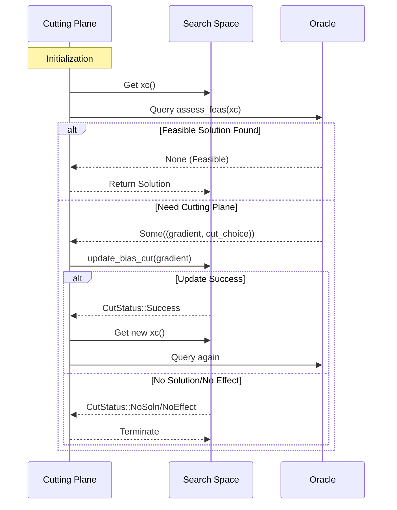
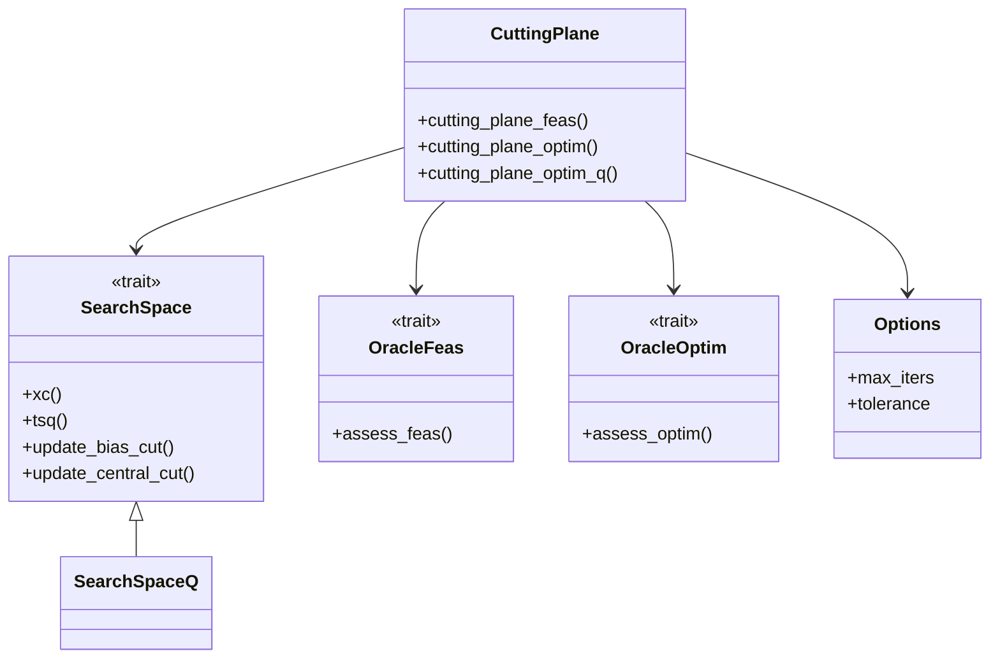
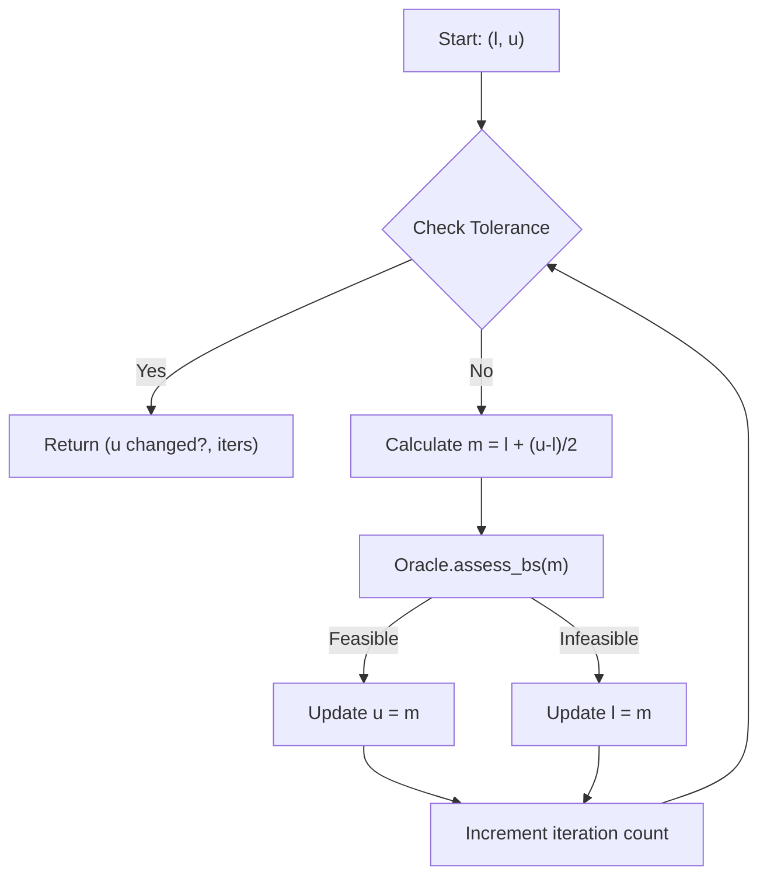
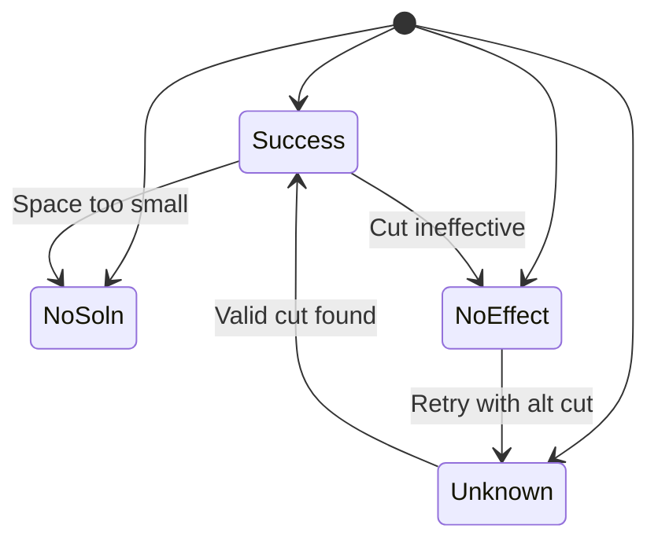

### 1. Sequence Diagram (Cutting Plane Process)

### 2. Class Diagram (Main Components)

### 3. Flowchart (Binary Search Process)

### 4. State Diagram (CutStatus Transitions)

### Key Color Coding:
- **Cutting Plane**: Orange
- **Search Space**: Blue
- **Oracle**: Green
- **Data Flow**: Purple arrows
- **Control Flow**: Red diamonds (decisions)

These diagrams collectively visualize:
1. The dynamic interaction between components
2. The hierarchical structure of traits and implementations
3. The binary search logic flow
4. State transitions during cut updates

The sequence diagram emphasizes the iterative query-update cycle, while the class diagram shows the Rust trait architecture. The flowchart and state diagram provide complementary perspectives on algorithm control flow.

Here are the enhanced **colorful** Mermaid diagrams with explicit color coding for each component and interaction:

### Color Legend:
| Color       | Component               | Meaning                     |
|-------------|-------------------------|-----------------------------|
| `#ffaa00`   | Cutting Plane           | Algorithm control           |
| `#00ccff`   | Search Space            | State management            |
| `#00ff88`   | Oracle                  | Feasibility/optimization    |
| `#66ff66`   | Success/Feasible        | Positive outcome            |
| `#ff6666`   | Failure/Infeasible      | Negative outcome            |
| `#ff9933`   | Neutral/Retry           | Intermediate state          |
| `#cccccc`   | Config/Unknown          | Parameters or unknowns      |

These diagrams now visually distinguish components, outcomes, and data flows using **vibrant colors** while maintaining logical clarity.