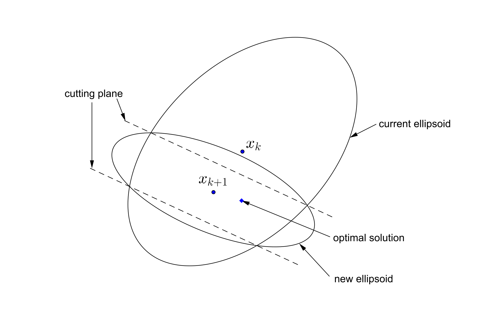
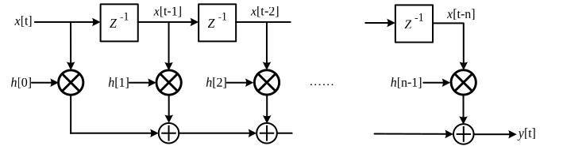
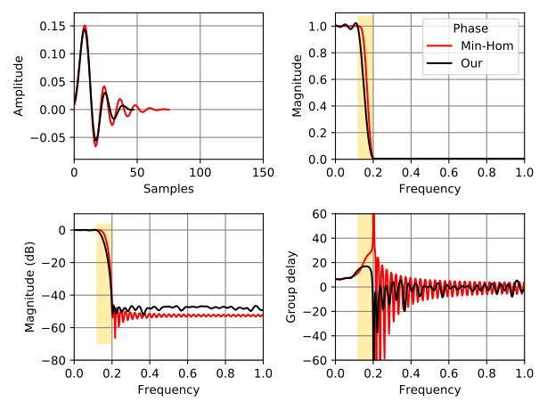
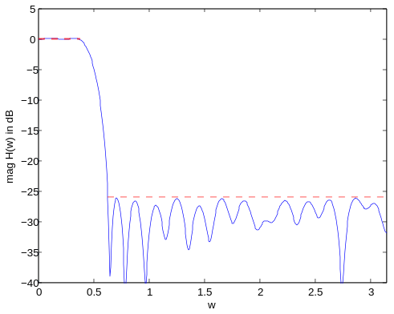

class: middle, center

Ellipsoid method Revisited
==========================

Wai-Shing Luk

2019-04-25

---

Basic Ellipsoid Method
----------------------

-   An ellipsoid $\mathcal{E}(x_c, P)$ is specified as a set
    $$\\{x \mid (x-x_c)P^{-1}(x-x_c) \leq 1 \\},$$ where $x_c$ is the
    center of the ellipsoid, $P$ is a symmetric positive matrix (SPD).


---

Python code
-----------

```python
import numpy as np

class ell:
    def __init__(self, val, x):
        '''ell = { x | (x - xc)' * P^-1 * (x - xc) <= 1 }'''
        self._n = n = len(x)
        self.c1 = float(n*n) / (n*n-1)
        self._xc = x.copy()
        if np.isscalar(val):
            self.P = val * np.identity(n)
        else:
            self.P = np.diag(val)

    def update_core(self, calc_ell, cut): ...
    def calc_cc(self, ...): ...
    def calc_dc(self, ...): ...
    def calc_ll(self, ...): ...
```

---

Updating the ellipsoid (deep-cut)
---------------------------------

-   Calculation of minimum volume ellipsoid covering:
    $$\mathcal{E} \cap \\{z \mid g^\mathsf{T} (z - x_c) + h \leq 0 \\}$$
-   Let $\tilde{g} = P\,g$, $\tau^2 = g^\mathsf{T} P g$.
-   If $n \cdot h < -\tau$ (shallow cut), no smaller ellipsoid can be
    found.
-   If $h > \tau$, intersection is empty.
-   Otherwise, $$x_c^+ = x_c - \frac{\rho}{ \tau^2 } \tilde{g}, \qquad
    P^+ = {\color{orange}\delta\cdot}\left(P - \frac{\sigma}{ \tau^2 } \tilde{g}\tilde{g}^\mathsf{T}\right)$$
    where

  $$\rho = \frac{ {\color{red}\tau}+nh}{n+1}, \qquad
  \sigma = \frac{2\rho}{ {\color{red}\tau}+h}, \qquad
  \delta = \frac{n^2(\tau^2 - h^2)}{(n^2 - 1)\tau^2}$$

---

Updating the ellipsoid (cont'd)
-------------------------------

-   Even better, split $P$ into two variables $\kappa \cdot Q$
-   Let $\tilde{g} = Q \cdot g$, $\omega = g^\mathsf{T} Q g$,
    $\tau^2 = {\kappa\cdot} \omega$,
    $$x_c^+ = x_c - \frac{\rho}{\omega} \tilde{g}, \qquad
    Q^+ = Q - \frac{\sigma}{\omega} \tilde{g}\tilde{g}^\mathsf{T}, \qquad
    \kappa^+ =  {\delta\cdot} \kappa
     $$
-   Reduce $n^2$ multiplications per iteration.
-   Note:
    -   The determinant of $Q$ decreases monotonically.
    -   The range of $\delta$ is $(0, \frac{n^2}{n^2 - 1})$

---

Python code (updating)
----------------------

```python
def update_core(self, calc_ell, cut):
    g, beta = cut
    Qg = self.Q.dot(g)
    omega = g.dot(Qg)
    tsq = self.kappa * omega
    if tsq <= 0.: return 4, 0. # unlikely
    status, params = calc_ell(beta, tsq)
    if status != 0:
        return status, tsq
    rho, sigma, delta = params
    self._xc -= (rho / omega) * Qg
    self.Q -= (sigma / omega) * np.outer(Qg, Qg)
    self.kappa *= delta
    return status, tsq
```

---

Python code (deep cut)
----------------------

```python
def calc_dc(self, beta, tsq):
    '''deep cut'''
    tau = math.sqrt(tsq)
    if beta > tau:
        return 1, None    # no sol'n
    if beta == 0:
        return self.calc_cc(tau)
    n = self._n
    gamma = tau + n*beta
    if gamma < 0.:
        return 3, None  # no effect
    rho = gamma/(n + 1)
    sigma = 2*rho/(tau + beta)
    delta = self.c1*(tsq - beta**2)/tsq
    return 0, (rho, sigma, delta)
```

---

Central Cut
-----------

-   A Special case of deep cut when $\beta = 0$
-   Deserve a separate implement because it is much simplier.
-   Let $\tilde{g} = Q\,g$, $\tau = \sqrt{\kappa\cdot\omega}$,

$$\rho = {\tau \over n+1}, \qquad
  \sigma = {2 \over n+1}, \qquad
  \delta = {n^2 \over n^2 - 1}$$

---

Python code (central cut)
----------------------

```python
def calc_cc(self, tau):
    '''central cut'''
    np1 = self._n + 1
    sigma = 2. / np1
    rho = tau / np1
    delta = self.c1
    return 0, (rho, sigma, delta)
```

---

Parallel Cuts
-------------

-   Oracle returns a pair of cuts instead of just one.

-   The pair of cuts is given by $g$ and $(\beta_1, \beta_2)$ such that:
    $$\begin{array}{l}
    g^\mathsf{T} (x - x_c) + \beta_1 \leq 0,  \\\\
    g^\mathsf{T} (x - x_c) + \beta_2 \geq 0,
    \end{array}$$ for all $x \in \mathcal{K}$.

-   Only linear inequality constraint can produce such parallel cut:
    $$ l \leq a^\mathsf{T} x + b \leq u, \qquad L \preceq F(x) \preceq U $$

-   Usually, provide faster convergence.

---

Parallel Cuts (II)
------------------



---

Updating the ellipsoid
----------------------

-   Let $\tilde{g} = Q\,g$, $\tau^2 = \kappa\cdot\omega$.
-   If $\beta_1 > \beta_2$, intersection is empty.
-   If $\beta_1 \beta_2 < -\tau^2/n$, no smaller ellipsoid can be found.
-   If $\beta_2^2 > \tau^2$, it reduces to deep-cut with
    $\alpha = \alpha_1$.
-   Otherwise, $$x_c^+ = x_c - \frac{\rho}{\omega} \tilde{g}, \qquad
    Q^+ = Q - \frac{\sigma}{\omega} \tilde{g}\tilde{g}^\mathsf{T}, \qquad
    \kappa^+ = \delta \kappa$$

    where

$$\begin{array}{lll}
    \bar{\beta} &=& (\beta_1 + \beta_2)/2 \\\\
    \xi^2 &=& (\tau^2 - \beta_1^2)(\tau^2 - \beta_2^2) + (n(\beta_2     \beta_1)\bar{\beta})^2, \\\\
    \sigma &=& (n + (\tau^2 - \beta_1\beta_2 - \xi)/(2\bar{\beta}^2)) / (n + 1), \\\\
    \rho &=& \bar{\beta}\cdot\sigma, \\\\
    \delta &=& (n^2/(n^2-1)) (\tau^2 - (\beta_1^2 + \beta_2^2)/2 + \xi/n) / \tau^2
\end{array}$$

---

Python code (parallel cut)
--------------------------

```python
def calc_ll_core(self, b0, b1, tsq):
    b1sq = b1**2
    if b1sq > tsq:
        return self.calc_dc(b0, tsq)
    if b1 < b0:  # unlikely
        return 1, None  # no sol'n
    if b0 == 0:
        return self.calc_ll_cc(b1, b1sq, tsq)
    n = self._n
    b0b1 = b0*b1
    if n*b0b1 < -tsq:  # unlikely
        return 3, None  # no effect
    b0sq = b0**2
    t0 = tsq - b0sq
    t1 = tsq - b1sq
    bav = (b0 + b1)/2.
    xi = math.sqrt(4*t0*t1 + (n*(b1sq - b0sq))**2)
    sigma = (n + (tsq - b0b1 - xi/2)/(2 * bav**2)) / (n + 1)
    rho = sigma * bav
    delta = self.c1 * (t0 + t1 + xi/n) / (2*tsq)
    return 0, (rho, sigma, delta)
```

---

Example - FIR filter design
--------------------------



-   The time response is: $$y[t] = \sum_{k=0}^{n-1}{h[k]u[t-k]}$$

---

Example - FIR filter design (II)
-------------------------------

-   The frequency response:
    $$H(\omega)~=~\sum_{m=0}^{n-1} h(m)e^{-jm\omega}$$

-   The magnitude constraints on frequency domain are expressed as

    $$L(\omega)~\leq~|H(\omega)|~\leq~U(\omega),~\forall~\omega\in(-\infty,+\infty)$$

    where $L(\omega)$ and $U(\omega)$ are the lower and upper
    (nonnegative) bounds at frequency $\omega$ respectively.

-   The constraint is non-convex in general.

---

Example - FIR filter design (III)
-----------------------------------

-   However, via *spectral factorization*, it can transform into a
    convex one:
    $$L^2(\omega)~\leq~R(\omega)~\leq~U^2(\omega),~\forall~\omega\in(0,\pi)$$
    where
    -   $R(\omega)=\sum_{i=-1+n}^{n-1} r(t)e^{-j{\omega}t} = |H(\omega)|^2$
    -   $\mathbf{r}=(r(-n+1),r(-n+2),...,r(n-1))$ are the
        autocorrelation coefficients.

---

Example - FIR filter design (cont'd)
-----------------------------------

-   $\mathbf{r}$ can be determined by $\mathbf{h}$:

    $$r(t)~=~\sum_{i=-n+1}^{n-1}{h(i)h(i+t)},~t\in\mathbf{Z}.$$

    where $h(t)=0$ for $t < 0$ or $t > n-1$.

-   The whole problem can be formulated as:

$$\begin{array}{ll}
  \text{min}  & \gamma \\\\
  \text{s.t.} & L^2(\omega) \leq R(\omega) \leq U^2(\omega), \; \forall \omega \in [0,\pi]   \\\\
              & R(\omega) > 0, \forall \omega \in [0,\pi]
\end{array}$$

---

Experiment
----------



---

Example - Maximum Likelihood estimation
--------------------------------------

$$\begin{array}{ll}
      \min_{\color{blue}\kappa, p}   &      \log \det (\Omega({\color{blue}p}) + {\color{blue}\kappa}
       \cdot I) + \mathrm{Tr}((\Omega({\color{blue}p}) + {\color{blue}\kappa} \cdot I)^{-1}Y) \\\\
      \text{s.t.} & \Omega({\color{blue}p}) {\color{red}\succeq} 0, {\color{blue}\kappa} {\color{red}\geq} 0 \\\\
 \end{array}$$

Note: the 1st term is concave, the 2nd term is convex

-   However, if there are enough samples such that $Y$ is a positive
    definite matrix, then the function is convex within $[0, 2Y]$

---

Example - Maximum Likelihood estimation (cont'd)
-----------------------------------------------

-   Therefore, the following problem is convex:

$$\begin{array}{ll}
      \min_{\color{blue}\kappa, p}   &   \log \det V({\color{blue}p}) + \mathrm{Tr}(V({\color{blue}p})^{-1}Y) \\\\
      \text{s.t.} & \Omega({\color{blue}p}) + {\color{blue}\kappa} \cdot I = V({\color{blue}p}) \\\\
                    & 0 \preceq V({\color{blue}p}) \preceq 2Y, {\color{blue}\kappa} {>} 0
\end{array}$$

---

class: middle, center

Discrete Optimization
=====================

---

Why Discrete Convex Programming
-------------------------------

-   Many engineering problems can be formulated as a convex/geometric
    programming, e.g. digital circuit sizing

-   Yet in an ASIC design, often there is only a limited set of choices
    from the cell library. In other words, some design variables are
    discrete.

-   The discrete version can be formulated as a Mixed-Integer Convex
    programming (MICP) by mapping the design variables to integers.

---

What's Wrong w/ Existing Methods?
---------------------------------

-   Mostly based on relaxation.

-   Then use the relaxed solution as a lower bound and use the
    branch--and--bound method for the discrete optimal solution.

    -   Note: the branch-and-bound method does not utilize the convexity
        of the problem.

-   What if I can only evaluate constraints on discrete data?
    Workaround: convex fitting?

---

Mixed-Integer Convex Programming
--------------------------------

Consider: $$\begin{array}{ll}
        \text{minimize}      & f_0(x), \\\\
        \text{subject to}    & f_j(x) \leq 0, \; \forall j=1,2,\ldots \\\\
                             & x \in \mathbb{D}.
\end{array}$$ where - $f_0(x)$ and $f_j(x)$ are "convex" - Some design
variables are discrete.

---

Oracle Requirement
------------------

-   The oracle looks for the nearby discrete solution $x_d$ of $x_c$
    with the cutting-plane:
    $$g^\mathsf{T} (x - x_d) + h \leq 0, h \geq 0, g \neq 0$$

-   Note: the cut may be a shallow cut.
-   Suggestion: use different cuts as possible for each iteration (
    e.g. round-robin the evaluation of constraints)

---

Example - Multiplier-less FIR filter design
------------------------------------------



---

class: center, middle

Q & A
=====
