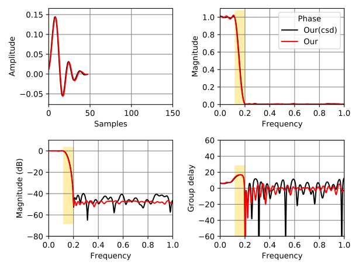

layout: true
class: typo, typo-selection

---

count: false
class: nord-dark, middle, center

# 🏉 Ellipsoid Method Revisited

.pull-left[

## @luk036

2022-11-03

] .pull-right[


] 

---

## 📝 Abstract

The lecture provides a brief history of the ellipsoid method, including its introduction by Shor, Yudin, and Nemirovskii in 1976. The method was used to show that linear programming is polynomial-time solvable. The lecture explains the basic ellipsoid method, which involves specifying an ellipsoid as a set and updating it through deep cuts. It also discusses the central cut and parallel cuts, which can provide faster convergence. The lecture then presents examples of the application of the ellipsoid method, including FIR filter design and maximum likelihood estimation. 

The lecture also briefly touches on the topic of discrete optimization and why it is important in engineering problems, such as digital circuit sizing. It highlights the limitations of existing methods based on relaxation and branch-and-bound approaches. The lecture introduces mixed-integer convex programming and the oracle requirement for finding nearby discrete solutions. It mentions the use of different cuts and suggests evaluating constraints in a round-robin fashion. 

Overall, the lecture explores the ellipsoid method, its variations, and its applications in both continuous and discrete optimization problems.

---

## Some History of Ellipsoid Method [@BGT81]

- Introduced by Shor and Yudin and Nemirovskii in 1976

- Used to show that linear programming (LP) is polynomial-time
  solvable (Kachiyan 1979), settled the long-standing problem of
  determining the theoretical complexity of LP.

- In practice, however, the simplex method runs much faster than the
  method, although its worst-case complexity is exponential.

---

## Basic Ellipsoid Method

- An ellipsoid $\mathcal{E}(x_c, P)$ is specified as a set
  $$\\{x \mid (x-x_c)P^{-1}(x-x_c) \le 1 \\},$$
  where $x_c$ is the center of the ellipsoid.


---

## Python 🐍 code

```python
class Ell:
    """Ellipsoid Search Space
        Ell = {x | (x − xc)' P^−1 (x − xc) ≤ 1}
    """
    def __init__(self, val, x):
        self._n = n = len(x)
        self.c1 = float(n * n) / (n * n - 1)
        self._xc = x.copy()
        if np.isscalar(val):
            self.P = val * np.eye(n)
        else:
            self.P = np.diag(val)

    def update_core(self, calc_ell, cut): ...
    def calc_cc(self, ...): ...
    def calc_dc(self, ...): ...
    def calc_ll(self, ...): ...
```

---

## Updating the ellipsoid (deep-cut)

Calculation of minimum volume ellipsoid ${\color{violet} \mathcal{E}^+}$ covering:
$${\color{red} \mathcal{E} } \cap 
 \\{z \mid {\color{green} g^\mathsf{T} } (z - {\color{orange} x_c}) + {\color{green} \beta} \le 0 \\}. $$


---

## Updating the ellipsoid (deep-cut)

- Let $\tilde{g} = P\,g$, $\tau^2 = g^\mathsf{T} P g$.

- If $n \cdot \beta < -\tau$ (shallow cut), no smaller ellipsoid can be found.

- If $\beta > \tau$, intersection is empty.

Otherwise,

$$
x_c^+ = x_c - \frac{\rho}{ \tau^2 } \tilde{g}, \quad
  P^+ = \delta\cdot\left(P - \frac{\sigma}{\tau^2} \tilde{g}\tilde{g}^\mathsf{T}\right).
$$

where

$$
\rho = \frac{ \tau+n \cdot \beta}{n+1}, \quad
  \sigma = \frac{2\rho}{ \tau + \beta}, \quad
  \delta = \frac{n^2(\tau + \beta)(\tau - \beta)}{(n^2 - 1)\tau^2}.
$$

---

## Updating the ellipsoid (cont'd)

- Even better, split $P$ into two variables $\kappa \cdot Q$

- Let $\tilde{g} = Q \cdot g$, $\omega = g^\mathsf{T}\tilde{g}$, $\tau = \sqrt{\kappa\cdot\omega}$.

  $$
  x_c^+ = x_c - \frac{\rho}{\omega} \tilde{g}, \quad
  Q' = Q - \frac{\sigma}{\omega} \tilde{g}\tilde{g}^\mathsf{T}, \quad
  \kappa^+ =  \delta\cdot\kappa.
  $$

- Reduce $n^2$ multiplications per iteration.

- 👉 Note:
  - The determinant of $Q$ decreases monotonically.
  - The range of $\delta$ is $(0, \frac{n^2}{n^2 - 1})$.

---

## Python 🐍 code (updating)

```python
def update_core(self, calc_ell, cut):
    grad, beta = cut
    grad_t = self._Q @ grad
    omega = grad @ grad_t
    self._tsq = self._kappa * omega
    status = calc_ell(beta)
    if status != CutStatus.Success:
        return status, self._tsq

    self._xc -= (self._rho / omega) * grad_t
    self._Q -= (self._sigma / omega) \
        * np.outer(grad_t, grad_t)
    self._kappa *= self._delta
    return status, self._tsq
```

---

## Python 🐍 code (deep cut)

```python
def _calc_dc(self, beta: float) -> CutStatus:
    """Calculate new ellipsoid under Deep Cut """
    tau = math.sqrt(self._tsq)
    if tau < beta:
        return CutStatus.NoSoln  # no sol'n
    if beta == 0.0:
        self._calc_cc(tau)
        return CutStatus.Success
    n = self._n
    gamma = tau + n * beta
    if gamma < 0.0:
        return CutStatus.NoEffect  # no effect, unlikely

    self._rho = gamma / self._nPlus1
    self._sigma = 2.0 * self._rho / (tau + beta)
    self._delta = self._c1 * (1.0 - beta * (beta / self._tsq))
    return CutStatus.Success
```

---

## Central Cut

- A Special case of deep cut when $\beta = 0$

- Deserve a separate implement because it is much simplier.

- Let $\tilde{g} = Q\,g$, $\tau = \sqrt{\kappa\cdot\omega}$,

$$
\rho = \frac{\tau}{n+1}, \quad
  \sigma = \frac{2}{n+1}, \quad
  \delta = \frac{n^2}{n^2 - 1}.
$$

---

## Central Cut

Calculation of minimum volume ellipsoid ${\color{violet} \mathcal{E}^+}$ covering:
$${\color{red} \mathcal{E} } \cap 
 \\{z \mid {\color{green} g^\mathsf{T} } (z - {\color{orange} x_c}) \le 0 \\}. $$


---

class: middle, center

# Parallel Cuts

---

## Parallel Cuts

- Oracle returns a pair of cuts instead of just one.

- The pair of cuts is given by $g$ and $({\color{green} \beta_0}, {\color{blue} \beta_1})$ such that:

  $$
  \begin{array}{l}
  {\color{green} g^\mathsf{T} } (x - {\color{orange} x_c}) + {\color{green} \beta_0} \leq 0, \\\\
  {\color{blue} g^\mathsf{T} } (x - {\color{orange} x_c}) + {\color{blue} \beta_1} \geq 0,
  \end{array}$$ for all $x \in \mathcal{K}$.
  $$

- Only linear inequality constraint can produce such parallel cut:
  $$ l \le a^\mathsf{T} x + b \le u, \quad L \preceq F(x) \preceq U. $$

- Usually provide faster convergence.

---

## Parallel Cuts

Calculation of minimum volume ellipsoid ${\color{violet} \mathcal{E}^+}$ covering:
$${\color{red} \mathcal{E} } \cap 
 \\{z \mid {\color{green} g^\mathsf{T} } (z - {\color{orange} x_c}) + {\color{green} \beta_0} \le 0 \land
            {\color{blue} g^\mathsf{T} } (z - {\color{orange} x_c}) + {\color{blue} \beta_1} \ge 0  \\}. $$


---

## Updating the ellipsoid (old)

- Let $\tilde{g} = Q\,g$, $\tau^2 = \kappa\cdot\omega$.
- If $\beta_0 > \beta_1$, intersection is empty.
- If $\beta_0 \beta_1 \leq -\tau^2/n$, no smaller ellipsoid can be found.
- If $\beta_1^2 > \tau^2$, it reduces to deep-cut with $\beta = \beta_1$
- Otherwise,
  $$
  x'_c = x_c - \frac{\rho}{\omega} \tilde{g}, \quad
  Q' = Q - \frac{\sigma}{\omega} \tilde{g}\tilde{g}^\mathsf{T}, \quad
  \kappa^+ =  \delta \kappa.
  $$
  where
  $$
  \begin{array}{lll}
    \lambda_0 &=& \tau^2 - \beta_0^2 \\\\
    \lambda_1 &=& \tau^2 - \beta_1^2 \\\\
    \xi &=& \sqrt{4\lambda_0\lambda_1 + n^2(\beta_1^2 - \beta_0^2)^2}, \\\\
    \sigma &=& (n + (2\tau^2 + 2\beta_0\beta_1 - \xi)/{\color{red}(\beta_0 + \beta_1)^2} ) / (n + 1), \\\\
    \rho &=& \sigma(\beta_0 + \beta_1) / 2, \\\\
    \delta &=& (n^2/2(n^2-1)) (\lambda_0 + \lambda_1 + \xi/n) / \tau^2 .
   \end{array}
  $$

---

## Updating the ellipsoid (new)

- Let $\tilde{g} = Q\,g$, $\tau^2 = \kappa\cdot\omega$.
- If $\beta_0 > \beta_1$, intersection is empty.
- If $\tau^2 + n \beta_0 \beta_1 \leq 0$, no smaller ellipsoid can be found.
- If $\beta_1^2 > \tau^2$, it reduces to deep-cut with $\beta = \beta_1$
- Otherwise,
  $$
  x'_c = x_c - \frac{\rho}{\omega} \tilde{g}, \quad
  Q' = Q - \frac{\sigma}{\omega} \tilde{g}\tilde{g}^\mathsf{T}, \quad
  \kappa^+ =  \delta \kappa.
  $$
  where
  $$
  \begin{array}{lll}
    \sigma &=& (n + (2\tau^2 + 2\beta_0\beta_1 - \xi)/(\beta_0 + \beta_1)^2 ) / (n + 1), \\\\
    \rho &=& \sigma(\beta_0 + \beta_1) / 2, \\\\
    \delta &=& (n^2/2(n^2-1)) (\lambda_0 + \lambda_1 + \xi/n) / \tau^2 .
   \end{array}
  $$

---

## Python 🐍 code (parallel cut)

```python
def calc_ll_core(self, b0, b1, tsq):
    if b1 < b0:
        return 1, None  # no sol'n
    n = self._n
    b0b1 = b0*b1
    if n*b0b1 < -tsq:
        return 3, None  # no effect
    b1sq = b1**2
    if b1sq > tsq or not self.use_parallel:
        return self.calc_dc(b0, tsq)
    if b0 == 0:
        return self.calc_ll_cc(b1, b1sq, tsq)
    # parallel cut
    t0 = tsq - b0**2
    t1 = tsq - b1sq
    bav = (b0 + b1)/2
    xi = math.sqrt( t0*t1 + (n*bav*(b1 - b0))**2 )
    sigma = (n + (tsq - b0b1 - xi)/(2 * bav**2)) / (n + 1)
    rho = sigma * bav
    delta = self.c1 * ((t0 + t1)/2 + xi/n) / tsq
    return 0, (rho, sigma, delta)
```

---

## Example - FIR filter design


- The time response is:
  $$y[t] = \sum_{k=0}^{n-1}{h[k]u[t-k]}. $$

---

## Example - FIR filter design (cont'd)

- The frequency response:
  $$H(\omega)~=~\sum_{m=0}^{n-1}{h(m)e^{-jm\omega} }. $$

- The magnitude constraints on frequency domain are expressed as

  $$L(\omega)~\leq~|H(\omega)|~\leq~U(\omega),~\forall~\omega\in(-\infty,+\infty). $$

  where $L(\omega)$ and $U(\omega)$ are the lower and
  upper (nonnegative) bounds at frequency $\omega$ respectively.

- The constraint is non-convex in general.

---

## Example - FIR filter design (II)

- However, via *spectral factorization* [@goodman1997spectral], it can transform into a convex one\ [@wu1999fir]:
  $$L^2(\omega)~\leq~R(\omega)~\leq~U^2(\omega),~\forall~\omega\in(0,\pi), $$

  where

  - $R(\omega)=\sum_{i=-1+n}^{n-1}{r(t)e^{-j{\omega}t} }=|H(\omega)|^2$
  - $\mathbf{r}=(r(-n+1),r(-n+2),...,r(n-1))$ are the
    autocorrelation coefficients.

---

## Example - FIR filter design (III)

- $\mathbf{r}$ can be determined by $\mathbf{h}$:

  $$r(t)~=~\sum_{i=-n+1}^{n-1}{h(i)h(i+t)},~t\in\mathbf{Z}, $$

  where $h(t)=0$ for $t < 0$ or $t > n - 1$.

- The whole problem can be formulated as:

$$
\begin{array}{ll}
  \text{min}  & \gamma \\\\
  \text{s.t.} & L^2(\omega) \le R(\omega) \le U^2(\omega), \; \forall \omega \in [0,\pi]   \\\\
              & R(\omega) > 0, \forall \omega \in [0,\pi]
\end{array}
$$

---

#🧪 Experiment


---

## 📊 Google Benchmark Result

```terminal
3: ------------------------------------------------------------------
3: Benchmark                        Time             CPU   Iterations
3: ------------------------------------------------------------------
3: BM_Lowpass_single_cut    627743505 ns    621639313 ns            1
3: BM_Lowpass_parallel_cut   30497546 ns     30469134 ns           24
3/4 Test #3: Bench_BM_lowpass .................   Passed    1.72 sec
```

---

class: middle, center

# Discrete Optimization

---

## Why Discrete Convex Programming

- Many engineering problems can be formulated as a convex/geometric
  programming, e.g. digital circuit sizing

- Yet in an ASIC design, often there is only a limited set of choices
  from the cell library. In other words, some design variables
  are discrete.

- The discrete version can be formulated as a *Mixed-Integer Convex
  programming* (MICP) by mapping the design variables to integers.

---

## What's Wrong w/ Existing Methods?

- Mostly based on relaxation.

- Then use the relaxed solution as a lower bound and use the
  branch--and--bound method for the discrete optimal solution.

  - 👉 Note: the branch-and-bound method does not utilize the convexity
    of the problem.

- What if I can only evaluate constraints on discrete data?
  Workaround: convex fitting?

---

## Mixed-Integer Convex Programming

Consider:

$$
\begin{array}{ll}
        \text{minimize}      & f_0(x), \\\\
        \text{subject to}    & f_j(x) \le 0, \; \forall j=1,2,\ldots \\\\
                             & x \in \mathbb{D}
\end{array}
$$

where

- $f_0(x)$ and $f_j(x)$ are "convex"
- Some design variables are discrete.

---

## Oracle Requirement

- The oracle looks for the nearby discrete solution ${\color{magenta} x_d}$ of ${\color{orange} x_c}$
  with the cutting-plane:
  $$g^\mathsf{T} (x - {\color{magenta}x_d}) + \beta \le 0, \beta \ge 0, g \neq 0$$

- 👉 Note: the cut may be a shallow cut.

- Suggestion: use different cuts as possible for each iteration
  (e.g. round-robin the evaluation of constraints)

---

## Discrete Cut


---

## Example - Multiplier-less FIR filter design (nnz=3)



---

class: nord-dark, middle, center

.pull-left[

# Q & A 🙋️

] .pull-right[


] 

