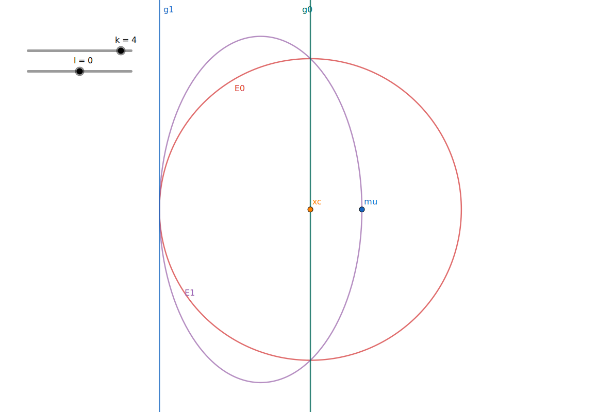

layout: true
class: typo, typo-selection

---

count: false
class: nord-dark, middle, center

# 👁️ Ellipsoid Method Revisited

@luk036 👨‍💻

2024-10-16 📅

---

## 📝 Abstract

This lecture provides a brief history of the ellipsoid method. Then it discusses implementation issues of the ellipsoid method, such as utilizing parallel cuts to update the search space and enhance computation time. In some instances, parallel cuts can drastically reduce computation time, as observed in FIR filter design. Discrete optimization is also investigated, illustrating how the ellipsoid method can be applied to problems that involve discrete design variables. An oracle implementation is required solely for locating the nearest discrete solutions

---

## Some History of Ellipsoid Method [@BGT81]

- Introduced by Shor and Yudin and Nemirovskii in 1976

- Used to show that linear programming (LP) is polynomial-time
  solvable (Kachiyan 1979), settled the long-standing problem of
  determining the theoretical complexity of LP.

- In practice, however, the simplex method runs much faster than the
  method, although its worst-case complexity is exponential.

---

## Basic Ellipsoid Method

- An ellipsoid $\mathcal{E}(x_c, P)$ is specified as a set
  $$\\{x \mid (x-x_c)P^{-1}(x-x_c) \le 1 \\},$$
  where $x_c$ is the center of the ellipsoid.


---

## Updating the ellipsoid (🌒 deep-cut)

.column-2.column-norule[
Calculation of minimum volume ellipsoid ${\color{violet} \mathcal{E}^+}$ covering:

$$
{\color{red} \mathcal{E} } \cap
 \\{z \mid {\color{green} g^\mathsf{T} } (z - {\color{darkorange} x_c}) + {\color{green} \beta} \le 0 \\}.
$$


]

---

## Updating the ellipsoid (🌒 deep-cut)

- Let $\tilde{g} = P\,g$, $\tau^2 = g^\mathsf{T} P g$.

- If $\tau + n \cdot \beta < 0$ (shallow cut), no smaller ellipsoid can be found.

- If $\beta > \tau$, intersection is empty.

Otherwise,

$$
x_c^+ = x_c - \frac{\rho}{ \tau^2 } \tilde{g}, \quad
  P^+ = \delta\cdot\left(P - \frac{\sigma}{\tau^2} \tilde{g}\tilde{g}^\mathsf{T}\right).
$$

where

$$
\rho = \frac{ \tau+n \cdot \beta}{n+1}, \quad
  \sigma = \frac{2\rho}{ \tau + \beta}, \quad
  \delta = \frac{n^2(\tau + \beta)(\tau - \beta)}{(n^2 - 1)\tau^2}.
$$

---

## Updating the ellipsoid (cont'd)

- Even better, split $P$ into two variables $\kappa \cdot Q$

- Let $\tilde{g} = Q \cdot g$, $\omega = g^\mathsf{T}\tilde{g}$, $\tau = \sqrt{\kappa\cdot\omega}$.

  $$
  x_c^+ = x_c - \frac{\rho}{\omega} \tilde{g}, \quad
  Q^+ = Q - \frac{\sigma}{\omega} \tilde{g}\tilde{g}^\mathsf{T}, \quad
  \kappa^+ =  \delta\cdot\kappa.
  $$

- Reduce $n^2$ multiplications per iteration.

- 👉 Note:
  - The determinant of $Q$ decreases monotonically.
  - The range of $\delta$ is $(0, \frac{n^2}{n^2 - 1})$.

---

## 🌓 Central Cut

- A Special case of deep cut when $\beta = 0$

- Deserve a separate implement because it is much simplier.

- Let $\tilde{g} = Q\,g$, $\tau = \sqrt{\kappa\cdot\omega}$,

$$
\rho = \frac{\tau}{n+1}, \quad
  \sigma = \frac{2}{n+1}, \quad
  \delta = \frac{n^2}{n^2 - 1}.
$$

---

## 🌓 Central Cut

.column-2.column-norule[
Calculation of minimum volume ellipsoid ${\color{violet} \mathcal{E}^+}$ covering:

$$
{\color{red} \mathcal{E} } \cap
 \\{z \mid {\color{green} g^\mathsf{T} } (z - {\color{darkorange} x_c}) \le 0 \\}.
$$


]

---

class: middle, center

# ⏸️ Parallel Cuts

---

## ⏸️ Parallel Cuts

- Oracle returns a pair of cuts instead of just one.

- The pair of cuts is given by $g$ and $({\color{green} \beta_0}, {\color{blue} \beta_1})$ such that:

  $$
  \begin{array}{l}
  {\color{green} g^\mathsf{T} } (x - {\color{darkorange} x_c}) + {\color{green} \beta_0} \leq 0, \\\\
  {\color{blue} g^\mathsf{T} } (x - {\color{darkorange} x_c}) + {\color{blue} \beta_1} \geq 0,
  \end{array}
  $$
  for all $x \in \mathcal{K}$.

- Only linear inequality constraint can produce such parallel cut:
  $$ l \le a^\mathsf{T} x + b \le u, \quad L \preceq F(x) \preceq U. $$

- Usually provide faster convergence.

---

## ⏸️ Parallel Cuts

.column-2.column-norule[
Calculation of minimum volume ellipsoid ${\color{violet} \mathcal{E}^+}$ covering:

$$
{\color{red} \mathcal{E} } \cap
 \\{z \mid {\color{green} g^\mathsf{T} } (z - {\color{darkorange} x_c}) + {\color{green} \beta_0} \le 0 \\\\
            \land {\color{blue} g^\mathsf{T} } (z - {\color{darkorange} x_c}) + {\color{blue} \beta_1} \ge 0  \\}.
$$


]

---

## Updating the ellipsoid (old)

- Let $\tilde{g} = Q\,g$, $\tau^2 = \kappa\cdot\omega$.
- If $\beta_0 > \beta_1$, intersection is empty.
- If $\beta_0 \beta_1 \leq -\tau^2/n$, no smaller ellipsoid can be found.
- If $\beta_1^2 > \tau^2$, it reduces to deep-cut with $\beta = \beta_1$
- Otherwise,
  $$
  x^+_c = x_c - \frac{\rho}{\omega} \tilde{g}, \quad
  Q^+ = Q - \frac{\sigma}{\omega} \tilde{g}\tilde{g}^\mathsf{T}, \quad
  \kappa^+ =  \delta \kappa.
  $$
  where
  $$
  \begin{array}{lll}
    \zeta_0 &=& \tau^2 - \beta_0^2 \\\\
    \zeta_1 &=& \tau^2 - \beta_1^2 \\\\
    \xi &=& \sqrt{4\zeta_0\zeta_1 + n^2(\beta_1^2 - \beta_0^2)^2}, \\\\
    \sigma &=& (n + (2\tau^2 + 2\beta_0\beta_1 - \xi)/{\color{red}(\beta_0 + \beta_1)^2} ) / (n + 1), \\\\
    \rho &=& \sigma(\beta_0 + \beta_1) / 2, \\\\
    \delta &=& (n^2/2(n^2-1)) (\zeta_0 + \zeta_1 + \xi/n) / \tau^2 .
   \end{array}
  $$

---

## Updating the ellipsoid (new)

- Let $\tilde{g} = Q\,g$, $\tau^2 = \kappa\cdot\omega$.
- If $\beta_0 > \beta_1$, intersection is empty.
- If $\tau^2 + n \beta_0 \beta_1 \leq 0$, no smaller ellipsoid can be found.
- If $\beta_1^2 > \tau^2$, it reduces to deep-cut with $\beta = \beta_1$
- Otherwise,
  $$
  x^+_c = x_c - \frac{\rho}{\omega} \tilde{g}, \quad
  Q^+ = Q - \frac{\sigma}{\omega} \tilde{g}\tilde{g}^\mathsf{T}, \quad
  \kappa^+ =  \delta \kappa.
  $$
  where
  $$
  \begin{array}{lll}
    \eta &=& \tau^2 + n \beta_0 \beta_1 \\\\
    \bar{\beta} &=& (\beta_0 + \beta_1) / 2 \\\\
    h &=& \frac{1}{2}(\tau^2 + \beta_0\beta_1) + n \bar{\beta}^2, \\\\
    k &=& h + \sqrt{h^2 - (n + 1) \eta \bar{\beta}^2}, \\\\
    \sigma &=& \eta / k, \quad \rho = \sigma \bar{\beta}, \\\\
    \delta &=& 1 + \frac{\eta}{\tau^2(k - \eta)} (\bar{\beta}^2 \sigma - \beta_0\beta_1).
   \end{array}
  $$

---

## Parallel Central Cuts

Calculation of minimum volume ellipsoid ${\color{violet} \mathcal{E}^+}$ covering:

$$
{\color{red} \mathcal{E} } \cap
 \\{z \mid {\color{green} g^\mathsf{T} } (z - {\color{darkorange} x_c}) \le 0 \\\\
            \land {\color{blue} g^\mathsf{T} } (z - {\color{darkorange} x_c}) + {\color{blue} \beta_1} \ge 0  \\}.
$$

---

## Updating the ellipsoid

- Let $\tilde{g} = Q\,g$, $\tau^2 = \kappa\cdot\omega$.
- If $\beta_1^2 > \tau^2$, it reduces to central-cut
- Otherwise,
  $$
  x^+_c = x_c - \frac{\rho}{\omega} \tilde{g}, \quad
  Q^+ = Q - \frac{\sigma}{\omega} \tilde{g}\tilde{g}^\mathsf{T}, \quad
  \kappa^+ =  \delta \kappa.
  $$
  where
  $$
  \begin{array}{lll}
    \alpha^2 &=& \beta^2 / \tau^2 \\\\
    h &=& \frac{n}{2} \alpha^2 \\\\
    r &=& h + \sqrt{h^2 + 1 - \alpha^2}, \\\\
    \rho &=& \frac{\beta}{r + 1} \\\\
    \sigma &=& \frac{2}{r + 1}, \\\\
    \delta &=& \frac{r}{r - 1/n}.
   \end{array}
  $$

---

## 📚 Example - FIR filter design


- The time response is:
  $$y[t] = \sum_{k=0}^{n-1}{h[k]u[t-k]}. $$

---

## 📚 Example - FIR filter design (cont'd)

- The frequency response:
  $$H(\omega)~=~\sum_{m=0}^{n-1}{h(m)e^{-jm\omega} }. $$

- The magnitude constraints on frequency domain are expressed as

  $$L(\omega)~\leq~|H(\omega)|~\leq~U(\omega),~\forall~\omega\in(-\infty,+\infty). $$

  where $L(\omega)$ and $U(\omega)$ are the lower and
  upper (nonnegative) bounds at frequency $\omega$ respectively.

- The constraint is non-convex in general.

---

## 📚 Example - FIR filter design (II)

- However, via *spectral factorization* [@goodman1997spectral], it can transform into a convex one [@wu1999fir]:
  $$L^2(\omega)~\leq~R(\omega)~\leq~U^2(\omega),~\forall~\omega\in(0,\pi), $$

  where

  - $R(\omega)=\sum_{i=-1+n}^{n-1}{ {\color{darkmagenta}r}(t)e^{-j{\omega}t} }=|H(\omega)|^2$
  - $\mathbf{ {\color{darkmagenta}r} }=({\color{darkmagenta}r}(-n+1),{\color{darkmagenta}r}(-n+2),...,{\color{darkmagenta}r}(n-1))$ are the
    autocorrelation coefficients.

---

## 📚 Example - FIR filter design (III)

- $\mathbf{ {\color{darkmagenta}r} }$ can be determined by $\mathbf{h}$:

  $${\color{darkmagenta}r}(t)~=~\sum_{i=-n+1}^{n-1}{h(i)h(i+t)},~t\in\mathbf{Z}, $$

  where $h(t)=0$ for ${\color{darkorange}\gamma} < 0$ or ${\color{darkorange}\gamma} > n - 1$.

- The whole problem can be formulated as:

$$
\begin{array}{ll}
  \text{min}  & {\color{darkorange}\gamma} \\\\
  \text{s.t.} & L^2(\omega) \le R(\omega) \le U^2(\omega), \; \forall \omega \in [0,\pi]   \\\\
              & R(\omega) > 0, \forall \omega \in [0,\pi]
\end{array}
$$

---

#🧪 Experiment


---

## 📊 Google Benchmark Result

```terminal
3: ------------------------------------------------------------------
3: Benchmark                        Time             CPU   Iterations
3: ------------------------------------------------------------------
3: BM_Lowpass_single_cut    627743505 ns    621639313 ns            1
3: BM_Lowpass_parallel_cut   30497546 ns     30469134 ns           24
3/4 Test #3: Bench_BM_lowpass .................   Passed    1.72 sec
```

---

class: middle, center

# 🧩 Discrete Optimization

---

## Why Discrete Convex Programming

- Many engineering problems can be formulated as a convex/geometric
  programming, e.g. digital circuit sizing

- Yet in an ASIC design, often there is only a limited set of choices
  from the cell library. In other words, some design variables
  are discrete.

- The discrete version can be formulated as a _Mixed-Integer Convex
  programming_ (MICP) by mapping the design variables to integers.

---

## What's Wrong w/ Existing Methods?

- Mostly based on relaxation.

- Then use the relaxed solution as a lower bound and use the
  branch--and--bound method for the discrete optimal solution.

  - 👉 Note: the branch-and-bound method does not utilize the convexity
    of the problem.

- What if I can only evaluate constraints on discrete data?
  Workaround: convex fitting?

---

## Mixed-Integer Convex Programming

Consider:

$$
\begin{array}{ll}
        \text{minimize}      & f_0(x), \\\\
        \text{subject to}    & f_j(x) \le 0, \; \forall j=1,2,\ldots \\\\
                             & x \in \mathbb{D}
\end{array}
$$

where

- $f_0(x)$ and $f_j(x)$ are "convex"
- Some design variables are discrete.

---

## 🔮 Oracle Requirement

- The oracle looks for the nearby discrete solution ${\color{darkmagenta} x_d}$ of ${\color{darkorange} x_c}$
  with the cutting-plane:
  $$g^\mathsf{T} (x - {\color{darkmagenta}x_d}) + \beta \le 0, \beta \ge 0, g \neq 0$$

- 👉 Note: the cut may be a shallow cut.

- Suggestion: use different cuts as possible for each iteration
  (e.g. round-robin the evaluation of constraints)

---

## 🧩 Discrete Cut


---

## 📚 Example - Multiplier-less FIR filter design (nnz=3)


---

---

## Complementary Role in Optimization

- Ellipsoid Method Strengths

  Efficiently handles massive constraint sets through separation oracles. Particularly valuable for robust optimization, parametric problems, and certain classes of semidefinite and discrete optimization.

- Interior-Point Method Strengths
  Better practical performance for well-structured convex problems with manageable constraint counts. Works by traversing the interior of the feasible region rather than shrinking enclosing volumes.

---

## A Companion 👫, Not Competitor 🤼‍♂️

- Complementary Strengths
  While the ellipsoid method may be perceived as slower than interior-point methods for solving convex problems, it offers distinct advantages, such as the ability to handle problems with a large or infinite number of constraints.

- Ongoing Improvements
  Techniques like parallel cuts and efficient implementations have helped to improve the performance of the ellipsoid method, making it a valuable tool in the optimization landscape.

- A Collaborative Approach
  Rather than viewing the ellipsoid method as a competitor to other optimization techniques, it should be seen as a companion, with each method offering unique strengths that can be leveraged to solve a wide range of optimization problems effectively.

---

## Conclusion: The Enduring Value of Amazing Oracles

- 🏆 Theoretical Achievement
  Established polynomial-time solvability of linear programming

- 🔮 Separation Oracle Framework
  Enables handling of astronomically large or infinite constraint sets

- 🔧 Complementary Tool
  Valuable for specific problem classes where structure can be exploited

The ellipsoid method remains a cornerstone of modern optimization, with its true versatility lying in the elegant framework that leverages separation oracles. These "amazing oracles" enable tackling previously intractable challenges across robust optimization, network analysis, matrix inequalities, and discrete optimization.

By understanding the strengths of the ellipsoid method and the crucial role of its oracles, researchers and practitioners can effectively leverage its capabilities to address complex optimization problems that would otherwise remain beyond reach.

---

class: nord-dark, middle, center

.column-2.column-norule[

# Q & A️ 🙋


]
