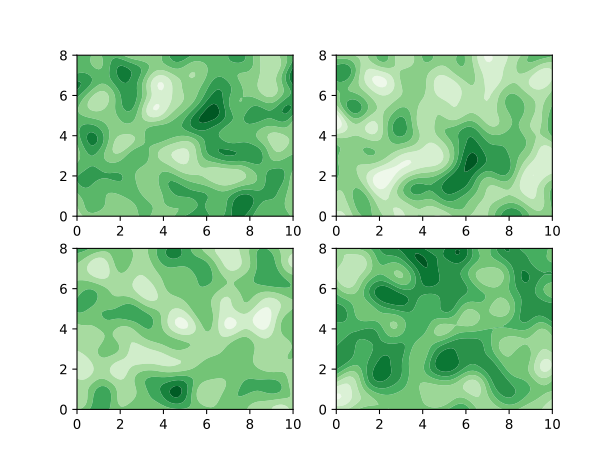
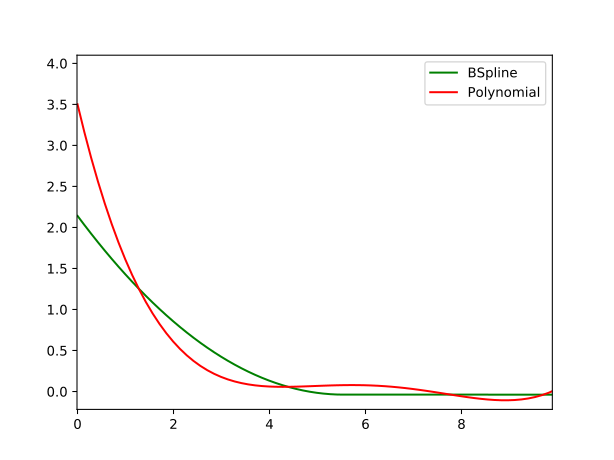
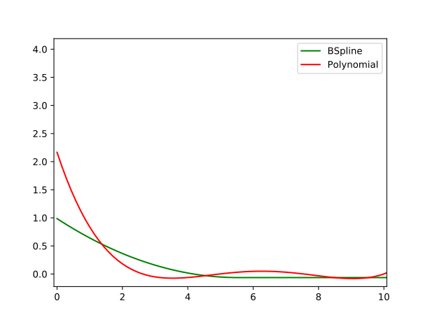
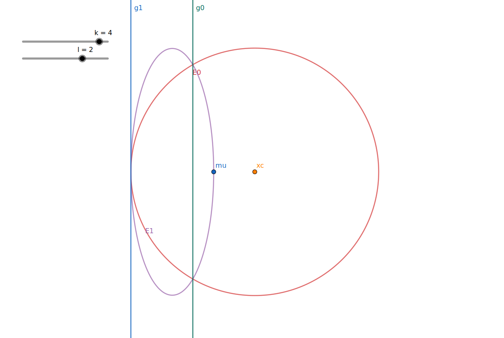
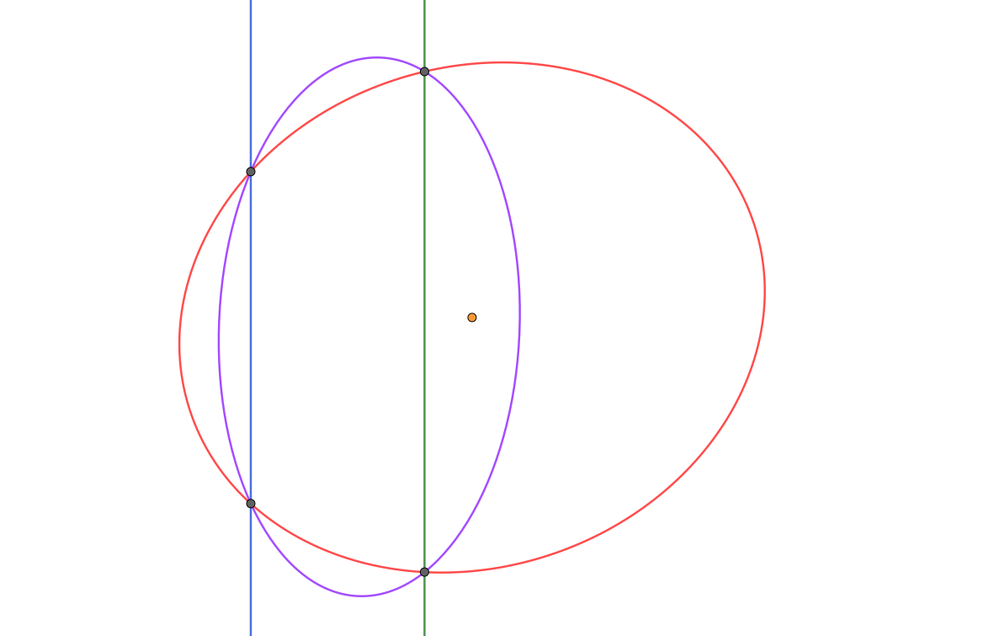

# 🥥 Cutting-plane Method and Its Amazing Oracles 🔮

@luk036 👨🏻‍🏫

2022-11-03 📅

> When you have eliminated the impossible, whatever remains, however
> improbable, must be the truth.

_Sir Arthur Conan Doyle, stated by Sherlock Holmes_

# 🎬 Introduction

## Common Perspective of Ellipsoid Method

- It is widely believed to be inefficient in practice for large-scale problems.

  - Convergent rate is slow, even when using deep cuts.

  - Cannot exploit sparsity.

- It has since then supplanted by the interior-point methods.

- Used only as a theoretical tool to prove polynomial-time solvability of some combinatorial optimization problems.

## But...

- The ellipsoid method works very differently compared with the interior point methods.

- Only require a _separation oracle_. Can play nicely with other techniques.

- While the ellipsoid method itself cannot take advantage of sparsity, the oracle can.

## Consider the ellipsoid method when...

- The number of optimization variables is moderate, e.g. ECO flow, analog circuit sizing, parametric problems

- The number of constraints is large, or even infinite

- Oracle can be implemented effectively.

class: middle, center

# 🥥 Cutting-plane Method Revisited

## 🌰 Convex Set

.pull-left70[

- Let $\mathcal{K} \subseteq \mathbb{R}^n$ be a convex set.
- Consider the feasibility problem:
  - Find a point $x^* \in \mathbb{R}^n$ in $\mathcal{K}$,
  - or determine that $\mathcal{K}$ is empty (i.e., there is no feasible solution)

] .pull-right30[


]

## 🔮 Separation Oracle

.pull-left70[

- When a separation oracle $\Omega$ is _queried_ at $x_0$, it either
  - asserts that $x_0 \in \mathcal{K}$, or
  - returns a separating hyperplane between $x_0$ and $\mathcal{K}$:
    $$
    g^\mathsf{T} (x - x_0) + \beta \le 0, \beta \geq 0, g \neq 0, \;
          \forall x \in \mathcal{K}
    $$

] .pull-right30[


]

## 🔮 Separation Oracle (cont'd)

- $(g, \beta)$ is called a _cutting-plane_, or cut, because it eliminates the half-space $\{x \mid g^\mathsf{T} (x - x_0) + \beta > 0\}$ from our search.

- If $\beta=0$ ($x_0$ is on the boundary of halfspace that is cut), the cutting-plane is called _neutral cut_.

- If $\beta>0$ ($x_0$ lies in the interior of halfspace that is cut), the cutting-plane is called _deep cut_.

- If $\beta<0$ ($x_0$ lies in the exterior of halfspace that is cut), the cutting-plane is called _shallow cut_.

## Subgradient

- $\mathcal{K}$ is usually given by a set of inequalities $f_j(x) \le 0$ or $f_j(x) < 0$ for $j = 1 \cdots m$, where $f_j(x)$ is a convex function.

- A vector $g \equiv \partial f(x_0)$ is called a subgradient of a convex function $f$ at $x_0$ if $f(z) \geq f(x_0) + g^\mathsf{T} (z - x_0)$.

- Hence, the cut $(g, \beta)$ is given by $(\partial f(x_0), f(x_0))$

Remarks:

- If $f(x)$ is differentiable, we can simply take $\partial f(x_0) = \nabla f(x_0)$

## Key components of Cutting-plane method

- A cutting plane oracle $\Omega$
- A search space $\mathcal{S}$ initially large enough to cover $\mathcal{K}$, e.g.
  - Polyhedron $\mathcal{P}$ = $\{z \mid C z \preceq d \}$
  - Interval $\mathcal{I}$ = $[l, u]$ (for one-dimensional problem)
  - Ellipsoid $\mathcal{E}$ = $\{z \mid (z-x_c)P^{-1}(z-x_c) \le 1 \}$

## Generic Cutting-plane method

- **Given** initial $\mathcal{S}$ known to contain $\mathcal{K}$.
- **Repeat**
  1.  Choose a point $x_0$ in $\mathcal{S}$
  2.  Query the cutting-plane oracle at $x_0$
  3.  **If** $x_0 \in \mathcal{K}$, quit
  4.  **Else**, update $\mathcal{S}$ to a smaller set that covers:
      $$\mathcal{S}^+ = \mathcal{S} \cap \{z \mid g^\mathsf{T} (z - x_0) + \beta \le 0\}$$
  5.  **If** $\mathcal{S}^+ = \emptyset$ or it is small enough, quit.

## From Feasibility to Optimization

$$
\begin{array}{ll}
    \text{minimize}     & f_0(x), \\
    \text{subject to}   & x \in \mathcal{K}
\end{array}
$$

- The optimization problem is treated as a feasibility problem with an
  additional constraint $f_0(x) \le \gamma$.

- $f_0(x)$ could be a convex or a _quasiconvex function_.

- $\gamma$ is also called the _best-so-far_ value of
  $f_0(x)$.

## 🌰 Convex Optimization Problem

- Consider the following general form:

  $$
  \begin{array}{ll}
    \text{minimize}     & \gamma, \\
    \text{subject to}   & \Phi(x, t) \le 0, \\
    & x \in \mathcal{K},
  \end{array}
  $$

  where $\mathcal{K}'_\gamma = \{x \mid \Phi(x, t) \le 0\}$
  is the $\gamma$-sublevel set of $\{x \mid f_0(x) \le \gamma\}$.

- 👉 Note: $\mathcal{K'}_\gamma \subseteq \mathcal{K'}_u$ if and only if
  $\gamma \le u$ (monotonicity)

- One easy way to solve the optimization problem is to apply the
  binary search on $\gamma$.

## Shrinking

- Another possible way is, to update the best-so-far
  $\gamma$ whenever a feasible solution $x'$ is found
  by solving the equation:
  $$\Phi(x', t_\text{new}) = 0 \, .$$

- If the equation is difficuit to solve
  but $\gamma$ is also convex w.r.t. $\Phi$,
  then we may create a new varaible, say $z$
  and let $z \le \gamma$.

## Generic Cutting-plane method (Optim)

- **Given** initial $\mathcal{S}$ known to contain
  $\mathcal{K}_\gamma$.
- **Repeat**
  1.  Choose a point $x_0$ in $\mathcal{S}$
  2.  Query the separation oracle at $x_0$
  3.  **If** $x_0 \in \mathcal{K}_\gamma$, update
      $\gamma$ such that
      $\Phi(x_0, t) = 0$.
  4.  Update $\mathcal{S}$ to a smaller set that covers:
      $$\mathcal{S}^+ = \mathcal{S} \cap \{z \mid g^\mathsf{T} (z - x_0) + \beta \le 0\} $$
  5.  **If** $\mathcal{S}^+ = \emptyset$ or it is small enough, quit.

## 📚 Example - Profit Maximization Problem

This example is taken from [@Aliabadi2013Robust].

$$
\begin{array}{ll}
   \text{maximize} & p(A x_1^\alpha x_2^\beta) - v_1 x_1 - v_2 x_2 \\
   \text{subject to}& x_1 \le k.
\end{array}
$$

- $p(A x_1^\alpha x_2^\beta)$ : Cobb-Douglas production function
- $p$: the market price per unit
- $A$: the scale of production
- $\alpha, \beta$: the output elasticities
- $x$: input quantity
- $v$: output price
- $k$: a given constant that restricts the quantity of $x_1$

## 📚 Example - Profit maximization (cont'd)

- The formulation is not in the convex form.
- Rewrite the problem in the following form: $$\begin{array}{ll}
      \text{maximize} & \gamma \\
      \text{subject to} & \gamma  + v_1 x_1  + v_2 x_2 \le p A x_1^{\alpha} x_2^{\beta}\\
                    & x_1 \le k.
      \end{array}$$

## Profit maximization in Convex Form

- By taking the logarithm of each variable:

  - $y_1 = \log x_1$, $y_2 = \log x_2$.

- We have the problem in a convex form:

$$
\begin{array}{ll}
    \text{max}  & \gamma \\
    \text{s.t.} & \log(t + v_1 e^{y_1} + v_2 e^{y_2}) - (\alpha y_1 + \beta y_2) \le \log(pA) \\
                & y_1 \le \log k.
\end{array}
$$

## Area of Applications

- 🛡️ Robust convex optimization
  - oracle technique: affine arithmetic
- Parametric network potential problem
  - oracle technique: negative cycle detection
- Semidefinite programming
  - oracle technique: Cholesky or $LDL^\mathsf{T}$ factorization

class: middle, center

# 🛡️ Robust Convex Optimization

## 🛡️ Robust Optimization Formulation

- Consider:

  $$
  \begin{array}{ll}
    \text{minimize}   & \sup_{q \in \mathbb Q} f_0(x,q), \\
    \text{subject to} & f_j(x,q) \leq 0, \;
     \forall q \in {\mathbb Q}, \; j = 1,2,\cdots,m,
  \end{array}
  $$
  where $q$ represents a set of varying parameters.

- The problem can be reformulated as:
  $$
  \begin{array}{ll}
    \text{minimize}   & \gamma \\
    \text{subject to} & f_0(x,q) < \gamma  \\
    & f_j(x,q) \leq 0, \;
     \forall q \in {\mathbb Q}, \; j = 1,2,\cdots,m.
  \end{array}
  $$

## 📚 Example - Profit Maximization Problem (convex)

$$
\begin{array}{ll}
\text{max}  & \gamma \\
\text{s.t.} & \log(t + \hat{v}_1 e^{y_1} + \hat{v}_2 e^{y_2}) - (\hat{\alpha} y_1 + \hat{\beta} y_2) \le \log(\hat{p}\,A)  \\
                  & y_1 \le \log \hat{k} ,
\end{array}
$$

- Now assume that:
  - $\hat{\alpha}$ and $\hat{\beta}$ vary $\bar{\alpha} \pm e_1$ and
    $\bar{\beta} \pm e_2$ respectively.
  - $\hat{p}$, $\hat{k}$, $\hat{v}_1$, and $\hat{v}_2$ all vary
    $\pm e_3$.

## 📚 Example - Profit Maximization Problem (oracle)

By detail analysis, the worst case happens when:

- $p = \bar{p} - e_3$, $k = \bar{k} - e_3$
- $v_1 = \bar{v}_1 + e_3$, $v_2 = \bar{v}_2 + e_3$,
- if $y_1 > 0$, $\alpha = \bar{\alpha} - e_1$, else
  $\alpha = \bar{\alpha} + e_1$
- if $y_2 > 0$, $\beta = \bar{\beta} - e_2$, else
  $\beta = \bar{\beta} + e_2$

## 🔮 Oracle in Robust Optimization Formulation

- The oracle only needs to determine:
  - If $f_j(x_0, q) > 0$ for some $j$ and $q = q_0$,
    then
    - the cut $(g, \beta)$ =
      $(\partial f_j(x_0, q_0), f_j(x_0, q_0))$
  - If $f_0(x_0, q) \geq \gamma$ for some
    $q = q_0$, then
    - the cut $(g, \beta)$ =
      $(\partial f_0(x_0, q_0), f_0(x_0, q_0) - t)$
  - Otherwise, $x_0$ is feasible, then
    - Let
      $q_{\max} = \argmax_{q \in \mathbb Q} f_0(x_0, q)$.
    - $\gamma := f_0(x_0, q_{\max})$.
    - The cut $(g, \beta)$ =
      $(\partial f_0(x_0, q_{\max}), 0)$

Remark:

- for more complicated problems, affine arithmetic could be used [@liu2007robust].

class: middle, center

# Multi-parameter Network Problem

## Parametric Network Problem

Given a network represented by a directed graph $G = (V, E)$.

Consider:

$$
\begin{array}{ll}
    \text{find} & x, {\color{red}u} \\
    \text{subject to} & {\color{red}u_j} - {\color{red}u_i} \le h_{ij}(x), \; \forall (i, j) \in E ,
   \end{array}
$$

- $h_{ij}(x)$ is the concave function of
  edge $(i,j)$,

- Assume: network is large, but the number of parameters is small.

## Network Potential Problem (cont'd)

Given $x$, the problem has a feasible solution if and only if
$G$ contains no negative cycle. Let $\mathcal{C}$ be a set of all cycles
of $G$.

$$
\begin{array}{ll}
    \text{find} & x \\
    \text{subject to} & w_k(x) \ge 0, \forall C_k \in \mathcal{C} ,
\end{array}
$$

- $C_k$ is a cycle of $G$

- $w_k(x) = \sum_{ (i,j)\in C_k} h_{ij}(x)$.

## Negative Cycle Finding

There are lots of methods to detect negative
cycles in a weighted graph [@cherkassky1999negative], in which Tarjan’s
algorithm [@Tarjan1981negcycle] is one of the fastest algorithms in
practice [@alg:dasdan_mcr; @cherkassky1999negative].

## 🔮 Oracle in Network Potential Problem

- The oracle only needs to determine:
  - If there exists a negative cycle $C_k$ under $x_0$, then
    - the cut $(g, \beta)$ = $(-\partial w_k(x_0), -w_k(x_0))$
  - Otherwise, the shortest path solution gives the value of ${\color{red}u}$.

## 📚 Example - Optimal Matrix Scaling [@orlin1985computing]

- Given a sparse matrix $A = [a_{ij}] \in \mathbb{R}^{N\times N}$.

- Find another matrix $B = U A U^{-1}$ where $U$ is a nonnegative
  diagonal matrix, such that the ratio of any two elements of $B$ in
  absolute value is as close to 1 as possible.

- Let $U = \mathrm{diag}([u_1, u_2, \ldots, u_N])$. Under the
  min-max-ratio criterion, the problem can be formulated as:

$$
\begin{array}{ll}
  \text{minimize}   &   \pi/\psi  \\
  \text{subject to} &   \psi \le u_i |a_{ij}| u_j^{-1} \le \pi, \; \forall a_{ij} \neq 0 , \\
                    &   \pi, \psi, u, \, \text{positive} \\
  \text{variables}  &   \pi, \psi, u \, .
  \end{array}
$$

## Optimal Matrix Scaling (cont'd)

By taking the logarithms of variables, the above problem can be
transformed into:

$$
\begin{array}{ll}
  \text{minimize}   &   \gamma \\
  \text{subject to} &   {\color{blue}\pi'} - {\color{blue}\psi'} \le \gamma \\
                    &   {\color{red}u_i'} - {\color{red}u_j'}  \le {\color{blue}\pi'} - a_{ij}', \; \forall a_{ij} \neq 0 \,, \\
                    &   {\color{red}u_j'} - {\color{red}u_i'} \le a_{ij}' - {\color{blue}\psi'}, \; \forall a_{ij} \neq 0 \,, \\
  \text{variables}  &   {\color{blue}\pi'}, {\color{blue}\psi'}, {\color{red}u'} \, .
  \end{array}
$$

where $k'$ denotes $\log( | k | )$ and
$x = ({\color{blue}\pi'}, {\color{blue}\psi'} )^\mathsf{T}$.

## 📚 Example - clock period & yield-driven co-optimization

$$
\begin{array}{cll}
   \text{minimize} &T_\text{CP} / \beta \\
   \text{subject to} & u_i - u_j \le T_\text{CP} - F_{ij}^{-1}(\beta), & \forall (i,j) \in E_s \,,\\
                     & u_j - u_i \le F_{ij}^{-1}(1 - \beta), & \forall (j,i) \in E_h \,, \\
                     & T_\text{CP} \ge 0, \, 0 \le \beta \le 1 \, , \\
    \text{variables} &T_\text{CP}, \beta, u.
   \end{array}
$$

- 👉 Note that $F_{ij}^{-1}(x)$ is not concave in general in $[0, 1]$.
- Fortunately, we are most likely interested in optimizing circuits
  for high yield rather than the low one in practice.
- Therefore, by imposing an additional constraint to $\beta$, say
  $\beta \geq 0.8$, the problem becomes convex.

## 📚 Example - clock period & yield-driven co-optimization

The problem can be reformulated as:

$$
\begin{array}{cll}
   \text{minimize}   & \gamma \\
   \text{subject to} & T_\text{CP} - \beta \gamma \le 0\\
                     & u_i - u_j \le T_\text{CP} - F_{ij}^{-1}(\beta), & \forall (i,j) \in E_s \,,\\
                     & u_j - u_i \le F_{ij}^{-1}(1 - \beta), & \forall (j,i) \in E_h \,, \\
                     & T_\text{CP} \ge 0, \, 0 \le \beta \le 1 \, , \\
    \text{variables} &T_\text{CP}, \beta, u.
   \end{array}
$$

class: middle, center

# Matrix Inequalities

## Problems With Matrix Inequalities

Consider the following problem:

$$
\begin{array}{ll}
    \text{find}    & x, \\
    \text{subject to}  & F(x) \succeq 0,
\end{array}
$$

- $F(x)$: a matrix-valued function
- $A \succeq 0$ denotes $A$ is positive semidefinite.

## Problems With Matrix Inequalities

- Recall that a matrix $A$ is positive semidefinite if and only if
  $v^\mathsf{T} A v \ge 0$ for all $v \in \mathbb{R}^N$.
- The problem can be transformed into: $$\begin{array}{ll}
              \text{find}      & x, \\
              \text{subject to}    & v^\mathsf{T} F(x) v \ge 0, \; \forall v \in \mathbb{R}^N
      \end{array}$$
- Consider $v^\mathsf{T} F(x) v$ is
  concave for all $v \in \mathbb{R}^N$ w. r. t. $x$,
  then the above problem is a convex programming.
- Reduce to _semidefinite programming_ if
  $F(x)$ is linear w.r.t.
  $x$, i.e.,
  $F(x) = F_0 + x_1 F_1 + \cdots + x_n F_n$

## 🔮 Oracle in Matrix Inequalities

The oracle only needs to:

- Perform a _row-based_ LDLT factorization such that
  $F(x_0) = L D L^\mathsf{T}$.
- Let $A_{p,p}$ denotes a submatrix
  $A(1:p, 1:p) \in \mathbb{R}^{p\times p}$.
- If the process fails at row $p$,
  - there exists a vector
    $e_p = (0, 0, \cdots, 0, 1)^\mathsf{T} \in \mathbb{R}^p$, such
    that
    - $v = R_{p,p}^{-1} e_p$, and
    - $v^\mathsf{T} F_{p,p}(x_0) v < 0$.
  - The cut $(g, \beta)$ =
    $(-v^\mathsf{T} \partial F_{p,p}(x_0) v, -v^\mathsf{T} F_{p,p}(x_0) v)$

## 🦥 Lazy evaluation

- Don't construct the full matrix at each iteration!

- Only O($p^3$) per iteration, independent of $N$!

## Google Benchmark 📊 Comparison

```terminal
2: ----------------------------------------------------------
2: Benchmark                Time             CPU   Iterations
2: ----------------------------------------------------------
2: BM_LMI_Lazy         131235 ns       131245 ns         4447
2: BM_LMI_old          196694 ns       196708 ns         3548
2/4 Test #2: Bench_BM_lmi .....................   Passed    2.57 sec
```

## 📚 Example - Matrix Norm Minimization

- Let $A(x) = A_0 + x_1 A_1 + \cdots + x_n A_n$
- Problem $\min_x \| A(x) \|$ can be reformulated as
  $$
  \begin{array}{ll}
       \text{minimize}      & \gamma, \\
       \text{subject to}    & \left(
   \begin{array}{cc}
    \gamma\,I   & A(x) \\
    A^\mathsf{T}(x) & \gamma\,I
   \end{array} \right) \succeq 0,
   \end{array}
  $$
- Binary search on $\gamma$ can be used for this problem.

## 📚 Example - Estimation of Correlation Function

$$
\begin{array}{ll}
   \min_{ {\color{blue}\kappa}, p}   & \| \Sigma({\color{blue}p}) + {\color{blue}\kappa} I - Y \| \\
   \text{s. t.} & \Sigma({\color{blue}p}) \succcurlyeq 0,  {\color{blue}\kappa} \geq 0 \; .\\
 \end{array}
$$

- Let $\rho(h) = \sum_i^n {\color{blue}p}_i \Psi_i(h)$, where
  - $p_i$'s are the unknown coefficients to be fitted
  - $\Psi_i$'s are a family of basis functions.
- The covariance matrix $\Sigma({\color{blue}p})$ can be recast as:
  $$\Sigma({\color{blue}p}) = {\color{blue}p}_1 F_1 + \cdots + {\color{blue}p}_n F_n$$

  where $\{F_k\}_{i,j} =\Psi_k( \| s_j - s_i \|_2)$

## 🧪 Experimental Result

.pull-left[


: Data Sample (kern=0.5)

] .pull-right[


: Least Square Result

]

## 🧪 Experimental Result II

.pull-left[



: Data Sample (kern=1.0)

] .pull-right[



: Least Square Result

]

## 🧪 Experimental Result III

.pull-left[


: Data Sample (kern=2.0)

] .pull-right[



: Least Square Result

]

# 👁️ Ellipsoid Method Revisited

.pull-left[

@luk036 👨🏻‍🏫

2022-11-03 📅

] .pull-right[


]

## Some History of Ellipsoid Method [@BGT81]

- Introduced by Shor and Yudin and Nemirovskii in 1976

- Used to show that linear programming (LP) is polynomial-time
  solvable (Kachiyan 1979), settled the long-standing problem of
  determining the theoretical complexity of LP.

- In practice, however, the simplex method runs much faster than the
  method, although its worst-case complexity is exponential.

## Basic Ellipsoid Method

- An ellipsoid $\mathcal{E}(x_c, P)$ is specified as a set
  $$\\{x \mid (x-x_c)P^{-1}(x-x_c) \le 1 \\},$$
  where $x_c$ is the center of the ellipsoid.


## Updating the ellipsoid (deep-cut)

Calculation of minimum volume ellipsoid ${\color{violet} \mathcal{E}^+}$ covering:

$$
{\color{red} \mathcal{E} } \cap
 \\{z \mid {\color{green} g^\mathsf{T} } (z - {\color{darkorange} x_c}) + {\color{green} \beta} \le 0 \\}.
$$

- Let $\tilde{g} = P\,g$, $\tau^2 = g^\mathsf{T} P g$.

- If $n \cdot \beta < -\tau$ (shallow cut), no smaller ellipsoid can be found.

- If $\beta > \tau$, intersection is empty.

Otherwise,

$$
x_c^+ = x_c - \frac{\rho}{ \tau^2 } \tilde{g}, \quad
  P^+ = \delta\cdot\left(P - \frac{\sigma}{\tau^2} \tilde{g}\tilde{g}^\mathsf{T}\right), \quad
  (P')^{-1} = \delta^{-1}\cdot\left(P^{-1} + \frac{\mu}{\tau^2} g g^\mathsf{T}\right).
$$

where

$$
\rho = \frac{ \tau+n \cdot \beta}{n+1}, \quad
  \sigma = \frac{2\rho}{ \tau + \beta}, \quad
  \delta = \frac{n^2(\tau + \beta)(\tau - \beta)}{(n^2 - 1)\tau^2}, \quad
  \mu = \frac{ 2(\tau + n \cdot \beta)}{(n-1)(\tau - \beta)}
$$

## Deep cut



## Updating the ellipsoid (cont'd)

- Even better, split $P$ into two variables $\kappa \cdot Q$

- Let $\tilde{g} = Q \cdot g$, $\omega = g^\mathsf{T}\tilde{g}$, $\tau = \sqrt{\kappa\cdot\omega}$.

  $$
  x_c^+ = x_c - \frac{\rho}{\omega} \tilde{g}, \quad
  Q' = Q - \frac{\sigma}{\omega} \tilde{g}\tilde{g}^\mathsf{T}, \quad
  (Q')^{-1} = Q^{-1} + \frac{\mu}{\omega} g g^\mathsf{T}, \quad
  \kappa^+ =  \delta\cdot\kappa.
  $$

- Reduce $n^2$ multiplications per iteration.

- 👉 Note:
  - The determinant of $Q$ decreases monotonically.
  - The range of $\delta$ is $(0, \frac{n^2}{n^2 - 1})$.

## Central Cut

- A Special case of deep cut when $\beta = 0$

- Deserve a separate implement because it is much simplier.

- Let $\tilde{g} = Q\,g$, $\tau = \sqrt{\kappa\cdot\omega}$,

$$
\rho = \frac{\tau}{n+1}, \quad
  \sigma = \frac{2}{n+1}, \quad
  \delta = \frac{n^2}{n^2 - 1}, \quad
  \mu = \frac{2}{n-1}.
$$

## Central Cut


class: middle, center

# ⏸️ Parallel Cuts

## ⏸️ Parallel Cuts

- Oracle returns a pair of cuts instead of just one.

- The pair of cuts is given by $g$ and $({\color{green} \beta_0}, {\color{blue} \beta_1})$ such that:

  $$
  \begin{array}{l}
  {\color{green} g^\mathsf{T} } (x - {\color{darkorange} x_c}) + {\color{green} \beta_0} \leq 0, \\\\
  {\color{blue} g^\mathsf{T} } (x - {\color{darkorange} x_c}) + {\color{blue} \beta_1} \geq 0,
  \end{array}$$ for all $x \in \mathcal{K}$.
  $$

- Only linear inequality constraint can produce such parallel cut:
  $$ l \le a^\mathsf{T} x + b \le u, \quad L \preceq F(x) \preceq U. $$

- Usually provide faster convergence.

## ⏸️ Parallel Cuts



## Updating the ellipsoid

- Let $\tilde{g} = Q\,g$, $\tau^2 = \kappa\cdot\omega$.
- If $\beta_0 > \beta_1$, intersection is empty.
- If $\beta_0 \beta_1 < -\tau^2/n$, no smaller ellipsoid can be found.
- If $\beta_1^2 > \tau^2$, it reduces to deep-cut with $\alpha = \alpha_1$
- Otherwise,
  $$
  x'_c = x_c - \frac{\rho}{\omega} \tilde{g}, \quad
  Q' = Q - \frac{\sigma}{\omega} \tilde{g}\tilde{g}^\mathsf{T}, \quad
  (Q')^{-1} = Q^{-1} + \frac{\mu}{\omega} g g^\mathsf{T}, \quad
  \kappa^+ =  \delta \kappa.
  $$
  where
  $$
  \begin{array}{lll}
    \bar{\beta} &=& (\beta_0 + \beta_1)/2, \\\\
    \xi^2 &=& (\tau^2 - \beta_0^2)(\tau^2 - \beta_1^2) + (n(\beta_1 - \beta_0)\bar{\beta})^2, \\\\
    \sigma &=& (n + (\tau^2 + \beta_0\beta_1 - \xi)/(2\bar{\beta}^2)) / (n + 1), \\\\
    \rho &=& \bar{\beta}\cdot\sigma, \\\\
    \mu &=& \sigma / (1 - \sigma), \\\\
    \delta &=& (n^2/(n^2-1)) (\tau^2 - (\beta_0^2 + \beta_1^2)/2 + \xi/n) / \tau^2 .
   \end{array}
  $$

## 📚 Example - FIR filter design


- The time response is:
  $$y[t] = \sum_{k=0}^{n-1}{h[k]u[t-k]}. $$

## 📚 Example - FIR filter design (cont'd)

- The frequency response:
  $$H(\omega)~=~\sum_{m=0}^{n-1}{h(m)e^{-jm\omega} }. $$

- The magnitude constraints on frequency domain are expressed as

  $$L(\omega)~\leq~|H(\omega)|~\leq~U(\omega),~\forall~\omega\in(-\infty,+\infty). $$

  where $L(\omega)$ and $U(\omega)$ are the lower and
  upper (nonnegative) bounds at frequency $\omega$ respectively.

- The constraint is non-convex in general.

## 📚 Example - FIR filter design (II)

- However, via *spectral factorization* [@goodman1997spectral], it can transform into a convex one\ [@wu1999fir]:
  $$L^2(\omega)~\leq~R(\omega)~\leq~U^2(\omega),~\forall~\omega\in(0,\pi), $$

  where

  - $R(\omega)=\sum_{i=-1+n}^{n-1}{r(t)e^{-j{\omega}t} }=|H(\omega)|^2$
  - $\mathbf{r}=(r(-n+1),r(-n+2),...,r(n-1))$ are the
    autocorrelation coefficients.

## 📚 Example - FIR filter design (III)

- $\mathbf{r}$ can be determined by $\mathbf{h}$:

  $$r(t)~=~\sum_{i=-n+1}^{n-1}{h(i)h(i+t)},~t\in\mathbf{Z}, $$

  where $h(t)=0$ for $\gamma < 0$ or $\gamma > n - 1$.

- The whole problem can be formulated as:

$$
\begin{array}{ll}
  \text{min}  & \gamma \\\\
  \text{s.t.} & L^2(\omega) \le R(\omega) \le U^2(\omega), \; \forall \omega \in [0,\pi]   \\\\
              & R(\omega) > 0, \forall \omega \in [0,\pi]
\end{array}
$$

#🧪 Experiment


## 📊 Google Benchmark Result

```terminal
3: ------------------------------------------------------------------
3: Benchmark                        Time             CPU   Iterations
3: ------------------------------------------------------------------
3: BM_Lowpass_single_cut    627743505 ns    621639313 ns            1
3: BM_Lowpass_parallel_cut   30497546 ns     30469134 ns           24
3/4 Test #3: Bench_BM_lowpass .................   Passed    1.72 sec
```

## 📚 Example - Maximum Likelihood estimation

$$
\begin{array}{ll}
      \min_{\color{blue}\kappa, p}   &      \log \det (\Omega({\color{blue}p}) + {\color{blue}\kappa}
       \cdot I) + \mathrm{Tr}((\Omega({\color{blue}p}) + {\color{blue}\kappa} \cdot I)^{-1}Y) \\\\
      \text{s.t.} & \Omega({\color{blue}p}) {\color{red}\succeq} 0, {\color{blue}\kappa} {\color{red}\ge} 0 \\\\
 \end{array}
$$

👉 Note: the 1st term is concave, the 2nd term is convex

- However, if there are enough samples such that $Y$ is a positive
  definite matrix, then the function is convex within $[0, 2Y]$

## 📚 Example - Maximum Likelihood estimation (cont'd)

- Therefore, the following problem is convex:

$$
\begin{array}{ll}
      \min_{\color{blue}\kappa, p}   &   \log \det V({\color{blue}p}) + \mathrm{Tr}(V({\color{blue}p})^{-1}Y) \\\\
      \text{s.t.} & \Omega({\color{blue}p}) + {\color{blue}\kappa} \cdot I = V({\color{blue}p}) \\\\
                    & 0 \preceq V({\color{blue}p}) \preceq 2Y, {\color{blue}\kappa} {>} 0
\end{array}
$$

class: middle, center

# 🧩 Discrete Optimization

## Why Discrete Convex Programming

- Many engineering problems can be formulated as a convex/geometric
  programming, e.g. digital circuit sizing

- Yet in an ASIC design, often there is only a limited set of choices
  from the cell library. In other words, some design variables
  are discrete.

- The discrete version can be formulated as a _Mixed-Integer Convex
  programming_ (MICP) by mapping the design variables to integers.

## What's Wrong w/ Existing Methods?

- Mostly based on relaxation.

- Then use the relaxed solution as a lower bound and use the
  branch--and--bound method for the discrete optimal solution.

  - 👉 Note: the branch-and-bound method does not utilize the convexity
    of the problem.

- What if I can only evaluate constraints on discrete data?
  Workaround: convex fitting?

## Mixed-Integer Convex Programming

Consider:

$$
\begin{array}{ll}
        \text{minimize}      & f_0(x), \\\\
        \text{subject to}    & f_j(x) \le 0, \; \forall j=1,2,\ldots \\\\
                             & x \in \mathbb{D}
\end{array}
$$

where

- $f_0(x)$ and $f_j(x)$ are "convex"
- Some design variables are discrete.

## 🔮 Oracle Requirement

- The oracle looks for the nearby discrete solution ${\color{darkmagenta} x_d}$ of ${\color{darkorange} x_c}$
  with the cutting-plane:
  $$g^\mathsf{T} (x - {\color{darkmagenta}x_d}) + \beta \le 0, \beta \ge 0, g \neq 0$$

- 👉 Note: the cut may be a shallow cut.

- Suggestion: use different cuts as possible for each iteration
  (e.g. round-robin the evaluation of constraints)

## Discrete Cut


## 📚 Example - Multiplier-less FIR filter design (nnz=3)


