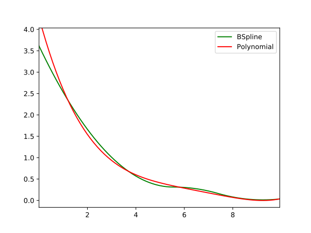

layout: true
class: typo, typo-selection

---

count: false
class: nord-dark, middle, center

# 🥥 Cutting-plane Method and Its Amazing Oracles 🔮

@luk036

2023-10-11

---

class: middle

.right[

> When you have eliminated the impossible, whatever remains, however
> improbable, must be the truth.

Sir Arthur Conan Doyle, stated by Sherlock Holmes
]

---

class: nord-light, middle, center

# 📖 Introduction

---

## Common Perspective of Ellipsoid Method

- It is widely believed to be inefficient in practice for large-scale problems.

  - Convergent rate is slow, even when using deep cuts.

  - Cannot exploit sparsity.

- It has since then supplanted by the interior-point methods.

- Used only as a theoretical tool to prove polynomial-time solvability of some combinatorial optimization problems.

---

## But...

- The ellipsoid method works very differently compared with the interior point methods.

- It only requires a _separation oracle_ that provides a cutting plane.

- Although the ellipsoid method cannot take advantage of the sparsity of the problem, the separation oracle is capable of take advantage of certain structural types.

---

## Consider the ellipsoid method when...

- The number of design variables is moderate, e.g. ECO flow, analog circuit sizing, parametric problems

- The number of constraints is large, or even infinite

- Oracle can be implemented effectively.

---

class: middle, center

# 🥥 Cutting-plane Method Revisited

---

## Convex Set

- Let $\mathcal{K} \subseteq \mathbb{R}^n$ be a convex set 🥚.
- Consider the feasibility problem:
  - Find a point $x^* \in \mathbb{R}^n$ in $\mathcal{K}$,
  - or determine that $\mathcal{K}$ is empty (i.e., there is no feasible solution)


---

## 🔮 Separation Oracle

.column-2.column-norule[

- When a separation oracle $\Omega$ is _queried_ at $x_0$, it either - asserts that $x_0 \in \mathcal{K}$, or - returns a separating hyperplane between $x_0$ and $\mathcal{K}$:
  $$
  g^\mathsf{T} (x - x_0) + \beta \le 0, \\
    \beta \geq 0, g \neq 0, \; \forall x \in \mathcal{K}
  $$


]

---

## 🔮 Separation Oracle (cont'd)

- $(g, \beta)$ is called a _cutting-plane_, or cut, because it eliminates the half-space $\{x \mid g^\mathsf{T} (x - x_0) + \beta > 0\}$ from our search.

- If \(\beta=0\) ($x_0$ is on the boundary of halfspace that is cut), the cutting-plane is called _neutral cut_.

- If $\beta>0$ ($x_0$ lies in the interior of halfspace that is cut), the cutting-plane is called _deep cut_.

- If $\beta<0$ ($x_0$ lies in the exterior of halfspace that is cut), the cutting-plane is called _shallow cut_.

---

## Subgradient

- $\mathcal{K}$ is usually given by a set of inequalities $f_j(x) \le 0$ or $f_j(x) < 0$ for $j = 1 \cdots m$, where $f_j(x)$ is a convex function.

- A vector $g \equiv \partial f(x_0)$ is called a subgradient of a convex function $f$ at $x_0$ if $f(z) \geq f(x_0) + g^\mathsf{T} (z - x_0)$.

- Hence, the cut $(g, \beta)$ is given by $(\partial f(x_0), f(x_0))$

Remarks:

- If $f(x)$ is differentiable, we can simply take $\partial f(x_0) = \nabla f(x_0)$

---

## Key components of Cutting-plane method

- A cutting plane oracle $\Omega$
- A search space $\mathcal{S}$ initially large enough to cover $\mathcal{K}$, e.g.
  - Polyhedron $\mathcal{P}$ = $\{z \mid C z \preceq d \}$
  - Interval $\mathcal{I}$ = $[l, u]$ (for one-dimensional problem)
  - Ellipsoid $\mathcal{E}$ = $\{z \mid (z-x_c)P^{-1}(z-x_c) \le 1 \}$

---

## Outline of Cutting-plane method

- Given initial $\mathcal{S}$ known to contain $\mathcal{K}$.
- Repeat
  - Choose a point $x_0$ in $\mathcal{S}$
  - Query the cutting-plane oracle at $x_0$
  - If $x_0 \in \mathcal{K}$, quit
  - Otherwise, update $\mathcal{S}$ to a smaller set that covers:
    $$\mathcal{S}^+ = \mathcal{S} \cap \{z \mid g^\mathsf{T} (z - x_0) + \beta \le 0\}$$
  - If $\mathcal{S}^+ = \emptyset$ or it is small enough, quit.

---

## Corresponding Python code

```python
def cutting_plane_feas(omega, space, options=Options()):
    for niter in range(options.max_iters):
        cut = omega.assess_feas(space.xc())  # query the oracle
        if cut is None:  # feasible sol'n obtained
            return space.xc(), niter
        status = space.update_deep_cut(cut)  # update space
        if status != CutStatus.Success or space.tsq() < options.tol:
            return None, niter
    return None, options.max_iters
```

---

## From Feasibility to Optimization

$$
\begin{array}{ll}
    \text{minimize}     & f_0(x), \\
    \text{subject to}   & x \in \mathcal{K}
\end{array}
$$

- The optimization problem is treated as a feasibility problem with an
  additional constraint $f_0(x) \le \gamma$.

- $f_0(x)$ could be a convex or a _quasiconvex function_.

- $\gamma$ is also called the _best-so-far_ value of
  $f_0(x)$.

---

## Convex Optimization Problem

- Consider the following general form:

  $$
  \begin{array}{ll}
    \text{minimize}     & \gamma, \\
    \text{subject to}   & \Phi(x, \gamma) \le 0, \\
    & x \in \mathcal{K},
  \end{array}
  $$

  where $\mathcal{K}'_\gamma = \{x \mid \Phi(x, \gamma) \le 0\}$
  is the $\gamma$-sublevel set of $\{x \mid f_0(x) \le \gamma\}$.

- 👉 Note: $\mathcal{K'}_\gamma \subseteq \mathcal{K'}_\epsilon$ if and only if
  $\gamma \le \epsilon$ (monotonicity)

- One easy way to solve the optimization problem is to apply the
  binary search on $\gamma$.

---

## Shrinking

- Another possible way is, to update the best-so-far
  $\gamma$ whenever a feasible solution $x'$ is found
  by solving the equation:
  $$\Phi(x', \gamma_\text{new}) = 0 \, .$$

- If the equation is difficuit to solve
  but $\gamma$ is also convex w.r.t. $\Phi$,
  then we may create a new varaible, say $z$
  and let $z \le \gamma$.

---

## Outline of Cutting-plane method (Optim)

- Given initial $\mathcal{S}$ known to contain
  $\mathcal{K}_\gamma$.
- Repeat
  - Choose a point $x_0$ in $\mathcal{S}$
  - Query the separation oracle at $x_0$
  - If $x_0 \in \mathcal{K}_\gamma$, update
    $\gamma$ such that
    $\Phi(x_0, \gamma) = 0$.
  - Update $\mathcal{S}$ to a smaller set that covers:
    $$\mathcal{S}^+ = \mathcal{S} \cap \{z \mid g^\mathsf{T} (z - x_0) + \beta \le 0\} $$
  - If $\mathcal{S}^+ = \emptyset$ or it is small enough, quit.

---

## Corresponding Python code

```python
def cutting_plane_optim(omega, S, gamma, options=Options()):
    x_best = None
    for niter in range(options.max_iters):
        cut, gamma1 = omega.assess_optim(space.xc(), gamma)
        if gamma1 is not None:  # better \gamma obtained
            gamma = gamma1
            x_best = copy.copy(space.xc())
            status = space.update_central_cut(cut)
        else:
            status = space.update_deep_cut(cut)
        if status != CutStatus.Success or space.tsq() < options.tol:
            return x_best, target, niter
    return x_best, gamma, options.max_iters
```

---

## Example - Profit Maximization Problem

This example is taken from [@Aliabadi2013Robust].

$$
\begin{array}{ll}
   \text{maximize} & p(A x_1^\alpha x_2^\beta) - v_1 x_1 - v_2 x_2 \\
   \text{subject to}& x_1 \le k.
\end{array}
$$

- $p(A x_1^\alpha x_2^\beta)$ : Cobb-Douglas production function
- $p$: the market price per unit
- $A$: the scale of production
- $\alpha, \beta$: the output elasticities
- $x$: input quantity
- $v$: output price
- $k$: a given constant that restricts the quantity of $x_1$

---

## Example - Profit maximization (cont'd)

- The formulation is not in the convex form.
- Rewrite the problem in the following form: $$\begin{array}{ll}
      \text{maximize} & \gamma \\
      \text{subject to} & \gamma  + v_1 x_1  + v_2 x_2 \le p A x_1^{\alpha} x_2^{\beta}\\
                    & x_1 \le k.
      \end{array}$$

---

## Profit maximization in Convex Form

- By taking the logarithm of each variable:

  - $y_1 = \log x_1$, $y_2 = \log x_2$.

- We have the problem in a convex form:

$$
\begin{array}{ll}
    \text{max}  & \gamma \\
    \text{s.t.} & \log(\gamma + v_1 e^{y_1} + v_2 e^{y_2}) - (\alpha y_1 + \beta y_2) \le \log(pA) \\
                & y_1 \le \log k.
\end{array}
$$

---

## Corresponding Python code

.font-sm.mb-xs[

```python
class ProfitOracle:
    def __init__(self, params, elasticities, price_out):
        unit_price, scale, limit = params
        self.log_pA = math.log(unit_price * scale)
        self.log_k = math.log(limit)
        self.price_out = price_out
        self.el = elasticities

    def assess_optim(self, y, gamma):
        if (fj := y[0] - self.log_k) > 0.0:  # constraint
            return (np.array([1.0, 0.0]), fj), None

        log_Cobb = self.log_pA + self.el.dot(y)
        q = self.price_out * np.exp(y)
        qsum = q[0] + q[1]
        if (fj := math.log(gamma + qsum) - log_Cobb) > 0.0:
            return (q / (gamma + qsum) - self.el, fj), None

        Cobb = np.exp(log_Cobb) # shrinking
        return (q / Cobb - self.el, 0.0), Cobb - qsum
```

]

---

## Main program

.font-sm.mb-xs[

```python
import numpy as np
from ellalgo.cutting_plane import cutting_plane_optim
from ellalgo.ell import Ell
from ellalgo.oracles.profit_oracle import ProfitOracle

p, A, k = 20.0, 40.0, 30.5
params = p, A, k
alpha, beta = 0.1, 0.4
v1, v2 = 10.0, 35.0
el = np.array([alpha, beta])
v = np.array([v1, v2])
r = np.array([100.0, 100.0])  # initial ellipsoid (sphere)

ellip = Ell(r, np.array([0.0, 0.0]))
omega = ProfitOracle(params, el, v)
xbest, gamma, num_iters = cutting_plane_optim(omega, ellip, 0.0)
```

]

---

## Area of Applications

- Robust convex optimization
  - oracle technique: affine arithmetic
- Semidefinite programming
  - oracle technique: Cholesky or $LDL^\mathsf{T}$ factorization
- Parametric network potential problem
  - oracle technique: negative cycle detection

---

class: middle, center

# Robust Convex Optimization

---

## Robust Optimization Formulation

- Consider:

  $$
  \begin{array}{ll}
    \text{minimize}   & \sup_{q \in \mathbb Q} f_0(x,q), \\
    \text{subject to} & f_j(x,q) \leq 0, \;
     \forall q \in {\mathbb Q}, \; j = 1,2,\cdots,m,
  \end{array}$$ where $q$ represents a set of varying parameters.
  $$

- The problem can be reformulated as:
  $$
  \begin{array}{ll}
    \text{minimize}   & \gamma \\
    \text{subject to} & f_0(x,q) < \gamma  \\
    & f_j(x,q) \leq 0, \;
     \forall q \in {\mathbb Q}, \; j = 1,2,\cdots,m.
  \end{array}
  $$

---

## Example - Profit Maximization Problem (convex)

$$
\begin{array}{ll}
\text{max}  & \gamma \\
\text{s.t.} & \log(\gamma + \hat{v}_1 e^{y_1} + \hat{v}_2 e^{y_2}) - (\hat{\alpha} y_1 + \hat{\beta} y_2) \le \log(\hat{p}\,A)  \\
                  & y_1 \le \log \hat{k} ,
\end{array}
$$

- Now assume that:
  - $\hat{\alpha}$ and $\hat{\beta}$ vary $\bar{\alpha} \pm e_1$ and
    $\bar{\beta} \pm e_2$ respectively.
  - $\hat{p}$, $\hat{k}$, $\hat{v}_1$, and $\hat{v}_2$ all vary
    $\pm e_3$.

---

## Example - Profit Maximization Problem (oracle)

By detail analysis, the worst case happens when:

- $p = \bar{p} - e_3$, $k = \bar{k} - e_3$
- $v_1 = \bar{v}_1 + e_3$, $v_2 = \bar{v}_2 + e_3$,
- if $y_1 > 0$, $\alpha = \bar{\alpha} - e_1$, else
  $\alpha = \bar{\alpha} + e_1$
- if $y_2 > 0$, $\beta = \bar{\beta} - e_2$, else
  $\beta = \bar{\beta} + e_2$

---

## Corresponding Python code

.font-sm.mb-xs[

```python
class ProfitRbOracle(OracleOptim):
    def __init__(self, params, elasticities, price_out, vparams):
        e1, e2, e3, e4, e5 = vparams
        self.elasticities = elasticities
        self.e = [e1, e2]
        unit_price, scale, limit = params
        params_rb = unit_price - e3, scale, limit - e4
        self.omega = ProfitOracle(params_rb, elasticities,
                                  price_out + np.array([e5, e5]))

    def assess_optim(self, y, gamma):
        el_rb = copy.copy(self.elasticities)
        for i in [0, 1]:
            el_rb[i] += -self.e[i] if y[i] > 0.0 else self.e[i]
        self.omega.el = el_rb
        return self.omega.assess_optim(y, gamma)
```

]

---

## Oracle in Robust Optimization Formulation

- The oracle only needs to determine:
  - If $f_j(x_0, q) > 0$ for some $j$ and $q = q_0$,
    then
    - the cut $(g, \beta)$ =
      $(\partial f_j(x_0, q_0), f_j(x_0, q_0))$
  - If $f_0(x_0, q) \geq \gamma$ for some
    $q = q_0$, then
    - the cut $(g, \beta)$ =
      $(\partial f_0(x_0, q_0), f_0(x_0, q_0) - \gamma)$
  - Otherwise, $x_0$ is feasible, then
    - Let
      $q_{\max} = \argmax_{q \in \mathbb Q} f_0(x_0, q)$.
    - $\gamma := f_0(x_0, q_{\max})$.
    - The cut $(g, \beta)$ =
      $(\partial f_0(x_0, q_{\max}), 0)$

Remark: for more complicated problems, affine arithmetic could be used [@liu2007robust].

---

class: middle, center

# Matrix Inequalities

---

## Problems With Matrix Inequalities

Consider the following problem:

$$
\begin{array}{ll}
    \text{find}    & x, \\
    \text{subject to}  & F(x) \succ 0,
\end{array}
$$

- $F(x)$: a matrix-valued function
- $A \succ 0$ denotes $A$ is positive semidefinite.

---

## Problems With Matrix Inequalities

- Recall that a matrix $A$ is positive semidefinite if and only if
  $v^\mathsf{T} A v > 0$ for all $v \in \mathbb{R}^N - 0^N$.
- The problem can be transformed into: $$\begin{array}{ll}
              \text{find}      & x, \\
              \text{subject to}    & v^\mathsf{T} F(x) v > 0, \; \forall v \in \mathbb{R}^N - 0^N
      \end{array}$$
- Consider $v^\mathsf{T} F(x) v$ is
  concave for all $v \in \mathbb{R}^N$ w. r. t. $x$,
  then the above problem is a convex programming.
- Reduce to _semidefinite programming_ if
  $F(x)$ is linear w.r.t.
  $x$, i.e.,
  $F(x) = F_0 + x_1 F_1 + \cdots + x_n F_n$

---

## LDLT factorization

- The LDLT factorization of a symmetric positive definite matrix $A$ is the factorization
  $A = L D L^T$, where $L$ is lower triangular with unit diagonal elements and $D$ is a diagonal matrix.

- For example,
  $$
  \left[\begin{array}{cccc}
   1 & 1 & 1 & 1 \\
   1 & 2 & 1 & 2 \\
   1 & 1 & 3 & 1 \\
   1 & 2 & 1 & 4 \end{array}\right] =
  \left[\begin{array}{cccc}
   1 & 0 & 0 & 0 \\
   1 & 1 & 0 & 0 \\
   1 & 0 & 1 & 0 \\
   1 & 1 & 0 & 1 \end{array}\right]
  \left[\begin{array}{cccc}
   1 & 0 & 0 & 0 \\
   0 & 1 & 0 & 0 \\
   0 & 0 & 2 & 0 \\
   0 & 0 & 0 & 2 \end{array}\right]
  \left[\begin{array}{cccc}
   1 & 1 & 1 & 1 \\
   0 & 1 & 0 & 1 \\
   0 & 0 & 1 & 0 \\
   0 & 0 & 0 & 1
  \end{array}\right].
  $$

---

## Naïve implementation

- Then, start with $a_{11} = d_{11}$, the basic algorithm of LDLT factorization is:

$$
\begin{array}{l}
 1~ \text{for}~i=1:n \\
 2~     \quad \text{for}~  j=1:i-1 \\
 3~       \qquad s = a_{ij} - \sum_{k=1}^{j-1} d_{kk} l_{ik} l_{jk} \\
 4~       \qquad l_{ij} = s / d_{jj} \\
 5~     \quad \text{end} \\
 6~     \quad d_{ii} = a_{ii} - \sum_{k=1}^{j-1} d_{kk} l_{ik} l_{jk} \\
 7~ \text{end}
\end{array}
$$

- Invoke $p^3$ FLOP's, where $p$ is the place the algorithm stops.

---

## Storage representation

First, we pack the solution and the intermediate storage on a single matrix $T$ such that:

$$
t_{ij} = \begin{cases}
  d_{ii}        & \mathrm{if}\ i = j, \\
  l_{ij}        & \mathrm{if}\ i > j, \\
  d_{ii} l_{ji} & \mathrm{if}\ j < i.
\end{cases}
$$

- For example,
  $$
  T = \left[\begin{array}{cccc}
   d_{11} & d_{11} l_{21} & d_{11} l_{31} & d_{11} l_{41} \\
   l_{21} & d_{22} & d_{22} l_{32} & d_{22} l_{42} \\
   l_{31} & l_{32} & d_{33} & d_{33} l_{43} \\
   l_{41} & l_{42} & l_{43} & d_{44}
  \end{array}\right].
  $$

---

## Improved implementation

- Then, start with $a_{11} = t_{11}$, the improved implementation of LDLT factorization is:

$$
\begin{array}{l}
 1~ \text{for}~i=1:n  \\
 2~     \quad \text{for}~  j=1:i-1 \\
 3~       \qquad t_{ji} = a_{ij} - \sum_{k=1}^{j-1} t_{ik} t_{jk} \\
 4~       \qquad t_{ij} = t_{ji} / t_{jj} \\
 5~     \quad \text{end} \\
 6~     \quad t_{ii} = a_{ii} - \sum_{k=1}^{i-1} t_{ik} t_{ki} \\
 7~ \text{end}
\end{array}
$$

- Invoke $\frac{p^3}{2}$ FLOP's (same as Cholesky factorization's), where $p$ is the place the algorithm stops.

---

## Witness of indefiniteness

- In the case of failure, a vector $v$ can be constructed to certify that $v^T A v \leq 0$.
- Let $L_{1:p}$ denote the partial sub-matrix $L(1:p, 1:p)$ where $p$ is the row of failure.
- Then $v = [L_{1:p}^{-T} e_p, 0, \cdots, 0]^T$, where $e_p = [0, \cdots, 0, 1]^T \in \mathbb{R}^p$

- Start with $v = e_p$, the basic algorithm is:

$$
\begin{array}{l}
 1~ \text{for}~i = p - 1~\text{downto}~1 \\
 2~     \quad \text{for}~ k = i~\text{to}~p \\
 3~       \qquad v_i = v_i - t_{k,i} v_k \\
 4~     \quad \text{end} \\
 5~ \text{end}
\end{array}
$$

---

## Oracle in Matrix Inequalities

The oracle only needs to:

- Perform a _row-based_ LDLT factorization such that
  $F(x_0) = L D L^\mathsf{T}$.
- Let $A_{p,p}$ denotes a submatrix
  $A(1:p, 1:p) \in \mathbb{R}^{p\times p}$.
- If the process fails at row $p$,
  - there exists a vector
    $e_p = (0, 0, \cdots, 0, 1)^\mathsf{T} \in \mathbb{R}^p$, such
    that
    - $v = R_{p,p}^{-1} e_p$, and
    - $v^\mathsf{T} F_{p,p}(x_0) v \leq 0$.
  - The cut $(g, \beta)$ =
    $(-v^\mathsf{T} \partial F_{p,p}(x_0) v, -v^\mathsf{T} F_{p,p}(x_0) v)$

---

## Lazy evaluation

- Don't construct the full matrix at each iteration!

- Only O($p^3$) per iteration, independent of $N$!

---

```python
class LMIOracle:
    def __init__(self, F, B):
        self.F = F
        self.F0 = B
        self.Q = LDLTMgr(len(B))

    def assess_feas(self, x: Arr) -> Optional[Cut]:
        def get_elem(i, j):
            return self.F0[i, j] - sum(
                Fk[i, j] * xk for Fk, xk in zip(self.F, x))

        if self.Q.factor(get_elem):
            return None
        ep = self.Q.witness()
        g = np.array([self.Q.sym_quad(Fk) for Fk in self.F])
        return g, ep
```

---

## Google Benchmark 📊 Comparison

```terminal
2: ----------------------------------------------------------
2: Benchmark                Time             CPU   Iterations
2: ----------------------------------------------------------
2: BM_LMI_Lazy         131235 ns       131245 ns         4447
2: BM_LMI_old          196694 ns       196708 ns         3548
2/4 Test #2: Bench_BM_lmi .....................   Passed    2.57 sec
```

---

## Example - Matrix Norm Minimization

- Let $A(x) = A_0 + x_1 A_1 + \cdots + x_n A_n$
- Problem $\min_x \| A(x) \|$ can be reformulated as
  $$
  \begin{array}{ll}
       \text{minimize}      & \gamma, \\
       \text{subject to}    & \left(
   \begin{array}{cc}
    \gamma\,I   & A(x) \\
    A^\mathsf{T}(x) & \gamma\,I
   \end{array} \right) \succ 0,
   \end{array}
  $$
- Binary search on $\gamma$ can be used for this problem.

---

## Example - Estimation of Correlation Function

$$
\begin{array}{ll}
   \min_{{\color{blue}\kappa}, p}   & \| \Sigma({\color{blue}p}) + {\color{blue}\kappa} I - Y \| \\
   \text{s. t.} & \Sigma({\color{blue}p}) \succ 0,  {\color{blue}\kappa} \geq 0 \; .\\
 \end{array}
$$

- Let $\rho(h) = \sum_i^n {\color{blue}p}_i \Psi_i(h)$, where
  - $p_i$'s are the unknown coefficients to be fitted
  - $\Psi_i$'s are a family of basis functions.
- The covariance matrix $\Sigma({\color{blue}p})$ can be recast as:
  $$\Sigma({\color{blue}p}) = {\color{blue}p}_1 F_1 + \cdots + {\color{blue}p}_n F_n$$

  where $\{F_k\}_{i,j} =\Psi_k( \| s_j - s_i \|_2)$

---

## 🧪 Experimental Result

.column-2.column-norule[


: Data Sample (kern=0.5)



: Least Square Result

]

---

## 🧪 Experimental Result II

.column-2.column-norule[


: Data Sample (kern=1.0)


]

---

## 🧪 Experimental Result III

.column-2.column-norule[


: Data Sample (kern=2.0)


: Least Square Result

]

---

class: middle, center

# Multi-parameter Network Problem

---

## Parametric Network Problem

Given a network represented by a directed graph $G = (V, E)$.

Consider:

$$
\begin{array}{ll}
    \text{find} & x, {\color{red}u} \\
    \text{subject to} & {\color{red}u_j} - {\color{red}u_i} \le h_{ij}(x), \; \forall (i, j) \in E ,
   \end{array}
$$

- $h_{ij}(x)$ is the concave function of
  edge $(i,j)$,

- Assume: network is large, but the number of parameters is small.

---

## Network Potential Problem (cont'd)

Given $x$, the problem has a feasible solution if and only if
$G$ contains no negative cycle. Let $\mathcal{C}$ be a set of all cycles
of $G$.

$$
\begin{array}{ll}
    \text{find} & x \\
    \text{subject to} & w_k(x) \ge 0, \forall C_k \in \mathcal{C} ,
\end{array}
$$

- $C_k$ is a cycle of $G$

- $w_k(x) = \sum_{ (i,j)\in C_k} h_{ij}(x)$.

---

## Negative Cycle Finding

There are lots of methods to detect negative
cycles in a weighted graph [@cherkassky1999negative], in which Tarjan’s
algorithm [@Tarjan1981negcycle] is one of the fastest algorithms in
practice [@alg:dasdan_mcr; @cherkassky1999negative].

---

## Oracle in Network Potential Problem

- The oracle only needs to determine:
  - If there exists a negative cycle $C_k$ under $x_0$, then
    - the cut $(g, \beta)$ = $(-\partial w_k(x_0), -w_k(x_0))$
  - Otherwise, the shortest path solution gives the value of ${\color{red}u}$.

---

## Python Code

```python
class NetworkOracle:
    def __init__(self, G, u, h):
        self._G = G
        self._u = u
        self._h = h
        self._S = NegCycleFinder(G)

    def update(self, gamma):
        self._h.update(gamma)

    def assess_feas(self, x) -> Optional[Cut]:
        def get_weight(e):
            return self._h.eval(e, x)

        for Ci in self._S.find_neg_cycle(self._u, get_weight):
            f = -sum(self._h.eval(e, x) for e in Ci)
            g = -sum(self._h.grad(e, x) for e in Ci)
            return g, f  # use the first Ci only
        return None
```

---

## Example - Optimal Matrix Scaling [@orlin1985computing]

- Given a sparse matrix $A = [a_{ij}] \in \mathbb{R}^{N\times N}$.

- Find another matrix $B = U A U^{-1}$ where $U$ is a nonnegative
  diagonal matrix, such that the ratio of any two elements of $B$ in
  absolute value is as close to 1 as possible.

- Let $U = \mathrm{diag}([u_1, u_2, \ldots, u_N])$. Under the
  min-max-ratio criterion, the problem can be formulated as:

$$
\begin{array}{ll}
  \text{minimize}   &   \pi/\psi  \\
  \text{subject to} &   \psi \le u_i |a_{ij}| u_j^{-1} \le \pi, \; \forall a_{ij} \neq 0 , \\
                    &   \pi, \psi, u, \, \text{positive} \\
  \text{variables}  &   \pi, \psi, u \, .
  \end{array}
$$

---

## Optimal Matrix Scaling (cont'd)

By taking the logarithms of variables, the above problem can be
transformed into:

$$
\begin{array}{ll}
  \text{minimize}   &   \gamma \\
  \text{subject to} &   {\color{blue}\pi'} - {\color{blue}\psi'} \le \gamma \\
    &   {\color{red}u_i'} - {\color{red}u_j'}  \le {\color{blue}\pi'} - a_{ij}', \; \forall a_{ij} \neq 0 \,, \\
    &   {\color{red}u_j'} - {\color{red}u_i'} \le a_{ij}' - {\color{blue}\psi'}, \; \forall a_{ij} \neq 0 \,, \\
  \text{variables}  &   {\color{blue}\pi'}, {\color{blue}\psi'}, {\color{red}u'} \, .
  \end{array}
$$

where $k'$ denotes $\log( | k | )$ and
$x = ({\color{blue}\pi'}, {\color{blue}\psi'} )^\mathsf{T}$.

---

```python
class OptScalingOracle:
    class Ratio:
        def __init__(self, G, get_cost):
            self._G = G
            self._get_cost = get_cost

        def eval(self, e, x: Arr) -> float:
            u, v = e
            cost = self._get_cost(e)
            return x[0] - cost if u < v else cost - x[1]

        def grad(self, e, x: Arr) -> Arr:
            u, v = e
            return np.array([1.0, 0.0] if u < v else [0.0, -1.0])

    def __init__(self, G, u, get_cost):
        self._network = NetworkOracle(G, u, self.Ratio(G, get_cost))

    def assess_optim(self, x: Arr, gamma: float):
        s = x[0] - x[1]
        g = np.array([1.0, -1.0])
        if (fj := s - gamma) >= 0.0:
            return (g, fj), None
        if (cut := self._network.assess_feas(x)):
            return cut, None
        return (g, 0.0), s
```

---

## Example - clock period & yield-driven co-optimization

$$
\begin{array}{cll}
   \text{minimize} &T_\text{CP} / \beta \\
   \text{subject to} & u_i - u_j \le T_\text{CP} - F_{ij}^{-1}(\beta), & \forall (i,j) \in E_s \,,\\
                     & u_j - u_i \le F_{ij}^{-1}(1 - \beta), & \forall (j,i) \in E_h \,, \\
                     & T_\text{CP} \ge 0, \, 0 \le \beta \le 1 \, , \\
    \text{variables} &T_\text{CP}, \beta, u.
   \end{array}
$$

- 👉 Note that $F_{ij}^{-1}(x)$ is not concave in general in $[0, 1]$.
- Fortunately, we are most likely interested in optimizing circuits
  for high yield rather than the low one in practice.
- Therefore, by imposing an additional constraint to $\beta$, say
  $\beta \geq 0.8$, the problem becomes convex.

---

## Example - clock period & yield-driven co-optimization

The problem can be reformulated as:

$$
\begin{array}{cll}
   \text{minimize}   & \gamma \\
   \text{subject to} & T_\text{CP} - \beta \gamma \le 0\\
                     & u_i - u_j \le T_\text{CP} - F_{ij}^{-1}(\beta), & \forall (i,j) \in E_s \,,\\
                     & u_j - u_i \le F_{ij}^{-1}(1 - \beta), & \forall (j,i) \in E_h \,, \\
                     & T_\text{CP} \ge 0, \, 0 \le \beta \le 1 \, , \\
    \text{variables} &T_\text{CP}, \beta, u.
   \end{array}
$$

---

class: nord-dark, middle, center

.column-2.column-norule[

# 🙋 Q & A️


]
