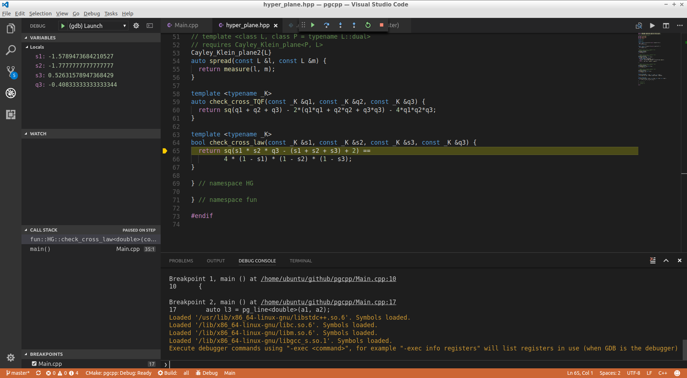

title: g++-7 Concept Flow
class: animation-fade
layout: true
<!-- This slide will serve as the base layout for all your slides -->
.bottom-bar[
  {{title}}
]

---

class: impact

# {{title}}
## Wai-Shing Luk

---

## Why?

- To test C++ Concepts new feature, together with structured binding.

- C++17 is pythonified, which is faster, safer, and easier to write.

---

## Installation on Ubuntu

- To compile C++17 and Concepts code together, you need g++ version >= 7.0
    - `-std=c++1z`
    - `-fconcepts`
- However, currently, the default g++ on ubuntu is only 6.3.
- Thus, to install g++ 7.0, you need to type:

```terminal
> sudo add-apt-repository -y ppa:ubuntu-toolchain-r/test
> sudo apt-get update
> sudo apt-get install g++-7
> sudo update-alternatives --install /usr/bin/g++ g++ /usr/bin/g++-7 90
```

---

## Installation 

.col-6[
-   sudo apt install (tools)
    - cmake
    - gdb
    - git
    - gnome-terminal (for vscode debugging)
]
.col-6[
-   sudo apt install (libraries)
    - libboost-dev
    - libcppunit-dev
    - catch
- github.com/fmtlib/fmt
- range-v3 (header only)
]

---

## CMake Setup

- CMakeLists.txt (example)

```cmake
cmake_minimum_required (VERSION 2.8.11)
project (pgcpp)
set (CMAKE_BUILD_TYPE Debug )
add_definitions ( -Wall -Wextra -Wpedantic -fconcepts -std=c++1z )
add_executable (Main Main.cpp)
target_link_libraries (Main -lfmt )
```

---

## Out-of-the-Box Compile

```bash
cd ~/workspace
mkdir build_pgcpp
cd build_pgcpp
cmake ~/github/pgcpp
make
```

---

## Visual Studio Code Extensions

- C/C++
- CMake Tools
- Code Runner
- Git History
- Git History Diff


---

class: center, middle
layout: false



---


## Online References

-   [cppreference.com](http://en.cppreference.com/w/)
-   [Boost](http://www.boost.org)

