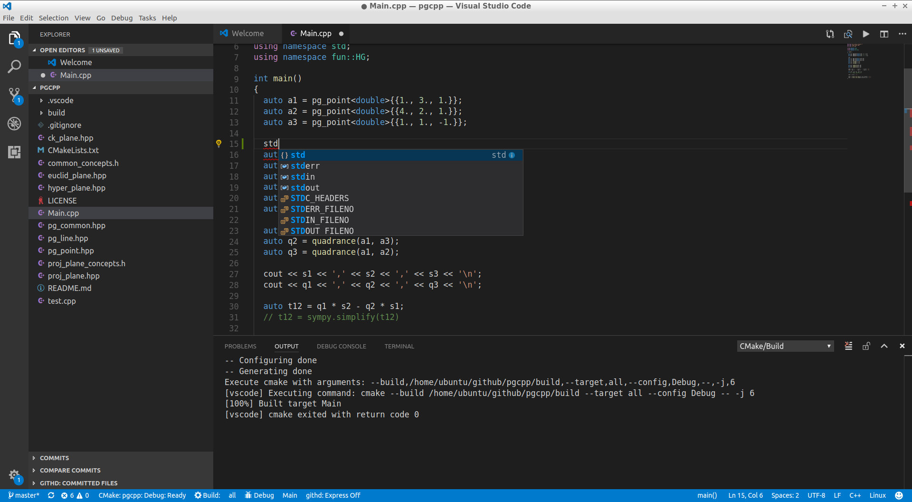

title: g++-10 Flow
class: animation-fade
layout: true
<!-- This slide will serve as the base layout for all your slides -->
.bottom-bar[
  {{title}}
]

---

class: impact

# {{title}}
## Wai-Shing Luk

---

## Why?

- To test C++20 new feature, together with structured binding.

- C++20 is pythonified, which is faster, safer, and easier to write.

---

## Installation on Ubuntu

- To compile C++20 with Concepts and Coroutine, you need g++ version >= 10
    - `-std=c++2a`
    - `-fconcepts`
    - `-fcoroutines -fno-exceptions`
- However, currently, the default g++ on Ubuntu 18.04 LTS is only 7.3.
- Thus, to install g++-10, you need to type:

```terminal
sudo add-apt-repository -y ppa:ubuntu-toolchain-r/test
sudo apt-get update
sudo apt-get install g++-10 gcc-10
sudo update-alternatives --install /usr/bin/g++ g++ /usr/bin/g++-10 90
sudo update-alternatives --install /usr/bin/gcc gcc /usr/bin/gcc-10 90

# Don't use conda's libstdc++.so
export LD_LIBRARY_PATH=/usr/lib/x86_64-linux-gnu/

```

---

## Installation 

.col-6[
-   sudo apt install (tools)
    - cmake
    - gdb
    - git
]
.col-6[
-   sudo apt install (libraries)
    - catch
- github.com/fmtlib/fmt
- range-v3 (header only)
]

---

## CMake Setup

- CMakeLists.txt (example)

```cmake
cmake_minimum_required (VERSION 2.8.11)
project (pgcpp)
set (CMAKE_BUILD_TYPE Debug )
add_definitions ( -Wall -Wextra -Wpedantic -fconcepts -std=c++1z )
add_executable (Main Main.cpp)
target_link_libraries (Main -lfmt )
```

---

## Out-of-the-Box Compile

```bash
cd ~/workspace
mkdir build_pgcpp
cd build_pgcpp
cmake ~/github/pgcpp
make
```

---

## Visual Studio Code Extensions

- C/C++
- CMake Tools
- Git History
- Git History Diff


---

class: center, middle
layout: false



---


## Online References

-   [cppreference.com](http://en.cppreference.com/w/)
-   [Boost](http://www.boost.org)

---

class: impact

Q & A 🗣️
==========
