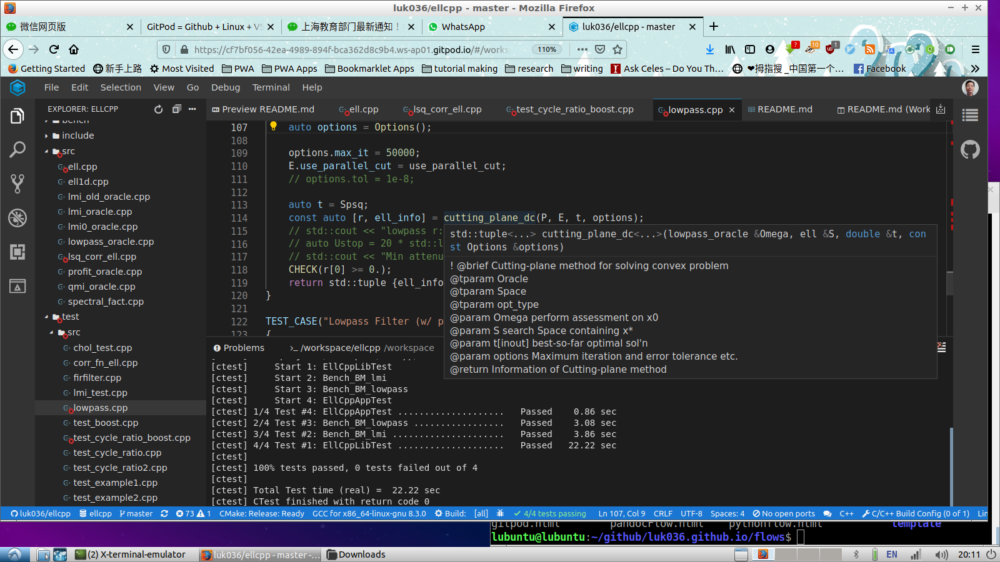

layout: true
class: typo, typo-selection

---

class: nord-dark, center, middle

# GitPod 🍑 = GitHub 🐙 + Linux 🐧 + VSCode

@luk036 👨‍💻

---

## Why 🍑 GitPod.io? ❓

- Remote working environment for software development 💻
- Development on the go 🚀
- Cloud-based development ☁️
- Remote access to a (virtual) Linux 🐧 machine (docker's container)
  that has a 16-core CPU and 60 GB RAM! 💪
- The only requirements:
  - a web browser 🌐 (better Chrome or Firefox)
  - an internet connection 📶
  - a GitHub/GitLab account 🔑

---

## Technologies ⚙️

- GitPod's IDE is based on Eclipse Foundation's Theia, the same as VSCode.
- Experimental support of VSCode's extensions. 🔌
- Integrate with GitHub 🐙 repositories.
- Docker's container as a virtual Linux 🐧 machine.
- Prebuilt Docker image contains basic software development tools such as:
  - g++-8, clang++-10, python2, python3, gdb, npm, CMake, make 🛠️
- More advanced images may include VNC or database facilities. 🗃️

---

## Custom Configuration 🛠️

- You may customize you own image build to make even more
  functionality, by modifying the `.gitpod.yml` file and `Dockerfile`.

- For example:

  - [jupyter lab](https://github.com/jins-tkomoda/dash-and-jupyter-notebook-with-gitpod) 📓
  - [conda](https://github.com/mtvu/miniconda) 🐍
  - [latex + pandoc](https://github.com/luk036/ellipsoid-method) 📝

---

## More examples 📚

- C++ plus Conda 🐍
- Python plus Jupyter 🐍📓
- Pandoc + LaTeX 📝

---

## Screenshot 📸

---

## Potential Usages 🚀

- Evaluate large open source GitHub/GitLab repos. 🔍
- Perform benchmarking of large benchmarks ⏱️
- Perform Sanitizer analysis, static code analysis 🔎
- Writing Undergraduate thesis via Pandoc 🎓
- Writing paper via Pandoc + LaTeX 📄
- Hardware design simulation. EDA on the cloud. ⚡

---

## Limitations ⚠️

- Unused workspaces are automatically deleted after 30 days of inactivity. 🗑️
- Only 50hrs/month, 4 parallel workspaces, public repos for free plan. ⏳
- No Windows or macOS build, only Linux 🐧.
- Graphical output must be through VNC or JupyterLab. No sound. 🔇
- No GPU support. 🎮

---

class: nord-dark, center, middle

# Q&A 🎤
