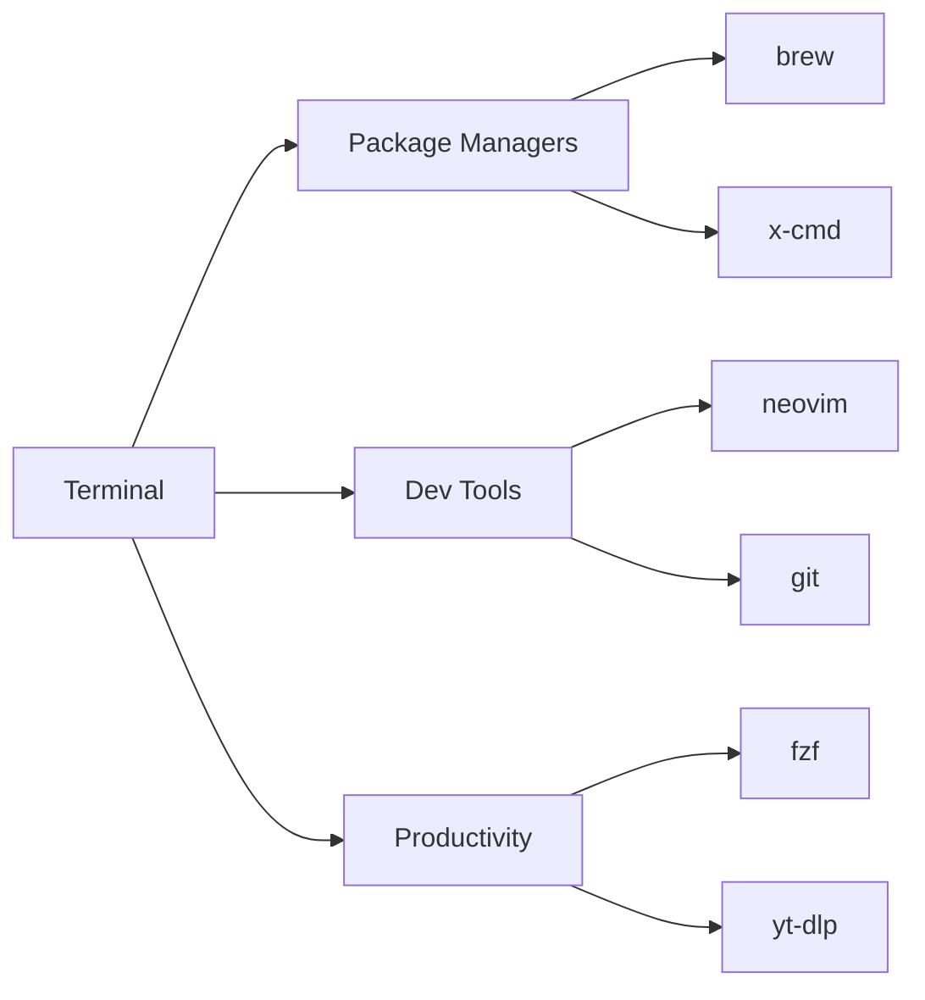

# Low-Energy Computing for Everyone Everyday 💻🔋

---

## 🏁 Introduction

- Why Low-Energy Computing? 🌱
  - Energy efficiency ♻️
  - Cost-effective 💰
  - Accessibility 👐
  - Perfect for development, learning, and light tasks 🛠️

---

## 🖥️ Hardware Options

### 1. Old Laptops 💻
- Repurpose instead of recycle ♻️
- Remove bloatware, optimize OS

### 2. Raspberry Pi 🍓
- $35 computer the size of a credit card
- Perfect for learning, IoT, servers

### 3. Tablets 📱
- Touch interface
- Great for media consumption

---

## 🖥️ Operating Systems

### Lightweight OS Options 🏗️
- **FydeOS** - ChromeOS alternative 🏗️
- **ChromeOS** - Cloud-first 🌥️
- **Lubuntu** - Lightweight Linux 🐧
- **Android** - Mobile ecosystem 📱

---

## ☁️ Cloud-Based Tools (Require Internet)

| Category        | Tools                          |
|-----------------|--------------------------------|
| Code Hosting    | github.com                     |
| Cloud IDE       | gitpod.io                      |
| AI Assistants   | deepseek.com, notebooklm.google|
| Audio Tools     | suno.com, savvycut.com         |
| Media Tools     | podcasteditor.streamlabs.com   |
| Utilities       | onlineconverter.com            |

**Pros:**
✅ No local processing energy needed
✅ Always up-to-date
✅ Access from anywhere

**Cons:**
❌ Requires internet
❌ Privacy considerations

---

## ⌨️ Terminal energy (CLI Tools)

### Essential CLI Tools 🛠️



### Python Setup 🐍

```bash
python -m venv ~/venv
source ~/venv/bin/activate
pip install -r requirements.txt
```

### x-cmd Highlights ✨

```bash
x starship  # Beautiful prompt
x ps        # Enhanced ps
x gh        # GitHub CLI
```

---

## 🏆 Top 5 CLI Tools

1. **fzf** - Fuzzy finder 🎯
2. **yt-dlp** - Media downloader 📥
3. **neovim** - Modern Vim ✏️
4. **rg (ripgrep)** - Blazing fast search 🔍
5. **xmake** - Build system 🏗️

```bash
# Example combo:
fzf --preview 'rg -n {}' | xargs nvim
```

---

## 💡 Pro Tips

1. **Nerd Fonts** are essential for CLI tools 👨‍💻
2. Use **tmux** or **screen** for session management
3. **Aliases** save time:
   ```bash
   alias ll='ls -la'
   alias gs='git status'
   ```
4. Cloud + CLI = Perfect balance ⚖️

---

## 🔮 Future of Low-Energy Computing

- ARM processors getting more energyful 💪
- WebAssembly enabling complex web apps 🕸️
- AI offloading to cloud 🤖
- Energy-efficient chips becoming mainstream 🌍

---

## ❓ Q&A

🎤‍♂️ **Any questions about:**
- Reviving old hardware?
- CLI tool recommendations?
- Cloud vs local tradeoffs?

📧 **Contact:** [your@email.com]

---

## 🎉 Thank You!

🚀 Happy low-energy computing!
💚 Sustainable tech matters
