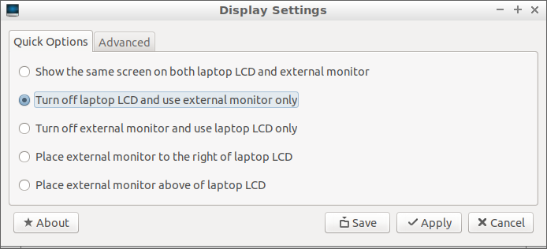
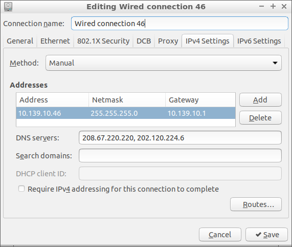
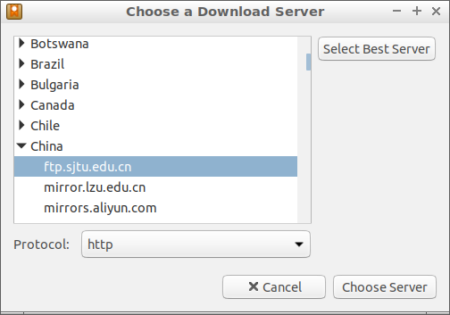
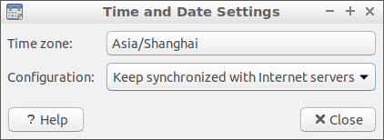

title: Lubuntu 17.10
class: animation-fade
layout: true

<!-- This slide will serve as the base layout for all your slides -->
.bottom-bar[
  {{title}}
]

---

class: impact

# {{title}}
## Wai-Shing Luk

---

## Why?

- Lightweight. 
    - Can be run on an old PC computer.
    - Can be run on a USB stick.
- Open source.
- Software development

---

## Preparation

.col-6[
Requirements:
- USB 3.0 (although USB 2.0 is ok too).
- Minimum 8Gb. Better 64Gb.
- Internet Connection.
- A Laptop/a PC computer.
]
.col-6[
Installation:
0. Partition a portion of USB for local storage (optional)
1. Download the iso image from the offical website (better via torrent).
2. Download the usb creator software such as `YUMI`.
3. Set the persistence storge to 4Gb.
4. Don't try the method for larger than 4Gb persistence.
]
---

## Reboot from USB:
    
- press `F12` during boot
- Select "Linux distributions" from menu
- Select "Try Lubuntu without installing" (don't install)
- Select "English" (default)

---

## Adjust the Display Settings (optional)

In case you are using a laptop with an external monitor, like me.
.col-6[
- Select "Preferences"->"Monitor Settings" from main menu.
- Select "Turn off laptop LCD and use external monitor only".
- Click "Apply".
- Then reselect "Show the same screen on both laptop LCD and external monitor only"
- Click "Apply" and "Save"
]
.col-6[

]

---

## Network Connections

.col-4[
- More or less the same as in Windows.
- Note that some networks may require a login from a web browser.
]
.col-4[

]
.col-4[

]

---

## Configure Software Updates Download Server

.col-6[
- Much faster than the main server.
- Select "Preferences"->"Software & Updates" from main menu.
- Select Download from: "Other..."
- Choose a Download Server near your location.
]
.col-6[

]

---

## Adjust Time and Date

.col-6[
- Press `Ctrl-Alt-T` to open a terminal.
- Type "sudo apt install ntp" to install a synchronization service.
- Select "Sytem Tools"->"Time and Date"
- Choose the Time zone of your location.
- Make sure "Keep synchronized with Internet servers"
- Wait a few seconds to make it take effective.
]
.col-6[

]

---

## Tools

- Dropbox/NutStore (JianGuoYun)
- Visual Studio Code (vcode)
- Firefox (web browser)
- git

---

## Issues

3. Can't set "synchromize date & time with internet servers".
   Sol'n: install NTP using "sudo apt install ntp"
4. Can't use Chinese Input method.
   Sol'n: install "Ibus" instead of using "Fcitx".
   - Add Chinese in Preference -> Language Support
   - Type "sudo apt install ibus ibus-pinyin"

---

## Useful keyboard shortcuts

- "Ctrl-Alt-T": open Terminal
- "Ctrl-Alt-Del": open Task Manager
- "Alt-Tab": Switch window
- "Win-D"

---

## Useful Terminal Commands

- "history"
- "df"
- "sudo apt install your_app"

---

## Common git commands

- "git clone http://github.com/your_code.git"
- "git status"
- "git pull"
- "git add --all"
- "git rm your_file"
- "git mv your_file /new/location/"
- "git commit -m "message""
- "git push"

---

## Firefox Add-ons

- AdBlock
- AutoProxy-ng/FoxyProxy
- Grammarly
- HTTPS Everywhere
- Pushbullet
- Save to Pocket (built-in)
- uBlock Origin
- Vimium FF

---

## Web Sites

- jianguoyun.com
- Dropbox.com
- github.com
- google.com
- facebook.com

---

## Backslide

- Download node-v6.11.0-linux-x64.tar.xz
- Decompress the file
- cd node-v6.11.0-linux-x64/
- sudo cp -r * /usr
- sudo npm install -g backslide
- cd workspace/
- bs init
- bs serve
