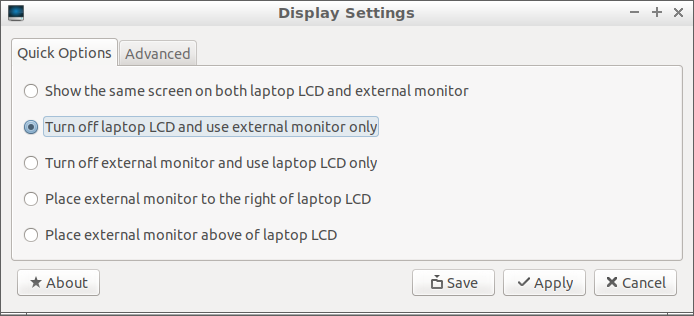
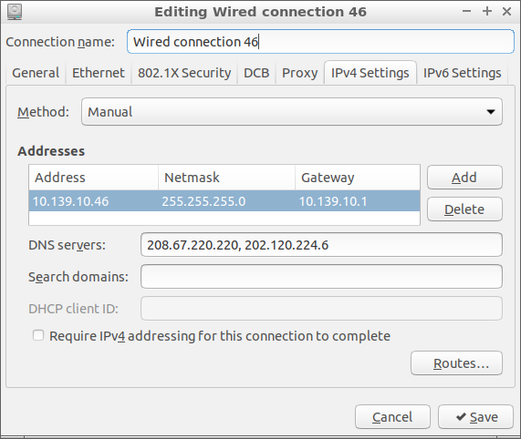
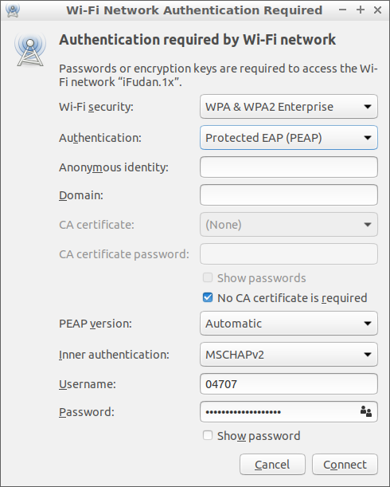
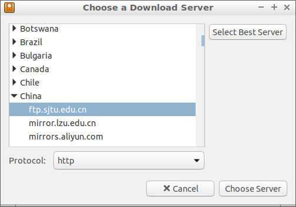
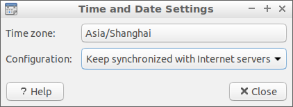
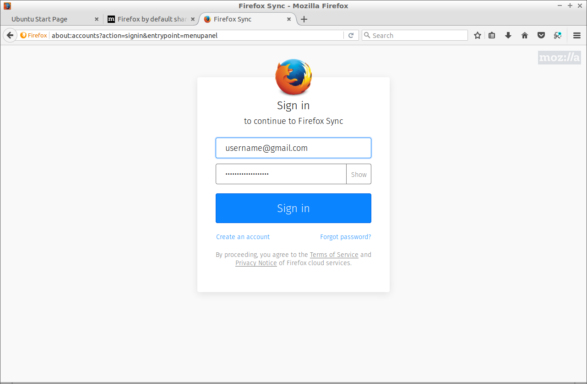

title: Lubuntu 18.04
class: animation-fade
layout: true

<!-- This slide will serve as the base layout for all your slides -->
.bottom-bar[
  {{title}}
]

---

class: impact

# {{title}}
## Wai-Shing Luk

---

## Why and Why not?

.col-6[

### Why Lubuntu?

- Lightweight. 
    - Can be run on an old PC computer.
    - Can be run on a USB drive.
- Open source.
- Less virus. No need anti-virus software.
- Software development.
- 18.04 LTS is a long-term-support version.

]
.col-6[

### Why not?

- [Online Microsoft's Office](https://office.com) is not good enough.
- VPN
- WiFi Hotspot

]

---

class: impact

Setup
======

---

## Adjust the Display Settings (optional)

In case you are using a laptop with an external monitor:
.col-6[
- Select "Preferences"->"Monitor Settings" from main menu.
- Select "Turn off laptop LCD and use external monitor only".
- Click "Apply".
- Then reselect "Show the same screen on both laptop LCD and external monitor only"
- Click "Apply" and "Save"
]
.col-6[

]

---

## Network Connections

.col-4[
- More or less the same as in Windows.
- Note that some networks may require a login from a web browser.
]
.col-4[

]
.col-4[

]

---

## Configure Software Updates Download Server

.col-6[
- Much faster than the main server.
- Select "Preferences"->"Software & Updates" from main menu.
- Select Download from: "Other..."
- Choose a Download Server near your location.
]
.col-6[

]

---

## Adjust Time and Date

.col-6[
- Press `Ctrl-Alt-T` to open a terminal.
- Type "sudo apt install ntp" to install a synchronization service.
- Select "Sytem Tools"->"Time and Date"
- Choose the Time zone of your location.
- Make sure "Keep synchronized with Internet servers"
- Wait a few seconds to make it take effective.
]
.col-6[

]

---

## Install shadowsocks

- sudo apt install shadowsocks
- edit /etc/shadowsocks.json
- exec sslocal -c /etc/shadowsocks.json

You may need Firefox Addon "FoxyProxy Standard" to use shadowsocks:

- SOCKS5: 127.0.0.1:1080

---

## Firefox Web Browser

- Built-in with Lubuntu.
- Sign-in to sync with other machines.
- Always enabled Add-ons: 
  - B.S. Detector, Content Farm Blocker, FoxyProxy, Momentum, Pushbullet, uBlock Origin, Vimium, 百度广告屏蔽, 
- Installed Add-ons: Chirpy, Evernote Web Clipper, Google Scholar Button, Grammarly for Firefox, Mendeley Importer, New Tong Wen Tang, QiuReader, Stylish, Tomato Clock, Zotero Connector

---



---

## Chinese Input Methods

- IBus is better than Fcitx
- Press `Ctrl-Alt-T` to open a terminal.
- Type "sudo apt install ibus ibus-pinyin" to install Pinyin method.
- You may want "ibus-cangjie" for 仓颉 or 速成。
- Select "Preferences"->"Language Support" from main menu.
- Ignore the warning "The language support is not installed completely". Click "Remind Me Later".
- Choose "IBus" from "Keyboad input method system".
- Select "Preferences"->"IBusPreferences" from main menu.
- Select "Input Method" then "Add". Select "Chinese" and then "Pinyin".
- Reboot the System. Press `<Super>-Space` to switch the input methods.

---

## Tools

- Visual Studio Code (code)
- Firefox (web browser)
- Dropbox/NutStore (JianGuoYun)
- qdirstat
- git
- vim

---

## Useful Tips


- Share programs between Systems:

```bash
export USB=/media/lubuntu/USBDISK
export CONDA_PREFIX=$USB/miniconda3
export PATH=$CONDA_PREFIX/bin:$HOME/.cabal/bin:$PATH

# optinal for advance software development
export LD_LIBRARY_PATH=$CONDA_PREFIX/lib
export LD_PRELOAD=$CONDA_PREFIX/lib/libmkl_rt.so
```

- Share files between Systems:

```bash
ln -s $USB/github .
ln -s $USB/.cabal .
```

---

## Useful Tips (2)

- Use a single system to serve a single purpose
  - LaTeX
  - g++-8
  - clang-8

---

## Useful keyboard shortcuts

- "Ctrl-Alt-T": open Terminal
- "Ctrl-Alt-Del": open Task Manager
- "Alt-Tab": Switch window
- "Win-D"

---

## Useful Terminal Commands

- "history"
- "df"
- "sudo apt install your_app"

---

## Configure ssh for github.com check-ins

```bash
ssh-keygen -t rsa -b 4096 -C "username@example.com"
eval "$(ssh-agent -s)"
ssh-add ~/.ssh/id_rsa
sudo apt-get install xclip
xclip -sel clip < ~/.ssh/id_rsa.pub
(Paste the clipboard text to the github.com ssh setting)

ssh -T git@github.com # check the connection

cd your-repository
vi .git/config
(change "https://github.com/repository" 
  to "ssh://git@github.com/repository) 
```

---

## Common git commands

- "git clone ssh://git@github.com/your_repository.git"
- "git status"
- "git pull"
- "git add --all"
- "git rm your_file"
- "git mv your_file /new/location/"
- "git commit -m "message" "
- "git push"

---

## Web Sites

- jianguoyun.com
- Dropbox.com
- github.com
- google.com
- facebook.com

---

class: impact

Questions?
==========
