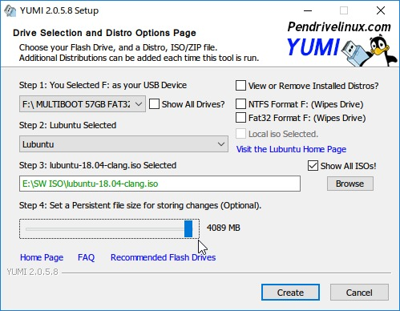

title: Bring Your Own Operating System
class: animation-fade
layout: true

<!-- This slide will serve as the base layout for all your slides -->
.bottom-bar[
  {{title}}
]

---

class: impact

{{title}}
=========

Wai-Shing Luk
-------------

---

Current: BYOD
-------------

-   Bring Your Own Device at work.
-   Work with the device you are familiar:
    -   Ultrabook, Chromebook, MacBook, Ubuntubook.
-   Keep your own personal Data:
    -   Passwords, bookmarks, browsing history
-   Office/School provides only the internet connection.

---

Future: BYOOS
-------------

-   Brin Your Own Operating System at work.
-   Keep your laptops at home/office.
-   Work with the OS you are familiar with:
    -   Lubuntu, Kubuntu, Phoenix OS, macOS, etc.
-   Keep Personal Data:
    -   Passwords, bookmarks, browsing history
-   Office/School provides the basic hardware and internet connection.

---

Solution: Live USB
------------------

-   History: Demo CD from Magazine
-   Now, USB.

---

4GB persistent file size limit issue
------------------------------------

-   Solution: Multiboot (YUMI)
-   Separate Partition
-   Firefox Sync
-   Cloud Storage:
    -   Onedrive, Dropbox, Jiangaoyun
    -   github

---

Microsoft Office Issue
----------------------

-   E-mail Attachment - Forward to outlook account
-   Upload to Onedrive/Jianguoyun

---

Why?
----

-   Share a single laptop for a whole family.
-   Shared workspace/Library/Internet Cafe.

---

Preparation
-----------

-   USB 3.0 (although USB 2.0 is ok too).
-   Minimum 8Gb. Better 64Gb.
-   Internet Connection.
-   A Laptop/PC computer.

---

Installation
------------

.col-7[

1.  Partition a portion of USB for local storage (optional)
2.  Download the iso image from the offical website (better via
    torrent).
3.  Download the usb creator software such as `YUMI`.
4.  Set the persistence storge to 4Gb.
5.  Don't try the methods for larger than 4Gb persistence.

]

.col-5[

]

---

Reboot from USB
---------------

-   press `F12` during boot
-   Select "Linux distributions" from menu
-   Select "Try Lubuntu without installing" (don't install)
-   Select "English" (default)

---

Future Work
-----------

-   VPN
-   Wifi Hotspot

---

class: impact

Questions?
==========
