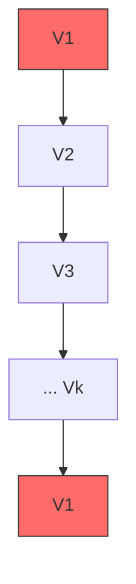
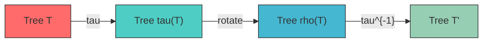
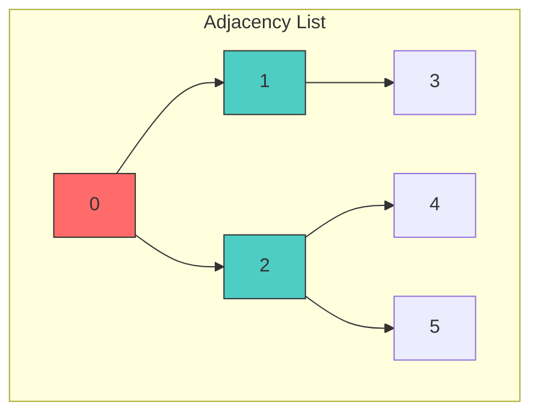

% Middle Levels Gray Code: A Memoryless Hamiltonian Cycle Algorithm 🎯
% Torsten Muetze & Jerri Nummenpalo
% 45 min presentation

---

# 📊 Middle Levels Gray Code: A Memoryless Hamiltonian Cycle Algorithm

## *Hamiltonian Cycles in the Middle Levels Graph*

**Torsten Muetze** 🇩🇪 **& Jerri Nummenpalo** 🇫🇮

* Based on research: [Muetze, Nummenpalo 2018] 🧮

---

## 📋 Outline

1. **What is the Middle Levels Problem?** 🤔
2. **Key Concepts**: Graphs, Paths, Trees 🌳
3. **The Memoryless Algorithm** 🔄
4. **Data Structures**: Vertex, Tree 🏗️
5. **Core Operations** ⚙️
6. **Demo** 💻
7. **Conclusions** ✅

---

# 1️⃣ What is the Middle Levels Problem?

## The Middle Levels Graph $G_n$ 📈

Given an integer $n$, the **middle levels graph** $G_n$ has vertices labelled by all bitstrings of length $2n+1$ with exactly $n$ or $n+1$ ones. 🎯

### Example: n = 1 (length = 3)

```
Bitstrings: 001, 010, 011, 100, 101, 110
         ↓    ↓    ↓    ↓   ↓   ↓
         0    1    1    0   1   1 (weight n=1 or 2)
```

### Number of Vertices

```katex
|V(G_n)| = \binom{2n+1}{n} + \binom{2n+1}{n+1} = 2 \binom{2n+1}{n}
```

| n | vertices | edges |
|---|----------|-------|
| 1 | 6 | 6 |
| 2 | 20 | 30 |
| 3 | 70 | 105 |
| 4 | 252 | 378 |
| 5 | 924 | 1386 |

> Grows as **binomial coefficient**! 📊

---

## The Hamiltonian Cycle Problem 🎯

A **Hamiltonian cycle** visits **every vertex exactly once** and returns to the start.

### Goal: Find a Hamiltonian cycle in $G_n$

```
Start → visit all vertices once → return to start
```

### Mermaid: Hamiltonian Cycle Concept



> This is a **NP-complete** problem in general! 🧩

But for middle levels, we have an efficient solution! ✅

---

## Gray Code in $G_n$ 🎨

Consecutive vertices in the Hamiltonian cycle differ by **one flip** operation.

### Example: n=2, bitstrings of length 5, weight 2 or 3

```
00110 → 00101 → 01101 → 01001 → 01011 → 01110
  ↓      ↓      ↓      ↓      ↓      ↓
 flip   flip   flip   flip   flip  flip
  bit    bit    bit    bit    bit   bit
   4      2      1      3      0     ?
```

> Each step flips **exactly one bit**! 🔄

---

# 2️⃣ Key Concepts 🌳

## Dyck Paths 📈

A **Dyck path** is a lattice path from $(0,0)$ to $(2n,0)$ using steps:
- **U** (up): $(1, +1)$ - represented as 1
- **D** (down): $(1, -1)$ - represented as 0

That never goes below the x-axis! 🎯

### Example: n=3, Dyck path

```
      ↑
    3 │╲
      │ ╲
    2 │  ╲╱
      │   ╲
    1 │    ╲
      │     ╲
    0 └──────╲──→↑
         0  1  2  3  4  5  6
         
Path: 111000010  (U,U,U,D,D,D,U,D,U,D)
```

---

## Binary Trees 🌳🌳

Each Dyck path corresponds to a **rooted ordered tree**:

### Tree Construction

| Bit | Meaning | Tree Operation |
|-----|---------|----------------|
| 1 | Up step | Add new child to current node |
| 0 | Down step | Move back to parent |

### Example

```
Bitstring: 110111000010

Tree:
      0
     / \
    1   2
       / \
      3   4
         \
          5
```

---

## The Auxiliary Graph 📊

Define an **auxiliary graph** $\hat{T}_n$ whose vertices are all ordered trees with $n+1$ nodes. 🔗

### Key Mappings

1. **$\tau$**: Transform tree structure
2. **$\tau^{-1}$**: Inverse transform
3. **$\rho$**: Rotate tree

```cpp
// In Tree class
bool flip_tree();    // Decide if applying tau()
void rotate();      // Rotate by one position
```

### Mermaid: Tree Transformations



---

# 3️⃣ The Memoryless Algorithm 🔄

## Main Idea 💡

> Generate Hamiltonian cycle **without storing previous vertices**!

### Memoryless Property

- Each step depends **only on current state**
- No need to remember visited vertices
- Time: $O(1)$ per vertex ✅

---

## Algorithm Overview

### Three Phases

1. **Initialization** (Phase 1) 🔧
2. **Hamilton Cycle Computation** (Phase 2) 🔄
3. **Flip Sequence Application** (Phase 3) 🎯

### Key Data Structures

```cpp
class HamCycle {
    Vertex x_;        // Starting vertex
    Vertex y_;        // Current vertex
    long long limit_; // Max vertices to visit
    Tree y_tree_;    // Tree representation
};
```

---

## Phase 1: Initialization 🔧

```cpp
HamCycle::HamCycle(const Vertex &x, long long limit, visit_f_t visit_f)
    : x_(x), y_(x), limit_(limit), visit_f_(visit_f) {
    
    // Check if last bit is 1
    if (xs[2 * n] == 1) {
        // Move backwards along cycle
        xs.rev_inv();
        skip += xs.to_last_vertex();
        xs.rev_inv();
        xs[2 * n] = 0;  // Jump to H_n∘0
        skip++;
    }
    
    // Move to first vertex
    skip += xs.to_first_vertex();
    
    // Build tree representation
    Tree y_tree(this->y_);
}
```

---

## Phase 2: Hamilton Cycle 🔄

### The Core Loop

```cpp
while (true) {
    // Phase 2a: Follow path in H_n∘0
    bool flip = y_tree.flip_tree();
    y_tree.rotate();
    
    // Compute flip sequence
    this->y_.compute_flip_seq_0(seq, flip);
    
    // Apply flip sequence
    if (flip_seq(seq, dist_to_start, final_path)) break;
    assert(this->y_.is_last_vertex());
    
    // Flip last bit to jump to rev(H_n)∘1
    if (flip_seq(seq01, dist_to_start, final_path)) break;
    assert(this->y_[2 * n] == 1);
    
    // Phase 2b: Follow path in rev(H_n)∘1
    this->y_.compute_flip_seq_1(seq);
    
    if (flip_seq(seq, dist_to_start, final_path)) break;
    // ... repeat until back to start
}
```

---

## Phase 3: Flip Sequence Application 🎯

```cpp
bool HamCycle::flip_seq(const std::vector<int> &seq, int &dist_to_start,
                    bool final_path) {
    
    // Apply flip sequence
    for (int j = 0; j < seq.size(); ++j) {
        const int i = seq[j];
        
        if ((dist_to_start == 0) || final_path) {
            this->y_[i] = 1 - this->y_[i];  // Flip bit
#ifndef NVISIT
            visit_f_(this->y_.get_bits(), i);    // Visit callback
#endif
            ++length_;
        }
        
        if (dist_to_start > 0) dist_to_start--;
    }
    
    return false;  // Continue
}
```

---

## The $\sigma()$ Recursion 📚

The algorithm uses **$\sigma()$ recursion rule** from the paper:

```cpp
// compute_flip_seq_0: Compute sequence from first to last vertex
void Vertex::compute_flip_seq_0(std::vector<int> &seq, bool flip) {
    // Recursive computation using canonical decomposition
    compute_flip_seq_0_rec(seq, idx, left, right, next_step);
}

// compute_flip_seq_1: Compute from last to first (transformed)
void Vertex::compute_flip_seq_1(std::vector<int> &seq) const {
    // Transformed recursion (faster in practice)
    compute_flip_seq_1_rec(seq, idx, left, right, next_step);
}
```

### Key Insight

> Using **bidirectional pointers** allows O(1) decomposition! ⚡

---

# 4️⃣ Data Structures 🏗️

## Vertex Class 📍

```cpp
class Vertex {
    std::vector<int> bits_;  // Bitstring representation
    
public:
    int &operator[](int i);           // Access bit i
    bool is_first_vertex() const;      // Check if first
    bool is_last_vertex() const;     // Check if last
    void rev_inv();                 // Reverse + complement
    int to_first_vertex();          // Distance to first
    int to_last_vertex();           // Distance to last
    void compute_flip_seq_0(...);   // Compute flip sequence
    void compute_flip_seq_1(...);   // Transformed version
};
```

### Bitstring as Vertex

```
bitstring: 1 1 0 1 1 1 0 0 0 1 0
           ↑               ↑
          position 0       position 10
          (weight n=5)    (always 0 or 1 for middle levels)
```

---

## Tree Class 🌳

```cpp
class Tree {
    int num_vertices_;              // Number of nodes
    int root_;                     // Root vertex
    std::vector<std::list<int>> children_;  // Adjacency list
    std::vector<int> parent_;       // Parent of each node
    
public:
    explicit Tree(const Vertex &x);  // Build from vertex
    bool flip_tree();                  // Apply tau() or tau^{-1}()
    void rotate();                   // Rotate children
    void to_bitstring(int x[]) const; // Convert back to bits
};
```

### Mermaid: Tree Structure



---

## Tree Building from Bitstring 🏗️

### Process: 110111000010

```
Bit: 1 1 0 1 1 1 0 0 0 1 0
     ↑          ↑
    root       last 0-bit (not added to tree)

Tree construction:
  1 → Add child to root → node 1
  1 → Add child to node 1 → node 2
  0 → Go back to parent (no new node)
  1 → Add child to node 1 → node 3
  ...
```

### Visual Result

```
        root(0)
        /    \
      (1)    (2)
      / \      
    (3) (4)  (5)
```

---

# 5️⃣ Core Operations ⚙️

## The $\tau$ Mapping

### Purpose
Transform tree to its image in the auxiliary graph.

```cpp
void Tree::tau() {
    // Move leaf from one parent to another
    move_leaf(leaf, new_parent, pos);
}

void Tree::tau_inverse() {
    // Inverse operation
}
```

### Visual: tau() Operation

```
Before tau():          After tau():

    0                   0
   / \                 /|\
  1   2      →       1 2 3
     /               /
    3               4
```

---

## The flip_tree() Decision

```cpp
bool Tree::flip_tree() {
    // Decide if tree is tau-preimage or tau-image
    // and apply transformation
    
    if (is_tau_preimage()) {
        tau();
        return true;   // Applied tau()
    } else if (is_tau_image()) {
        tau_inverse();
        return false;  // Applied tau^{-1}()
    } else {
        // No transformation needed
        return false;
    }
}
```

### Decision Tree

```mermaid
graph TD
    Start[Start] --> Pre{is tau-preimage?}
    Pre -->|Yes| Tau[Apply tau()]
    Pre -->|No| Img{is tau-image?}
    Img -->|Yes| TauInv[Apply tau^{-1}()]
    Img -->|No| Done[No change]
    
    style Start fill:#ff6b6b,stroke:#333
    style Tau fill:#4ecdc4,stroke:#333
    style TauInv fill:#4ecdc4,stroke:#333
    style Done fill:#96ceb4,stroke:#333
```

---

## rotate() Operation 🔄

### Purpose
Rotate tree by making leftmost child the new root.

```cpp
void Tree::rotate() {
    rotate_children();  // Leftmost → rightmost
    // Update root
}
```

### Visual: rotate()

```
Before:             After rotate():
    0                 2
   / \               / \
  1   2      →     0   1
     /             \
    3               4
```

> This allows traversing the **entire cycle**! 🔄

---

## rev_inv() Operation 🔀

### Purpose
Reverse and complement the bitstring.

```cpp
void Vertex::rev_inv() {
    // Reverse bitstring
    // Complement (0↔1)
    std::reverse(bits_.begin(), bits_.end());
    for (int i = 0; i < size(); ++i)
        bits_[i] = 1 - bits_[i];
}
```

### Example

```
Original:  1 1 0 1 1 0
After:    1 0 1 0 0 1
           ↑         ↑
         reversed  complemented
```

---

# 6️⃣ Demo 💻

## Running the Program

```bash
cd middle
make
```

### Usage

```bash
./middle -n2          # Calculate n=2 (length 5)
./middle -n2 -l10     # List first 10 vertices
./middle -n2 -v01010 # Start from specific bitstring
./middle -n2 -p1      # Print flip positions
```

### Options

| Option | Description |
|--------|-------------|
| `-n` | Parameter n (generates 2n+1 bits) |
| `-l` | Limit output (-1 for all) |
| `-v` | Starting bitstring |
| `-p` | Print flip positions |
| `-s` | Store all vertices |

---

## Example Output

```bash
$ ./middle -n2
01010
01001
01101
00101
00111
10111
10110
10010
11010
11000
11100
...
```

### Output Format

```
For n=2: 5-bit strings with weight 2 or 3
01010 (weight 2)
01001 (weight 2)
01101 (weight 3)
...
```

---

## With Flip Positions

```bash
$ ./middle -n2 -p1
4
2
1
3
0
5
...
```

> Each number is position to **flip** to get next vertex! 🎯

---

# 7️⃣ Conclusions ✅

## Summary

1. ✅ **Memoryless algorithm** - O(1) per vertex!
2. ✅ **Hamiltonian cycle** - Visits all vertices
3. ✅ **Gray code** - One bit flip between consecutive vertices
4. ✅ **Proven correctness** - Based on rigorous research

---

## Complexity Analysis 📊

| Aspect | Complexity |
|--------|------------|
| Time per vertex | $O(1)$ |
| Memory | $O(n)$ |
| Total time | $O(\binom{2n}{n})$ |

### Practical Performance

| n | Vertices | Time |
|---|----------|------|
| 5 | 252 | < 1s |
| 10 | 184,756 | ~ minutes |
| 15 | 155,117,520 | ~ hours |

---

## Key Contributions 🏆

1. **Novel tree representation** 🌳
2. **Auxiliary graph** 📊
3. **$\tau$ / $\rho$ transformations** 🔄
4. **Memoryless Gray code** 💾

---

## References 📚

1. **Muetze, Nummenpalo** - "Generating Hamiltonian Cycles in the Middle Levels Graph" (2018) 📄
2. **Gray** - "Pulse code communication" (1953) 🎯
3. ** Booth** - "Lexicographically least circular substrings" (1980) 📈

---

## Thank You! 🙏

### Questions? ❓

🎉 **End of Presentation** 🎉