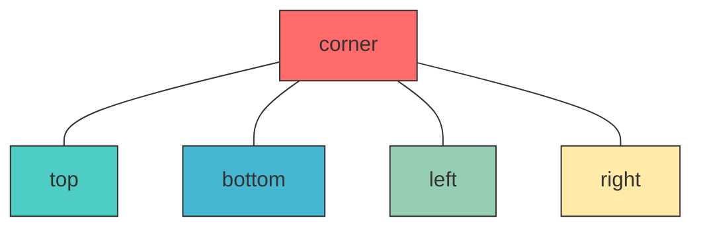
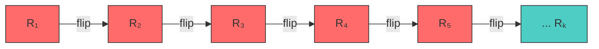
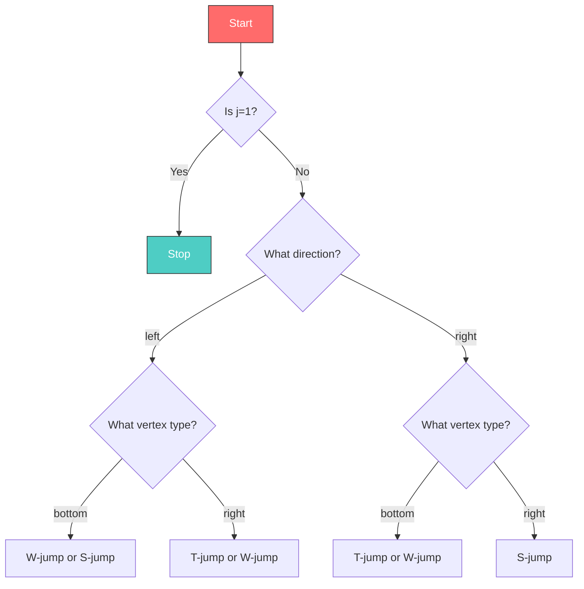

% Rectangulation Generation: A Memoryless Gray Code Algorithm 🎯
% Arturo Merino & Torsten Muetze
% 45 min presentation

---

# 📐 Rectangulation Generation: A Memoryless Gray Code Algorithm

## *Generating All Rectangulations of *n* Rectangles in Gray Code Order*

**Arturo Merino** 🇨智利 **& Torsten Muetze** 🇩🇪

* Based on research: [Merino, Muetze 2021] 🧮

---

## 📋 Outline

1. **What is a Rectangulation?** 🤔
2. **Data Structures** 🏗️
3. **The Memoryless Gray Code Algorithm** 🔄
4. **Jump Operations** (W-jump, S-jump, T-jump) ⬆️⬇️
5. **Types of Rectangulations** 📊
6. **Demo** 💻
7. **Conclusions** ✅

---

# 1️⃣ What is a Rectangulation?

## Definition 📖

A **rectangulation** of *n* rectangles is a division of a rectangle into *n* smaller rectangles using only vertical and horizontal cuts. 🎯

```
┌─────────┬───────┐
│         │       │
│    1    │   2   │
│         ├───────┤
│         │   3   │
├─────────┼───────┤
│    4   │   5   │
└─────────┴───────┘
```

### Example: 5 rectangles (n=5)

---

## Why Rectangulations? 🌟

- **Tiling problems** 🧱
- **Floorplan design** 🏠
- **VLSI layout** 💾
- **Computer graphics** 🎨
- **Warehouse organization** 📦

> Eachrectangulation corresponds to a unique way to partition a rectangle! 🔢

---

## Key Numbers 📊

| n | Generic | Diagonal | Block-aligned |
|---|--------|---------|--------------|
| 1 | 1 | 1 | 1 |
| 2 | 2 | 2 | 2 |
| 3 | 6 | 4 | 2 |
| 4 | 22 | 10 | 4 |
| 5 | 94 | 28 | 10 |
| 10 | ? | ? | ? |

The sequence grows **super-exponentially**! 🚀

---

# 2️⃣ Data Structures 🏗️

## The Four Fundamental Types

### 1. **Vertex** 📍
### 2. **Edge** ➖
### 3. **Wall** 🧱
### 4. **Rectangle** ⬜

---

## Vertex (Point) 📍

```cpp
enum class VertexType { corner, top, bottom, left, right, None };

class Vertex {
    int north_;  // Edge to north
    int east_;   // Edge to east
    int south_; // Edge to south
    int west_;  // Edge to west
    VertexType type_;
};
```

### Mermaid: Vertex Types



---

## Edge (Line Segment) ➖

```cpp
enum class EdgeDir { Hor, Ver, None };

class Edge {
    EdgeDir dir_;    // Direction
    int tail_;    // Tail vertex
    int head_;    // Head vertex
    int prev_;    // Previous edge
    int next_;    // Next edge
    int left_;    // Left rectangle
    int right_;   // Right rectangle
    int wall_;    // Wall ID
};
```

### Doubly-Linked List Structure

```
     ┌─────────────────────────────────────┐
     │      Doubly-Linked Edge List         │
     └─────────────────────────────────────┘
           ↑     ↑     ↑     ↑
        prev   prev   prev   prev
     
     ┌──────┐ ┌──────┐ ┌──────┐ ┌──────┐
     │ edge │─→│ edge │─→│ edge │─→│ edge │
     │  1  │ ←─│  2  │ ←─│  3  │ ←─│  4  │
     └──────┘ └──────┘ └──────┘ └──────┘
           ↑     ↑     ↑     ↑
          next   next   next   next
```

---

## Wall (Boundary) 🧱

```cpp
class Wall {
    int first_; // First vertex
    int last_; // Last vertex
};
```

> A wall is a **connected sequence of edges** forming a boundary! 🧱

### SVG: Wall Structure

```svg
<svg viewBox="0 0 200 100" xmlns="http://www.w3.org/2000/svg">
  <rect x="10" y="10" width="180" height="80" fill="none" stroke="#333" stroke-width="2"/>
  <text x="100" y="50" text-anchor="middle" fill="#333">Wall 0 (outer)</text>
</svg>
```

---

## Rectangle ⬜

```cpp
class Rectangle {
    int nwest_; // Northwest corner
    int neast_; // Northeast corner
    int swest_; // Southwest corner
    int seast_; // Southeast corner
};
```

### Coordinate System

```
    y (north)
    ↑
    │
  2 ┌─────────┬─────────┐
    │ nwest   │ neast   │
    │ (1,2)  │ (2,2)  │
  1 ┼─────────┼─────────┤
    │ swest   │ seast   │
    │ (1,1)  │ (2,1)  │
  0 └─────────┴─────────┘
    └──────────────────→ x (east)
          0     1     2
```

---

## Complete Data Structure Counts 📊

For a rectangulation with *n* rectangles:

| Structure | Count | Formula |
|-----------|-------|---------|
| Edges | $3n + 1$ | $3n + 1$ |
| Vertices | $2n + 2$ | $2n + 2$ |
| Rectangles | $n$ | $n$ |
| Walls | $n + 3$ | $n + 3$ |

---

# 3️⃣ The Memoryless Gray Code Algorithm 🔄

## What is Gray Code? 🎯

A **Gray code** is a binary number system where two successive values differ by only one bit.

### Example: 3-bit Gray Code

| Decimal | Binary | Gray |
|--------|-------|------|
| 0 | 000 | 000 |
| 1 | 001 | 001 |
| 2 | 010 | 011 |
| 3 | 011 | 010 |
| 4 | 100 | 110 |
| 5 | 101 | 111 |
| 6 | 110 | 101 |
| 7 | 111 | 100 |

> Only **one bit changes** at a time! 🧬

---

## Key Insight 💡

> Our algorithm generates rectangulations in **Gray code order**: consecutive rectangulations differ by **minimum changes**! 🔁

### Mermaid: Gray Code Traversal



---

## Algorithm Overview 📋

### Steps M1-M5

| Step | Name | Description |
|------|------|------------|
| M1 | Initialize | Set all edges vertical |
| M2 | Store | Store initial state |
| M3 | Select | Pick rectangle *j* |
| M4 | Jump | Apply jump operation |
| M5 | Update | Update state vectors |

```cpp
// Key state vectors
std::vector<RectangulationDirection> o_; // Orientation: left/right
std::vector<int> s_;                  // State: which rectangle
```

---

## The Core Loop 🔄

```cpp
bool Rectangulation::next() {
    const int j = this->s_[n_];  // M3: Select rectangle
    if (j == 1) return false;    // Terminal case
    
    switch (this->type_) {        // M4: Jump operation
    case (RectangulationType::generic):
        next_generic(j, this->o_[j]);
        break;
    case (RectangulationType::diagonal):
        next_diagonal(j, this->o_[j]);
        break;
    case (RectangulationType::baligned):
        next_baligned(j, this->o_[j]);
        break;
    }
    
    this->s_[n_] = n_;  // M5: Update state
    return true;
}
```

> **Memoryless**: No need to remember previous states! 💾

---

# 4️⃣ Jump Operations ⬆️⬇️

## Three Types of Jumps

1. **W-jump** (Wall-jump) - Move edge along wall
2. **S-jump** (Swap-jump) - Flip two rectangles
3. **T-jump** (Transition-jump) - Three rectangles

---

## W-jump (Wall Jump) 🧱

**Purpose**: Move an edge along a wall to a new position.

```cpp
void Rectangulation::Wjump_hor(int j, RectangulationDirection dir, int alpha) {
    // Remove edge from head, insert after reference
    remHead(beta);
    insAfter(alpha, a, beta);
    // Update pointers
    this->edges_[beta].left_ = k;
    this->edges_[beta].right_ = j;
}
```

### Visual: W-jump

```
Before:        After:
┌─────┐       ┌─────┐
│     │       │     │
│  j  │       │  j  │
│  █  │  →    │     █│
│     │       │     │
└─────┘       └─────┘
```

---

## S-jump (Swap Jump) 🔄

**Purpose**: Swap orientation of two adjacent rectangles.

```cpp
void Rectangulation::Sjump(int j, RectangulationDirection d, int alpha) {
    // Step 1: Remove both edges
    remTail(beta);
    remHead(beta_prime);
    // Step 2: Insert in swapped positions
    insBefore(beta, a, alpha);
    insAfter(gamma, b, beta_prime);
    // Step 3: Flip edge direction
    this->edges_[delta].dir_ = EdgeDir::Hor;
}
```

### Visual: S-jump

```
Before:              After:
┌─────┬─────┐      ┌─────┬─────┐
│ j-1 │  j  │  →   │ j-1 │  j  │
├─────┼─────┤      ├─────┼─────┤
│     │     │      │     │     │
└─────┴─────┘      └─────┴─────┘
  vertical    →   horizontal
```

---

## T-jump (Transition Jump) 🔀

**Purpose**: More complex 3-rectangle operation.

```cpp
void Rectangulation::Tjump_hor(int j, RectangulationDirection dir, int alpha) {
    // Complex 3-rectangle flip
    remTail(beta);
    remTail(beta_prime);
    insAfter(alpha, a, beta);
    insAfter(gamma, b, beta_prime);
    // Update all three rectangles
    this->rectangles_[j].neast_ = b;
    this->rectangles_[k].neast_ = c;
    this->rectangles_[m].neast_ = a;
}
```

### Visual: T-jump

```
Before:                  After:
┌─────┬─────┬─────┐   ┌─────┬─────┬─────┐
│  k  │  j  │  m  │ → │  k  │  j  │  m  │
├─────┼─────┼─────┤   ├─────┼─────┼─────┤
│     │     │     │   │     │     │     │
└─────┴─────┴─────┘   └─────┴─────┴─────┘
```

---

## Jump Decision Tree 🌳



---

# 5️⃣ Types of Rectangulations 📊

## Three Types

| Type | Description | Constraint |
|------|-------------|------------|
| **Generic** | Any rectangulation | None |
| **Diagonal** | Vertices on diagonal | All corners on main diagonal |
| **Block-aligned** | Subset of diagonal | Special structure |

---

## Generic Rectangulations 🎯

- Any valid division into *n* rectangles
- Maximum flexibility
- **Largest count** 📈

```
┌────────��┬��──────┐
│         │       │
│    1    │   2   │
│         ├───────┤
│         │   3   │
├─────────┼───────┤
│    4   │   5   │
└─────────┴───────┘
```

---

## Diagonal Rectangulations ↘️

- All internal vertices on the **main diagonal**
- Special structure
- Fewer options than generic

```
┌───┬─────┬───┐
│ 1 │     │ 2 │
├───┼─────┼───┤
│   │  3  ├───┤
│   ├─────┤ 4 │
├───┼─────┼───┤
│ 5 │     │ 6 │
└───┴─────┴───┘
    ↘ ↘ ↘ ↘
   main diagonal
```

---

## Block-Aligned Rectangulations 📦

- Subset of diagonal
- Rectangles aligned in "blocks"
- **Fewest options** 📉

```
┌───┬───┬───┐
│ 1 │ 2 │ 3 │
├───┼───┼───┤
│   │   ├───┤
│   │   │ 4 │
├───┼───┼───┤
│ 5 │ 6 │ 7 │
└───┴───┴───┘
```

---

## Comparison Table 📊

$$
\begin{array}{c|ccc}
n & \text{Generic} & \text{Diagonal} & \text{Block-aligned} \\
\hline
1 & 1 & 1 & 1 \\
2 & 2 & 2 & 2 \\
3 & 6 & 4 & 2 \\
4 & 22 & 10 & 4 \\
5 & 94 & 28 & 10 \\
6 & 394 & 84 & 28 \\
7 & 1,808 & 264 & 84 \\
8 & 9,190 & 858 & 264 \\
9 & 50,688 & 2,812 & 858 \\
10 & 305,836 & 9,270 & 2,812
\end{array}
$$

> Exponential growth! 🚀

---

# 6️⃣ Demo 💻

## Running the Program

```bash
cd rect
make
```

### Usage

```bash
./rect -n5 -c        # Count all rectangulations for n=5
./rect -n5 -t2 -c    # Diagonal type only
./rect -n5 -p1 -c   # Exclude clockwise windmill
./rect -n10 -l100   # List first 100 (n=10)
```

### Options

| Option | Description |
|--------|-------------|
| `-n` | Number of rectangles |
| `-t` | Type: 1=generic, 2=diagonal, 3=block-aligned |
| `-p` | Forbidden patterns (1-8) |
| `-l` | Number to list (-1 for all) |
| `-c` | Output count |

---

## Example Output

```bash
$ ./rect -n3 -c
number of rectangulations: 6
```

```bash
$ ./rect -n3
0 0 1 1 | 1 0 2 1
0 0 1 1 | 2 0 2 1
0 0 2 1 | 2 0 2 1
...
```

### Output Format

Each line: `x₁ y₁ x₂ y₂ | x₃ y₃ x₄ y₄ | ...`

Where `(x₁,y₁)` to `(x₂,y₂)` is rectangle coordinates!

---

# 7️⃣ Conclusions ✅

## Summary

1. ✅ **Memoryless algorithm** - No need to store all rectangulations!
2. ✅ **Gray code order** - Consecutive rectangulations differ minimally
3. ✅ **Three types** - Generic, diagonal, block-aligned
4. ✅ **Efficient** - O(1) per rectangulation

---

## Complexity Analysis 📊

- ⏱️ **Time**: $O(R)$ where $R$ = number of rectangulations
- 💾 **Space**: $O(n)$ for data structures

| n | Time to generate all |
|---|--------------------|
| 5 | < 1 second |
| 10 | ~ seconds |
| 15 | ~ hours |
| 20 | ~ days |

---

## Future Work 🔭

- 🔬 **Proof of completeness** - Show all rectangulations generated
- ⏳ **Efficiency** - Faster for larger *n*
- 🌐 **Web interface** - Interactive visualization
- 📱 **Apps** - Practical applications

---

## References 📚

1. **Merino, Muetze** - "On the Generation of Rectangulations" (2021) 📄
2. **Gray Code** - Frank Gray (1953) 🎯
3. **Hamiltonian paths** - Combinatorial structures 🧮

---

## Thank You! 🙏

### Questions? ❓

🎉 **End of Presentation** 🎉