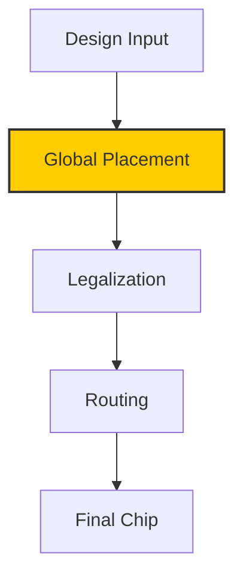
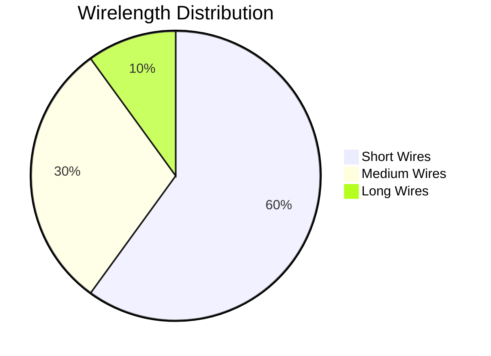
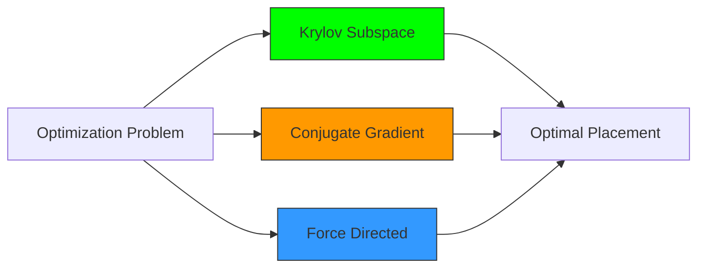
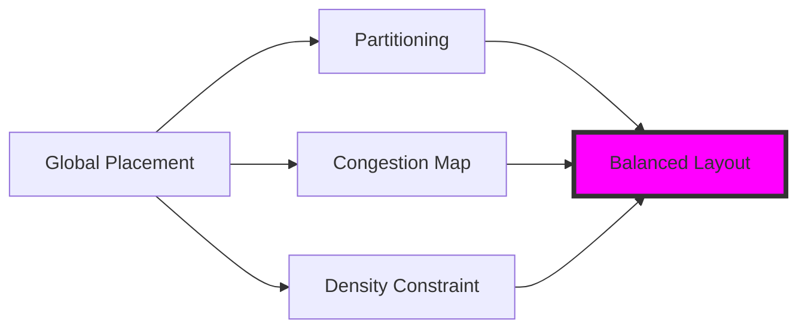
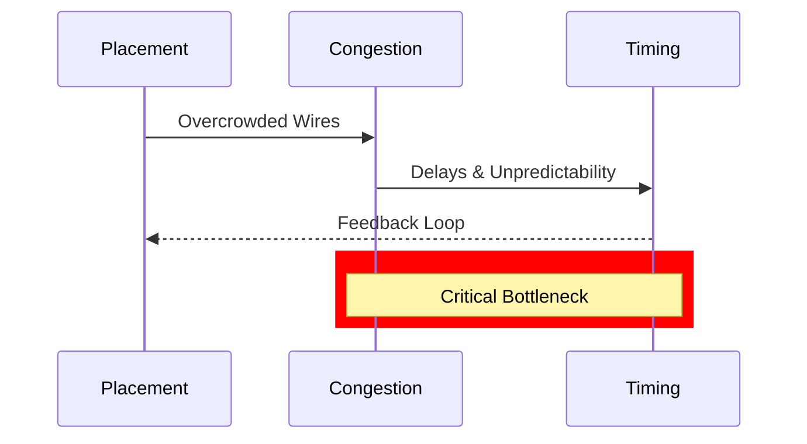
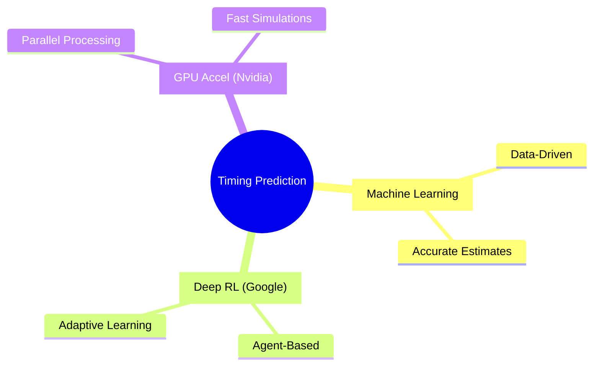
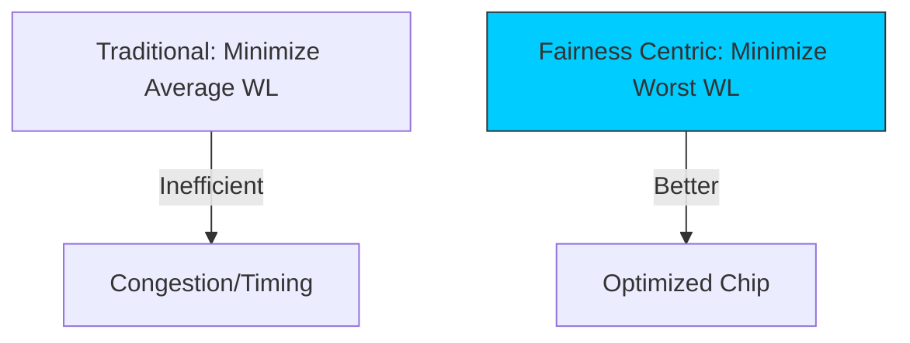

# Why HPWL is The Root of All Evil? 😈

**Presenter: [Your Name]**
**Date: November 06, 2025**
**Duration: 20 Minutes**

---

## Agenda 📋
- Introduction to Global Placement (2 min)
- HPWL: The Root of All Evil 😈 (2 min)
- Analytical Placement Methods (3 min)
- Enhancing Placement: Partitioning & Maps (2 min)
- Challenges: Congestion & Timing (2 min)
- Advanced Prediction Techniques (3 min)
- Our Solution: Fairness Centric Approach (3 min)
- Max-Min Fairness Explained (2 min)
- Conclusion & Benefits (1 min)

🔍 Total: 20 Minutes

---

## What is Global Placement? 🛠️
Global Placement is a key step in VLSI design where cells are positioned on the chip to optimize performance.

- **Goal**: Minimize wirelength while respecting constraints.
- **Why it matters**: Affects power, performance, and area (PPA).

Emoji: 🔌



---

## HPWL: Half-Perimeter Wire Length 📏
HPWL is a common metric to estimate total wirelength.

- **Formula**: For a net with bounding box (x_min, x_max, y_min, y_max):
  HPWL = (x_max - x_min) + (y_max - y_min)
- **Minimize Total Wirelength**: Sum of HPWL for all nets.
- **The Root of All Evil** 😈: Poor placement leads to congestion, timing issues, and higher power consumption.



---

## Analytical Placement Methods 🧮
Analytical methods model placement as an optimization problem.

- **Krylov Subspace Method**: Solves large linear systems efficiently. 🚀
- **Conjugate Gradient Method**: Iterative solver for quadratic minimization. 📈
- **Force Directed Method**: Simulates physical forces to spread cells. ⚡

Pros: Scalable for large designs.
Cons: May ignore discrete nature of placement.



---

## Enhancing Placement Techniques 🗺️
Beyond basics, incorporate:

- **Partitioning**: Divide the chip into regions for better management. 🧩
- **Congestion Map**: Visualize overcrowded areas to guide adjustments. 📍
- **Density Constraint**: Ensure even cell distribution to avoid hotspots. ⚖️

These help in achieving balanced designs.



---

## Challenges: Congestion & Timing Problems ⚠️
Congestion arises from poor wire distribution.

- **Congestion Problem** → **Timing Problem** (Unpredictable delays). ⏳
- Impacts: Signal integrity, increased power, manufacturing issues.

Emoji: 🚧



---

## Pre-Routing Timing Prediction 🔮
Predict timing before full routing to iterate faster.

- **Machine Learning Based**: Use models to estimate delays. 🤖
- **Deep Reinforcement Learning (Google)**: AI agents optimize placements. 🧠
- **GPU Acceleration (Nvidia)**: Speed up computations for large chips. ⚡

Enables proactive fixes.



---

## Introducing Our Solution: Fairness Centric Global Placement 🌟
Shift focus from average to equity.

- **Core Idea**: Prioritize fairness in wirelength distribution.
- **Why?** Reduces the impact of outliers (long wires causing bottlenecks).

Emoji: ⚖️



---

## Max-Min Fairness Explained 📊
Max-min fairness aims to maximize the minimum resource allocation.

- **In Placement**: Minimize the **worst** (longest) wirelength.
- **Benefits**: Improves overall timing predictability and reduces congestion.
- **Implementation**: Adjust optimization to target max HPWL.

```mermaid
barChart
    title Wirelength Fairness Comparison
    x-axis Methods
    y-axis Wirelength (um)
    bar Traditional, 500
    bar Fairness, 300
    bar Traditional Worst, 1000
    bar Fairness Worst, 400
```

---

## Conclusion & Benefits 🎉
Fairness Centric Global Placement addresses key pain points in chip design.

- **Key Takeaways**: Move beyond average metrics; focus on the worst-case.
- **Benefits**: Better timing, less congestion, scalable with ML/GPU.
- **Future Work**: Integrate with more AI techniques.

Thank you! Questions? ❓
