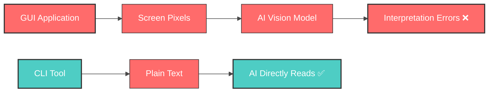
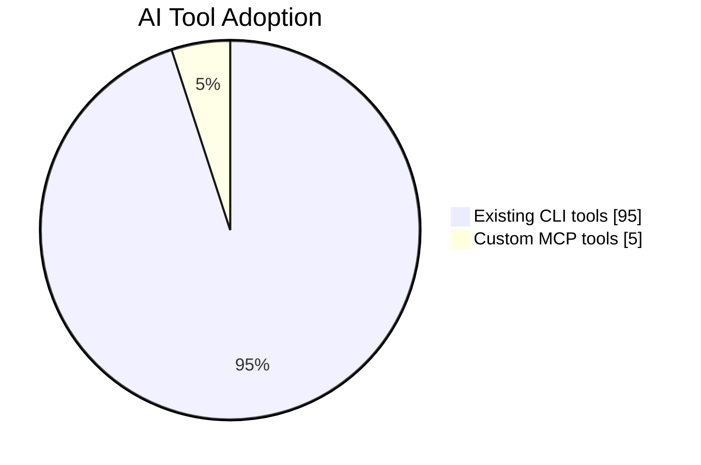
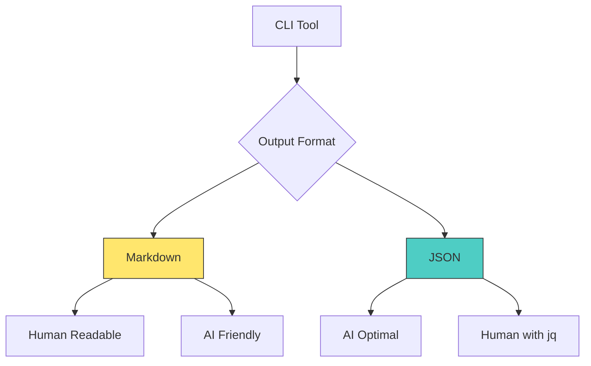
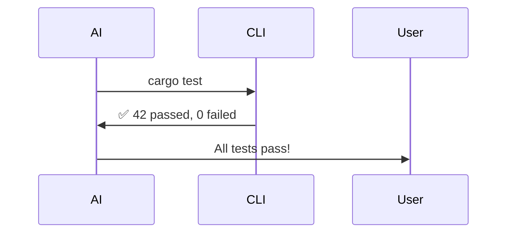
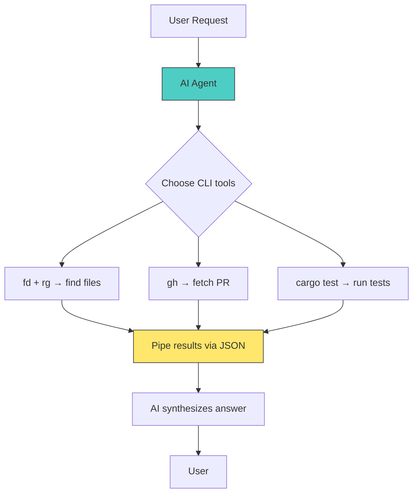

# Why AI Agents Love CLI? 🤖💻

---

## Agenda 📋

1. **What is CLI?** – Quick refresher
2. **CLI vs GUI** – Why GUIs fail for AI
3. **CLI vs MCP** – Simplicity over complexity
4. **AI Agents Love CLI** – They use it themselves
5. **The CLI Ecosystem** – Tools for every domain
6. **Conclusion** – CLI = Natural AI Interface

---

## What is CLI? 🖥️

**Command-Line Interface** – text-based interaction with software

```bash
$ grep "error" log.txt | wc -l
42
```

**Key characteristics**:
- 📝 **Text in, text out** – no pixels, no events
- 🔗 **Composable** – pipe, redirect, script
- 🔁 **Deterministic** – same input → same output
- 🌍 **Universal** – present on every OS (Linux, macOS, Windows via WSL/Scoop)

---

## CLI vs GUI 🖱️



**Why GUI is hard for AI**:
- 🎨 Requires visual parsing (slow, error-prone)
- 🖱️ Relies on mouse coordinates, event loops
- 🔄 Non-deterministic (popups, animations)
- 🤖 No standard "API" for automation

**CLI is AI-native** – just parse stdin/stdout!

---

## CLI vs MCP 🔌

**MCP** = Model Context Protocol (Anthropic's tool-calling framework)

| Aspect | CLI | MCP |
|--------|-----|-----|
| **Setup** | Built-in, zero config | Need server, schema, registration |
| **Ecosystem** | Millions of existing tools | Handful of custom tools |
| **Composability** | Pipe `\|` and `&&` | Need explicit orchestration |
| **Observability** | Just print stdout | Complex logging |
| **Language** | Agnostic (any language) | JSON-RPC over stdio/SSE |



**Verdict**: CLI is the **original** and **most universal** tool interface for AI.

---

## AI Agents Themselves Use CLI 🧠

Many AI coding assistants expose a **CLI interface**:

| Tool | Description |
|------|-------------|
| **iflow/Qoder** | CLI for AI-powered code generation |
| **opencode** | Open-source AI coding agent |
| **gemini** | Google's Gemini CLI (experimental) |

```bash
$ gemini "Explain this function" --file main.py
$ qoder review --diff
$ opencode test --verbose
```

**If AI agents embrace CLI, so should the tools they use!**

---

## Output Formats: Markdown & JSON 📄

AI agents need **structured, parseable output**:



**Examples**:
- `rg --json` → JSON lines for AI
- `gh pr view --json title,body` → Structured PR data
- `cargo test --format json` → Test results

---

## Essential CLI Tools for AI 🛠️

**Search & file manipulation** – AI's "eyes and hands"

```bash
# ripgrep – blazing fast regex search
$ rg "TODO:" --type rust

# fd – user-friendly find
$ fd "*.py" --exec black {}

# jq – JSON processor
$ curl api.example.com | jq '.data[].id'
```

These tools are:
- ⚡ **Fast** (Rust-powered)
- 📦 **Portable** (single binaries)
- 🧩 **Composable** with other commands

---

## Web Interaction via CLI 🌐

AI can control web services **without a browser**:

| CLI Tool | Service |
|----------|---------|
| `gh` | GitHub (issues, PRs, releases) |
| `bili-cli` | Bilibili (video uploads) |
| `twitter-cli` | Twitter/X (tweets, DMs) |
| `whatsapp-cli` | WhatsApp (messages) |
| `gws-cli` | Google Workspace (docs, sheets) |
| `himalaya` | Email (IMAP/SMTP) |

```bash
$ gh issue create --title "Bug" --body "..." --label "ai-generated"
$ himalaya send -t user@example.com -s "Report" < summary.txt
```

**No browser automation needed!** 🎉

---

## Software Development – Compilers 🔧

AI agents can **build and compile** code:


**Supported languages**:
- 🦀 Rust: `cargo build`
- 🐍 Python: `python -m compileall`
- 📦 C/C++: `cmake --build`, `xmake`
- 🔧 Scripting: `tclsh`, `awk -f`

AI can run these, capture errors, and **fix them iteratively**.

---

## Static Analysis – Linting & Type Checking 🔍

AI needs to **verify code quality** before submission:

```bash
# Python
$ ruff check . && mypy src/

# Rust
$ cargo clippy -- -D warnings

# C/C++
$ clang-tidy *.cpp -- -std=c++17

# Markdown
$ rumdl README.md
```

**Why this matters**:
- ✅ Catch bugs before runtime
- 📏 Enforce style guides
- 🤖 AI can auto-fix with `--fix`

---

## Validation & Testing – Harness Engineering 🧪

AI agents must **prove code works**:

| Framework | Command |
|-----------|---------|
| pytest | `pytest tests/ -v` |
| cargo test | `cargo test --release` |
| xmake test | `xmake test --verbose` |
| lychee | `lychee --offline docs/` |
| srt-validate.py | `python srt-validate.py subtitles.srt` |



**Continuous validation** = reliable AI agent.

---

## Special Tools – Beyond Traditional CLI 🎨

**Multimedia & scripting**:

```bash
# Video processing
$ ffmpeg -i input.mp4 -vf "scale=1280:720" output.mp4

# Image editing (GIMP headless)
$ gimp -i -b '(script-fu "my-script" "image.png")'

# Subtitle validation (as agent skill)
$ srt-validate.py captions.srt

# Convert script to notebook (as agent skill)
$ script2ipynb.py analysis.py --output notebook.ipynb
```

---

## EDA – Hardware Design with CLI ⚡

AI agents can design **digital circuits** too!

```bash
# Write Verilog module
$ cat adder.v
module adder(input [3:0] a, b, output [4:0] sum);
  assign sum = a + b;
endmodule

# Synthesize with Yosys
$ yosys -p "read_verilog adder.v; synth_ice40; write_json synth.json"

# Simulate with Icarus Verilog
$ iverilog -o test adder_tb.v adder.v && vvp test

# Python-based testbench with cocotb
$ cocotb-run --test test_adder.py
```

**Hardware development is CLI-native** – perfect for AI-driven design automation.

---

## Integration – How AI Agents Combine CLI Tools 🔗



**Example pipeline**:
```bash
$ fd "\.rs$" | xargs rg "unsafe" --json | jq '.matches[].line'
$ gh pr list --json number,title --jq '.[] | "PR#\(.number): \(.title)"'
```

AI can **orchestrate complex workflows** using simple shell pipelines.

---

## Conclusion – CLI is AI's Native Language 🎯

| Why CLI wins for AI | |
|---------------------|---|
| 🔤 **Text-based** | No vision models needed |
| 🔗 **Composable** | Build complex workflows from simple parts |
| 🌍 **Universal** | Works everywhere (even Termux on Android) |
| 📦 **Vast ecosystem** | Millions of existing tools |
| 🔁 **Deterministic** | Reliable, repeatable automation |
| 🚀 **Lightweight** | No server, no schema, no dependencies |

**The future**: AI agents that **speak shell** natively.

---

## Thank You! 🙏

**Questions?**

*"The command line is the AI's natural habitat."*

---

## Resources 📚

- **CLI tools mentioned**: ripgrep, fd, gh, himalaya, ffmpeg, yosys, cocotb, …
- **AI agent CLIs**: iflow/Qoder, opencode, gemini
- **Platforms**: Linux, Termux (Android), Windows (Scoop/WSL)

**Slide deck available**: [github.com/yourname/cli-for-ai](https://example.com)

---

## Bonus: Quick Demo 🎬

```bash
# AI agent in action (pseudo-code)
$ ai-agent "Find all Python files with missing docstrings"
> fd "\.py$" | xargs -I{} python -c "
    import ast, sys
    tree = ast.parse(open(sys.argv[1]).read())
    missing = [f.name for f in ast.walk(tree) if isinstance(f, ast.FunctionDef) and not ast.get_docstring(f)]
    if missing: print(f'{sys.argv[1]}: {missing}')
  " {}
```

**No GUI. No API keys. Just pure CLI power.** 🔥

