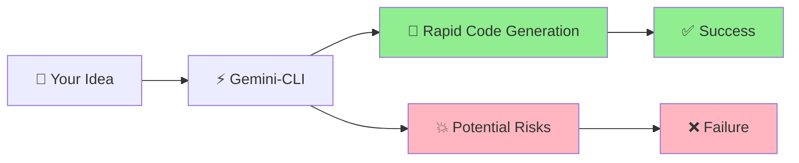
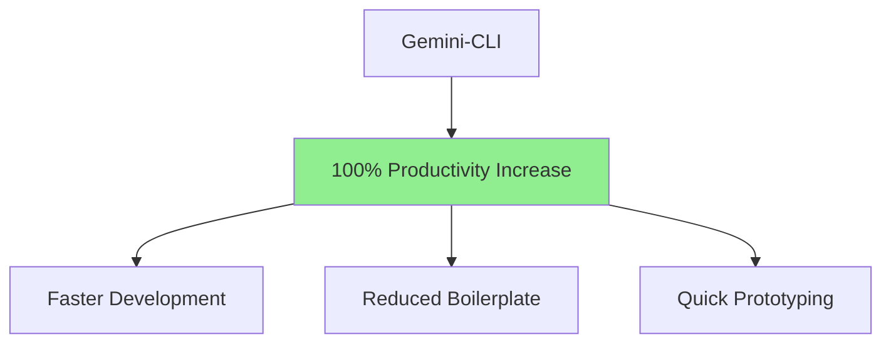
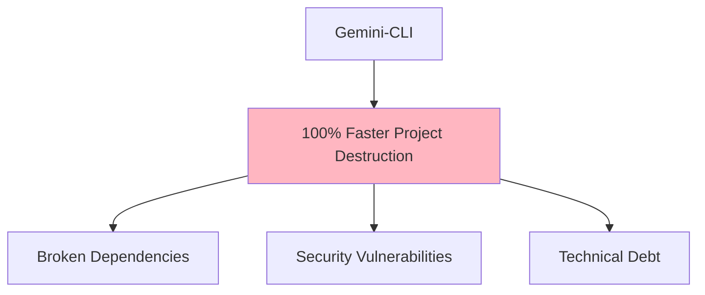
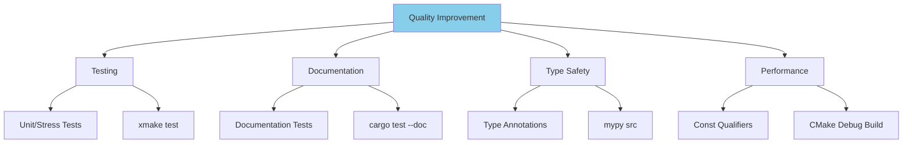
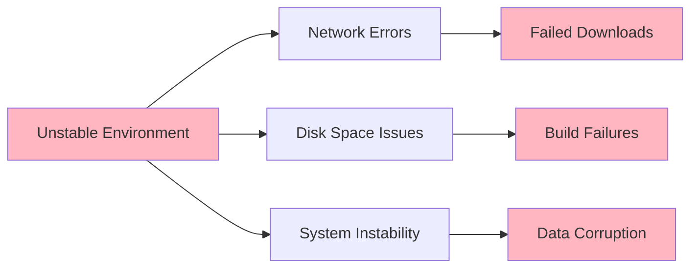
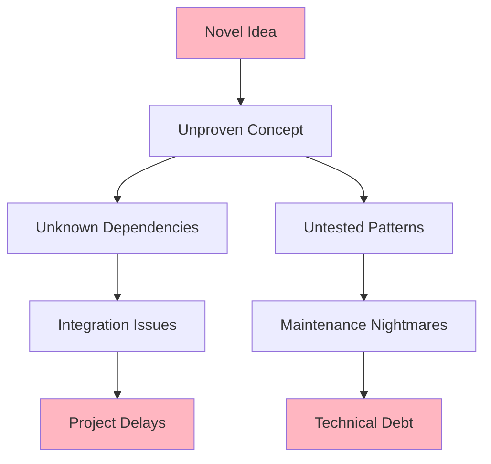
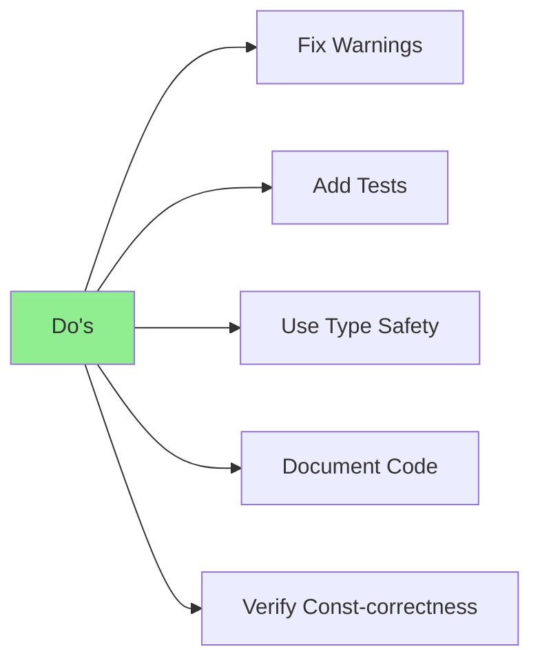
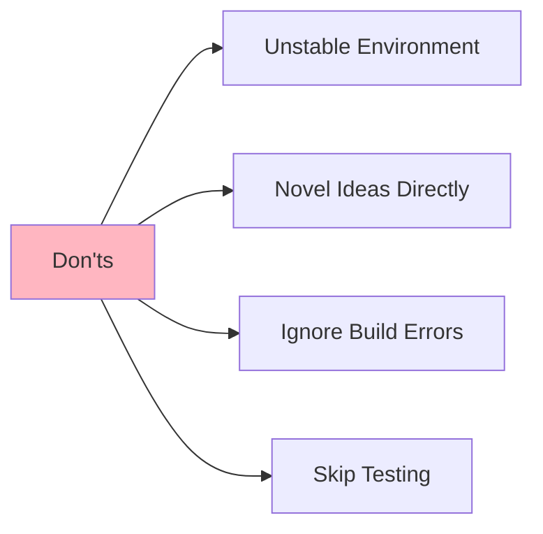
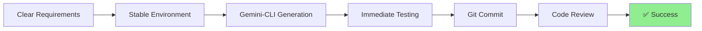
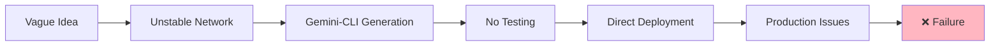

# Gemini-CLI: The Double-Edged Sword ⚔️

**Boosting Productivity vs. Project Risks**

---

## What is Gemini-CLI? 🤖

- **AI-powered command line interface**
- **Code generation and automation**
- **Rapid development acceleration**
- **But... requires careful handling** ⚠️



---

## The Double-Edged Sword Metaphor ⚔️

### **Positive Edge** 📈


### **Negative Edge** 📉


---

## Essential Safety Nets 🛡️

### **Version Control (GitHub)**
- **Commit frequently** 🔄
- **Meaningful commit messages** 📝
- **Branch protection rules** 🌿
- **Code reviews** 👀

### **Unit Testing**
- **Test before trusting** 🧪
- **Automated test suites** 🤖
- **Continuous integration** ⚙️
- **Code coverage metrics** 📊

---

## ✅ DO: Fix Errors & Warnings Immediately

### Build & Test Commands to Monitor 🎯

```bash
# C++ Projects
cmake --build build --config Release
xmake test

# Python Projects  
ruff check
mypy src
tox -e docs

# Rust Projects
cargo clippy
```

**Why this matters:**
- 🚨 **Early bug detection**
- 🎯 **Code quality maintenance**  
- 🔄 **Continuous validation**
- 📈 **Technical debt prevention**

---

## ✅ DO: Improve Software Quality

### Quality Enhancement Strategies 🏗️



---

## 🧪 Testing & Documentation

### **Add Comprehensive Tests**
```bash
# Unit/Stress tests in test/source/
xmake test

# Documentation tests in comments
cargo test --doc
```

**Benefits:**
- ✅ **Code reliability**
- 📚 **Living documentation**
- 🔄 **Regression prevention**
- 🎯 **Confident refactoring**

---

## 🔒 Type Safety & Performance

### **Type Annotations & Optimization**
```python
# Add type hints
def calculate_total(items: List[Item]) -> float:
    return sum(item.price for item in items)

# Use const where appropriate
const int MAX_CONNECTIONS = 100;
```

**Verification Commands:**
```bash
mypy src              # Type checking
cmake --build build --config Debug  # Const verification
```

---

## ❌ DON'T: Work in Unstable Environments

### **Risk Factors to Avoid** 🚫



### **Prevention Strategies:**
- 📡 **Stable internet connection**
- 💾 **Adequate disk space monitoring**
- 🔄 **Regular system maintenance**
- 💻 **Reliable hardware**

---

## ❌ DON'T: Implement Novel Ideas Directly

### **Why This is Risky** 🎲



### **Better Approach:**
- 🔍 **Research first**
- 🧪 **Prototype in isolation**
- 📊 **Validate assumptions**
- 🚀 **Gradual integration**

---

## Best Practices Summary 📋

### **Do's** ✅


### **Don'ts** ❌


---

## Risk Mitigation Framework 🛡️

### **Before Using Gemini-CLI:**
1. **Environment check** ✅
2. **Backup current work** 💾
3. **Clear objectives** 🎯
4. **Safety nets in place** 🛡️

### **During Development:**
1. **Incremental changes** 🔄
2. **Frequent testing** 🧪
3. **Version control commits** 📝
4. **Peer review** 👥

### **After Implementation:**
1. **Comprehensive testing** ✅
2. **Documentation updates** 📚
3. **Performance validation** ⚡
4. **Security review** 🔒

---

## Real-World Scenarios 🎭

### **Success Story** 🌟


### **Failure Story** 💥


---

## Key Takeaways 🎯

### **Gemini-CLI is Powerful When:**
- 🛡️ **Safety nets are established**
- 🧪 **Testing is comprehensive**
- 🔄 **Processes are followed**
- 👥 **Collaboration is maintained**

### **Gemini-CLI is Dangerous When:**
- 🚫 **Safeguards are ignored**
- ⚠️ **Quality checks are skipped**
- 🎲 **Used for unproven concepts**
- 💥 **Deployed without validation**

---

## Q&A Session ❓

**Questions?** Let's discuss:

- Your experiences with AI coding tools
- Additional safety measures you use
- Success stories and lessons learned
- Future improvements for AI-assisted development

---

## Thank You! 🙏

**Remember:** Gemini-CLI is a tool, not a replacement for good engineering practices.

**Use it wisely!** ⚔️✨
