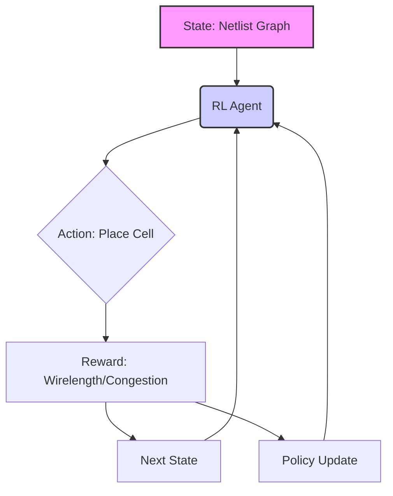
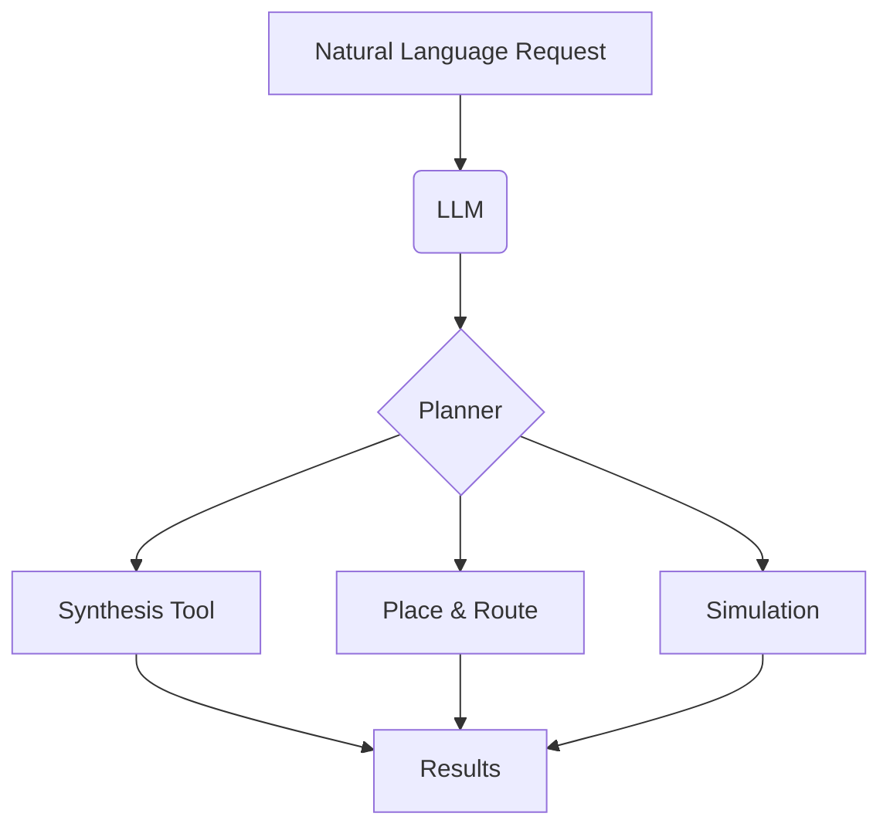
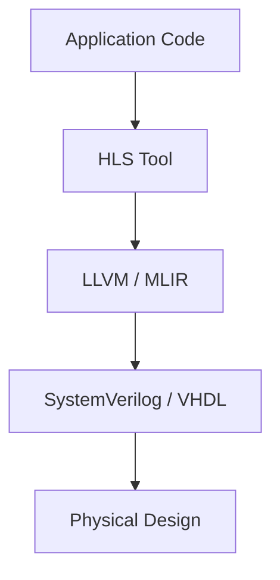

# AI for EDA 🤖💡

## The New Frontier in Chip Design 🚀

**Duration:** 30 Minutes

**Topics:**
- The Evolution of EDA 🤔➡️🧠
- AI/ML Techniques: RL, GNN, BO 📈
- The Rise of AI-Agents and LLMs 🗣️
- HLS, Physical Design & The Future 🔮

---

### AI in EDA: A Paradigm Shift

- **Traditional EDA:** Rule-based, heuristic-driven, time-consuming. 🐢
- **AI-Driven EDA:** Data-driven, predictive, and autonomous. 🚀

**AI = Machine Learning + Reinforcement Learning + Bayesian Optimization**

- **Goal:** Faster Time-to-Market, Better PPA (Power, Performance, Area). 🎯

---

### Key AI Techniques in EDA at Past

| Technique | Application in EDA | Analogy |
| :--- | :--- | :--- |
| **Machine Learning (ML)** | Timing Prediction, Yield Estimation | Learning from past data 📊 |
| **Reinforcement Learning (RL)** | Global Placement, Routing | Learning by trial & error 🎮 |
| **Bayesian Optimization (BO)** | Hyperparameter Tuning, Design Space Exploration | Smart guessing 🔎 |

---

### Industry Leaders & Their Approaches 🏢

- **Google:** (Ugly Chapter of Chip Design)
    - Pioneered **Reinforcement Learning** for chip placement (Nature paper). 🧠⚡
    - Treats placement as a game where the AI gets better over time.
    - Failed

- **Nvidia:**
    - Heavy investment in **Graph Neural Networks (GNN)** . 📊
    - Uses GNNs to understand the connectivity and topology of circuits (nets & cells).
    - Failed

- Why they don't work on Logic Synthesis?

---

### Google's Approach to Chip Placement 🎮

**Key Concept:** The agent learns a policy to place cells to maximize reward (minimize wirelength). 📈

---

### Nvidia's View: Circuits as Graphs (GNN) 🕸️

- **Why GNNs?** Chips are inherently graphs (Cells = Nodes, Wires = Edges). 🕸️
- **What they do:**
    1.  Learn embeddings for each cell.
    2.  Capture long-range dependencies.
    3.  Predict timing and congestion accurately.

---

### Critical Application: Global Placement 🌍

**Problem:** Place millions of standard cells on the chip die.

**Equation:**
$$\text{Total Wirelength} = \sum_{\text{net } n} \text{HPWL}(n)$$

**Constraints:** Must meet timing, congestion, and power constraints. ✅

**AI's Role:** RL agents (Google) and GNNs (Nvidia) are used to find near-optimal placements that minimize this equation faster than traditional solvers. 🤯

---

### The Timing Prediction Challenge ⏱️

**Problem:** Predicting if a signal arrives on time (Slack ≥ 0).

**AI Application:**
1.  **Data:** Features from placement (delay, slew, capacitance). 📊
2.  **Model:** ML models (XGBoost, GNN) predict timing violations.

- We use models to predict the final performance to avoid expensive re-spins. 💰🚫

> "Before taping-out, everything is prediction."

---

### The New Era: AI-Agent + LLM for EDA 🗣️

The "Software 2.0" approach for hardware.

- **Vibe Coding:** Describing what you want in natural language.
- **Harness Engineering:** Orchestrating multiple tools (synthesis, place & route).
- **Loop Engineering:** Automating the design closure loop.

---

### Vibe Coding for Hardware 🧘

**Concept:** "I'll just say what I need, and the AI writes the RTL." ✨

- **Input:** "Create a 32-bit RISC-V core."
- **Output:** SystemVerilog code.

**Status:** Not ready for production-level complex designs, but rapidly improving! 🚧

---

### Harness Engineering

- Moving from manual scripts to an **AI-orchestrated flow**. 🤖
- The AI decides which tools to run, with what parameters, and in what order.

---

### Loop Engineering 🔄

**Concept:** The AI doesn't just run a flow; it learns from the results and tries again.

1. **Run** the EDA flow.
2. **Measure** PPA (Power, Performance, Area).
3. **Analyze** the results.
4. **Optimize** parameters/architecture.

---

### High-Level Synthesis (HLS) Stack 🧩

- **HLS:** Converts C/C++ to RTL (SystemVerilog). 🤯
- **LLVM + MLIR:** The backbone for optimizing the "intermediate" representation.
- **AI can optimize the HLS directives:** The LLM can choose the best pragmas for performance. ✨

---

### Physical Design & JSON 📄

- **Industry Standard:** Yosys Netlist JSON.
- **Why JSON?** It's human-readable and machine-parsable. 👀
- **SAX Parser:** Used for streaming large netlist files without loading them entirely into memory. (Efficient for huge designs).

> **The importance of JSON Schema**

---

### Future Directions

- Validation tools for AI Era
- Schema-driven AI flow
- Opensource

---

### Summary & The Road Ahead

1.  **Reinforcement Learning:** Solving placement. 🤖
2.  **Graph Neural Networks:** Understanding structure. 🕸️
3.  **LLMs:** The new interface for EDA. 🗣️
4.  **HLS:** Democratizing hardware design. 🧩

---

# Thank You! 🙏

**Questions?** 🤔💬
