## 🛑 Why Continuous Logic Optimization with Diffusion Models is a **Bad Idea**

### Slide 1: Introduction: The Appeal vs. The Reality (0–3 min)

| Content | Details & Criticism Focus |
| :--- | :--- |
| **Title** | **The Illusion of Efficiency: Why Continuous Logic Optimization with Diffusion Models is Flawed** ❌ |
| **Goal of Proposed Method** | To optimize logic synthesis sequences efficiently by moving from the exponentially large discrete search space to a continuous latent space. Previous discrete search methods (RL, MAB, BO) suffer from "considerable overhead and inefficiency". |
| **The Core Innovation** | Use **continuous optimization** guided by an explicit gradient for speed. Incorporate a **Diffusion Model** to ensure the optimized solution maps back to feasible transformations. |
| **The Claimed Results** | Achieves lower area and delay while improving efficiency by **5X to 130X** compared with previous methods. |
| **Our Thesis** | This efficiency gain is misleading. The method introduces massive **pre-optimization overhead, complexity, and fragility**, making it a poor choice for general logic synthesis optimization. |

***

### Slide 2: The Unified Framework: A Two-Headed Dragon (3–6 min)

The proposed method combines two highly complex deep learning components, each with its own training requirements and failure modes, into a single, delicate optimization loop.

**The Components:**

1.  **QoR Surrogate Model ($\hat{F}(x)$):** Trained to predict QoR (Area/Delay) and provide the optimization gradient $\nabla_x \hat{F}(x)$.
2.  **Diffusion Model ($\epsilon_\theta(x, t)$):** Trained to learn the distribution of feasible transformation embeddings, ensuring minimal discrepancy, $H(x)$.

**The Unified Optimization Loop (Simplified):**

$$
x^* = \underset{x}{\text{argmin}} [\hat{F}(x) + H(x)] \quad \text{(Equation 4)}
$$

The iterative update rule combines gradient descent for QoR and denoising steps for feasibility:

$$
x_{t-1} = x_t - \eta(\epsilon_\theta(x_t, t) + \omega\nabla_x\hat{F}(\hat{x}_t)) + \sigma_t z \quad \text{(Equation 13)}
$$

***

### Slide 3: Criticism 1: Massive Upfront Overhead & Data Dependency (6–9 min)

The supposed efficiency gains ignore the significant, hidden cost of preparing the system for optimization.

#### 📊 Initial Investment: The Training Burden
The entire process requires substantial pre-training time, which is then excluded from the runtime comparison as a "one-time effort".

1.  **Surrogate Model Training:** Requires a dataset of $N$ data points, including sequences and QoR labels. Experimental setup used **20,000 randomly generated sequences** for training.
2.  **Diffusion Model Training:** Trained on the $N$ pre-collected embedded sequences. The experimental diffusion model had **500 diffusion/denoising steps**.

#### ⏳ Time Cost Per Circuit
This pre-training is required **for each target circuit**.

> For each circuit, we train a corresponding surrogate model and a diffusion model, which takes about **11 minutes and is a one-time effort**.

While 11 minutes might seem small, if the goal is to optimize dozens or hundreds of circuits, this upfront training cost rapidly accumulates, especially compared to RL/BO baselines which integrate model updates *during* their optimization loops.

#### 🔗 Fragile Data Dependence
The efficacy of the optimization is entirely beholden to the quality of the initial 20,000 sequences and their QoR labels. If the training data does not accurately represent the distribution or the QoR landscape, the optimization will fail, regardless of the speed.

***

### Slide 4: Visualization of Dependency Chain (9–12 min)

The system is highly complex, relying on the successful sequential training of deep neural networks before any optimization can occur.

```mermaid
graph TD
    A[Pre-collected Sequences & QoR Labels] --> B{"Embeddings g(s)"};
    B --> C("Train Surrogate Model F̂(·)");
    B --> D("Train Diffusion Model ϵθ(·, t)");
    C & D --> E("Initial Latent Variables xT ∼ N(0, I)");
    E --> F["Iterative Optimization (Eq. 13)"];
    F --> G(Optimized Latent Variables x*);
    G --> H[Retrieve Discrete Sequence];
    H --> I["Final QoR Validation (ABC)"];

    subgraph Pre-Optimization Overhead
        A
        B
        C
        D
    end

    style Pre-Optimization Overhead fill:#fdd,stroke:#333,stroke-width:2px
    style A fill:#aaffdd
    style I fill:#fddfaa
```

The initial investment (A, B, C, D) must be perfect for the subsequent optimization (F) to yield quality results (I).

***

### Slide 5: Criticism 2: The Unreliable Gradient and Optimization Tractability (12–15 min)

The core advantage of continuous optimization is leveraging the explicit gradient. However, the sources themselves reveal fundamental difficulties in calculating and relying on this gradient.

#### 📉 The Problematic Surrogate Gradient ($\nabla_x \hat{F}(x)$)
1.  **Reliability Issue:** A significant concern remains regarding the need to "obtain a reliable gradient".
2.  **Noisy Input Inaccuracy:** The surrogate model may not provide accurate prediction when dealing with the *noisy* latent variables $x_t$ present in the iterative optimization.
    *   *Mitigation Attempt:* They must introduce a separate noise-free version $\hat{x}_t$ (via reparameterization trick) to obtain a "more accurate gradient".
    *   *Criticism:* The need for this trick proves that the primary gradient source ($\hat{F}(x)$) is inherently unstable or unreliable when operating on variables within the diffusion process noise envelope.

#### ⚖️ Intractable Discrepancy Gradient ($\nabla_x H(x)$)
The unified objective $F̂(x) + H(x)$ is conceptually elegant, but mathematically problematic.

> Minimizing $H(x)$ (Negative Log-Likelihood, NLL) through gradient descent leads to **tractability issues for computing $\nabla_x H(x)$**.

Instead of calculating the true gradient for the feasibility term, the method resorts to optimizing a **variational bound** by training a complex diffusion model, which minimizes the difference between added noise and predicted noise:

$$
\min \mathcal{L}_d = \mathbb{E}_{t, j, x_0, \epsilon_t} [||\epsilon_t - \epsilon_\theta(\sqrt{\bar{\alpha}_t} x_0^{(j)} + \sqrt{1 - \bar{\alpha}_t} \epsilon_t, t)||^2] \quad \text{(Equation 10)}
$$

This turns a single gradient problem into a complex, two-part optimization based on approximation and external model tuning.

***

### Slide 6: Criticism 3: The Diffusion Model — A Single Point of Failure (15–18 min)

The entire advantage of the continuous search approach hinges on the Diffusion Model correctly solving the retrieval problem.

#### 💔 Failure Mode: Discrepancy Catastrophe
Continuous optimization alone yields solutions that **deviate from feasible ones**, making the final sequence retrieval nearly impossible. Previous attempts to fix this post-optimization (using distance metrics or decoders) failed because they were "out of the optimization loop".

The Diffusion Model is brought *inside* the optimization loop specifically to fix this, minimizing the discrepancy between optimized embeddings and feasible transformations.

#### 💣 Evidence of Fragility
Ablation studies confirm the catastrophic dependence:

> Solely utilizing a surrogate model to perform continuous optimization **can hardly exceed the performance of baseline methods**.

If the complex diffusion model component fails to accurately model the distribution of feasible transformation embeddings, the optimized latent variables diverge, making the resulting sequence effectively useless.

***

### Slide 7: Visualization: The Cost of Diffusion Model Failure (18–21 min)

The comparison visualizing the latent space highlights how quickly the continuous optimization fails without the Diffusion Model's constraint.

*(Based on data from)*

This shows that the continuous optimization process itself, guided by the QoR gradient, is fundamentally **unstable** and requires constant, complex intervention from the Diffusion Model to remain relevant to the discrete problem space.

| Scenario | Optimized Latent Variables | QoR Result (Area) |
| :--- | :--- | :--- |
| **With Diffusion Model** | Aligned with feasible embeddings (minimal discrepancy). | 11,900.00 $\mu m^2$ |
| **Without Diffusion Model** | **Deviate from feasible embeddings** (large discrepancy). | 22,654.15 $\mu m^2$ |

The failure state (without diffusion) leads to a sequence yielding an area **1.9 times larger** than the successful result. This extreme sensitivity means the Diffusion Model is not an auxiliary component; it is the **sole guarantor of solution quality**.

***

### Slide 8: Criticism 4: Tuning and Deployment Complexity (21–24 min)

Implementing this approach requires navigating the tuning complexities of two interconnected deep learning models in an optimization setting.

1.  **Balancing Objectives:** The optimization relies on balancing the QoR minimization (guided by $\nabla_x \hat{F}$) against the feasibility minimization (guided by the denoising steps $\epsilon_\theta$).
    *   This balance is controlled by the coefficients $\eta$ and $\omega$ (Equation 13).
    *   Tuning these parameters ($\eta, \omega$) is crucial for finding the right trade-off, where aggressive QoR optimization does not destroy feasibility, and aggressive feasibility enforcement does not impede QoR improvement.

2.  **Diffusion Model Hyperparameters:** The Diffusion Model itself is a highly complex generative model. It requires careful tuning of noise parameters, conditional distributions, and 500+ denoising steps. Any miscalibration here directly leads to solution divergence and catastrophic QoR degradation.

#### 🧩 Analogy: Steering a Ship in a Storm

Imagine steering a ship (the optimization) toward a target (low QoR).

*   **Traditional Methods (RL/BO):** Slow, sequential rowing, but you are always on solid discrete ground.
*   **Proposed Method:** You jump into a high-speed jet boat (continuous optimization). However, the boat has two engines: one pushing toward the QoR goal ($\nabla_x \hat{F}$) and one constantly correcting the position to stay *on the water* (Diffusion Model $\epsilon_\theta$). If the corrective engine fails, or if the two engines are misaligned ($\eta, \omega$ improperly set), the jet boat instantly flies off course, crashes, and leaves you far worse off than before.

***

### Slide 9: Conclusion — The Hidden Costs Outweigh the Speed (24–30 min)

The proposed Continuous Logic Optimization framework is efficient *on paper* but introduces prohibitive complexities and points of failure.

#### 🔑 Summary of Weaknesses

1.  **High Pre-Optimization Cost:** Requires circuit-specific training of two complex deep learning models (Surrogate & Diffusion) on massive pre-collected datasets (e.g., 20,000 samples), a time investment often ignored in speedup comparisons.
2.  **Unreliable Gradient:** The core efficiency mechanism—the explicit gradient—is inherently unreliable on noisy latent variables, requiring complex reparameterization tricks ($\hat{x}_t$).
3.  **Tractability Debt:** The optimization objective ($H(x)$) is fundamentally intractable via gradient descent, necessitating the use of the complex variational bound approach implemented by the Diffusion Model.
4.  **Extreme Fragility:** The entire process is critically dependent on the Diffusion Model. Without it, the optimization yields results nearly 2X worse, making the continuous optimization component useless on its own.

| 💡 **Verdict:** | While fast during execution, the method replaces traditional overhead with a massive, fragile, and mandatory upfront investment in sophisticated deep learning infrastructure for every new optimization task. |
| :--- | :--- |

**Thank You.** 🙏