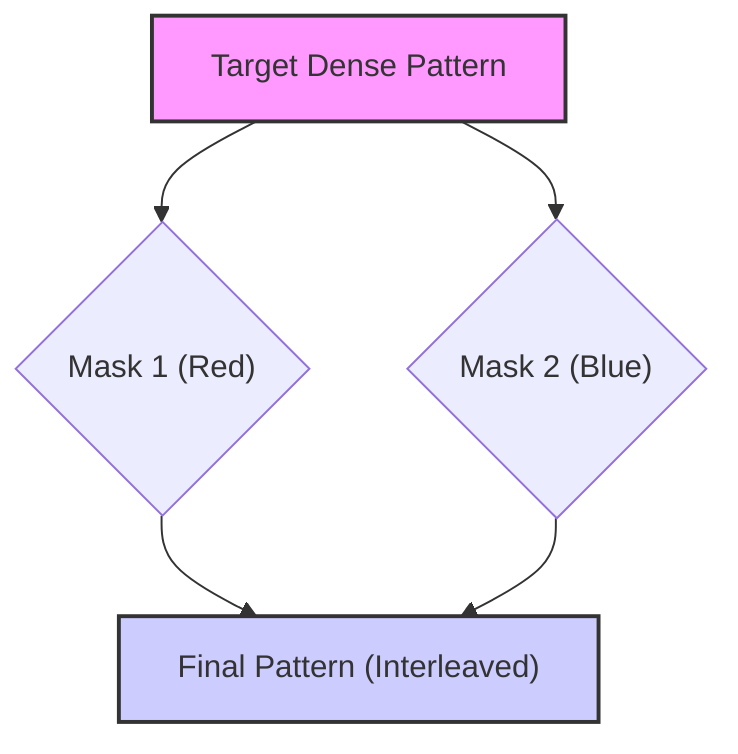
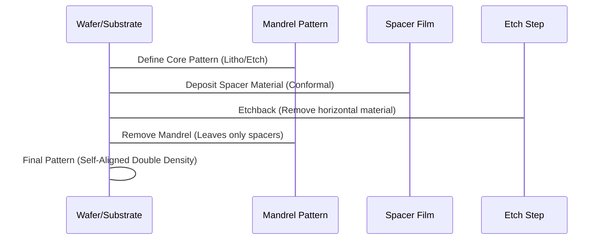

# 📊 Changes and Challenges in Multi-Patterning Lithography (MPL)

## 🕒 30-Minute Presentation Outline

| Section | Topic | Estimated Time |
| :--- | :--- | :--- |
| **I. Introduction** | Motivation & Principles | 3 min |
| **II. Core Techniques** | LELE, SADP, SAQP | 7 min |
| **III. Manufacturing & Cost** | Overlay, Cost, & Optimization | 6 min |
| **IV. Design & EDA Challenges** | Layout Decomposition & Tooling | 8 min |
| **V. Future Outlook** | EUV Integration & DSA | 4 min |
| **VI. Conclusion** | Summary & Q&A | 2 min |

---

# I. Introduction (Slides 1-3)

## Slide 1: Title Slide 🛠️

# **Changes and Challenges Abound in Multi-Patterning Lithography**
#### Enabling Sub-10nm Scaling in Semiconductor Manufacturing

*Based on contributions from:*
*   David Abercrombie (Mentor Graphics)
*   Gary Zhang (ASML Brion)
*   Dr. Donis Flagello (Nikon Research Corporation of America)
*   Various Industry Sources (SEMI, Patsnap, Wikipedia)

*(Presentation Time: 1 minute)*

---

## Slide 2: Why Multi-Patterning is Necessary 🤔

*   **Resolution Limits:** Traditional single-exposure lithography (like 193nm immersion) reached a fundamental optical resolution limit, typically around 80 nm minimum pitch. Below this limit, single exposures struggle to resolve features with sufficient accuracy.
*   **Moore's Law Extension:** MPL is required to continue device scaling and exploit design area and performance scaling. Without multi-patterning or EUV (Extreme Ultraviolet Lithography), Moore’s Law would slow to a crawl.
*   **EUV Delay:** MPL using immersion lithography is essential until EUV comes into full production, which was expected for mid-node insertion at 10nm and production at 7nm (2015-2017 timeframe).
*   **The Goal:** MPL is a class of technologies developed to **enhance feature density**. It enables the creation of smaller features by effectively doubling, tripling, or quadrupling the density achievable in a single exposure.

*(Presentation Time: 1 minute)*

---

## Slide 3: Principles of Multiple Patterning 💡

MPL involves dividing a desired pattern and using multiple steps to transfer it onto the wafer.

### General MPL Workflow:
1.  **Pattern Division:** The complex pattern is split into simpler patterns.
2.  **Exposure & Development:** Each simpler pattern is exposed sequentially, often using different masks or techniques.
3.  **Pattern Transfer:** The individual patterns are etched or processed into the underlying material.
4.  **Final Pattern:** The overlapping or integrated patterns form the final, high-density complex pattern.

### Types of MPL:
The sources define two main approaches:

| Approach | Mechanism | Example | Key Feature |
| :--- | :--- | :--- | :--- |
| **Pitch Splitting** | Repeated lithography and etching | **LELE** (Litho-Etch-Litho-Etch) | Relies heavily on overlay accuracy |
| **Sidewall Image Transfer (SIT)** | Deposition and removal using a core feature (mandrel) | **SADP/SAQP** | Inherently self-aligned |

### Visualizing Pitch Splitting
This shows how features separated by one pitch (unresolvable) are assigned to two different masks (colors).

*(Presentation Time: 1 minute)*

---

# II. Core Techniques (Slides 4-7)

## Slide 4: Litho-Etch-Litho-Etch (LELE) 📝

LELE is the simplest form of dual patterning. It is also known as "pitch splitting" when applied to dense lines and spaces.

### Process:
1.  Print and etch the first pattern (Mask A).
2.  Deposit a second photoresist layer.
3.  Print and etch the second pattern (Mask B).
4.  The final result is a composite of the etched sub-patterns, achieving doubled density.

### Multi-Step LELE:
The LELE approach can be extended:
*   **Triple Patterning (LELELE):** Requires three separate exposures and etch steps. Used for critical layers at 14nm.
*   **Quadruple Patterning (LELELELE):** Requires four litho-etch iterations.

### Key Challenge: Overlay 🚨
LELE's primary challenge is the **requirement for precise alignment** between the multiple patterning steps. Misalignment leads to pattern overlay errors, impacting yield and performance.

*(Presentation Time: 2 minutes)*

---

## Slide 5: Self-Aligned Double Patterning (SADP) 📏

SADP, or Spacer Patterning, utilizes inherent self-alignment, offering better control over overlay compared to LELE.

### Process:
1.  **Mandrel Formation:** A core pattern (mandrel) is printed.
2.  **Spacer Deposition:** A spacer film layer is deposited uniformly on the mandrel sidewalls.
3.  **Etchback:** The film is etched away from horizontal surfaces, leaving only the material on the sidewalls.
4.  **Mandrel Removal:** The original mandrel is removed.
5.  **Density Doubling:** Two spacers remain for every line, doubling the pattern density.

### SADP Flow Diagram:

### SADP Variants:
*   **Spacer-Is-Dielectric (SID):** The spacers define dielectric spaces rather than conducting features, potentially reducing the need for line cutting masks.

*(Presentation Time: 2 minutes)*

---

## Slide 6: Self-Aligned Quadruple Patterning (SAQP) 🚀

SAQP builds upon SADP principles to achieve even finer pitches.

### Process:
SAQP applies the SADP process **twice in a row**.
1.  Initial mandrel and first spacer formation (SADP Step 1).
2.  A second set of spacers is deposited on the first set, doubling the pattern density again.

### Benefits and Application:
*   **Pitch Quartering:** SAQP achieves an effective pitch quartering. A 76 nm minimum pitch from immersion lithography can be reduced to 19 nm using SAQP.
*   **Highest Density:** SAQP is highly beneficial for achieving the smallest feature sizes and is a favored choice for cutting-edge applications.
*   **Industrial Adoption:** SAQP is established for patterning fins for 7 nm and 5 nm FinFETs. Intel uses SAQP for its 10nm minimum metal pitch of 36 nm.

### SAQP Complexity:
The complexity and cost associated with SAQP are significant due to the multiple processing steps, requiring meticulous control to ensure high yield.

*(Presentation Time: 3 minutes)*

---

# III. Manufacturing & Cost (Slides 8-11)

## Slide 7: Cost and Throughput Implications 💸

| Patterning Method | Normalized Wafer Cost (Approx.) |
| :--- | :--- |
| 193i Single Exposure (SE) | 1 |
| 193i LELE (Double) | 2.5 |
| 193i LELELE (Triple) | 3.5 |
| 193i SADP | 2 |
| 193i SAQP | 3 |
| EUV SE | 4 |
| EUV SADP | 6 |

*   **Increased Steps & Cost:** MPL adds additional masks and process steps, increasing complexity and cost. This has led to fewer companies moving to advanced nodes quickly, requiring significant volume and profit margins to justify the expense.
*   **Throughput Reduction:** Below the 28nm node, the increasing number of masks and metrology steps translates to **lower wafer throughput** per scanner and **longer wafer cycle time**.
*   **Immersion vs. EUV:** DUV multi-patterning (like 193i SAQP) can be cheaper than EUV single exposure. Furthermore, immersion scanners may offer higher wafer productivity (WPM) than EUV, even with 4 passes per layer, due to faster wafer exposure throughput (WPH) and higher tool uptime.

*(Presentation Time: 2 minutes)*

---

## Slide 8: The Critical Challenge of Overlay (Alignment) 🎯

Overlay is the alignment accuracy between subsequent patterned layers or exposures within the same layer. This is one of the most critical aspects of MPL.

*   **Tighter Specifications:** MPL drives tighter requirements for CD (Critical Dimension), focus, and overlay to account for increased process variations from additional steps.
    *   Moving from 28 nm (single exposure) to 14 nm (double patterning) and 10 nm (triple patterning) requires ever tighter overlay specifications.
*   **Advanced Corrections:** To deliver required overlay control, scanner matching and process control must include **high order corrections**.
    *   ASML's latest immersion scanners are capable of **sub-3 nm matched-machine overlay**.
*   **Ensemble Overlay:** The overall overlay of all exposures within a layer must be equal to or better than a single exposure.

*(Presentation Time: 2 minutes)*

---

## Slide 9: Process Window Enhancement (PWE) 🔍

To maximize manufacturability and yield, a combination of Process Window Enhancement (PWE) and Process Window Control solutions is necessary.

### Design Hotspots:
*   Rule-based MPT designs risk pattern defects from design hot spots.
*   PWE solutions are used in the design phase to eliminate these hot spots and maximize the full chip process window.

### Key Optimization Tools:

| Tool | Function | Description |
| :--- | :--- | :--- |
| **SMO** | Source-Mask Optimization | Co-optimizes scanner optics (illumination source) and mask enhancements (SRAF, OPC) to enlarge the lithography process window. |
| **OPC** | Optical Proximity Correction | Used for production mask data preparation to deliver the best full chip process window. |
| **LMC** | Lithography Manufacturability Check | Evaluates the impact of realistic dose, focus, mask, and overlay variations on hot spots. |

### SMO Example:
In triple patterning of a 10nm node metal layer, SMO enabled a 23% larger overlapping process window for SRAM and logic designs.

*(Presentation Time: 2 minutes)*

---

# IV. Design & EDA Challenges (Slides 12-16)

## Slide 10: Layout Decomposition (Coloring) 🎨

Layout decomposition, or coloring, is the fundamental problem of dividing the original layout into multiple masks (colors) that are free of process rule violations.

### Coloring Flows:
*   **Colorless Flow:** The designer does not assign colors. Specialized checks ensure the layout can be decomposed later. Requires complex visualization (e.g., odd cycle error visualization for DP).
*   **Partial Coloring Flow:** Designer manually assigns color to specific parts (e.g., matched circuitry) to manage subtle variation concerns.
*   **Fully Colored Flow:** Designer is responsible for producing the final mask assignments for all polygons.

### Coloring Objectives:
1.  **Avoid Conflicts:** Ensure all patterns can be manufactured by the allotted masks.
2.  **Stitch Minimization:** For LELE-type MPL, stitches (where one pattern is split into two touching parts with different colors) must be minimized due to overlay-induced yield loss.
3.  **Color Balancing:** Ensure pattern density is balanced between split masks, which is beneficial for litho and etch process control.

*(Presentation Time: 2 minutes)*

---

## Slide 11: Complexity of Advanced Coloring (KaTeX) 🤯

While double patterning (DP) checks are complex, the generalized solution for **triple patterning (TP)** and **quadruple patterning (QP)** has exponentially increasing run time (an **NP-complete problem** in graph theory).

*   The problem must be constrained to allow reasonable heuristic algorithmic approaches.
*   Layout decomposition can be formulated using conflict graphs where vertices (patterns) need to be colored.

### Vector-Based Formulation for K-Patterning:
The generalized SDP (Semidefinite Programming) formulation for $k$-patterning ($k \geq 4$) relaxes the discrete vector coloring problem into a continuous SDP problem.

$$ \min \sum_{e_{ij} \in CE} \left(\vec{y}_i \cdot \vec{y}_j + \frac{1}{k - 1} \right) + \alpha \sum_{e_{ij} \in SE} \left(1 - \vec{y}_i \cdot \vec{y}_j \right) \quad (1a) $$
$$ s.t. \quad \vec{y}_i \cdot \vec{y}_i = 1, \quad \forall i \in V \quad (1b) $$
$$ \vec{y}_i \cdot \vec{y}_j \geq - \frac{1}{k - 1}, \quad \forall e_{ij} \in CE \quad (1c) $$

Where:
*   $CE$: Conflict edges (patterns that *must* have different colors).
*   $SE$: Stitch edges (patterns that *may* have the same or different colors).
*   $\vec{y}_i$: Continuous relaxation of the discrete color vector.

*(Presentation Time: 3 minutes)*

---

## Slide 12: Design Rule Check (DRC) Changes 📐

The introduction of MPL fundamentally changes how design rules are defined and checked.

### Key Changes:
*   **Spacing Checks:** For every traditional spacing check in a fully colored flow, there are now two essential checks for DP:
    1.  Minimum spacing for **different colored** polygons.
    2.  Larger minimum spacing for **same colored** polygons.
*   **Density Checks:** Additional density checks are required to ensure the ratio between colors is reasonably equal (color balancing).
*   **New Specialized Checks (Colorless Flow):** Checks are needed to verify if a valid coloring exists for a given layout construct.
    *   For DP, this includes **odd cycle checks** (an odd-numbered cycle of interacting polygons cannot be colored).
    *   For TP and QP, the uncolorable constructs are much more complex than simple cycles.

### EDA Support:
EDA solutions like Calibre must address all different coloring flows and provide the same checks/algorithms from initial IP blocks to final full chip signoff.

*(Presentation Time: 2 minutes)*

---

## Slide 13: IC Design and Verification Issues 🛑

MPL introduces systemic issues across the entire IC design flow.

*   **Design Constraints:** Designers face new design rules, more complexity in methodology constraints, and the need to ensure IC designs are MPT compliant.
*   **Parasitic Variation:** Electrical design must now consider additional parasitic variability for timing analysis. MPT process variations heavily influence performance metrics like RC timing delay, cross talk, and leakage.
*   **Hotspot Identification:** Identification of MPT hot spots helps drive OPC and design improvements, as hot spots are major yield detractors.
*   **Standard Cell (SC) Design:** SC designers must provide robust libraries. MPL constraints, especially in Middle-of-Line (MOL) layers, introduce multi-cell interactions.
    *   **Pin Access Optimization:** Difficult pin access in dense SCs must be co-optimized with the layout, especially for SADP-based metal layers.

*(Presentation Time: 1 minute)*

---

## Slide 14: MPL-Aware Physical Design (Placement & Routing) 🗺️

To reduce costly redesign efforts, MPL implications must be considered early in physical design stages, including placement and routing.

### Placement (Resolving Inter-Cell Conflicts):
When standard cells (SCs) are placed next to each other, inter-cell coloring conflicts can arise, even if individual cells were pre-colored. Techniques used to resolve these conflicts include (as illustrated for Triple Patterning):

*   **Cell Re-Coloring:** Selecting a compatible pre-computed coloring solution for the cell.
*   **Cell Flipping:** Changing the orientation of the cell.
*   **Cell Shifting:** Moving the cell position.

### Routing (Incorporating MP Constraints):
*   **Grid Models:** Expanded routing grid models help systematically deal with coloring constraints during routing.
*   **SADP/SAQP Routing:** Due to better overlay control, SADP/SAQP are competitive lithography candidates for lower routing layers. SADP-aware routing integrates layer assignment techniques to separate conflicting patterns.

*(Presentation Time: 2 minutes)*

---

# V. Future Outlook (Slides 17-21)

## Slide 15: The Necessity of Line Cutting ✂️

MPL is often used in conjunction with a separate **cut mask** exposure, especially for two-dimensional patterns and line ends.

*   **Purpose:** Line cutting does not directly increase feature density but allows the definition of features (like brick patterns) based on minimum pitch lines.
*   **Rounding and Gaps:** Dense two-dimensional patterns are subject to significant rounding at corners. Without a separate cut exposure, the gap between line ends (tip-to-tip spacing) would be prohibitively large.
*   **EUV Requirement:** Even for EUV, a line-cutting approach is usually necessary because a single EUV exposure has difficulty with line end-to-end spacing control.
*   **Self-Aligned Cutting:** Self-aligned blocking or cutting is being targeted for SAQP for sub-30 nm pitches, ensuring double pitch features are patterned over lines at the minimum pitch without edge placement errors.

*(Presentation Time: 2 minutes)*

---

## Slide 16: EUV and Multi-Patterning 🌌

EUV lithography, while promising for smaller features, is not a silver bullet and may still require MPL.

*   **Stochastic Defects:** EUV resolution is limited by **stochastic defects** (random shaping of cuts, missing or bridging features). This forces the dose to increase for successive nodes.
*   **Tip-to-Tip Issues:** Tip-to-tip gaps are problematic for small dimensions (e.g., 16 nm). EUV single exposure has difficulty controlling line end-to-end spacing.
*   **Illumination Limitations:** Different patterns and pitches in the same metal layer might require different, mutually exclusive illuminations. A single EUV exposure only offers a single illumination.
*   **High-NA EUV:** Even advanced High-NA EUV tools (0.55 NA) face challenges and may require stitching or multiple exposures for half-field scans.

*(Presentation Time: 2 minutes)*

---

## Slide 17: Directed Self-Assembly (DSA) 🧪

DSA is an emerging technique that uses block copolymers to define sub-20 nm patterns through self-assembly.

### Core Mechanism:
DSA leverages block copolymers that microphase separate into ordered domains (e.g., lines or cylinders), guided by surface topography (graphoepitaxy) or chemical patterning (chemoepitaxy).

### DSA Benefits:
*   **Simple Processing:** Relatively simple processing compared to multiple exposures or depositions/etching.
*   **Mask Reduction:** DSA can potentially reduce the number of masks required for sidewall spacer patterning.

### DSA Challenges:
*   **Limited Range:** DSA has a relatively limited range of feature sizes and duty cycles for a given formulation.
*   **Defectivity:** DSA has not yet been implemented in volume manufacturing due to concerns over defects (features not appearing as expected).

*(Presentation Time: 1 minute)*

---

## Slide 18: Conclusion & Hybrid Approaches 🤝

**The Reality of Scaling:** The paradigm of multi-patterning remains critical and viable for sub-10nm nodes, whether continuing DUV scaling (up to SAQP or beyond) or assisting emerging technologies.

*   **Hybrid Lithography:** The industry is moving toward combining traditional 193nm lithography or SADP with high-resolution techniques like EUV or EBL (Electron Beam Lithography).
    *   Example: SALELE (Self-Aligned Litho-Etch-Litho-Etch) is a hybrid SADP/LELE technique used at 7nm and 5nm nodes.
*   **Holistic Approach:** A full suite of design and manufacturing solutions are required. ASML, for instance, uses a holistic lithography framework to optimize design, scanner, mask, and process control together for best manufacturability.

The successful transition to advanced nodes requires **Design-Technology Co-Optimization (DTCO)**, where EDA tools and physical design flows incorporate complex MPL constraints from the start.

*(Presentation Time: 2 minutes)*
