# Why I don't use Rust Recently? 🤔

---

## About Me 👨‍💻

- Researcher with experience in multiple languages
- Worked on C++ programming, EDA development, and algorithms
- Tried Rust for several projects
- Appreciate its strengths but found some challenges

---

## Agenda 📋

1. **The Good** - What Rust does well ✅
2. **The Challenges** - Where I struggle ❌
3. **Trait System** - Complexity concerns 
4. **Borrow Checker** - The learning curve
5. **Use Cases** - Where Rust shines vs struggles
6. **Conclusion** - My personal take

---

## The Good: Rust's Strengths ✅

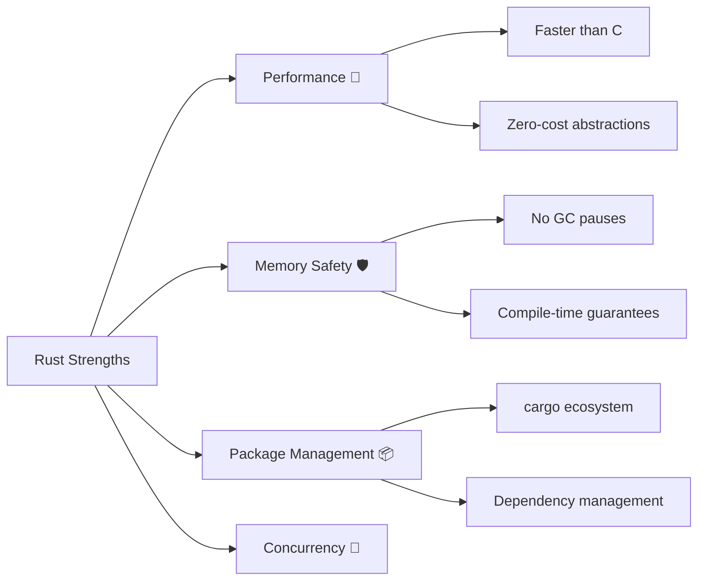

---

## Performance Champions 🏆

**Real-world examples that impressed me:**

- `rg` (ripgrep) - Blazing fast text search
- `fd` - Simple, fast file finding
- `zed` - High-performance code editor
- `fish` shell - Fast command completion

**Benchmarks often show Rust outperforming C++**

---

## Cargo: The Gold Standard 📦

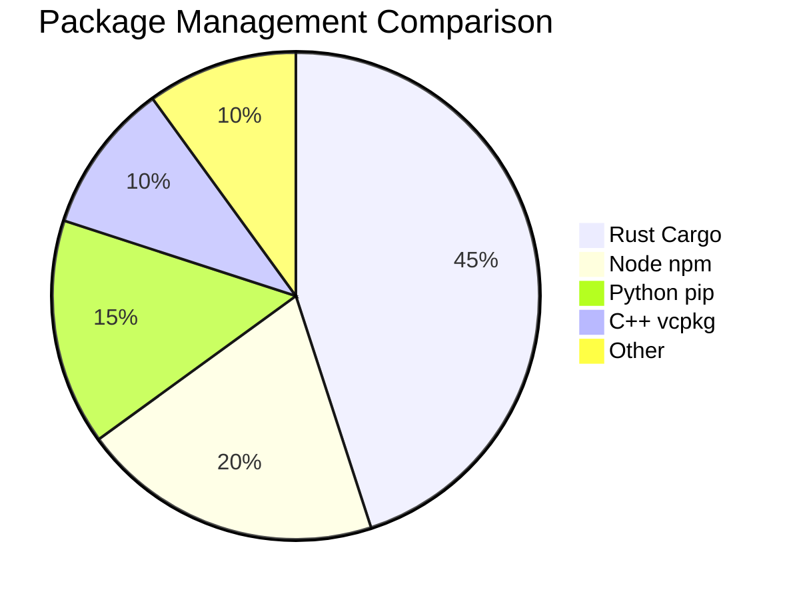

- **Dependency resolution** that just works
- **Built-in testing** and documentation
- **Cross-compilation** made easy
- **Workspace** support for monorepos

---

## The Learning Curve 📈

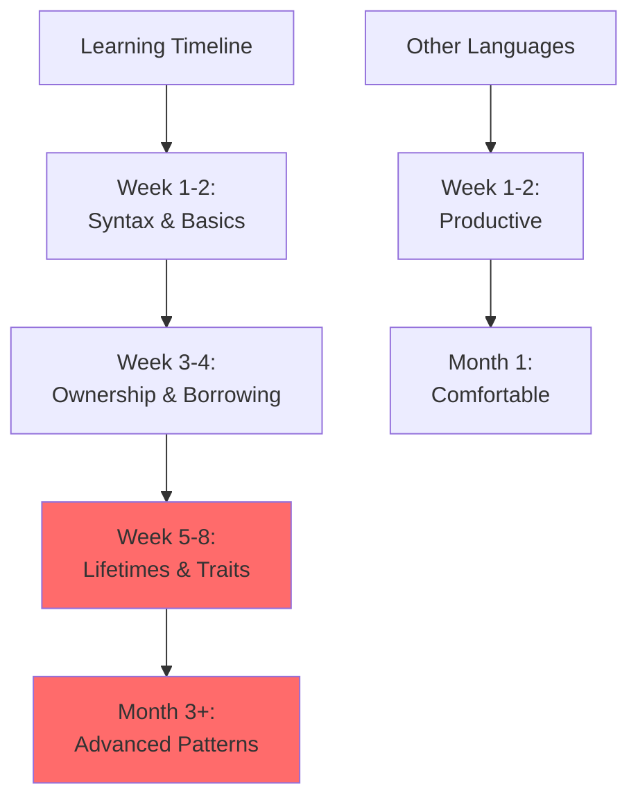

---

## Key Concepts That Challenge Beginners 🧩

### 🎯 Ownership & Borrowing
### 🔄 Lifetimes `<'a>`
### 📐 Traits & Generics
### 🧩 Macros
### 🔒 Concurrency Model

**You need to understand ALL of these to be productive**

---

## Trait System: Powerful but Complex ⚙️

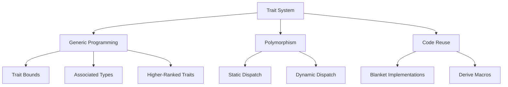

---

## Trait Implementation Challenges 🤯

```rust
trait MyTrait {
    type AssociatedType;
    fn method(&self) -> Self::AssociatedType;
}

impl<T> MyTrait for Vec<T> 
where 
    T: Clone + Debug,
{
    type AssociatedType = Vec<T>;
    fn method(&self) -> Self::AssociatedType {
        self.clone()
    }
}
```

**Complex trait bounds can become unreadable**

---

## Borrow Checker: Love-Hate Relationship 💔

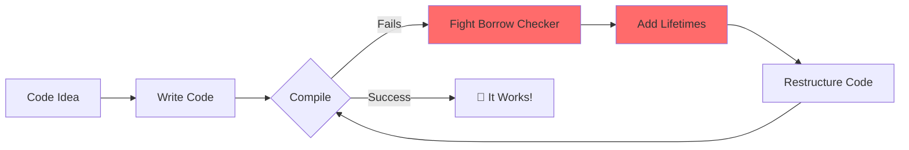

---

## Borrow Checker Pain Points 😫

### 🚫 **Too Restrictive**
```rust
fn process_data(data: &mut Vec<i32>) -> &i32 {
    let result = &data[0];
    data.push(42); // ❌ Compiler error!
    result
}
```

### 🔍 **Not Always Smart Enough**
```rust
fn get_or_create(map: &mut HashMap<String, String>, key: String) -> &String {
    if !map.contains_key(&key) {
        map.insert(key.clone(), String::new()); // ❌ Can't do this easily
    }
    &map[&key]
}
```

---

## Lifetime Annotations: Visualized 📊

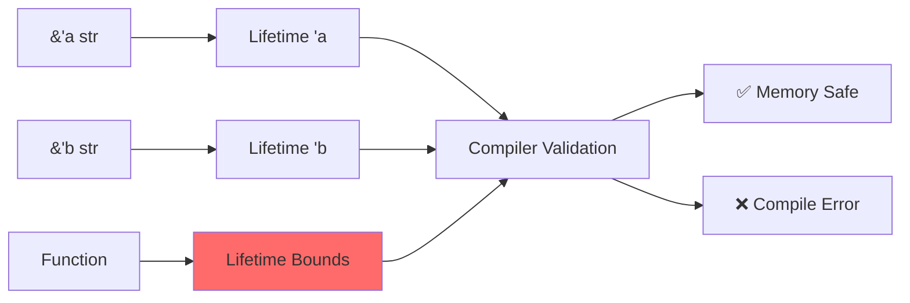

**`<'a>` - The syntax that haunts beginners' dreams**

---

## AI Assistance Limitations 🤖

### **Current State:**
- ChatGPT struggles with complex lifetime issues
- GitHub Copilot suggests incorrect borrow patterns
- AI can't reason about ownership like humans

### **Reality Check:**
```rust
// AI might suggest this:
fn bad_idea(data: &Vec<i32>) -> &i32 {
    &data[0] // ❌ Lifetime issues await
}

// When you actually need:
fn better<'a>(data: &'a Vec<i32>) -> &'a i32 {
    &data[0]
}
```

---

## Algorithm Development Challenges 🎮

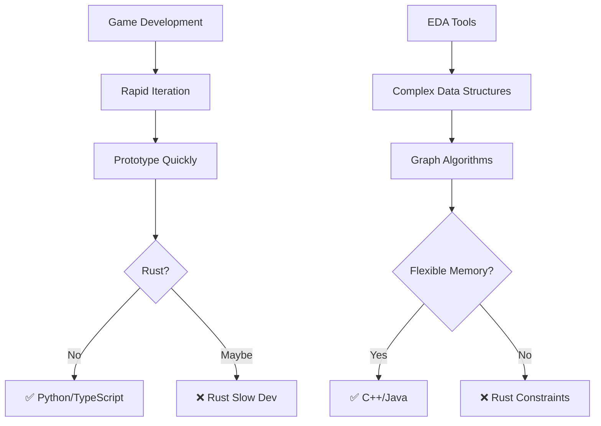

---

## Where Rust Excels 🌟

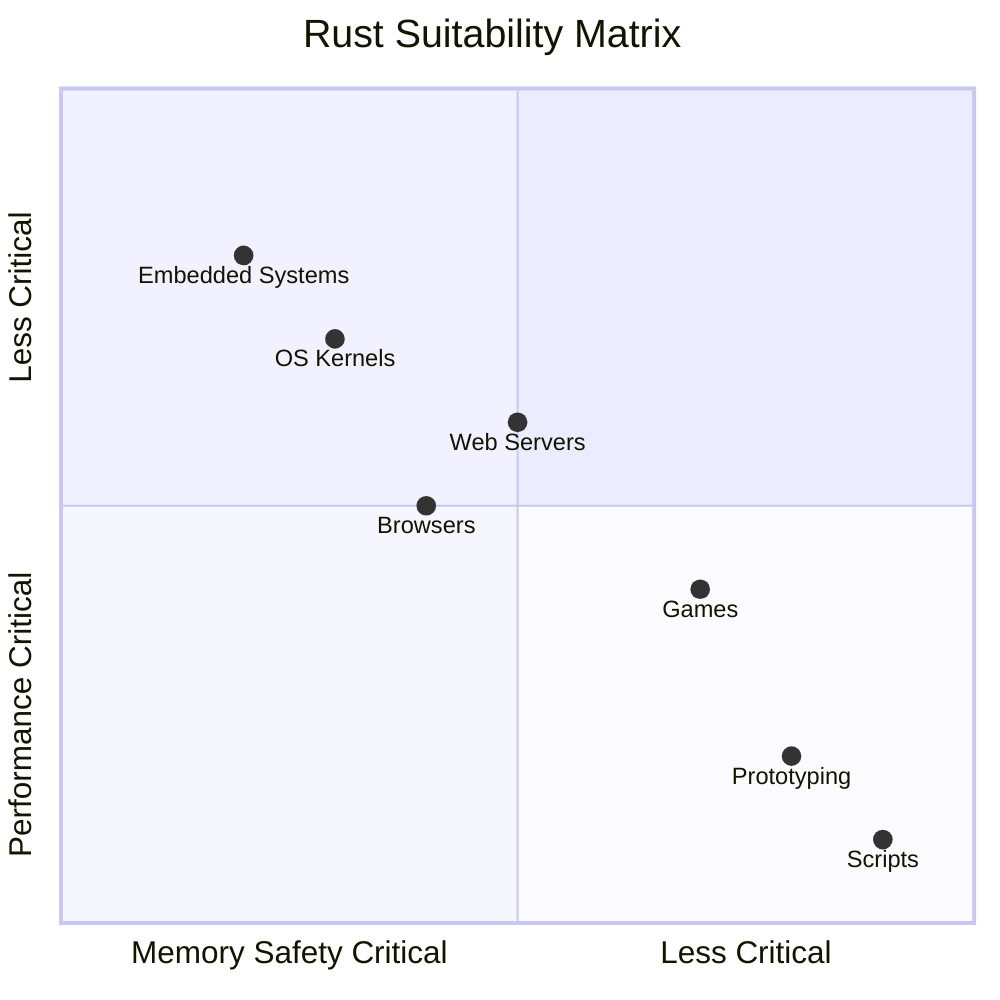

---

## Embedded Systems: Perfect Fit 🔌

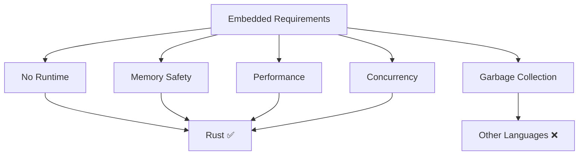

**No runtime, no GC, perfect for resource-constrained environments**

---

## Linux Kernel Development 🐧

### **Why Rust in Linux?**
- **Memory safety** without performance cost
- **Better concurrency** primitives
- **Modern tooling** and package management
- **Gradual adoption** alongside C

### **Success Stories:**
- Android kernel drivers
- Microsoft hypervisor components
- Various filesystem implementations

---

## My Personal Workflow 🔄

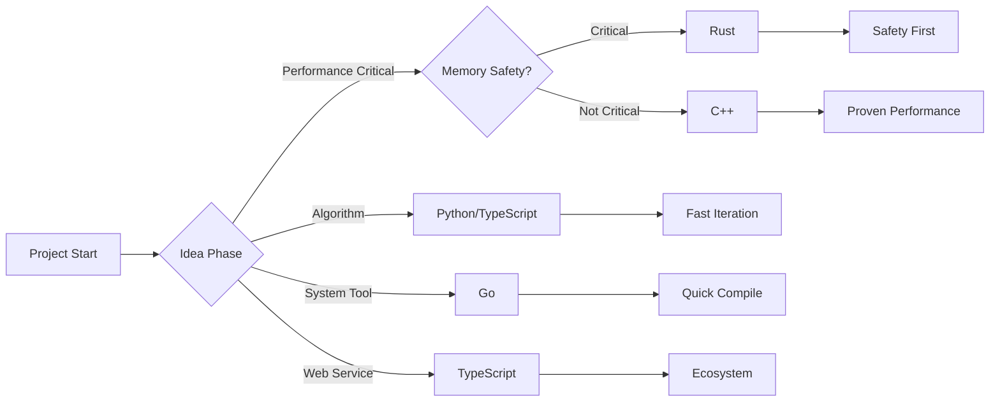

---

## Community & Ecosystem 🌍

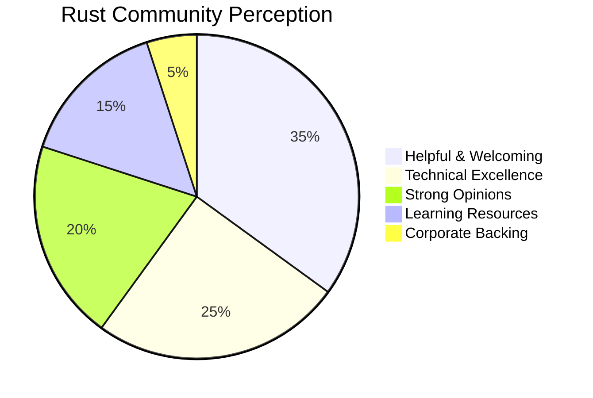

**Amazing community, but sometimes... overly enthusiastic about Rust for everything**

---

## The Right Tool for the Job 🛠️

| Use Case | Best Tool | Why |
|----------|-----------|-----|
| **Web APIs** | TypeScript/Go | Faster development |
| **Data Science** | Python | Ecosystem |
| **System Tools** | Go/Rust | Trade-offs matter |
| **Kernel Code** | Rust/C | Safety critical |
| **Game Dev** | C++/C# | Mature ecosystems |

---

## When I Would Choose Rust 🎯

### **Green light:**
- Safety-critical systems
- Performance-sensitive infrastructure
- Embedded development
- Where C/C++ would be used traditionally

### **Yellow light:**
- Web services (consider Go/TypeScript)
- Tools with complex data structures
- Team with mixed experience levels

### **Red light:**
- Rapid prototyping
- Simple scripts
- Teams new to systems programming

---

## The Verdict ⚖️

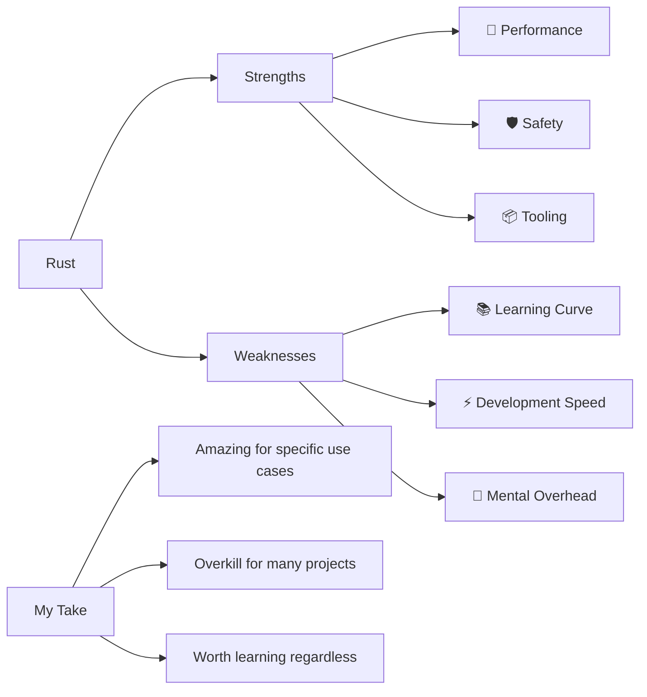

---

## Key Takeaways 🎯

1. **Rust is technically impressive** - performance and safety are real
2. **Steep learning curve** - traits, lifetimes, and borrow checker are challenging
3. **Not ideal for rapid iteration** - algorithm development suffers
4. **Excellent for systems programming** - embedded, kernels, performance-critical code
5. **Choose based on project needs** - not every problem needs Rust's guarantees

---

## Q&A ❓

**Let's discuss!**

- Have you had similar experiences?
- Found good workarounds for these challenges?
- Different perspectives on Rust's trade-offs?

---

## Thank You! 🙏

*Remember: The best language is the one that gets the job done effectively!* 🚀
