# 🚀 Table Look-Up Algorithms: From CORDIC to EDA
## A Journey Through Compute-Once, Lookup-Forever Optimization

---

# 📋 Agenda

| ⏱️ Time | 🎯 Topic |
|:-------:|:---------|
| 0–5 min | 🧮 What is Table Look-Up? |
| 5–10 min | ⚡ TLU in Action: Arithmetic, Crypto & Search |
| 10–18 min | 🔧 TLU in Electronic Design Automation |
| 18–25 min | 💻 Modern C++: `constexpr` CORDIC Case Study |
| 25–30 min | 🎯 Key Takeaways & Q&A |

---

# 🧮 What is Table Look-Up?

> **"The fastest computation is the one you don't have to perform."**

**Table Look-Up (TLU)** replaces runtime computation with **precomputed results** stored in memory.

```mermaid
graph LR
    A[📝 Input x] --> B{ {"Hash / Index / Decode"} }
    B --> C[("📊 Lookup Table<br/>ROM / RAM / Cache")]
    C --> D["✅ Output f(x)"]
    
    style A fill:#e1f5fe,stroke:#01579b,stroke-width:3px
    style B fill:#fff9c4,stroke:#f57f17,stroke-width:2px
    style C fill:#c8e6c9,stroke:#2e7d32,stroke-width:3px
    style D fill:#ffccbc,stroke:#bf360c,stroke-width:3px
```

**Core Idea:** Amortize expensive computation over many fast memory accesses.

---

# ⚖️ The Speed–Memory Tradeoff

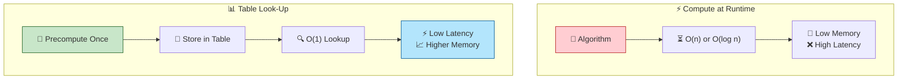

| Pattern | Benefit | Example |
|:-------:|:-------:|:-------|
| 🎯 **Function Approximation** | Avoid slow convergence | Sine LUT, Gamma tables |
| 🔢 **Finite Field Arithmetic** | Replace poly ops with addition | AES S-box, Reed-Solomon |
| 🤖 **State Machine Acceleration** | Next-state in one cycle | DFA, Branch Predictors |
| 🧠 **Memoization** | Reuse subproblems | BDD cache, Transposition tables |

---

# 🧮 TLU in Arithmetic: The CORDIC Family

**CORDIC** (COordinate Rotation DIgital Computer) is the *archetypal* table-driven algorithm.

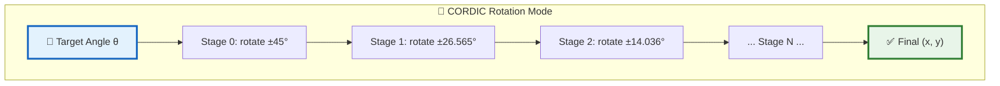

**What the table stores:** Precomputed arctangent angles

$$\alpha_i = \arctan(2^{-i})$$

**Why it matters:** No multipliers needed — only shifts, adds, and table lookups! 🎯

---

# 📐 CORDIC Mathematics

**Rotation equations** (simplified for iteration $i$):

$$x_{i+1} = x_i - d_i \cdot y_i \cdot 2^{-i}$$

$$y_{i+1} = y_i + d_i \cdot x_i \cdot 2^{-i}$$

$$z_{i+1} = z_i - d_i \cdot \alpha_i$$

Where:
- $d_i \in \{-1, +1\}$ is the **direction** (sign of remaining angle)
- $\alpha_i = \arctan(2^{-i})$ is looked up from the **constant table** 📊

**Gain compensation** (also table-driven or hardcoded):

$$K = \prod_{i=0}^{N-1} \cos(\alpha_i) \approx 0.60725$$

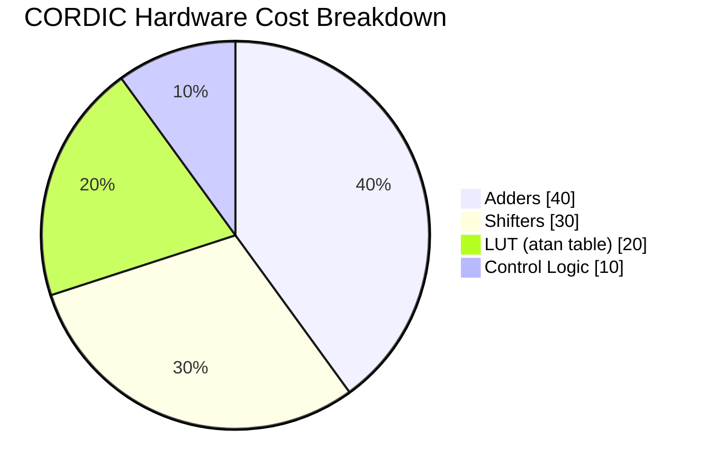

---

# 🔐 TLU in Cryptography: AES S-Box

The AES **SubBytes** step is a pure 256-byte table look-up.

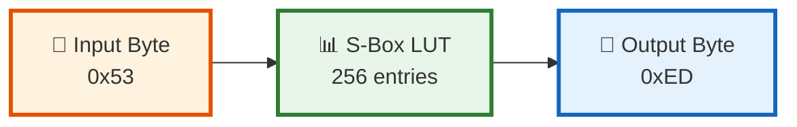

**What the table stores:** 
$$S(x) = \text{Affine}\left(\text{GF}(2^8)\text{-Inverse}(x)\right)$$

**Speed-up:** O(1) non-linear substitution vs. computing multiplicative inverse in $\text{GF}(2^8)$ on the fly.

> 💡 **Fun fact:** AES also uses **T-tables** (4× 256-word tables) to combine SubBytes, ShiftRows, and MixColumns into a single lookup round! 🚀

---

# 🔍 TLU in String Matching

| Algorithm | Table | Speed-Up |
|:---------:|:-----:|:--------:|
| **Boyer-Moore** | Bad-character shift table | Skip up to $m$ chars per mismatch |
| **KMP** | Prefix function $\pi$ table | O(n) guaranteed, no backtracking |
| **Aho-Corasick** | Goto + Failure + Output links | O(n + m + z) multi-pattern matching |

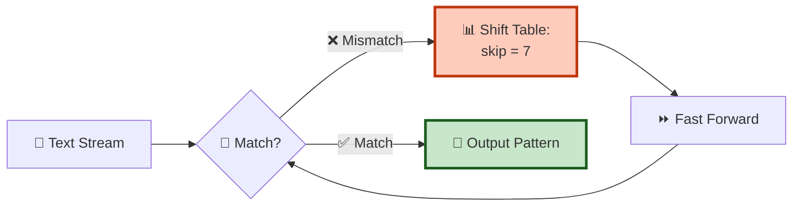

---

# 🏗️ TLU in Computer Architecture

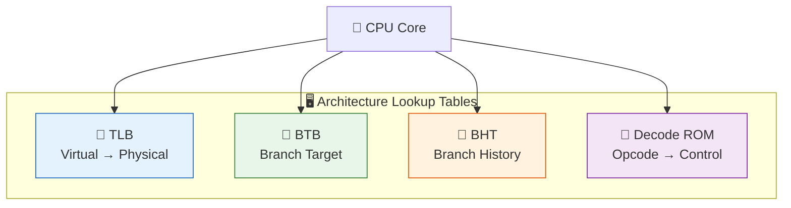

| Table | Latency | Benefit |
|:-----:|:-------:|:-------|
| **TLB** | ~1 cycle | Avoids 2–4 level page table walks (10–100× faster) |
| **BTB** | 0 cycles | Zero-penalty taken branches |
| **BHT** | 0 cycles | Predicts branch direction via 2-bit saturating counters |
| **Decode ROM** | 1 cycle | Single-cycle instruction decode |

---

# 🔧 TLU in EDA: An Overview

Electronic Design Automation is **obsessed** with tables — from logic synthesis to signoff.

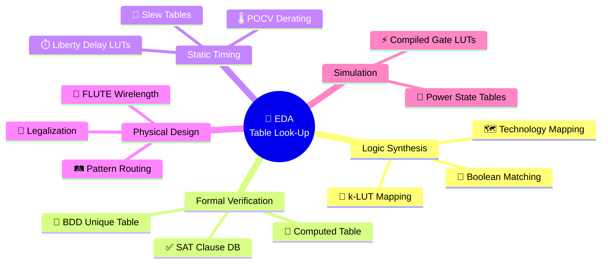

---

# 🧩 EDA: Logic Synthesis & Technology Mapping

**Boolean Matching (NPN Classification):**

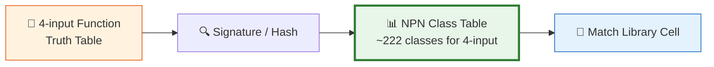

**FPGA k-LUT Mapping (ABC, CutMap):**
- Precompute all **k-feasible cuts** for each node
- Store in priority-cut table
- **O(1) cut selection** instead of dynamic enumeration

$$K = 4 \Rightarrow \text{At most } 2^{2^4} = 65,536 \text{ functions to classify}$$

---

# ⏱️ EDA: Static Timing Analysis (STA)

**Liberty `.lib` Delay Model:**

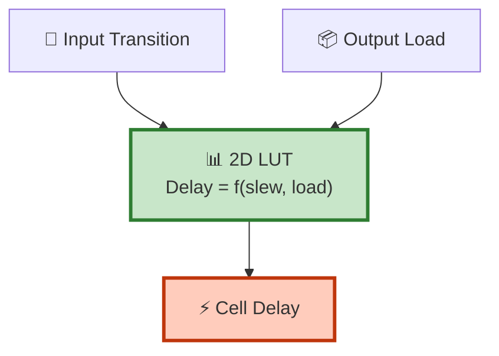

**What the table stores:**

$$\text{Delay} = \text{LUT}[\text{Input Transition Time}, \text{Output Load Capacitance}]$$

**Speed-up:** O(1) interpolation vs. running SPICE for every cell instance in a million-gate design! 🚀

**Other STA tables:**
- 📐 **Slew tables** — output transition vs. load
- 🌡️ **POCV/SOCV derating** — variation-aware delay distributions
- 🔌 **Power LUTs** — internal & leakage power vs. input state

---

# 📏 EDA: Physical Design — FLUTE

**FLUTE** (Fast Look-Up Table based Wirelength Estimation) is a *masterclass* in TLU.

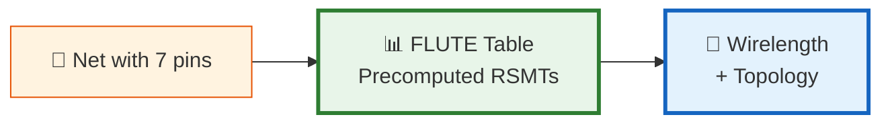

**The magic:**
- For $\leq 9$ pins: **Optimal** Rectilinear Steiner Minimal Tree is precomputed and stored
- For $> 9$ pins: Net is partitioned and table is applied recursively

**Impact:** FLUTE replaces NP-hard geometric Steiner algorithms with **O(1) lookup**, making it the backbone of academic analytical placers. 🎯

---

# ✅ EDA: Formal Verification — BDDs

**Binary Decision Diagrams** rely on two critical tables:

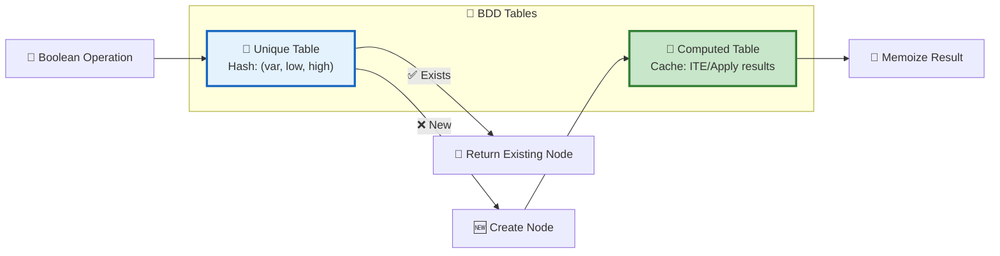

| Table | Purpose | Speed-Up |
|:-----:|:-------:|:--------:|
| **Unique Table** | Canonical node sharing | O(1) canonicity check; prevents exponential blow-up |
| **Computed Table** | Memoization cache | Avoids recomputing identical ITE/Apply subproblems |

> Without these tables, BDDs would be **Decision Trees** — exponentially large! 😱

---

# 💻 Modern C++: The `constexpr` Revolution

C++11/14/17/20 introduced `constexpr` — compile-time computation with zero runtime cost.

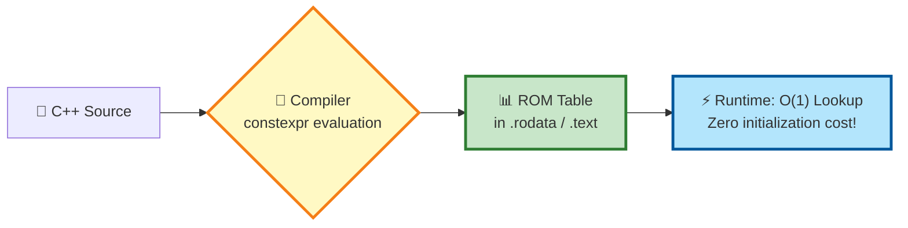

**Why `constexpr` TLU is powerful:**
- 🚫 No runtime initialization overhead
- 🚫 No dependency on build scripts (Python/CMake table generators)
- ✅ Guaranteed compile-time validation
- ✅ Perfect for embedded, HLS, and bare-metal targets

---

# 🎯 Case Study: `constexpr` CORDIC

**The Challenge:** CORDIC needs $\arctan(2^{-i})$ values.

Pre-C++23, `std::atan` is **not** `constexpr`! So how do we build the table at compile time?

```cpp
// 🎯 Custom constexpr arctan approximation
template<typename T>
constexpr T constexpr_atan(T x) {
    // 🧮 Taylor series or CORDIC-like iteration
    // evaluated entirely at compile time!
    T result = 0;
    for (int n = 0; n < 20; ++n) {
        T term = /* ... */;
        result += term;
    }
    return result;
}

// 📊 Generate CORDIC angle table at compile time
template<int N, typename T>
struct CordicTable {
    static constexpr std::array<T, N> angles = []{
        std::array<T, N> a{};
        for (int i = 0; i < N; ++i)
            a[i] = constexpr_atan(T(1) / (T(1) << i));
        return a;
    }();
};
```

---

# 🏗️ GitHub Spotlight: DrasLorus/CORDIC_Rotate_APFX

**The most explicit `constexpr` CORDIC implementation on GitHub.**

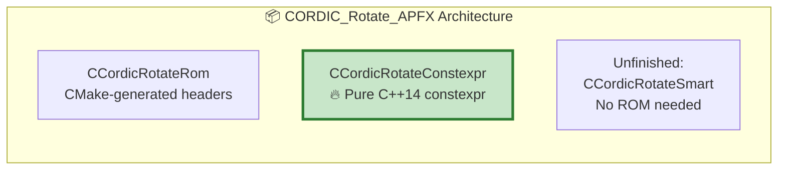

| Feature | Detail |
|:-------:|:-------|
| **Standard** | C++14 (`-std=c++14`) |
| **Target** | Xilinx HLS / Hardware Simulation |
| **Precision** | Bit-accurate fixed-point (template word length) |
| **Stages** | 2 to 7 (template parameter) |
| **ROM** | Control signals per stage, indexed by input angle |
| **Generators** | True `constexpr` + Monte-Carlo (runtime) |

**Repository:** [github.com/DrasLorus/CORDIC_Rotate_APFX](https://github.com/DrasLorus/CORDIC_Rotate_APFX) 🔗

---

# 🤔 Why Is `constexpr` CORDIC So Rare?

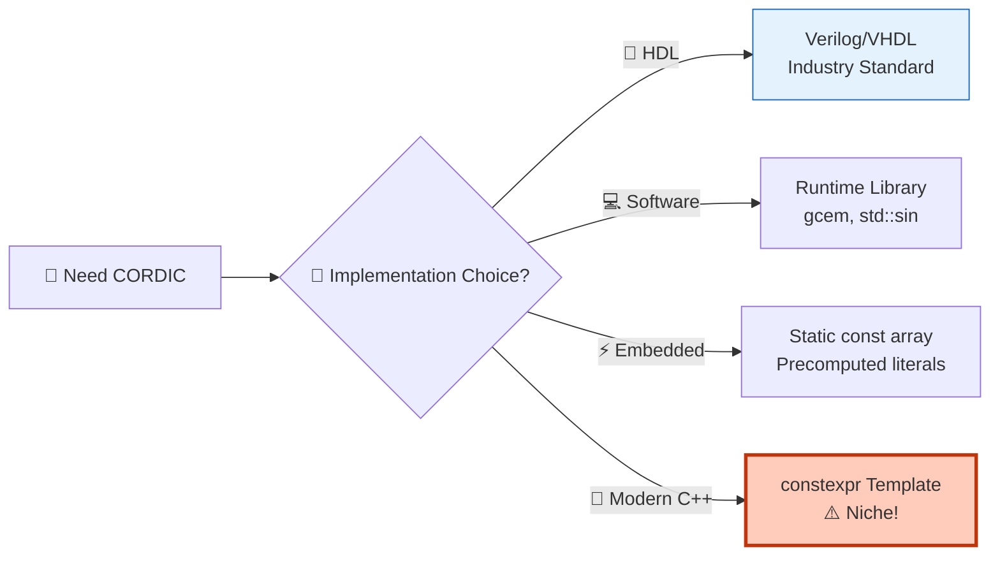

| Barrier | Explanation |
|:-------:|:-----------:|
| 🚫 `std::atan` not `constexpr` (pre-C++23) | Requires custom constexpr approximation |
| 🔧 EDA targets HDL | CORDIC is usually silicon, not software |
| 🐍 Build scripts are "good enough" | Python/CMake table generation is standard |
| 📚 Niche audience | Only HLS + bare-metal C++ developers care |

> **Exception:** DrasLorus's project bridges HLS and clean C++ — no CMake table generation needed! 🎉

---

# 🎯 Key Takeaways

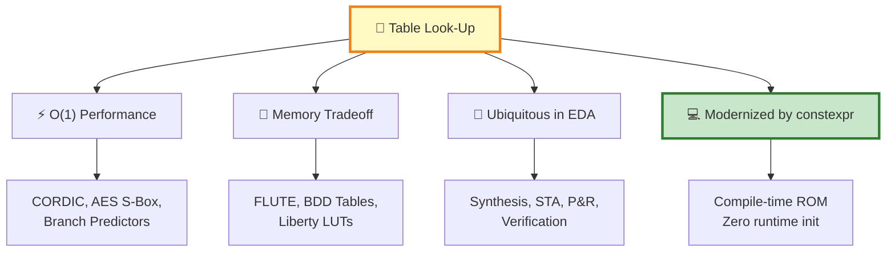

| # | 💡 Insight |
|:-:|:----------|
| 1 | **TLU is the original "cache"** — compute once, lookup forever |
| 2 | **CORDIC** epitomizes TLU: shifts, adds, and an atan table replace multipliers |
| 3 | **EDA runs on tables** — from NPN Boolean matching to FLUTE wirelength |
| 4 | **`constexpr` elevates TLU** — compile-time generation eliminates build dependencies |
| 5 | **The best algorithm is often the one you don't run** — just look it up! 📊 |

---

# 🙏 Thank You!

## Questions? 🎤

> **"The fastest computation is the one you don't have to perform."**

📧 **Resources:**
- 🔗 [DrasLorus/CORDIC_Rotate_APFX](https://github.com/DrasLorus/CORDIC_Rotate_APFX)
- 🔗 [kthohr/gcem](https://github.com/kthohr/gcem) — General constexpr math
- 🔗 [FLUTE](http://vlsicad.ucsd.edu/GSRC/bookshelf/Slots/RSMT/) — Fast LUT-based wirelength

**Happy Optimizing!** 🚀✨