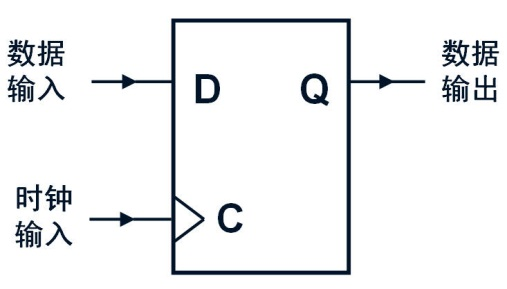

title: Beamer Slides using Pandoc and Markdown
author: Wai-Shing Luk
bibliography: papers.bib
...

# Introduction {#sec:intro}

## Why and Why not

### Why Markup Language?

- Separate "content" with "style".

### Why Beamer?

- For professional presentation.
- Tikz diagrams.

```

# `pandoc`

## `pandoc` {#sec:pandoc}

Pandoc is a Haskell library for converting from one markup format to another[^1], and a command-line tool that uses this library. It can read Markdown and write \LaTeX\ or Beamer.

To compile:

```bash
$ pandoc -s -t beamer beamer.yaml intro.md -o intro.tex
```

or directly to a pdf file:

```bash
$ pandoc -t beamer beamer.yaml intro.md -o intro.pdf
```

[^1]: This is a footnote.

## A simple header `beamer.yaml`

\scriptsize

```yaml
---
fontsize: 10pt
classoption:
  - serif,onlymath
institute: Fudan University
date: \today
link-citations: true
colorlinks: true
header-includes:
  - \usetheme{default}
  - \usepackage{tikz,pgf,pgfplots}
  - \usetikzlibrary{arrows}
  - \definecolor{qqqqff}{rgb}{0.,0.,1.}
  - \newcommand{\columnsbegin}{\begin{columns}}
  - \newcommand{\columnsend}{\end{columns}}
  - \newcommand{\col}[1]{\column{#1}}
  - \pgfdeclareimage[height=0.5cm]{fudan-logo}{fudan-logo.jpg}
  - \logo{\pgfuseimage{fudan-logo}}
...
```


## Render Mathematical Equations using LaTeX

\columnsbegin

\col{0.5\textwidth}

\scriptsize

```latex

Consider the following problem:

$$\begin{array}{ll}
  \text{minimize}    & f_0(x), \\
  \text{subject to}  & F(x) \succeq 0,
\end{array}$$ {#eq:semidef}

- $F(x)$: a matrix-valued function
- $A \succeq 0$ denotes $A$ is
  positive semidefinite.

```

\col{0.5\textwidth}

Consider the following problem:

$$\begin{array}{ll}
  \text{minimize}    & f_0(x), \\
  \text{subject to}  & F(x) \succeq 0,
\end{array}$$  {#eq:semidef}

- $F(x)$: a matrix-valued function
- $A \succeq 0$ denotes $A$ is
  positive semidefinite.

\columnsend


## How to make a two-column slide

```markdown

\columnsbegin

\col{0.5\textwidth}

  Left-hand side

\col{0.5\textwidth}

  Right-hand side

\columnsend

```

## Figures

An image occurring by itself in a paragraph will be rendered as a figure with a caption.

{#fig:figure0}

(source)
```markdown
{#fig:figure0}
```

## Figures (cont'd)

If you just want a regular inline image, just make sure it is not the only thing in the paragraph. One way to do this is to insert a nonbreaking space after the image:

\

(source)
```markdown
\
```


## Render Diagrams using Tikz

\columnsbegin

\col{0.4\textwidth}
\scriptsize

```latex

\begin{figure}[hp]
\centering
\input{pole2polar.tikz}
\caption{Example of constructing
    the polar of a point}%
\label{fig:pole2polar}
\end{figure}

```

\col{0.6\textwidth}

\begin{figure}[hp]
\centering
\input{pole2polar.tikz}
\caption{Example of constructing
    the polar of a point}%
\label{fig:pole2polar}
\end{figure}

\columnsend


## Table

Simple tables can be generated using Markdown.

\scriptsize

\columnsbegin

\col{0.5\textwidth}

```markdown

| Costs        | 28nm      | 20nm        |
| ------------ | --------- | ----------- |
| Fab Costs    | 3B        | 4B - 7B     |
| Process R&D  | 1.2B      | 2.1B - 3B   |
| Mask Costs   | 2M - 3M   | 5M - 8M     |
| Design Costs | 50M - 90M | 120M - 500M |

: Fab, process, mask, and design
  costs {#tbl:fab}

```

\col{0.5\textwidth}

| Costs        | 28nm      | 20nm        |
| ------------ | --------- | ----------- |
| Fab Costs    | 3B        | 4B - 7B     |
| Process R&D  | 1.2B      | 2.1B - 3B   |
| Mask Costs   | 2M - 3M   | 5M - 8M     |
| Design Costs | 50M - 90M | 120M - 500M |

: Fab, process, mask, and design
  costs {#tbl:fab}

\columnsend

# `pandoc-crossref` filter

## `pandoc-crossref` filter

With this filter, you can cross-reference figures (see @fig:figure0 and Fig. \ref{fig:pole2polar}), display equations (see @eq:semidef), tables (see [@tbl:fab]) and sections ([@sec:intro; @sec:pandoc])

There is also support for code blocks, for example, [@lst:captionAttr; @lst:tableCaption].

To compile:

```bash
$ pandoc -F pandoc-crossref -t beamer beamer.yaml \
  crossref.yaml beamer.md -o intro.pdf
```

## A sample `crossref.yaml`

\scriptsize

```yaml
---
cref: True
codeBlockCaptions: True
lofTitle: "## List of Figures"
lotTitle: "## List of Tables"
autoSectionLabels: True
figureTemplate: $$t$$
tableTemplate: $$t$$
figPrefix:
  - "Fig."
eqnPrefix:
  - "Eq."
tblPrefix:
  - "Table"
lstPrefix:
  - "Listing"
secPrefix:
  - "§"
...
```

## Code blocks

There are a couple options for code block labels. Those work only if code block id starts with `lst:`, e.g. `{#lst:label}`

## `caption` attribute {#sec:caption-attr}

`caption` attribute will be treated as code block caption. If code block has both id and `caption` attributes, it will be treated as numbered code block.

```{#lst:captionAttr .haskell caption="Listing caption A"}
main :: IO ()
main = putStrLn "Hello World!"
```

(source)
```markdown
{#lst:captionAttr .haskell caption="Listing caption A"}
```

## Table-style captions  {#sec:table-capts}

Enabled with `codeBlockCaptions` metadata option. If code block is immediately
adjacent to paragraph, starting with `Listing: ` or `: `, said paragraph will be treated as code block caption.

Listing: Listing caption B
```{#lst:tableCaption .haskell}
main :: IO ()
main = putStrLn "Hello World!"
```

# `pandoc-citeproc` filter

## Bibliography

- See @Aalst-etal_2004, or
- See [@Baldi-etal_2008;@Canfora-Cerulo_2005a].

(source)
```markdown
- See @Aalst-etal_2004, or
- See [@Baldi-etal_2008;@Canfora-Cerulo_2005a].
```

To compile:

```bash
$ pandoc -F pandoc-crossref -F pandoc-citeproc -t beamer \
  beamer.yaml crossref.yaml beamer.md -o intro.pdf
```

## References {.allowframebreaks}

